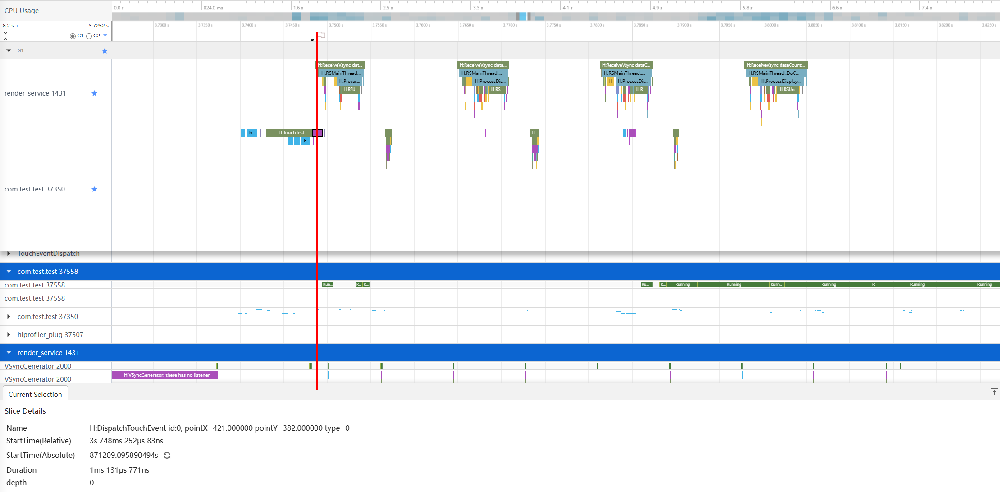
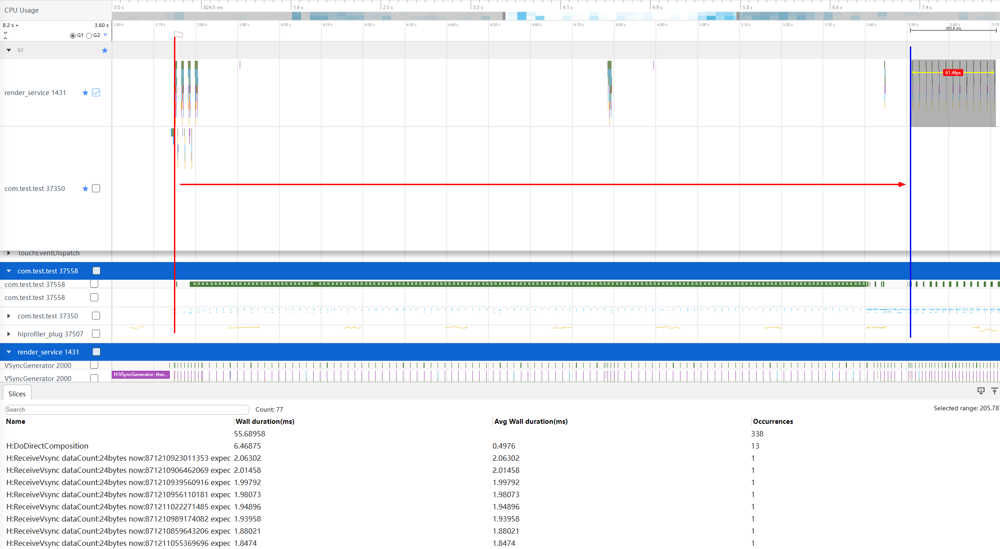
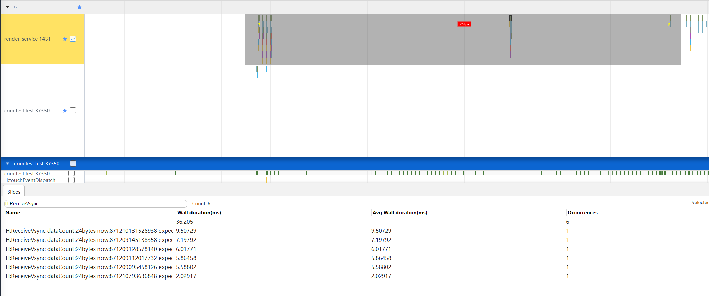
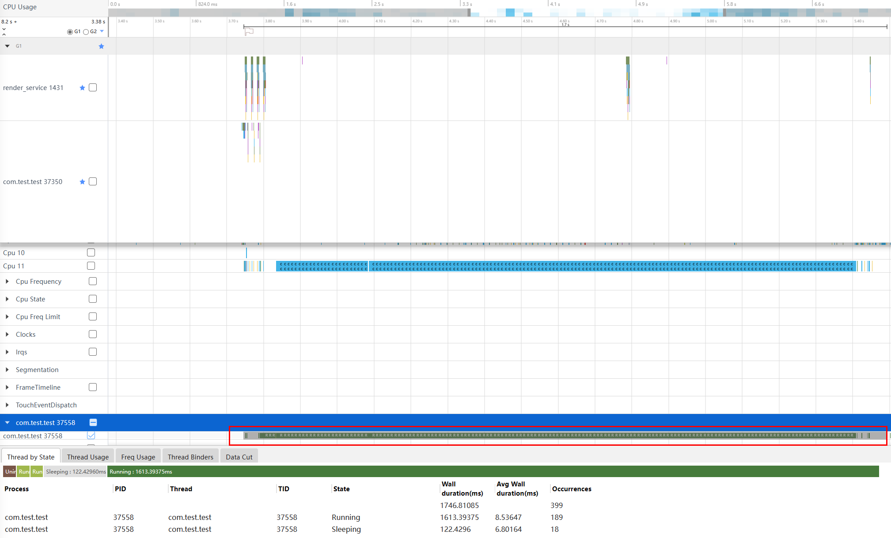
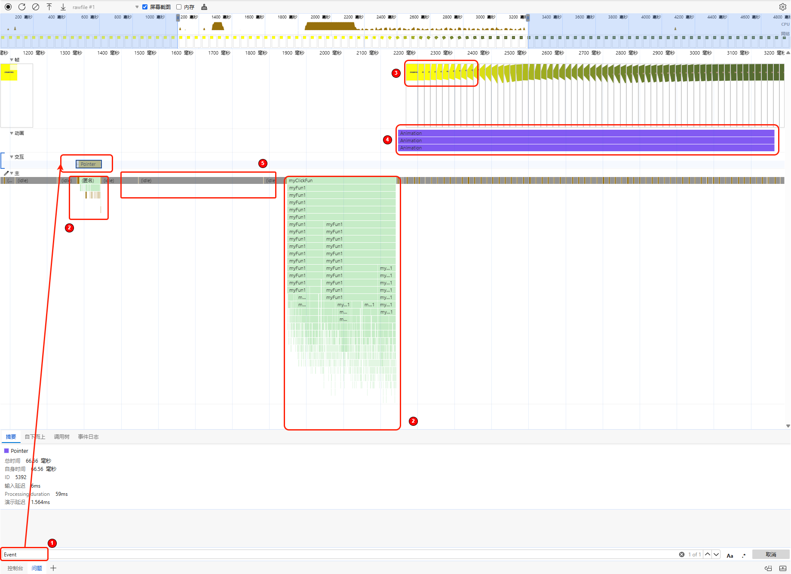
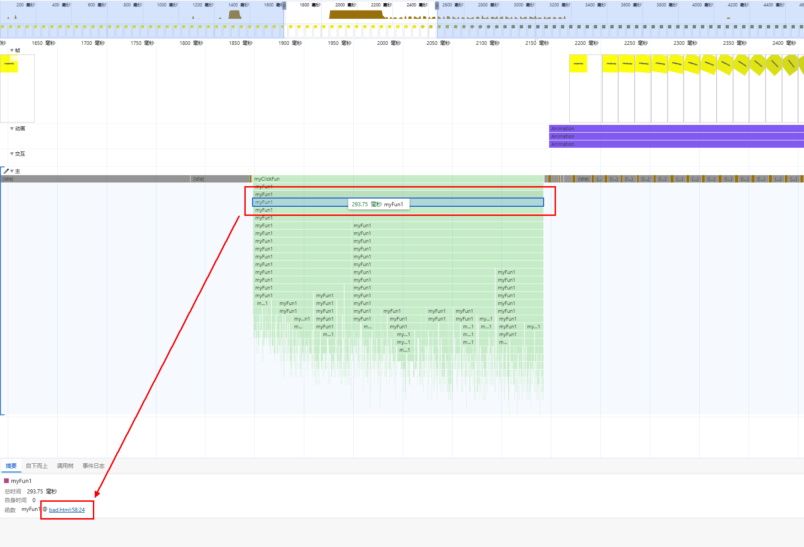
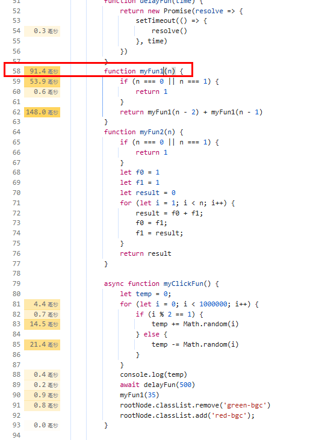
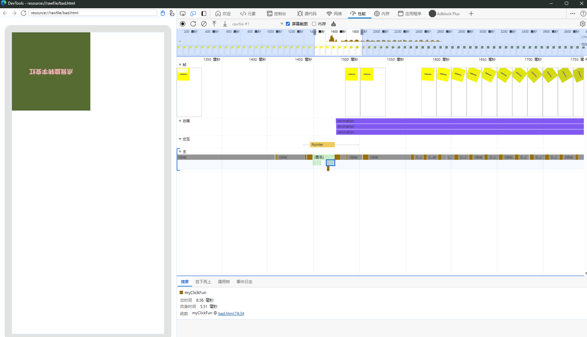
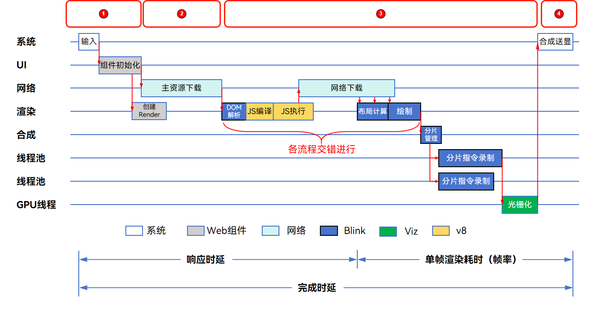

# Web性能问题分析案例

如下图所示，下方字块在点击后，经过一定的时间，才开始动画，实际经过延迟很大。  
图一 场景动画  
  

## 问题定位流程

### 使用录屏辅助定位

处理问题时，可以优先查看操作录屏，查看操作场景，看看能否发现一些有助于定位的信息，比如：

1. 是否有转场动效，初始动效是否明显。
2. 页面组件是否复杂。

在此问题中，可以明显发现点击时延是在动效之前的，同时组件复杂程度较低。

### 使用Trace工具抓取Trace

响应时延类问题首先确认响应起止点，确定这一段区域在哪里，大概是在干什么。

1. 确认起点：如果为点击触发，则首先先找到应用侧的ispatchTouchEvent Type = 1，如图二红线所示：  
    图二 Trace起点
    
2. 确认终点：一般以render_service侧的第一帧为终点，如图三蓝线所示：  
    图三 Trace终点
    
    可以发现，后续动画已经达到最大帧率，说明无响应是红线到蓝线阶段。
3. 分析中途出现的H:ReceiveVsync信号可以发现，在无响应阶段出现出现过几帧，但是每帧的耗时并没有过大。应用侧也如此，说明在UI绘制过程并没有高负载。  
    图四 Trace帧率分析
    
4. 同时可以发现在此过程中，应用长时间占用CPU，因此可能是产生了大量的计算。  
    图五 可能耗时原因
    

经过前面的分析，应用侧发现可能是H5侧产生了大量的计算，此时需要使用Devtools工具进一步分析。

### 使用Devtools进行分析

使用Devtools调试可以参考此链接：[使用Devtools工具调试前端页面](https://developer.huawei.com/consumer/cn/doc/harmonyos-guides-V5/web-debugging-with-devtools-V5?catalogVersion=V5)。

抓取的DevTools泳道图如图六所示，本文把可能发生的异常区域进行分析： 

图六：DevTools泳道图区域划分  

- 区域1: 该处为起点，输入Event搜索点击事件。
- 区域2：该处为组件加载区域，主要是JS执行。
- 区域3：该处为响应终点，frame泳道第一帧送显。
- 区域4：该区域为动画区域，负责执行动画。
- 区域5：该区域为空白区域，一般是由于setTimeout等延迟函数引起。

由于此页面不涉及网络交互，所以还有部分区域如网络区域等没有标记，后面也会给出示例。

## 根因分析

H5页面点击切换场景下，此时Web组件已经初始化，点击事件为Web内部的Event，场景过程主要发生在图六的1234的区域。  
当点击时会执行以下流程：
1. Web导航等待主页面渲染出第一个非空白帧。
2. 主页面【主资源下载】之后【主资源解析渲染】，之后【子资源下载】【子资源解析渲染】交错进行。
3. 主资源渲染完成，为非空白帧，唤起导航动画，页面响应。
4. 主资源渲染完成，为空白帧，Web会丢弃，后续子资源渲染出的第一个非空白帧，唤起导航动画，页面响应。

**经验总结：** 大部分响应慢会存在以下异常。
1. 主资源渲染组件结构复杂耗时高。
2. 主资源空白，子资源动态加载，第一帧显示慢。

故因此应重点分析组件加载和网络区域异常这两个阶段，各区域根因分析如下：

### 组件加载区域异常分析

对应图六的2区域：可以记录此段【加载耗时】
此处异常点通常为：
1. 区域耗时长占比高，比如区域2耗时290ms左右，是一个优化点。
2. 有几段区域都是在加载渲染组件，此时可能是动态加载组件，通常时延会高。

我们可以看到出现了大量调用的myFun1，此时可以点击下方跳转到源码：   
图七：方法跳转至源码  
  
图八：源码耗时  
  
如图八所示，源码处会显示具体方法的耗时，此时可以发现myFun1方法采用了递归，大幅增加了CPU的运算耗时，导致了响应延时。  
解决方法：将递归方法myFun1优化为循环方法myFun2，减少耗时。

### 网络区域异常分析

对应图六的2区域：  
异常定义：网络耗时占比过高。
此处异常点通常为：在响应阶段、耗时占比很高并且阻塞线程。
trace特点：网络区域每一阶段网络请求完成后都会对应执行js或者任务。

### 动画区域异常分析

对应图六的4区域：  
如果测试的响应时间的trace起点到终点的时间相差很大，此时动画区域会有异常。
常见的场景：动画中的页面背景色为透明，动画曲线为先慢后快导致动画弹出起点时，透明色没有变化看起来慢。

### 空白区域异常分析

对应图六的5区域  
此处的异常点通常为：  
- 有网络请求，空白区域之后通常会有一段js函数执行，上方的网络泳道，通常有网络请求（网络请求过长，CPU空闲时可能导致空白区域）
常见的场景是点击按钮之后出现网络请求，后端返回数据成功之后进行跳转或者改变页面状态。
- 定时器等待，空白区域之后能找到定时器相关的函数执行。

我们发现代码中有`await delayFun(500)`这种定时器延迟函数，优化方法是移除冗余延迟函数。

经过上述分析步骤的优化，此时再次调用DevTools进行分析：  
图九：优化后的泳道图
  
从图九可以看出耗时明显减少，回归正常水平。

## 常见Trace流程点

**Web网页整体加载流程：**

图十：Web网页整体加载流程   

| Web网页加载流程拆解 | 关键Trace |  
| --- | --- |  
| 点击事件 | 最后一个DispatchTouchEvent到组件初始化前 | 
| web组件初始化 | NWebImpl\|CreateNWeb到导航流程前 | 
| 导航流程 | NavigationControllorImpl::LoadURLWithParams 到 NavigationBodyLoader::OnStartLoadingResponseBody结束 |
| DOM&CSS解析 | CSSParserImpl::parseStyleShee和ParseHTML解析，扣除HTMLDocumentParser::RunScriptsForPausedTreeBuilder |
| JS编译+执行 | EvaluateScript 和 v8.callFunction |
| 等待网络资源下载 | render主线程ThrottlingURLLoader::OnReceiveResponse前的空闲（粗略算上大段的空白就行） |
| 点击响应结束点 | NotifyFrameSwapped，UnloadOldFrame/第一个SkiaOutputSurfaceImplOnGpu::SwapBuffers |
| 绘制 | ThreadProxy::BeginMaiFrame扣除v8执行 |
| 光栅化&合成 | 从ProxyImpl::NotifyReadyToCommitOnImpl开始到SwapBuffers结束 |
| 完成时延结束 | 最后一个SkiaOutputSurfaceImplOnGpu::SwapBuffers |

## 总结

通过以上步骤，使用录屏、Trace工具和Devtools分析，可以有效定位并解决点击切换类时延问题。
