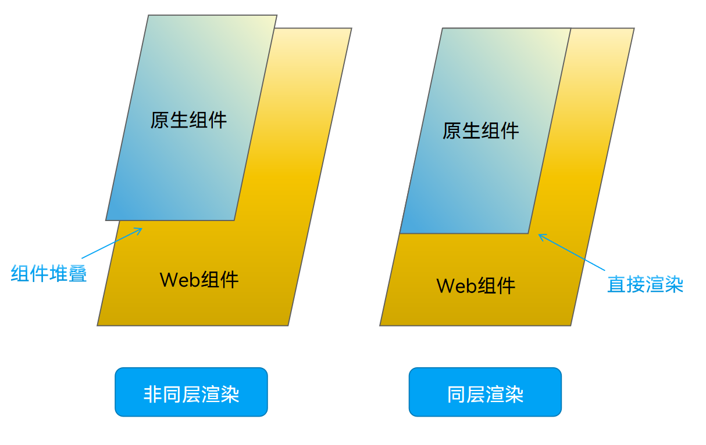
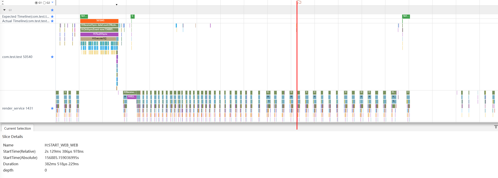
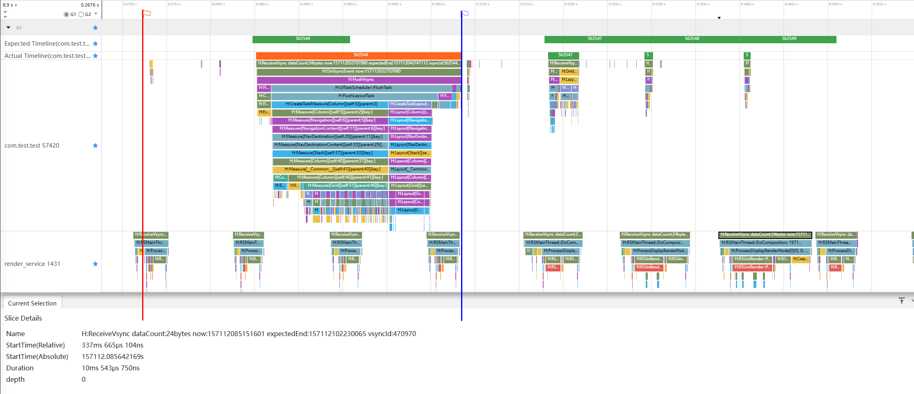
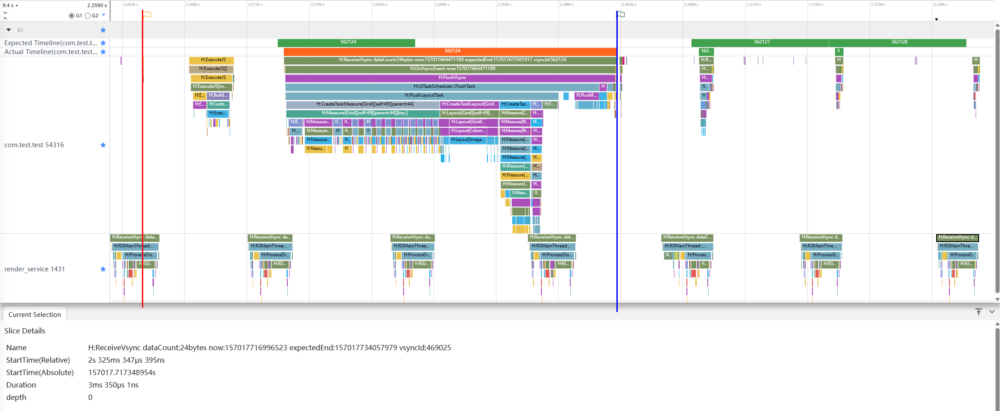
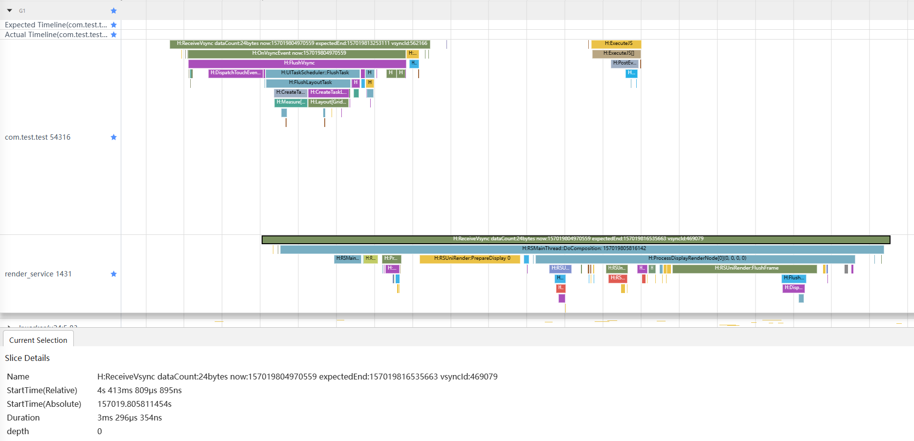

# 使用同层渲染在Web上渲染原生组件

在使用Web组件加载H5页面时，经常会有长列表、视频等场景。由于Web目前最高只有60帧，想要更加流畅的体验，必须要将原生组件放到Web上。

在什么场景下应该在Web上使用原生组件：
- 需要高性能，流畅体验。如长列表，视频等场景
- 需要使用原生组件功能
- 原生组件已经实现，复用以减少开发成本

目前要实现在Web上使用原生组件有两种方案：  
方案一：直接将组件堆叠到H5页面上。  
方案二：使用**同层渲染**，使用Web和原生组件交互的方式，将原生组件替代Web中部分组件，提升交互体验和性能。

## 什么是同层渲染

同层渲染是一种优化技术，用于提高Web页面的渲染性能。同层渲染会将位于同一个图层的元素一起渲染，以减少重绘和重排的次数，从而提高页面的渲染效率。

同层渲染和非同层渲染的区别如下：

- 非同层渲染：通过Z序的层级关系堆叠在Web页面上。此方式实现方式简单，用于原生组件大小位置固定场景。
- 同层渲染：通过同层渲染的方式直接渲染到H5页面Embed标签区域上。此方式实现相对复杂，用于原生组件大小位置需要跟随Web页面变化场景。

**图一：同层渲染和非同层渲染区别**  


同层渲染的大致开发流程可以参考[同层渲染绘制](../web/web-same-layer.md)。

## 场景示例

以下分别采用纯H5、非同层渲染和同层渲染的三种方式，加载相同的商城组件到相同的H5页面上，并抓取trace对比三者之间的区别，其中商城页面大致如图二所示：

**图二：商城页面场景**  


场景实例源码的核心部分如下：

上图中，背景的空白提供承载的H5页面如下：

```html
<!-- nativeembed_view.html -->
...
  <body>
    <div>
      <div id="bodyId">
        <!-- 在H5界面上通过embed标签标识同层元素，在应用侧将原生组件渲染到H5页面embed标签所在位置-->
        <embed id="nativeSearch" type="native/component" width="100%" height="100%" src="view" />
      </div>
    </div>
  </body>
...
```

上图中，搜索框+下方列表的原生商城组件如下：

```typescript
// SearchComponent.ets
  
// API以及模块引入
// ...
  
@Component
export struct SearchComponent {
  @Prop params: Params;
  @State myData: MyData = new MyData();

  build() {
    Column({ space: 8 }) {
      Text('商城').fontSize(16)
      Row() {
        Image($r("app.media.nativeembed_search_icon"))
          .width(14)
          .margin({ left: 14 })
        Text("搜索相关宝贝")
          .fontSize(14)
          .opacity(0.6)
          .fontColor('#000000')
          .margin({ left: 14 })
      }
      .width("100%")
      .margin(4)
      .height(36)
      .backgroundColor('#FFFFFF')
      .borderRadius(18)
      .onClick(() => {
        // 点击搜索框提示
        promptAction.showToast({
          message: "仅演示"
        });
      })

      Grid() {
        LazyForEach(this.myData, (item: ProductDataModel, index: number) => {
          GridItem() {
            Column({ space: 8 }) {
              Image(item.uri).width(100)
              Row({ space: 8 }) {
                Text(item.title).fontSize(12)
                Text(item.price).fontSize(12)
              }
            }
            .backgroundColor('#FFFFFF')
            .alignItems(HorizontalAlign.Center)
            .justifyContent(FlexAlign.Center)
            .width("100%")
            .height(140)
            .borderRadius(12)
          }
        }, (item: ProductDataModel) => `${item.id}`)
      }
      .cachedCount(2)
      .columnsTemplate('1fr 1fr')
      .rowsGap(8)
      .columnsGap(8)
      .width("100%")
      .height("90%")
      .backgroundColor('#F1F3F5')
    }
    .padding(10)
    .width(this.params.width)
    .height(this.params.height)
  }
}

```

## Web加载原生组件三种方案的对比 

### 直接使用H5加载  
首先的想法是，将搜索框和列表组件使用原生H5实现，直接用web加载页面。数据交互的部分则需要与原生交互部分通过WebMessagePort与Web交互。关键代码步骤如下：

1. 应用侧使用单Web组件挂在H5页面，但是同时需要设置javaScriptProxy传入参数，并在PageEnd回调中建立WebMessagePort通道传输数据。

    ```typescript
    Web({ src: $rawfile("web.html"), controller: this.browserTabController })
      .zoomAccess(false)
      .javaScriptProxy({
        object: this.mockData,
        name: 'mockData',
        methodList: ["getMockData"],
        controller: this.browserTabController
      })
      .onPageEnd(() => {
        // 1. 创建消息端口
        this.ports = this.browserTabController.createWebMessagePorts(true);
        // 2. 发送端口1到HTML5
        this.browserTabController.postMessage("init_web_messageport", [this.ports[1]], "*");
        // 3. 保存端口0到本地
        this.nativePort = this.ports[0];
        // 4. 设置回调函数
        this.nativePort.onMessageEventExt((result) => {
          try {
            const type = result.getType();
            switch (type) {
              case webview.WebMessageType.STRING: {
                if (result.getString() === 'shop_search_click') {
                  // 点击搜索框提示
                  promptAction.showToast({
                    message: $r("app.string.nativeembed_prompt_text")
                  });
                }
                break;
              }
            }
          } catch (error) {
            console.error(`ErrorCode: ${error.code},  Message: ${error.message}`);
          }
        });
        hiTraceMeter.finishTrace('START_WEB_WEB', 2002);
      })
    ```
2. 此时，样式和组件需要单独通过js和css文件进行控制，这里仅展示js主要代码

    ```javascript
    let h5Port; // 获取应用侧的端口
    window.addEventListener('message', function (event) {
        if (event.data == 'init_web_messageport') {
            if (event.ports[0] != null) {
                h5Port = event.ports[0]; // 1. 保存从ets侧发送过来的端口
            }
        }
    })

    function postStringToApp(str) {
        if (h5Port) {
            h5Port.postMessage(str);
        } else {
            console.error("In html h5port is null, please init first");
        }
    }


    // 获取应用侧的数据对象
    let imageNodeData = mockData.getMockData();

    // 搜索框
    let searchNode = document.createElement('div');
    searchNode.classList.add('shop-input');
    searchNode.addEventListener('click', () => {
        postStringToApp('shop_search_click')
    })

    // ...
    // 其余相关节点
    // ...

    let imageNodeList = []; // 商城node节点列表
    imageNodeData.forEach(item => {
        // 商品div
        let node = document.createElement("div");
        node.classList.add('shop-container');
        // 图片img
        let imageNode = document.createElement('img');
        imageNode.classList.add('shop-img');
        imageNode.src = item.uri;
        // 文字
        let textNode = document.createElement("p");
        textNode.innerText = `${item.title}\u00A0\u00A0\u00A0\u00A0${item.price}`;
        // 组合商品图
        node.append(imageNode, textNode);
        imageNodeList.push(node);
    })

    shopNode.append(...imageNodeList);

    document.querySelector("#my-app").append(titleNode, searchNode, shopNode);
    ```

在上述的方案中可以发现，用H5开发页面时，需要使用到JS和CSS，甚至一些前端框架进行页面的开发。并且动效和体验都不如原生组件。既然Web也是一个组件，可以想到直接把原生组件堆叠到Web页面上，方案如下：   

### 使用非同层渲染   
底层使用空白的H5页面，用任意标签进行占位，然后在H5页面上方层叠一个原生组件。原生组件需要在Web加载完成后，获取到标签大小位置后，在对应位置展示。

1. 使用Stack层叠Web和searchBuilder组件。

    ```typescript
    build() {
      Stack() {
        Web({ src: $rawfile("nativeembed_view.html"), controller: this.browserTabController })
          .backgroundColor('#F1F3F5')
          .zoomAccess(false)// 不允许执行缩放
          .onPageEnd(() => { 
            // ...
            // 里面放下一步的内容
            // ...
          })
        if (this.isWebInit) {
          Column() {
            // 由于需要根据Web实际加载的尺寸进行展示，需要等Web初始化后获取宽高，之后层叠到Web上
            searchBuilder({ width: this.searchWidth, height: this.searchHeight })
          }
          .zIndex(10)
        }
      }
      .alignContent(Alignment.Top)
    }
    ```
2. 用Web加载nativeembed_view.html文件，在加载完成后的onPageEnd回调中，获取Web侧预留的Embed元素大小，并通过px2vp方法转换为组件大小。  
需要在H5侧添加getEmbedSize方法来获取元素大小，如下：

    ```javascript
    // H5侧
    function getEmbedSize() {
        let doc = document.getElementById('nativeSearch');
        return {
          width: doc.offsetWidth,
          height: doc.offsetHeight,
        }
    }
    ```
    在应用侧，步骤1的onPageEnd回调中：

    ```typescript
    // 从web侧获取组件大小
    this.browserTabController.runJavaScript(
      'getEmbedSize()',
      (error, result) => {
        if (result) {
          interface EmbedSize {
            width: number,
            height: number
          }
          let embedSize = JSON.parse(result) as EmbedSize;
          this.searchWidth = px2vp(embedSize.width);
          this.searchHeight = px2vp(embedSize.height);
          this.isWebInit = true;
        }
      });
    ```
3. 获取到步骤2的尺寸之后，传入searchBuilder中，通过显隐控制展示SearchComponent组件。

在上述的方案中，实现方法非常简单。但是这只是限于底层H5网页比较简单，不会滚动的情况。如果H5页面可以上下滑动或者放大缩小比较复杂，此方案就会出现问题，就会发现原生组件是很难去定位，很难跟随H5页面一起滚动。而且在性能上，Web是整体渲染的，即使被原生组件遮住的部分也会消耗性能。于是我们可以通过同层渲染来完美解决这个问题，方案如下：  

### 同层渲染实现  
同层渲染简单来说就是，底层使用空白的H5页面，用**Embed标签**进行占位，原生使用**NodeContainer**来站位，最后将Web侧的surfaceId和原生组件绑定，渲染在**NodeContainer**上。详细的步骤可以参考前面[什么是同层渲染](#什么是同层渲染)中的链接，这里给出一些大致步骤。

1. 用Stack组件层叠NodeContainer和Web组件，并开启enableNativeEmbedMode模式。
    ```typescript
      build() {
        Stack() {
          NodeContainer(this.searchNodeController)
          // web组件加载本地nativeembed_view.html页面
          Web({ src: $rawfile("nativeembed_view.html"), controller: this.browserTabController })
            .backgroundColor('#F1F3F5')
            .zoomAccess(false)// 不允许执行缩放
            .enableNativeEmbedMode(true) // 开启同层渲染模式
        }
      }
    ```
2. 因为要使用NodeContainer，所以封装一个继承自NodeController的类SearchNodeController。
    ```typescript
    type Node = BuilderNode<[Params]> | undefined | null;

    /**
     * 用于控制和反馈对应的NodeContainer上的节点的行为，需要与NodeContainer一起使用
     */
    class SearchNodeController extends NodeController {
      private surfaceId: string = ""; // 当前的surfaceId
      private embedId: string = ""; // 当前的embedId
      private type: string = ""; // 当前的节点类型
      private renderType: NodeRenderType = NodeRenderType.RENDER_TYPE_DISPLAY; // 渲染模式
      private componentWidth: number = 0; // 原生组件宽
      private componentHeight: number = 0; // 原生组件高
      private nodeMap: Map<string, Node> = new Map<string, Node>(); // 存放与surfaceId关联的BuilderNode

      /**
       * 设置surfaceId等渲染选项
       */
      setRenderOption(params: NodeControllerParams): void {
        this.surfaceId = params.surfaceId;
        this.embedId = params.embedId;
        this.type = params.type;
        this.renderType = params.renderType;
        this.componentWidth = params.width;
        this.componentHeight = params.height;
      }

      /**
       * 在对应NodeContainer创建的时候调用、或者通过rebuild方法调用刷新
       */
      makeNode(uiContext: UIContext): FrameNode | null {
        if (!this.surfaceId) { // 当前没有surfaceId时直接返回null
          return null;
        }
        let getNode: Node = this.nodeMap.get(this.surfaceId);
        if (getNode) { // 根据surfaceId获取BuilderNode
          return getNode.getFrameNode();
        } else { // 没有获取到则创建一个BuilderNode并与nodeMap关联后返回
          let newNode: Node = new BuilderNode(uiContext, { surfaceId: this.surfaceId, type: this.renderType })
          newNode.build(wrapBuilder(searchBuilder), { width: this.componentWidth, height: this.componentHeight });
          this.nodeMap.set(this.surfaceId, newNode);
          return newNode.getFrameNode();
        }
      }

      /**
       * 将触摸事件派发到rootNode创建出的FrameNode上
       */
      postEvent(event: TouchEvent | undefined): boolean {
        if (!this.surfaceId) {
          return false;
        } else {
          let getNode: Node = this.nodeMap.get(this.surfaceId);
          return getNode?.postTouchEvent(event) as boolean;
        }
      }
    }
    ```
3. 使用Web加载nativeembed_view.html文件，web解析到Embed标签后，通过onNativeEmbedLifecycleChange接口上报Embed标签创建消息通知到应用侧。
    ```typescript
    Web({ src: $rawfile("nativeembed_view.html"), controller: this.browserTabController })
      .backgroundColor('#F1F3F5')
      .zoomAccess(false)// 不允许执行缩放
      .enableNativeEmbedMode(true) // 开启同层渲染模式
      .onNativeEmbedLifecycleChange((embed) => {
        ...
        // 此处进行下一步
        ...
      })
      .onNativeEmbedGestureEvent((touch) => { 
        // 获取同层渲染组件触摸事件信息
        this.searchNodeController.postEvent(touch.touchEvent);
      })
    ```
4. 在步骤3的回调内，根据embed.status，将配置传入searchNodeController后，执行rebuild方法重新触发其makeNode方法。
    ```typescript
    if (embed.status === NativeEmbedStatus.CREATE) {
      // 获取embed标签的surfaceId等信息，传入searchNodeController
      this.searchNodeController.setRenderOption({
        surfaceId: embed.surfaceId as string,
        type: embed.info?.type as string,
        renderType: NodeRenderType.RENDER_TYPE_TEXTURE,
        embedId: embed.embedId as string,
        width: px2vp(embed.info?.width),
        height: px2vp(embed.info?.height)
      });
    }
    this.searchNodeController.rebuild();
    ```
5. makeNode方法触发后，NodeContainer组件获取到BuilderNode对象，页面出现原生组件。
6. Embed标签大小变化是onNativeEmbedLifecycleChange接口上报Embed标签更新消息。

## 页面启动场景性能收益对比

本节以Navigation页面跳转到Web页面的场景，抓取Trace图进行分析。下面的Trace图上的红线处Web页面加载完成，蓝线处原生组件加载显示出来。  

### 直接使用H5加载  

**图三：H5的Trace图**
  
H5的分析：
- 在应用侧，情况比较特殊，因为H5页面是在web侧渲染，所以app侧只有开始加载web之前的js处理阶段，在PageEnd后应用侧没有什么处理。
- 在render_service侧，每一帧ReceiveVsync的耗时无明显变化。  

### 使用非同层渲染加载  

**图四：非同层渲染的Trace图**  
  
非同层渲染的分析：
- 在应用侧，红蓝线之间为测量和计算布局，图片加载被延后到了蓝线之外。  
- 在render_service侧，蓝线之后每一帧ReceiveVsync的耗时大幅增加。
  
**图五：非同层渲染情况下的单帧放大图**  
  
从图五可以明显的看到，其中的RSUniRender::Process耗时比起其他帧大幅增加，说明是应用侧组件层叠导致render_service侧的绘任务过重。 

### 使用同层渲染加载  

**图六：同层渲染的Trace图**  
  
同层渲染的分析：
- 在应用侧，红蓝线之间由于NodeContainer的原因，组件布局的测量和绘制划分成了两部分，同时将图片加载提前到了红蓝线之间。
- 在render_service侧，每一帧ReceiveVsync的耗时无明显变化。  

### 页面启动场景总结

下表为各种方法完成原生组件加载（蓝线）前后几帧render_service侧的耗时对比（-1为完成前一帧，1为完成后一帧，以此类推）：

|          | 非同层渲染         | 同层渲染        |
| ----     | ----              |  ----          |
| -2       | 3ms 682μs 292ns   | 3ms 561μs 979ns|
| -1       | 3ms 796μs 355ns   | 3ms 866μs 145ns|
| 1        | 6ms 741μs 146ns   | 4ms 192μs 187ns|
| 2        | 7ms 974μs 479ns   | 3ms 439μs 584ns|
| 3        | 10ms 543μs 750ns  | 3ms 350μs 1ns  |
| 4        | 4ms 706μs 250ns   | 3ms 573μs 958ns|
| **平均** | 6ms 240μs 712ns   | 3ms 663μs 975ns|


从此表格可以看出，非同层渲染会导致render_service侧每帧耗时大幅提升，同层渲染相比起非同层渲染，并不影响render_service侧的每帧耗时。

## 列表滑动场景性能收益对比

本节以列表滑动场景，抓取Trace图进行分析。在此场景下，由于纯H5实现的Web端由于帧率计算不一样，所以第二个场景不考虑纯H5的情况，对比同层渲染和非同层渲染的每一帧的结构如下所示：  

### 使用非同层渲染

  **图七：非同层渲染滑动时单帧图**  
  

### 使用同层渲染

  **图八：同层渲染滑动时单帧图**  
  
  上述两张图经过对比也可以发现，render_service每一帧的耗时大幅增加，其中的RSUniRender::Process耗时也大幅增加，结论和上述保持一致，再次验证了同样的结果。

## 总结

通过上述的分析，可以得出下表的结论。

|      | H5  | 非同层渲染  | 同层渲染  |
| ----     | ----   |  ----  | ----  |
| 体验  | 低于原生 | 原生体验 | 原生体验   |
| 性能  | 低   | 中 | 高   |
| 功能  | 低于原生  | 完整原生功能 | 完整原生功能  |

在Web中渲染原生组件时，采用同层渲染方式比起非同层渲染可以降低绘制任务，提升了性能。同时使用同层渲染可以实现更多功能，比如根据尺寸调整组件大小等功能，从而避免繁琐操作。
