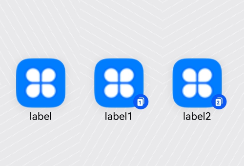
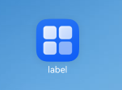
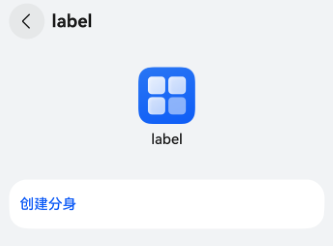
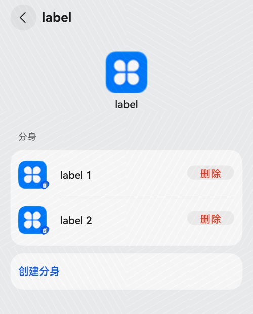

# 创建应用分身
应用分身能实现在一个设备上安装多个相同的应用，实现多个账号同时登录使用和运行并且互不影响。主要应用场景有社交账号双开、游戏大小号双开等，无需账号切换，从而省去频繁登录的繁琐。

创建应用分身后，在桌面上会出现多个应用图标相同的应用，其中拥有下角标的应用图标为分身应用。

效果图如下所示:




## 创建应用分身的配置方法

在工程项目中对AppScope/app.json5配置文件配置[multiAppMode](app-configuration-file.md#multiappmode标签)字段。具体配置如下：
```json
{
  "app": {
    "multiAppMode": {
      "multiAppModeType": "appClone",
      "maxCount": 2
    }
  }
}
```

## 开发者创建应用分身

下面介绍如何创建分身应用：

1. 将已配置好的工程编译打包安装到设备上。
 
      

2. 打开设置>系统>应用分身，点击“创建分身”。

      
      

3. 返回到桌面查看是否创建成功。

      

      图中的三个应用都是独立的进程，运行、数据、通知等，都是彼此独立的。

主应用与分身应用的关系：
- 主应用和分身应用共享同一个应用。例如，当主应用更新/升级时，主应用与分身应用都会同步更新，包括应用的图标(icon)和名称(label)、应用特性本身的新特性等。
- 主应用和分身应用，其对应的使能和相关配置都是独立的，数据也是彼此隔离。
- 当主应用被卸载时，会同步卸载掉所有的分身应用。而卸载分身应用不会出现这样的情况。

