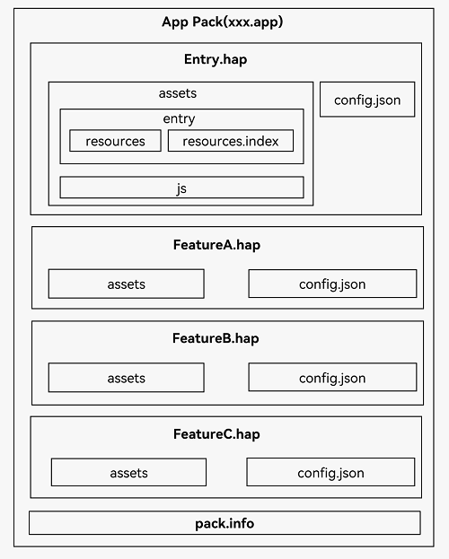

# FA模型应用程序包结构

基于[FA模型](application-configuration-file-overview-fa.md)开发的应用，其应用程序包结构如下图**应用程序包结构（FA模型）**所示。开发者需要熟悉应用程序包结构相关的基本概念。

FA模型与Stage模型不同之处在于HAP内部文件存放位置不同，FA模型将所有的资源文件、库文件和代码文件都放在assets文件夹中，在文件夹内部进一步区分。

- config.json是应用配置文件，IDE会自动生成一部分模块代码，开发者按需修改其中的配置。详细字段请参见[应用配置文件](app-structure.md)。

- assets是HAP所有的资源文件、库文件和代码文件的集合，内部可以分为entry和js文件夹。entry文件夹中存放的是resources目录和resources.index文件。

- resources目录用于存放应用的资源文件（字符串、图片等），便于开发者使用和维护，详见[资源文件的使用](resource-categories-and-access.md)。

- resources.index是资源索引表，由IDE调用SDK工具生成。

- js文件夹中存放的是编译后的代码文件。

- pack.info是Bundle中用于描述每个HAP属性的文件，例如app中的bundleName和versionCode信息、module中的name、type和abilities等信息，由IDE工具构建Bundle包时自动生成。

**图1** 应用程序包结构（FA模型）  
