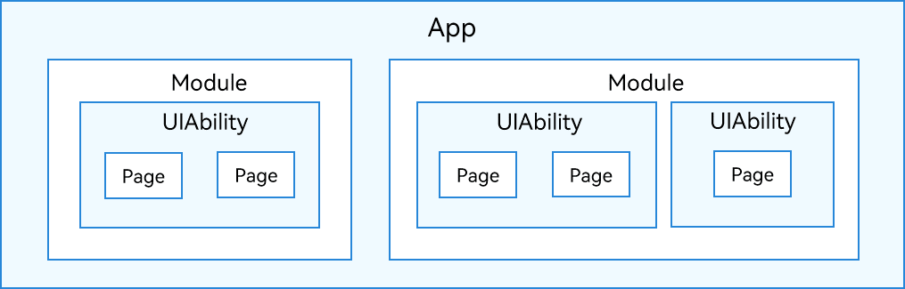
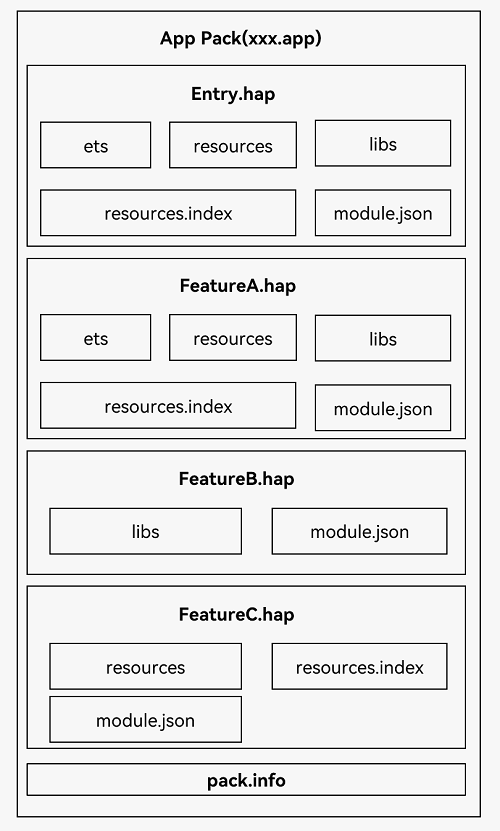

# Stage模型应用程序包结构

基于[Stage模型](application-configuration-file-overview-stage.md)开发的应用，经编译打包后，其应用程序包结构如下图**应用程序包结构（Stage模型）**所示。开发者需要熟悉应用程序包结构相关的基本概念。

- 在开发态，一个应用包含一个或者多个Module，可以在[DevEco Studio](https://developer.harmonyos.com/cn/develop/deveco-studio/)工程中[创建一个或者多个Module](https://developer.harmonyos.com/cn/docs/documentation/doc-guides-V3/ohos-adding-deleting-module-0000001218760594-V3)。Module是OpenHarmony应用/服务的基本功能单元，包含了源代码、资源文件、第三方库及应用/服务配置文件，每一个Module都可以独立进行编译和运行。Module分为“Ability”和“Library”两种类型，“Ability”类型的Module对应于编译后的HAP（Harmony Ability Package）；“Library”类型的Module对应于[HAR](har-structure.md)（Harmony Ability Resources）包，即编译后的.tgz文件。
  一个Module可以包含一个或多个[UIAbility](../application-models/uiability-overview.md)组件，如**Module与UIAbility组件关系示意图**所示。

    **图1** Module与UIAbility组件关系示意图  
  

  全文中介绍到的Module默认指的是“Ability”类型的Module。

- 开发者通过DevEco Studio把应用程序编译为一个或者多个.hap后缀的文件，即HAP。HAP是OpenHarmony应用安装的基本单位，包含了编译后的代码、资源、三方库及配置文件。HAP可分为Entry和Feature两种类型。
  - Entry类型的HAP：是应用的主模块，在[module.json5配置文件](module-configuration-file.md)中的type标签配置为“entry”类型。在同一个应用中，同一设备类型只支持一个Entry类型的HAP，通常用于实现应用的入口界面、入口图标、主特性功能等。
  - Feature类型的HAP：是应用的动态特性模块，在[module.json5配置文件](module-configuration-file.md)中的type标签配置为“feature”类型。一个应用程序包可以包含一个或多个Feature类型的HAP，也可以不包含；Feature类型的HAP通常用于实现应用的特性功能，可以配置成按需下载安装，也可以配置成随Entry类型的HAP一起下载安装（请参见[module对象内部结构](module-configuration-file.md)中的“deliveryWithInstall”）。

- 每个OpenHarmony应用可以包含多个.hap文件，一个应用中的.hap文件合在一起称为一个Bundle，而bundleName就是应用的唯一标识（请参见[app.json5配置文件](app-configuration-file.md)中的bundleName标签）。需要特别说明的是：在应用上架到应用市场时，需要把应用包含的所有.hap文件（即Bundle）打包为一个.app后缀的文件用于上架，这个.app文件称为App Pack（Application Package），其中同时包含了描述App Pack属性的pack.info文件；在云端分发和端侧安装时，都是以HAP为单位进行分发和安装的。

- 打包后的HAP包结构包括ets、libs、resources等文件夹和resources.index、module.json、pack.info等文件。
  - ets目录用于存放应用代码编译后的字节码文件。
  - libs目录用于存放库文件。库文件是OpenHarmony应用依赖的第三方代码（例如.so、.jar、.bin、.har等二进制文件）。
  - resources目录用于存放应用的资源文件（字符串、图片等），便于开发者使用和维护，详见[资源文件的使用](../key-features/multi-device-app-dev/resource-usage.md)。
  - resources.index是资源索引表，由IDE编译工程时生成。
  - module.json是HAP的配置文件，内容由工程配置中的module.json5和app.json5组成，该文件是HAP中必不可少的文件。IDE会自动生成一部分默认配置，开发者按需修改其中的配置。详细字段请参见[应用配置文件](application-configuration-file-overview-stage.md)。
  - pack.info是Bundle中用于描述每个HAP属性的文件，例如app中的bundleName和versionCode信息、module中的name、type和abilities等信息，由IDE工具生成Bundle包时自动生成。

   **图2** 应用程序包结构（Stage模型）  
     
