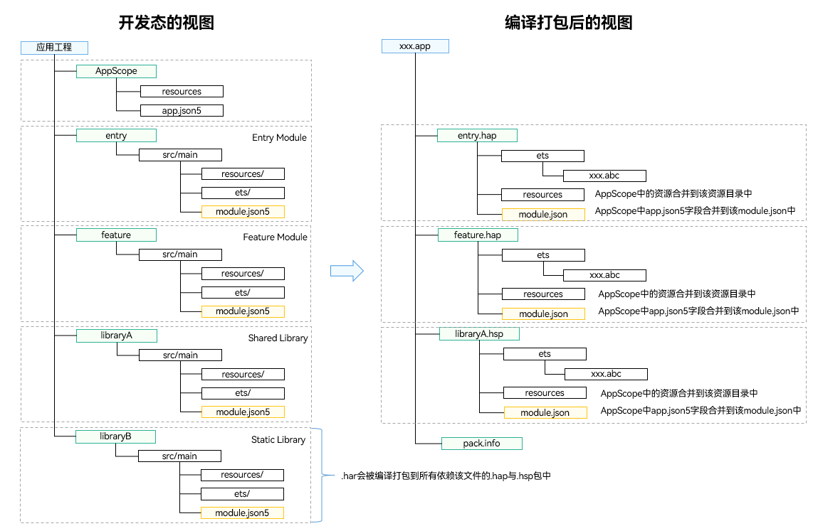
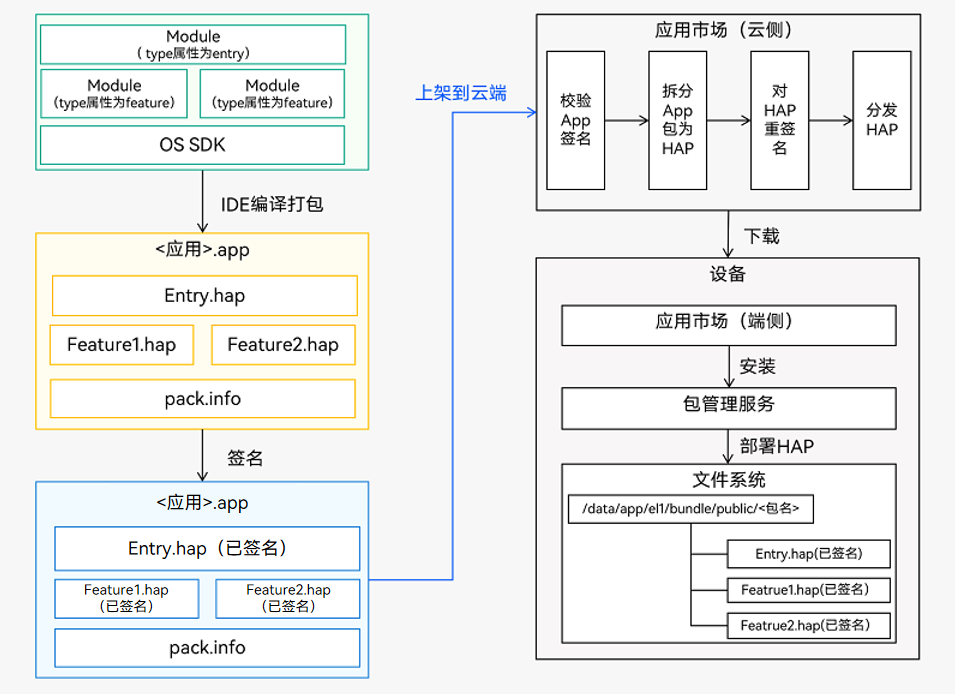

# Stage模型应用程序包结构

为了让开发者能对应用程序包在不同阶段的形态有更加清晰的认知，分别对开发态、编译态、发布态的应用程序结构展开介绍。

## 开发态包结构
在DevEco Studio上创建一个项目工程，并尝试创建多个不同类型的Module。根据实际工程中的目录对照本章节进行学习，可以有助于理解开发态的应用程序结构。

**图1** 项目工程结构示意图（以实际为准）

工程结构主要包含的文件类型及用途如下：

> **说明：**
>
> - AppScope目录由DevEco Studio自动生成，不可更改。
> - Module目录名称可以由DevEco Studio自动生成（比如entry、library等），也可以自定义。为了便于说明，下表中统一采用Module_name表示。

| 文件类型 | 说明 |
| -------- | -------- |
| 配置文件 | 包括应用级配置信息、以及Module级配置信息：  - **AppScope &gt; app.json5**：[app.json5配置文件](app-configuration-file.md)，用于声明应用的全局配置信息，比如应用Bundle名称、应用名称、应用图标、应用版本号等。  - **Module_name &gt; src &gt; main &gt; module.json5**：[module.json5配置文件](module-configuration-file.md)，用于声明Module基本信息、支持的设备类型、所含的组件信息、运行所需申请的权限等。 |
| ArkTS源码文件 | **Module_name &gt; src &gt; main &gt; ets**：用于存放Module的ArkTS源码文件（.ets文件）。|
| 资源文件 | 包括应用级资源文件、以及Module级资源文件，支持图形、多媒体、字符串、布局文件等，详见[资源分类与访问](resource-categories-and-access.md)。  - **AppScope &gt; resources** ：用于存放应用需要用到的资源文件。  - **Module_name &gt; src &gt; main &gt; resources** ：用于存放该Module需要用到的资源文件。|
| 其他配置文件 | 用于编译构建，包括构建配置文件、编译构建任务脚本、混淆规则文件、依赖的共享包信息等。  - **build-profile.json5**：工程级或Module级的构建配置文件，包括应用签名、产品配置等。   - **hvigorfile.ts**：应用级或Module级的编译构建任务脚本，开发者可以自定义编译构建工具版本、控制构建行为的配置参数。  - **obfuscation-rules.txt**：混淆规则文件。混淆开启后，在使用Release模式进行编译时，会对代码进行编译、混淆及压缩处理，保护代码资产。  - **oh-package.json5**：用于存放依赖库的信息，包括所依赖的三方库和共享包。 |

## 编译态包结构
不同类型的Module编译后会生成对应的HAP、HAR、HSP等文件，开发态视图与编译态视图的对照关系如下：

**图2** 开发态与编译态的工程结构视图

从开发态到编译态，Module中的文件会发生如下变更：
- **ets目录**：ArkTS源码编译生成.abc文件。
- **resources目录**：AppScope目录下的资源文件会合入到Module下面资源目录中，如果两个目录下存在重名文件，编译打包后只会保留AppScope目录下的资源文件。
- **module配置文件**：AppScope目录下的app.json5文件字段会合入到Module下面的module.json5文件之中，编译后生成HAP或HSP最终的module.json文件。

> **说明：**
>
> 在编译HAP和HSP时，会把他们所依赖的HAR直接编译到HAP和HSP中。

## 发布态包结构

每个应用中至少包含一个.hap文件，可能包含若干个.hsp文件、也可能不含，一个应用中的所有.hap与.hsp文件合在一起称为**Bundle**，其对应的bundleName是应用的唯一标识（详见[app.json5配置文件](app-configuration-file.md)中的bundleName标签）。

当应用发布上架到应用市场时，需要将Bundle打包为一个.app后缀的文件用于上架，这个.app文件称为**App Pack**（Application Package），与此同时，DevEco Studio工具自动会生成一个**pack.info**文件。**pack.info**文件描述了App Pack中每个HAP和HSP的属性，包含APP中的bundleName和versionCode信息、以及Module中的name、type和abilities等信息。

> **说明：**
>
> - App Pack是发布上架到应用市场的基本单元，但是不能在设备上直接安装和运行。
> - 在应用签名、云端分发、端侧安装时，都是以HAP/HSP为单位进行签名、分发和安装的。

**图3** 编译发布与上架部署流程图

## 选择合适的包类型

HAP、HAR、HSP三者的功能和使用场景总结对比如下：

| Module类型 | 包类型 | 说明 |
| -------- | -------- | -------- |
| Ability | [HAP](hap-package.md)| 应用的功能模块，可以独立安装和运行，必须包含一个entry类型的HAP，可选包含一个或多个feature类型的HAP。|
| Static Library | [HAR](har-package.md) | 静态共享包，编译态复用。  - 支持应用内共享，也可以发布后供其他应用使用。  &ensp; - 作为二方库，发布到[OHPM私仓](https://developer.huawei.com/consumer/cn/doc/harmonyos-guides-V13/ide-ohpm-repo-V13)，供公司内部其他应用使用。  &ensp; - 作为三方库，发布到[OHPM中心仓](https://ohpm.openharmony.cn/)，供其他应用使用。  - 多包（HAP/HSP）引用相同的HAR时，会造成多包间代码和资源的重复拷贝，从而导致应用包膨大。  - 注意：[编译HAR](har-package.md#编译)时，建议开启混淆能力，保护代码资产。 |
| Shared Library | [HSP](in-app-hsp.md)| 动态共享包，运行时复用。  - 当多包（HAP/HSP）同时引用同一个共享包时，采用HSP替代HAR，可以避免HAR造成的多包间代码和资源的重复拷贝，从而减小应用包大小。 |

HAP、HSP、HAR支持的规格对比如下，其中“√”表示是，“×”表示否。

开发者可以根据实际场景所需的能力，选择相应类型的包进行开发。在后续的章节中还会针对如何使用[HAP](hap-package.md)、[HAR](har-package.md)、[HSP](in-app-hsp.md)分别展开详细介绍。

| 规格| HAP | HAR | HSP |
| -------- | ---------- |----------- |----------- |
| 支持在配置文件中声明[UIAbility](../application-models/uiability-overview.md)组件|  √  |  √   |  √   |
| 支持在配置文件中声明[ExtensionAbility](../application-models/extensionability-overview.md)组件  | √ | × | √ |
| 支持在配置文件中声明[pages](./module-configuration-file.md#pages标签)页面| √  |× |√ |
| 支持包含资源文件与.so文件 | √  |√ |√|
| 支持依赖其他HAR文件 | √ |√  |√  |
| 支持依赖其他HSP文件 | √ |√  |√  |
| 支持在设备上独立安装运行 | √ |× |× |

> **说明：**
>
> - 如果HAR支持声明pages页面，那么当HAR被打包到HAP或HSP中时，其内部声明的pages页面可能会与HAP/HSP中的pages页面存在相对路径上的重复，这将导致无法根据相对路径识别特定的路由页面。因此，HAR不支持在配置文件中声明pages页面，但可以包含pages页面，并通过[命名路由](../ui/arkts-routing.md#命名路由)的方式进行跳转。
> - 由于HSP仅支持应用内共享，如果HAR依赖了HSP，则该HAR文件仅支持应用内共享，不支持发布到二方仓或三方仓供其他应用使用，否则会导致编译失败。
> - HAR和HSP均不支持循环依赖，也不支持依赖传递。

