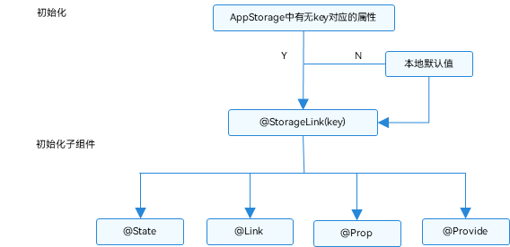

# AppStorage：应用全局的UI状态存储


AppStorage是应用全局的UI状态存储，是和应用的进程绑定的，由UI框架在应用程序启动时创建，为应用程序UI状态属性提供中央存储。


和AppStorage不同的是，LocalStorage是页面级的，通常应用于页面内的数据共享。而AppStorage是应用级的全局状态共享，还相当于整个应用的“中枢”，[持久化数据PersistentStorage](arkts-persiststorage.md)和[环境变量Environment](arkts-environment.md)都是通过AppStorage中转，才可以和UI交互。


本文仅介绍AppStorage使用场景和相关的装饰器：\@StorageProp和\@StorageLink。


## 概述

AppStorage是在应用启动的时候会被创建的单例。它的目的是为了提供应用状态数据的中心存储，这些状态数据在应用级别都是可访问的。AppStorage将在应用运行过程保留其属性。属性通过唯一的键字符串值访问。

AppStorage可以和UI组件同步，且可以在应用业务逻辑中被访问。

AppStorage支持应用的[主线程](../application-models/thread-model-stage.md)内多个UIAbility实例间的状态共享。

AppStorage中的属性可以被双向同步，数据可以是存在于本地或远程设备上，并具有不同的功能，比如数据持久化（详见[PersistentStorage](arkts-persiststorage.md)）。这些数据是通过业务逻辑中实现，与UI解耦，如果希望这些数据在UI中使用，需要用到[@StorageProp](#storageprop)和[@StorageLink](#storagelink)。


## \@StorageProp

在上文中已经提到，如果要建立AppStorage和自定义组件的联系，需要使用\@StorageProp和\@StorageLink装饰器。使用\@StorageProp(key)/\@StorageLink(key)装饰组件内的变量，key标识了AppStorage的属性。

当自定义组件初始化的时候，会使用AppStorage中对应key的属性值将\@StorageProp(key)/\@StorageLink(key)装饰的变量初始化。由于应用逻辑的差异，无法确认是否在组件初始化之前向AppStorage实例中存入了对应的属性，所以AppStorage不一定存在key对应的属性，因此\@StorageProp(key)/\@StorageLink(key)装饰的变量进行本地初始化是必要的。

\@StorageProp(key)是和AppStorage中key对应的属性建立单向数据同步，允许本地改变，但是对于\@StorageProp，本地的修改永远不会同步回AppStorage中，相反，如果AppStorage给定key的属性发生改变，改变会被同步给\@StorageProp，并覆盖掉本地的修改。
> **说明：**
>
> 从API version 11开始，该装饰器支持在原子化服务中使用。

### 装饰器使用规则说明

| \@StorageProp变量装饰器 | 说明                                                         |
| ----------------------- | ------------------------------------------------------------ |
| 装饰器参数              | key：常量字符串，必填（字符串需要有引号）。                  |
| 允许装饰的变量类型      | Object、class、string、number、boolean、enum类型，以及这些类型的数组。<br/>API12及以上支持Map、Set、Date类型。嵌套类型的场景请参考[观察变化和行为表现](#观察变化和行为表现)。<br/>类型必须被指定，建议和AppStorage中对应属性类型相同，否则会发生类型隐式转换，从而导致应用行为异常。<br/>不支持any，API12及以上支持undefined和null类型。<br/>API12及以上支持上述支持类型的联合类型，比如string \| number, string \| undefined 或者 ClassA \| null，示例见[AppStorage支持联合类型](#appstorage支持联合类型)。 <br/>**注意**<br/>当使用undefined和null的时候，建议显式指定类型，遵循TypeScript类型校验，比如：`@StorageProp("AA") a: number \| null = null`是推荐的，不推荐`@StorageProp("AA") a: number = null`。 |
| 同步类型                | 单向同步：从AppStorage的对应属性到组件的状态变量。<br/>组件本地的修改是允许的，但是AppStorage中给定的属性一旦发生变化，将覆盖本地的修改。 |
| 被装饰变量的初始值      | 必须指定，如果AppStorage实例中不存在属性，则用该初始值初始化该属性，并存入AppStorage中。 |


### 变量的传递/访问规则说明

| 传递/访问      | 说明                                       |
| ---------- | ---------------------------------------- |
| 从父节点初始化和更新 | 禁止，\@StorageProp不支持从父节点初始化，只能AppStorage中key对应的属性初始化，如果没有对应key的话，将使用本地默认值初始化 |
| 初始化子节点     | 支持，可用于初始化\@State、\@Link、\@Prop、\@Provide。 |
| 是否支持组件外访问  | 否。                                       |


  **图1** \@StorageProp初始化规则图示  


### 观察变化和行为表现

**观察变化**


- 当装饰的数据类型为boolean、string、number类型时，可以观察到数值的变化。

- 当装饰的数据类型为class或者Object时，可以观察到对象整体赋值和对象属性变化（详见[从ui内部使用appstorage和localstorage](#从ui内部使用appstorage和localstorage)）。

- 当装饰的对象是array时，可以观察到数组添加、删除、更新数组单元的变化。

- 当装饰的对象是Date时，可以观察到Date整体的赋值，同时可通过调用Date的接口`setFullYear`, `setMonth`, `setDate`, `setHours`, `setMinutes`, `setSeconds`, `setMilliseconds`, `setTime`, `setUTCFullYear`, `setUTCMonth`, `setUTCDate`, `setUTCHours`, `setUTCMinutes`, `setUTCSeconds`, `setUTCMilliseconds` 更新Date的属性。详见[装饰Date类型变量](#装饰date类型变量)。

- 当装饰的变量是Map时，可以观察到Map整体的赋值，同时可通过调用Map的接口`set`, `clear`, `delete` 更新Map的值。详见[装饰Map类型变量](#装饰map类型变量)。

- 当装饰的变量是Set时，可以观察到Set整体的赋值，同时可通过调用Set的接口`add`, `clear`, `delete` 更新Set的值。详见[装饰Set类型变量](#装饰set类型变量)。


**框架行为**


- 当\@StorageProp(key)装饰的数值改变被观察到时，修改不会被同步回AppStorage对应key的属性中。

- 当前\@StorageProp(key)单向绑定的数据会被修改，即仅限于当前组件的私有成员变量改变，其他绑定该key的数据不会同步改变。

- 当\@StorageProp(key)装饰的数据本身是状态变量，它的改变虽然不会同步回AppStorage中，但是会引起所属的自定义组件重新渲染。

- 当AppStorage中key对应的属性发生改变时，会同步给所有\@StorageProp(key)装饰的数据，\@StorageProp(key)本地的修改将被覆盖。


## \@StorageLink

> **说明：**
>
> 从API version 11开始，该装饰器支持在原子化服务中使用。

\@StorageLink(key)是和AppStorage中key对应的属性建立双向数据同步：

1. 本地修改发生，该修改会被写回AppStorage中；

2. AppStorage中的修改发生后，该修改会被同步到所有绑定AppStorage对应key的属性上，包括单向（\@StorageProp和通过Prop创建的单向绑定变量）、双向（\@StorageLink和通过Link创建的双向绑定变量）变量和其他实例（比如PersistentStorage）。

### 装饰器使用规则说明

| \@StorageLink变量装饰器 | 说明                                       |
| ------------------ | ---------------------------------------- |
| 装饰器参数              | key：常量字符串，必填（字符串需要有引号）。                  |
| 允许装饰的变量类型          | Object、class、string、number、boolean、enum类型，以及这些类型的数组。<br/>API12及以上支持Map、Set、Date类型。嵌套类型的场景请参考[观察变化和行为表现](#观察变化和行为表现)。<br/>类型必须被指定，建议和AppStorage中对应属性类型相同，否则会发生类型隐式转换，从而导致应用行为异常。<br/>不支持any，API12及以上支持undefined和null类型。<br/>API12及以上支持上述支持类型的联合类型，比如string \| number, string \| undefined 或者 ClassA \| null，示例见[AppStorage支持联合类型](#appstorage支持联合类型)。 <br/>**注意**<br/>当使用undefined和null的时候，建议显式指定类型，遵循TypeScript类型校验，比如：`@StorageLink("AA") a: number \| null = null`是推荐的，不推荐`@StorageLink("AA") a: number = null`。 |
| 同步类型               | 双向同步：从AppStorage的对应属性到自定义组件，从自定义组件到AppStorage对应属性。 |
| 被装饰变量的初始值          | 必须指定，如果AppStorage实例中不存在属性，则用该初始值初始化该属性，并存入AppStorage中。 |


### 变量的传递/访问规则说明

| 传递/访问      | 说明                                       |
| ---------- | ---------------------------------------- |
| 从父节点初始化和更新 | 禁止。                                      |
| 初始化子节点     | 支持，可用于初始化常规变量、\@State、\@Link、\@Prop、\@Provide。 |
| 是否支持组件外访问  | 否。                                       |


  **图2** \@StorageLink初始化规则图示  





### 观察变化和行为表现

**观察变化**


- 当装饰的数据类型为boolean、string、number类型时，可以观察到数值的变化。

- 当装饰的数据类型为class或者Object时，可以观察到对象整体赋值和对象属性变化（详见[从ui内部使用appstorage和localstorage](#从ui内部使用appstorage和localstorage)）。

- 当装饰的对象是array时，可以观察到数组添加、删除、更新数组单元的变化。

- 当装饰的对象是Date时，可以观察到Date整体的赋值，同时可通过调用Date的接口`setFullYear`, `setMonth`, `setDate`, `setHours`, `setMinutes`, `setSeconds`, `setMilliseconds`, `setTime`, `setUTCFullYear`, `setUTCMonth`, `setUTCDate`, `setUTCHours`, `setUTCMinutes`, `setUTCSeconds`, `setUTCMilliseconds` 更新Date的属性。详见[装饰Date类型变量](#装饰date类型变量)。

- 当装饰的变量是Map时，可以观察到Map整体的赋值，同时可通过调用Map的接口`set`, `clear`, `delete` 更新Map的值。详见[装饰Map类型变量](#装饰map类型变量)。

- 当装饰的变量是Set时，可以观察到Set整体的赋值，同时可通过调用Set的接口`add`, `clear`, `delete` 更新Set的值。详见[装饰Set类型变量](#装饰set类型变量)。


**框架行为**


1. 当\@StorageLink(key)装饰的数值改变被观察到时，修改将被同步回AppStorage对应属性键值key的属性中。

2. AppStorage中属性键值key对应的数据一旦改变，属性键值key绑定的所有的数据（包括双向\@StorageLink和单向\@StorageProp）都将同步修改。

3. 当\@StorageLink(key)装饰的数据本身是状态变量，它的改变不仅仅会同步回AppStorage中，还会引起所属的自定义组件的重新渲染。


## 限制条件

1. \@StorageProp/\@StorageLink的参数必须为string类型，否则编译期会报错。

```ts
AppStorage.setOrCreate('PropA', 47);

// 错误写法，编译报错
@StorageProp() storageProp: number = 1;
@StorageLink() storageLink: number = 2;

// 正确写法
@StorageProp('PropA') storageProp: number = 1;
@StorageLink('PropA') storageLink: number = 2;
```

2. \@StorageProp与\@StorageLink不支持装饰Function类型的变量，框架会抛出运行时错误。

3. AppStorage与[PersistentStorage](arkts-persiststorage.md)以及[Environment](arkts-environment.md)配合使用时，需要注意以下几点：

    （1） 在AppStorage中创建属性后，调用PersistentStorage.persistProp()接口时，会使用在AppStorage中已经存在的值，并覆盖PersistentStorage中的同名属性，所以建议要使用相反的调用顺序，反例可见[在PersistentStorage之前访问AppStorage中的属性](arkts-persiststorage.md#在persistentstorage之前访问appstorage中的属性)；

    （2） 如果在AppStorage中已经创建属性后，再调用Environment.envProp()创建同名的属性，会调用失败。因为AppStorage已经有同名属性，Environment环境变量不会再写入AppStorage中，所以建议AppStorage中属性不要使用Environment预置环境变量名。

    （3） 状态装饰器装饰的变量，改变会引起UI的渲染更新，如果改变的变量不是用于UI更新，只是用于消息传递，推荐使用 emitter方式。例子可见<!--Del-->[<!--DelEnd-->不建议借助@StorageLink的双向同步机制实现事件通知<!--Del-->](#不建议借助storagelink的双向同步机制实现事件通知)<!--DelEnd-->。


## 使用场景


### 从应用逻辑使用AppStorage和LocalStorage

AppStorage是单例，它的所有API都是静态的，使用方法类似于LocalStorage中对应的非静态方法。


```ts
AppStorage.setOrCreate('PropA', 47);

let storage: LocalStorage = new LocalStorage();
storage.setOrCreate('PropA',17);
let propA: number | undefined = AppStorage.get('PropA') // propA in AppStorage == 47, propA in LocalStorage == 17
let link1: SubscribedAbstractProperty<number> = AppStorage.link('PropA'); // link1.get() == 47
let link2: SubscribedAbstractProperty<number> = AppStorage.link('PropA'); // link2.get() == 47
let prop: SubscribedAbstractProperty<number> = AppStorage.prop('PropA'); // prop.get() == 47

link1.set(48); // 双向同步: link1.get() == link2.get() == prop.get() == 48
prop.set(1); // 单向同步: prop.get() == 1; 但 link1.get() == link2.get() == 48
link1.set(49); // 双向同步: link1.get() == link2.get() == prop.get() == 49

storage.get<number>('PropA') // == 17
storage.set('PropA', 101);
storage.get<number>('PropA') // == 101

AppStorage.get<number>('PropA') // == 49
link1.get() // == 49
link2.get() // == 49
prop.get() // == 49
```


### 从UI内部使用AppStorage和LocalStorage

\@StorageLink变量装饰器与AppStorage配合使用，正如\@LocalStorageLink与LocalStorage配合使用一样。此装饰器使用AppStorage中的属性创建双向数据同步。


```ts
class PropB {
  code: number;

  constructor(code: number) {
    this.code = code;
  }
}

AppStorage.setOrCreate('PropA', 47);
AppStorage.setOrCreate('PropB', new PropB(50));
let storage = new LocalStorage();
storage.setOrCreate('PropA', 48);
storage.setOrCreate('PropB', new PropB(100));

@Entry(storage)
@Component
struct CompA {
  @StorageLink('PropA') storageLink: number = 1;
  @LocalStorageLink('PropA') localStorageLink: number = 1;
  @StorageLink('PropB') storageLinkObject: PropB = new PropB(1);
  @LocalStorageLink('PropB') localStorageLinkObject: PropB = new PropB(1);

  build() {
    Column({ space: 20 }) {
      Text(`From AppStorage ${this.storageLink}`)
        .onClick(() => {
          this.storageLink += 1;
        })

      Text(`From LocalStorage ${this.localStorageLink}`)
        .onClick(() => {
          this.localStorageLink += 1;
        })

      Text(`From AppStorage ${this.storageLinkObject.code}`)
        .onClick(() => {
          this.storageLinkObject.code += 1;
        })

      Text(`From LocalStorage ${this.localStorageLinkObject.code}`)
        .onClick(() => {
          this.localStorageLinkObject.code += 1;
        })
    }
  }
}
```

### 不建议借助@StorageLink的双向同步机制实现事件通知

不建议开发者使用@StorageLink和AppStorage的双向同步的机制来实现事件通知，因为AppStorage中的变量可能绑定在多个不同页面的组件中，但事件通知则不一定需要通知到所有的这些组件。并且，当这些@StorageLink装饰的变量在UI中使用时，会触发UI刷新，带来不必要的性能影响。

示例代码中，TapImage中的点击事件，会触发AppStorage中tapIndex对应属性的改变。因为@StorageLink是双向同步，修改会同步回AppStorage中，所以，所有绑定AppStorage的tapIndex自定义组件里都能感知到tapIndex的变化。使用@Watch监听到tapIndex的变化后，修改状态变量tapColor从而触发UI刷新（此处tapIndex并未直接绑定在UI上，因此tapIndex的变化不会直接触发UI刷新）。

使用该机制来实现事件通知需要确保AppStorage中的变量尽量不要直接绑定在UI上，且需要控制@Watch函数的复杂度（如果@Watch函数执行时间长，会影响UI刷新效率）。


```ts
// xxx.ets
class ViewData {
  title: string;
  uri: Resource;
  color: Color = Color.Black;

  constructor(title: string, uri: Resource) {
    this.title = title;
    this.uri = uri
  }
}

@Entry
@Component
struct Gallery2 {
  // 此处'app.media.icon'仅作示例，请开发者自行替换，否则imageSource创建失败会导致后续无法正常执行。
  dataList: Array<ViewData> = [new ViewData('flower', $r('app.media.icon')), new ViewData('OMG', $r('app.media.icon')), new ViewData('OMG', $r('app.media.icon'))]
  scroller: Scroller = new Scroller()

  build() {
    Column() {
      Grid(this.scroller) {
        ForEach(this.dataList, (item: ViewData, index?: number) => {
          GridItem() {
            TapImage({
              uri: item.uri,
              index: index
            })
          }.aspectRatio(1)

        }, (item: ViewData, index?: number) => {
          return JSON.stringify(item) + index;
        })
      }.columnsTemplate('1fr 1fr')
    }

  }
}

@Component
export struct TapImage {
  @StorageLink('tapIndex') @Watch('onTapIndexChange') tapIndex: number = -1;
  @State tapColor: Color = Color.Black;
  private index: number = 0;
  private uri: Resource = {
    id: 0,
    type: 0,
    moduleName: "",
    bundleName: ""
  };

  // 判断是否被选中
  onTapIndexChange() {
    if (this.tapIndex >= 0 && this.index === this.tapIndex) {
      console.info(`tapindex: ${this.tapIndex}, index: ${this.index}, red`)
      this.tapColor = Color.Red;
    } else {
      console.info(`tapindex: ${this.tapIndex}, index: ${this.index}, black`)
      this.tapColor = Color.Black;
    }
  }

  build() {
    Column() {
      Image(this.uri)
        .objectFit(ImageFit.Cover)
        .onClick(() => {
          this.tapIndex = this.index;
        })
        .border({ width: 5, style: BorderStyle.Dotted, color: this.tapColor })
    }

  }
}
```

相比借助@StorageLink的双向同步机制实现事件通知，开发者可以使用emit订阅某个事件并接收事件回调的方式来减少开销，增强代码的可读性。

> **说明：**
>
> emit接口不支持在Previewer预览器中使用。


```ts
// xxx.ets
import { emitter } from '@kit.BasicServicesKit';

let NextID: number = 0;

class ViewData {
  title: string;
  uri: Resource;
  color: Color = Color.Black;
  id: number;

  constructor(title: string, uri: Resource) {
    this.title = title;
    this.uri = uri
    this.id = NextID++;
  }
}

@Entry
@Component
struct Gallery2 {
  // 此处'app.media.icon'仅作示例，请开发者自行替换，否则imageSource创建失败会导致后续无法正常执行。
  dataList: Array<ViewData> = [new ViewData('flower', $r('app.media.icon')), new ViewData('OMG', $r('app.media.icon')), new ViewData('OMG', $r('app.media.icon'))]
  scroller: Scroller = new Scroller()
  private preIndex: number = -1

  build() {
    Column() {
      Grid(this.scroller) {
        ForEach(this.dataList, (item: ViewData) => {
          GridItem() {
            TapImage({
              uri: item.uri,
              index: item.id
            })
          }.aspectRatio(1)
          .onClick(() => {
            if (this.preIndex === item.id) {
              return
            }
            let innerEvent: emitter.InnerEvent = { eventId: item.id }
            // 选中态：黑变红
            let eventData: emitter.EventData = {
              data: {
                "colorTag": 1
              }
            }
            emitter.emit(innerEvent, eventData)

            if (this.preIndex != -1) {
              console.info(`preIndex: ${this.preIndex}, index: ${item.id}, black`)
              let innerEvent: emitter.InnerEvent = { eventId: this.preIndex }
              // 取消选中态：红变黑
              let eventData: emitter.EventData = {
                data: {
                  "colorTag": 0
                }
              }
              emitter.emit(innerEvent, eventData)
            }
            this.preIndex = item.id
          })
        }, (item: ViewData) => JSON.stringify(item))
      }.columnsTemplate('1fr 1fr')
    }

  }
}

@Component
export struct TapImage {
  @State tapColor: Color = Color.Black;
  private index: number = 0;
  private uri: Resource = {
    id: 0,
    type: 0,
    moduleName: "",
    bundleName: ""
  };

  onTapIndexChange(colorTag: emitter.EventData) {
    if (colorTag.data != null) {
      this.tapColor = colorTag.data.colorTag ? Color.Red : Color.Black
    }
  }

  aboutToAppear() {
    //定义事件ID
    let innerEvent: emitter.InnerEvent = { eventId: this.index }
    emitter.on(innerEvent, data => {
    this.onTapIndexChange(data)
    })
  }

  build() {
    Column() {
      Image(this.uri)
        .objectFit(ImageFit.Cover)
        .border({ width: 5, style: BorderStyle.Dotted, color: this.tapColor })
    }
  }
}
```

以上通知事件逻辑简单，也可以简化成三元表达式。

```ts
// xxx.ets
class ViewData {
  title: string;
  uri: Resource;
  color: Color = Color.Black;

  constructor(title: string, uri: Resource) {
    this.title = title;
    this.uri = uri
  }
}

@Entry
@Component
struct Gallery2 {
  // 此处'app.media.icon'仅作示例，请开发者自行替换，否则imageSource创建失败会导致后续无法正常执行。
  dataList: Array<ViewData> = [new ViewData('flower', $r('app.media.icon')), new ViewData('OMG', $r('app.media.icon')), new ViewData('OMG', $r('app.media.icon'))]
  scroller: Scroller = new Scroller()

  build() {
    Column() {
      Grid(this.scroller) {
        ForEach(this.dataList, (item: ViewData, index?: number) => {
          GridItem() {
            TapImage({
              uri: item.uri,
              index: index
            })
          }.aspectRatio(1)

        }, (item: ViewData, index?: number) => {
          return JSON.stringify(item) + index;
        })
      }.columnsTemplate('1fr 1fr')
    }

  }
}

@Component
export struct TapImage {
  @StorageLink('tapIndex') tapIndex: number = -1;
  private index: number = 0;
  private uri: Resource = {
    id: 0,
    type: 0,
    moduleName: "",
    bundleName: ""
  };

  build() {
    Column() {
      Image(this.uri)
        .objectFit(ImageFit.Cover)
        .onClick(() => {
          this.tapIndex = this.index;
        })
        .border({
          width: 5,
          style: BorderStyle.Dotted,
          color: (this.tapIndex >= 0 && this.index === this.tapIndex) ? Color.Red : Color.Black
        })
    }
  }
}
```


### AppStorage支持联合类型

在下面的示例中，变量A的类型为number | null，变量B的类型为number | undefined。Text组件初始化分别显示为null和undefined，点击切换为数字，再次点击切换回null和undefined。

```ts
@Component
struct StorLink {
  @StorageLink("AA") A: number | null = null;
  @StorageLink("BB") B: number | undefined = undefined;

  build() {
    Column() {
      Text("@StorageLink接口初始化，@StorageLink取值")
      Text(this.A + "").fontSize(20).onClick(() => {
        this.A ? this.A = null : this.A = 1;
      })
      Text(this.B + "").fontSize(20).onClick(() => {
        this.B ? this.B = undefined : this.B = 1;
      })
    }
    .borderWidth(3).borderColor(Color.Red)

  }
}

@Component
struct StorProp {
  @StorageProp("AAA") A: number | null = null;
  @StorageProp("BBB") B: number | undefined = undefined;

  build() {
    Column() {
      Text("@StorageProp接口初始化，@StorageProp取值")
      Text(this.A + "").fontSize(20).onClick(() => {
        this.A ? this.A = null : this.A = 1;
      })
      Text(this.B + "").fontSize(20).onClick(() => {
        this.B ? this.B = undefined : this.B = 1;
      })
    }
    .borderWidth(3).borderColor(Color.Blue)
  }
}

@Entry
@Component
struct TestCase3 {
  build() {
    Row() {
      Column() {
        StorLink()
        StorProp()
      }
      .width('100%')
    }
    .height('100%')
  }
}
```


### 装饰Date类型变量

> **说明：**
>
> 从API version 12开始，AppStorage支持Date类型。

在下面的示例中，@StorageLink装饰的selectedDate类型为Date，点击Button改变selectedDate的值，视图会随之刷新。

```ts
@Entry
@Component
struct DateSample {
  @StorageLink("date") selectedDate: Date = new Date('2021-08-08');

  build() {
    Column() {
      Button('set selectedDate to 2023-07-08')
        .margin(10)
        .onClick(() => {
          AppStorage.setOrCreate("date", new Date('2023-07-08'));
        })
      Button('increase the year by 1')
        .margin(10)
        .onClick(() => {
          this.selectedDate.setFullYear(this.selectedDate.getFullYear() + 1);
        })
      Button('increase the month by 1')
        .margin(10)
        .onClick(() => {
          this.selectedDate.setMonth(this.selectedDate.getMonth() + 1);
        })
      Button('increase the day by 1')
        .margin(10)
        .onClick(() => {
          this.selectedDate.setDate(this.selectedDate.getDate() + 1);
        })
      DatePicker({
        start: new Date('1970-1-1'),
        end: new Date('2100-1-1'),
        selected: $$this.selectedDate
      })
    }.width('100%')
  }
}
```


### 装饰Map类型变量

> **说明：**
>
> 从API version 12开始，AppStorage支持Map类型。

在下面的示例中，@StorageLink装饰的message类型为Map\<number, string\>，点击Button改变message的值，视图会随之刷新。

```ts
@Entry
@Component
struct MapSample {
  @StorageLink("map") message: Map<number, string> = new Map([[0, "a"], [1, "b"], [3, "c"]]);

  build() {
    Row() {
      Column() {
        ForEach(Array.from(this.message.entries()), (item: [number, string]) => {
          Text(`${item[0]}`).fontSize(30)
          Text(`${item[1]}`).fontSize(30)
          Divider()
        })
        Button('init map').onClick(() => {
          this.message = new Map([[0, "a"], [1, "b"], [3, "c"]]);
        })
        Button('set new one').onClick(() => {
          this.message.set(4, "d");
        })
        Button('clear').onClick(() => {
          this.message.clear();
        })
        Button('replace the existing one').onClick(() => {
          this.message.set(0, "aa");
        })
        Button('delete the existing one').onClick(() => {
          AppStorage.get<Map<number, string>>("map")?.delete(0);
        })
      }
      .width('100%')
    }
    .height('100%')
  }
}
```


### 装饰Set类型变量

> **说明：**
>
> 从API version 12开始，AppStorage支持Set类型。

在下面的示例中，@StorageLink装饰的memberSet类型为Set\<number\>，点击Button改变memberSet的值，视图会随之刷新。

```ts
@Entry
@Component
struct SetSample {
  @StorageLink("set") memberSet: Set<number> = new Set([0, 1, 2, 3, 4]);

  build() {
    Row() {
      Column() {
        ForEach(Array.from(this.memberSet.entries()), (item: [number, string]) => {
          Text(`${item[0]}`)
            .fontSize(30)
          Divider()
        })
        Button('init set')
          .onClick(() => {
            this.memberSet = new Set([0, 1, 2, 3, 4]);
          })
        Button('set new one')
          .onClick(() => {
            AppStorage.get<Set<number>>("set")?.add(5);
          })
        Button('clear')
          .onClick(() => {
            this.memberSet.clear();
          })
        Button('delete the first one')
          .onClick(() => {
            this.memberSet.delete(0);
          })
      }
      .width('100%')
    }
    .height('100%')
  }
}
```

## 常见问题

### \@StorageProp本地更改值后，无法通过AppStorage接口更新

```ts
AppStorage.setOrCreate('PropA', false);

@Entry
@Component
struct Index {
  @StorageProp('PropA') @Watch('onChange') propA: boolean = false;

  onChange() {
    console.log(`propA change`);
  }

  aboutToAppear(): void {
    this.propA = true;
  }

  build() {
    Column() {
      Text(`${this.propA}`)
      Button('change')
        .onClick(() => {
          AppStorage.setOrCreate('PropA', false);
          console.log(`PropA: ${this.propA}`);
        })
    }
  }
}
```

上述示例，在点击事件之前，PropA的值已经在本地被更改为true，而AppStorage中存的值仍为false。当点击事件通过setOrCreate接口尝试更新PropA的值为false时，由于AppStorage中的值为false，两者相等，不会触发更新同步，因此@StorageProp的值仍为true。

如果想要实现二者同步，有两种方式：
（1）将\@StorageProp更改为\@StorageLink。
（2）本地更改值的方式变为使用AppStorage.setOrCreate('PropA', true)的方式。
