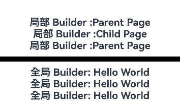

# \@BuilderParam装饰器：引用\@Builder函数


当开发者创建了自定义组件，并想对该组件添加特定功能时，例如在自定义组件中添加一个点击跳转操作。若直接在组件内嵌入事件方法，将会导致所有引入该自定义组件的地方均增加了该功能。为解决此问题，ArkUI引入了\@BuilderParam装饰器，\@BuilderParam用来装饰指向[\@Builder](./arkts-builder.md)方法的变量（@BuilderParam是用来承接@Builder函数的）。开发者可以在初始化自定义组件时，使用不同的方式（如：参数修改、尾随闭包、借用箭头函数等）对\@BuilderParam装饰的自定义构建函数进行传参赋值，在自定义组件内部通过调用\@BuilderParam为组件增加特定的功能。该装饰器用于声明任意UI描述的一个元素，类似slot占位符。


在阅读本文档前，建议提前阅读：[\@Builder](./arkts-builder.md)。

> **说明：**
>
> 从API version 9开始，该装饰器支持在ArkTS卡片中使用。
>
> 从API version 11开始，该装饰器支持在原子化服务中使用。


## 装饰器使用说明


### 初始化\@BuilderParam装饰的方法

\@BuilderParam装饰的方法只能被自定义构建函数（\@Builder装饰的方法）初始化。如果在API 11中和[\@Require](arkts-require.md)结合使用，则必须父组件构造传参。

- 使用所属自定义组件的自定义构建函数或者全局的自定义构建函数，在本地初始化\@BuilderParam。

  ```ts
  @Builder function overBuilder() {}

  @Component
  struct Child {
    @Builder doNothingBuilder() {};

    // 使用自定义组件的自定义构建函数初始化@BuilderParam
    @BuilderParam customBuilderParam: () => void = this.doNothingBuilder;
    // 使用全局自定义构建函数初始化@BuilderParam
    @BuilderParam customOverBuilderParam: () => void = overBuilder;
    build(){}
  }
  ```

- 用父组件自定义构建函数初始化子组件\@BuilderParam装饰的方法。

  ```ts
  @Component
  struct Child {
    @Builder customBuilder() {};
    // 使用父组件@Builder装饰的方法初始化子组件@BuilderParam
    @BuilderParam customBuilderParam: () => void = this.customBuilder;

    build() {
      Column() {
        this.customBuilderParam()
      }
    }
  }

  @Entry
  @Component
  struct Parent {
    @Builder componentBuilder() {
      Text(`Parent builder `)
    }

    build() {
      Column() {
        Child({ customBuilderParam: this.componentBuilder })
      }
    }
  }
  ```
  **图1** 示例效果图

  


- 需要注意this的指向。

以下示例对this的指向做了介绍。

  ```ts
  @Component
  struct Child {
    label: string = `Child`;
    @Builder customBuilder() {};
    @Builder customChangeThisBuilder() {};
    @BuilderParam customBuilderParam: () => void = this.customBuilder;
    @BuilderParam customChangeThisBuilderParam: () => void = this.customChangeThisBuilder;

    build() {
      Column() {
        this.customBuilderParam()
        this.customChangeThisBuilderParam()
      }
    }
  }

  @Entry
  @Component
  struct Parent {
    label: string = `Parent`;

    @Builder componentBuilder() {
      Text(`${this.label}`)
    }

    build() {
      Column() {
        // 调用this.componentBuilder()时，this指向当前@Entry所装饰的Parent组件，即label变量的值为"Parent"。
        this.componentBuilder()
        Child({
          // 把this.componentBuilder传给子组件Child的@BuilderParam customBuilderParam，this指向的是子组件Child，即label变量的值为"Child"。
          customBuilderParam: this.componentBuilder,
          // 把():void=>{this.componentBuilder()}传给子组件Child的@BuilderParam customChangeThisBuilderParam，
          // 因为箭头函数的this指向的是宿主对象，所以label变量的值为"Parent"。
          customChangeThisBuilderParam: (): void => { this.componentBuilder() }
        })
      }
    }
  }
  ```
 **图2** 示例效果图

 


## 限制条件

- \@BuilderParam装饰的变量接收来自父组件使用\@Builder装饰的函数，且\@Builder函数是参数传递类型，仅支持局部\@Builder函数作为参数传递。

```ts
@Component
struct Child {
  header: string = '';
  @BuilderParam content: () => void;
  footer: string = '';

  build() {
    Column() {
      Text(this.header)
      this.content();
      Text(this.footer)
    }
  }
}

@Entry
@Component
struct Parent {
  @Builder
  test() {
    Text('Hello')
  }

  build() {
    Column() {
      // 错误写法，@BuilderParam需要被初始化
      Child()
      // 正确写法
      Child({ content: this.test })
    }
  }
}
```

- 在自定义组件尾随闭包的场景下，子组件有且仅有一个\@BuilderParam用来接收此尾随闭包，且此\@BuilderParam不能有参数。详情见[尾随闭包初始化组件](#尾随闭包初始化组件)。


## 使用场景


### 参数初始化组件

\@BuilderParam装饰的方法可以是有参数和无参数的两种形式，需与指向的\@Builder方法类型匹配。\@BuilderParam装饰的方法类型需要和\@Builder方法类型一致。

```ts
class Tmp{
  label: string = '';
}

@Builder function overBuilder($$: Tmp) {
  Text($$.label)
    .width(400)
    .height(50)
    .backgroundColor(Color.Green)
}

@Component
struct Child {
  label: string = 'Child';
  @Builder customBuilder() {};
  // 无参数类型，指向的componentBuilder也是无参数类型
  @BuilderParam customBuilderParam: () => void = this.customBuilder;
  // 有参数类型，指向的overBuilder也是有参数类型的方法
  @BuilderParam customOverBuilderParam: ($$: Tmp) => void = overBuilder;

  build() {
    Column() {
      this.customBuilderParam()
      this.customOverBuilderParam({label: 'global Builder label' } )
    }
  }
}

@Entry
@Component
struct Parent {
  label: string = 'Parent';

  @Builder componentBuilder() {
    Text(`${this.label}`)
  }

  build() {
    Column() {
      this.componentBuilder()
      Child({ customBuilderParam: this.componentBuilder, customOverBuilderParam: overBuilder })
    }
  }
}
```
**图3** 示例效果图


### 尾随闭包初始化组件

在自定义组件中使用\@BuilderParam装饰的属性时也可通过尾随闭包进行初始化。在初始化自定义组件时，组件后紧跟一个大括号“{}”形成尾随闭包场景。

> **说明：**
>
>  - 此场景下自定义组件内有且仅有一个使用\@BuilderParam装饰的属性。
> 
>  - 此场景下自定义组件不支持使用通用属性。

开发者可以将尾随闭包内的内容看做\@Builder装饰的函数传给\@BuilderParam。

示例1：

```ts
@Component
struct CustomContainer {
  @Prop header: string = '';
  @Builder closerBuilder(){};
  // 使用父组件的尾随闭包{}(@Builder装饰的方法)初始化子组件@BuilderParam
  @BuilderParam closer: () => void = this.closerBuilder;

  build() {
    Column() {
      Text(this.header)
        .fontSize(30)
      this.closer()
    }
  }
}

@Builder function specificParam(label1: string, label2: string) {
  Column() {
    Text(label1)
      .fontSize(30)
    Text(label2)
      .fontSize(30)
  }
}

@Entry
@Component
struct CustomContainerUser {
  @State text: string = 'header';

  build() {
    Column() {
      // 创建CustomContainer，在创建CustomContainer时，通过其后紧跟一个大括号“{}”形成尾随闭包
      // 作为传递给子组件CustomContainer @BuilderParam closer: () => void的参数
      CustomContainer({ header: this.text }) {
        Column() {
          specificParam('testA', 'testB')
        }.backgroundColor(Color.Yellow)
        .onClick(() => {
          this.text = 'changeHeader';
        })
      }
    }
  }
}
```
**图4** 示例效果图


使用全局@Builder和局部@Builder通过尾随闭包的形式去初始化@ComponentV2修饰的自定义组件中的@BuilderParam。

示例2：

```ts
@ComponentV2
struct ChildPage {
  @Require @Param message: string = "";
  @Builder customBuilder() {};
  @BuilderParam customBuilderParam: () => void = this.customBuilder;

  build() {
    Column() {
      Text(this.message)
        .fontSize(30)
        .fontWeight(FontWeight.Bold)
      this.customBuilderParam()
    }
  }
}

const builder_value: string = 'Hello World';
@Builder function overBuilder() {
  Row() {
    Text(`全局 Builder: ${builder_value}`)
      .fontSize(20)
      .fontWeight(FontWeight.Bold)
  }
}

@Entry
@ComponentV2
struct ParentPage {
  @Local label: string = `Parent Page`;

  @Builder componentBuilder() {
    Row(){
      Text(`局部 Builder :${this.label}`)
        .fontSize(20)
        .fontWeight(FontWeight.Bold)
    }
  }

  build() {
    Column() {
      ChildPage({ message: this.label}){
        Column() {  // 使用局部@Builder，通过组件后紧跟一个大括号“{}”形成尾随闭包去初始化自定义组件@BuilderParam
          this.componentBuilder();
        }
      }
      Line()
        .width('100%')
        .height(10)
        .backgroundColor('#000000').margin(10)
      ChildPage({ message: this.label}){  // 使用全局@Builder，通过组件后紧跟一个大括号“{}”形成尾随闭包去初始化自定义组件@BuilderParam
        Column() {
          overBuilder();
        }
      }
    }
  }
}
```

### 使用全局和局部\@Builder初始化\@BuilderParam

在自定义组件中，使用\@BuilderParam修饰的变量接收来自父组件通过\@Builder传递的内容进行初始化，因为父组件的\@Builder可以使用箭头函数的形式改变当前的this指向，所以当使用\@BuilderParam修饰的变量时，会展示出不同的内容。

```ts
@Component
struct ChildPage {
  label: string = `Child Page`;
  @Builder customBuilder() {};
  @BuilderParam customBuilderParam: () => void = this.customBuilder;
  @BuilderParam customChangeThisBuilderParam: () => void = this.customBuilder;

  build() {
    Column() {
      this.customBuilderParam()
      this.customChangeThisBuilderParam()
    }
  }
}

const builder_value: string = 'Hello World';
@Builder function overBuilder() {
  Row() {
    Text(`全局 Builder: ${builder_value}`)
      .fontSize(20)
      .fontWeight(FontWeight.Bold)
  }
}

@Entry
@Component
struct ParentPage {
  label: string = `Parent Page`;

  @Builder componentBuilder() {
    Row(){
      Text(`局部 Builder :${this.label}`)
        .fontSize(20)
        .fontWeight(FontWeight.Bold)
    }
  }

  build() {
    Column() {
      // 调用this.componentBuilder()时，this指向当前@Entry所装饰的ParentPage组件，所以label变量的值为"Parent Page"。
      this.componentBuilder()
      ChildPage({
        // 把this.componentBuilder传给子组件ChildPage的@BuilderParam customBuilderParam，this指向的是子组件ChildPage，所以label变量的值为"Child Page"。
        customBuilderParam: this.componentBuilder,
        // 把():void=>{this.componentBuilder()}传给子组件ChildPage的@BuilderParam customChangeThisBuilderParam，
        // 因为箭头函数的this指向的是宿主对象，所以label变量的值为"Parent Page"。
        customChangeThisBuilderParam: (): void => { this.componentBuilder() }
      })
      Line()
        .width('100%')
        .height(10)
        .backgroundColor('#000000').margin(10)
      // 调用全局overBuilder()时，this指向当前整个活动页，所以展示的内容为"Hello World"。
      overBuilder()
      ChildPage({
        // 把全局overBuilder传给子组件ChildPage的@BuilderParam customBuilderParam，this指向当前整个活动页，所以展示的内容为"Hello World"。
        customBuilderParam: overBuilder,
        // 把全局overBuilder传给子组件ChildPage的@BuilderParam customChangeThisBuilderParam，this指向当前整个活动页，所以展示的内容为"Hello World"。
        customChangeThisBuilderParam: overBuilder
      })
    }
  }
}
```
**图5** 示例效果图



### 在@ComponentV2修饰的自定义组件中使用@BuilderParam

使用全局@Builder和局部@Builder去初始化@CompoentV2修饰的自定义组件中的@BuilderParam属性。

```ts
@ComponentV2
struct ChildPage {
  @Param label: string = `Child Page`;
  @Builder customBuilder() {};
  @BuilderParam customBuilderParam: () => void = this.customBuilder;
  @BuilderParam customChangeThisBuilderParam: () => void = this.customBuilder;

  build() {
    Column() {
      this.customBuilderParam()
      this.customChangeThisBuilderParam()
    }
  }
}

const builder_value: string = 'Hello World';
@Builder function overBuilder() {
  Row() {
    Text(`全局 Builder: ${builder_value}`)
      .fontSize(20)
      .fontWeight(FontWeight.Bold)
  }
}

@Entry
@ComponentV2
struct ParentPage {
  @Local label: string = `Parent Page`;

  @Builder componentBuilder() {
    Row(){
      Text(`局部 Builder :${this.label}`)
        .fontSize(20)
        .fontWeight(FontWeight.Bold)
    }
  }

  build() {
    Column() {
      // 调用this.componentBuilder()时，this指向当前@Entry所装饰的ParentPage组件，所以label变量的值为"Parent Page"。
      this.componentBuilder()
      ChildPage({
        // 把this.componentBuilder传给子组件ChildPage的@BuilderParam customBuilderParam，this指向的是子组件ChildPage，所以label变量的值为"Child Page"。
        customBuilderParam: this.componentBuilder,
        // 把():void=>{this.componentBuilder()}传给子组件ChildPage的@BuilderParam customChangeThisBuilderPara
        // 因为箭头函数的this指向的是宿主对象，所以label变量的值为"Parent Page"。
        customChangeThisBuilderParam: (): void => { this.componentBuilder() }
      })
      Line()
        .width('100%')
        .height(5)
        .backgroundColor('#000000').margin(10)
      // 调用全局overBuilder()时，this指向当前整个活动页，所以展示的内容为"Hello World"。
      overBuilder()
      ChildPage({
        // 把全局overBuilder传给子组件ChildPage的@BuilderParam customBuilderParam，this指向当前整个活动页，所以展示的内容为"Hello World"。
        customBuilderParam: overBuilder,
        // 把全局overBuilder传给子组件ChildPage的@BuilderParam customChangeThisBuilderParam，this指向当前整个活动页，所以展示的内容为"Hello World"。
        customChangeThisBuilderParam: overBuilder
      })
    }
  }
}
```
**图6** 示例效果图


## 常见问题

### 改变内容UI不刷新

当调用自定义组件ChildPage时，把\@Builder作为参数通过this.componentBuilder的形式传递，当前this会指向自定义组件内部，所以在父组件里面改变label的值，自定义组件ChildPage是感知不到的。

【反例】

```ts
@Component
struct ChildPage {
  @State label: string = `Child Page`;
  @Builder customBuilder() {};
  @BuilderParam customChangeThisBuilderParam: () => void = this.customBuilder;

  build() {
    Column() {
      this.customChangeThisBuilderParam()
    }
  }
}

@Entry
@Component
struct ParentPage {
  @State label: string = `Parent Page`;

  @Builder componentBuilder() {
    Row(){
      Text(`Builder :${this.label}`)
        .fontSize(20)
        .fontWeight(FontWeight.Bold)
    }
  }

  build() {
    Column() {
      ChildPage({
        // 当前写法this指向ChildPage组件内
        customChangeThisBuilderParam: this.componentBuilder
      })
      Button('点击改变label内容')
        .onClick(() => {
          this.label = 'Hello World';
        })
    }
  }
}
```

使用箭头函数的形式把\@Builder传递进自定义组件ChildPage中，当前this指向会停留在父组件ParentPage里，所以在父组件里改变label的值，自定义组件ChildPage会感知到并重新渲染UI。
把@Builder改为@LocalBuilder也能实现动态渲染UI功能。

【正例】

```ts
@Component
struct ChildPage {
  @State label: string = `Child Page`;
  @Builder customBuilder() {};
  @BuilderParam customChangeThisBuilderParam: () => void = this.customBuilder;

  build() {
    Column() {
      this.customChangeThisBuilderParam()
    }
  }
}

@Entry
@Component
struct ParentPage {
  @State label: string = `Parent Page`;

  @Builder componentBuilder() {
    Row(){
      Text(`Builder :${this.label}`)
        .fontSize(20)
        .fontWeight(FontWeight.Bold)
    }
  }

  build() {
    Column() {
      ChildPage({
        customChangeThisBuilderParam: () => { this.componentBuilder() }
      })
      Button('点击改变label内容')
        .onClick(() => {
          this.label = 'Hello World';
        })
    }
  }
}
```