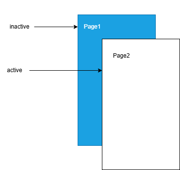
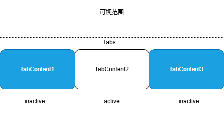
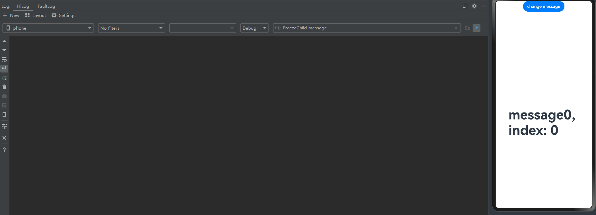
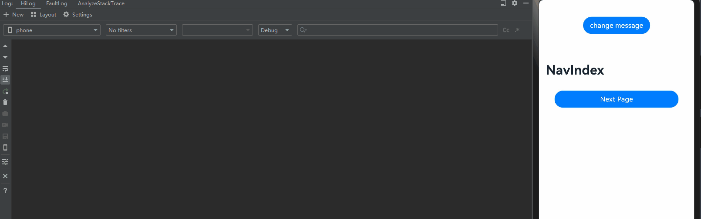
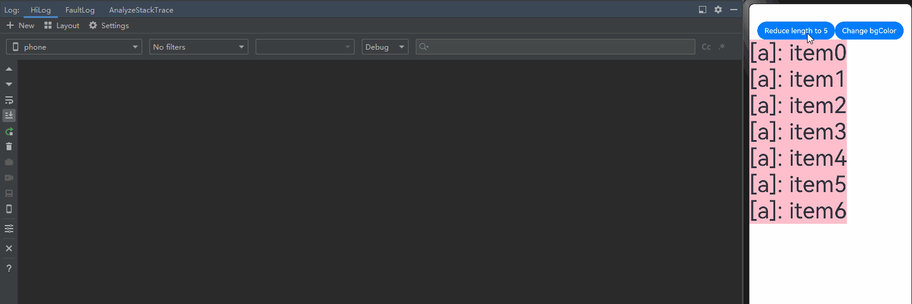

# 自定义组件冻结功能

当@ComponentV2装饰的自定义组件处于非激活状态时，状态变量将不响应更新，即@Monitor不会调用，状态变量关联的节点不会刷新。通过freezeWhenInactive属性来决定是否使用冻结功能，不传参数时默认不使用。支持的场景有：页面路由，TabContent，Navigation。

在阅读本文档前，开发者需要了解\@ComponentV2基本语法。建议提前阅读：[\@ComponentV2](./arkts-new-componentV2.md)。

> **说明：**
>
> 从API version 12开始，支持@ComponentV2装饰的自定义组件冻结功能。
>
> 从API version 18开始，支持自定义组件冻结功能的混用场景冻结。
>
> 和@Component的组件冻结不同， @ComponentV2装饰的自定义组件不支持LazyForEach场景下的缓存节点组件冻结。


## 当前支持的场景

### 页面路由

> **说明：**
>
> 本示例使用了router进行页面跳转，建议开发者使用组件导航(Navigation)代替页面路由(router)来实现页面切换。Navigation提供了更多的功能和更灵活的自定义能力。请参考[使用Navigation的组件冻结用例](#navigation)。

- 当页面1调用router.pushUrl接口跳转到页面2时，页面1为隐藏不可见状态，此时如果更新页面1中的状态变量，不会触发页面1刷新。
图示如下：



页面1：

```ts
import { router } from '@kit.ArkUI';

@ObservedV2
export class Book {
  @Trace name: string = "100";

  constructor(page: string) {
    this.name = page;
  }
}

@Entry
@ComponentV2({ freezeWhenInactive: true })
export struct Page1 {
  @Local bookTest: Book = new Book("A Midsummer Night’s Dream");

  @Monitor("bookTest.name")
  onMessageChange(monitor: IMonitor) {
    console.log(`The book name change from ${monitor.value()?.before} to ${monitor.value()?.now}`);
  }

  build() {
    Column() {
      Text(`Book name is  ${this.bookTest.name}`).fontSize(25)
      Button('changeBookName').fontSize(25)
        .onClick(() => {
          this.bookTest.name = "The Old Man and the Sea";
        })
      Button('go to next page').fontSize(25)
        .onClick(() => {
          router.pushUrl({ url: 'pages/Page2' });
          setTimeout(() => {
            this.bookTest = new Book("Jane Austen oPride and Prejudice");
          }, 1000)
        })
    }
  }
}
```

页面2：

```ts
import { router } from '@kit.ArkUI';

@Entry
@ComponentV2
struct Page2 {
  build() {
    Column() {
      Text(`This is the page2`).fontSize(25)
      Button('Back')
        .onClick(() => {
          router.back();
        })
    }
  }
}
```

在上面的示例中：

1.点击页面1中的Button “changeBookName”，bookTest变量的name属性改变，@Monitor中注册的方法onMessageChange会被调用。

2.点击页面1中的Button “go to next page”，跳转到页面2，然后延迟1s更新状态变量“bookTest”。在更新“bookTest”的时候，已经跳转到页面2，页面1处于inactive状态，状态变量`@Local bookTest`将不响应更新，其@Monitor不会调用，状态变量关联的节点不会刷新。
trace如下：


3.点击“back”，页面2被销毁，页面1的状态由inactive变为active。状态变量“bookTest”的更新被观察到，@Monitor中注册的方法onMessageChange被调用，对应的Text显示内容改变。


### TabContent

- 对Tabs中当前不可见的TabContent进行冻结，不会触发组件的更新。

- 需要注意的是：在首次渲染的时候，Tab只会创建当前正在显示的TabContent，当切换全部的TabContent后，TabContent才会被全部创建。

图示如下：



```ts
@Entry
@ComponentV2
struct TabContentTest {
  @Local message: number = 0;
  @Local data: number[] = [0, 1];

  build() {
    Row() {
      Column() {
        Button('change message').onClick(() => {
          this.message++;
        })

        Tabs() {
          ForEach(this.data, (item: number) => {
            TabContent() {
              FreezeChild({ message: this.message, index: item })
            }.tabBar(`tab${item}`)
          }, (item: number) => item.toString())
        }
      }
      .width('100%')
    }
    .height('100%')
  }
}

@ComponentV2({ freezeWhenInactive: true })
struct FreezeChild {
  @Param message: number = 0;
  @Param index: number = 0;

  @Monitor('message') onMessageUpdated(mon: IMonitor) {
    console.info(`FreezeChild message callback func ${this.message}, index: ${this.index}`);
  }

  build() {
    Text("message" + `${this.message}, index: ${this.index}`)
      .fontSize(50)
      .fontWeight(FontWeight.Bold)
  }
}
```

在上面的示例中：

1.点击“change message”更改message的值，当前正在显示的TabContent组件中的@Monitor中注册的方法onMessageUpdated被触发。

2.点击TabBar“tab1”切换到另外的TabContent，TabContent状态由inactive变为active，对应的@Monitor中注册的方法onMessageUpdated被触发。 

3.再次点击“change message”更改message的值，仅当前显示的TabContent子组件中的@Monitor中注册的方法onMessageUpdated被触发。其他inactive的TabContent组件不会触发@Monitor。




### Navigation

- 当NavDestination不可见时，会将其子自定义组件设置成非激活态，不会触发组件的刷新。当返回该页面时，其子自定义组件重新恢复成激活态，触发@Monitor回调进行刷新。

```ts
@Entry
@ComponentV2
struct MyNavigationTestStack {
  @Provider('pageInfo') pageInfo: NavPathStack = new NavPathStack();
  @Local message: number = 0;

  @Monitor('message') info() {
    console.info(`freeze-test MyNavigation message callback ${this.message}`);
  }

  @Builder
  PageMap(name: string) {
    if (name === 'pageOne') {
      pageOneStack({ message: this.message })
    } else if (name === 'pageTwo') {
      pageTwoStack({ message: this.message })
    } else if (name === 'pageThree') {
      pageThreeStack({ message: this.message })
    }
  }

  build() {
    Column() {
      Button('change message')
        .onClick(() => {
          this.message++;
        })
      Navigation(this.pageInfo) {
        Column() {
          Button('Next Page', { stateEffect: true, type: ButtonType.Capsule })
            .onClick(() => {
              this.pageInfo.pushPath({ name: 'pageOne' }); //将name指定的NavDestination页面信息入栈
            })
        }
      }.title('NavIndex')
      .navDestination(this.PageMap)
      .mode(NavigationMode.Stack)
    }
  }
}

@ComponentV2
struct pageOneStack {
  @Consumer('pageInfo') pageInfo: NavPathStack = new NavPathStack();
  @Local index: number = 1;
  @Param message: number = 0;

  build() {
    NavDestination() {
      Column() {
        NavigationContentMsgStack({ message: this.message, index: this.index })
        Text("cur stack size:" + `${this.pageInfo.size()}`)
          .fontSize(30)
        Button('Next Page', { stateEffect: true, type: ButtonType.Capsule })
          .onClick(() => {
            this.pageInfo.pushPathByName('pageTwo', null);
          })
        Button('Back Page', { stateEffect: true, type: ButtonType.Capsule })
          .onClick(() => {
            this.pageInfo.pop();
          })
      }.width('100%').height('100%')
    }.title('pageOne')
    .onBackPressed(() => {
      this.pageInfo.pop();
      return true;
    })
  }
}

@ComponentV2
struct pageTwoStack {
  @Consumer('pageInfo') pageInfo: NavPathStack = new NavPathStack();
  @Local index: number = 2;
  @Param message: number = 0;

  build() {
    NavDestination() {
      Column() {
        NavigationContentMsgStack({ message: this.message, index: this.index })
        Text("cur stack size:" + `${this.pageInfo.size()}`)
          .fontSize(30)
        Button('Next Page', { stateEffect: true, type: ButtonType.Capsule })
          .onClick(() => {
            this.pageInfo.pushPathByName('pageThree', null);
          })
        Button('Back Page', { stateEffect: true, type: ButtonType.Capsule })
          .onClick(() => {
            this.pageInfo.pop();
          })
      }
    }.title('pageTwo')
    .onBackPressed(() => {
      this.pageInfo.pop();
      return true;
    })
  }
}

@ComponentV2
struct pageThreeStack {
  @Consumer('pageInfo') pageInfo: NavPathStack = new NavPathStack();
  @Local index: number = 3;
  @Param message: number = 0;

  build() {
    NavDestination() {
      Column() {
        NavigationContentMsgStack({ message: this.message, index: this.index })
        Text("cur stack size:" + `${this.pageInfo.size()}`)
          .fontSize(30)
        Button('Next Page', { stateEffect: true, type: ButtonType.Capsule })
          .height(40)
          .onClick(() => {
            this.pageInfo.pushPathByName('pageOne', null);
          })
        Button('Back Page', { stateEffect: true, type: ButtonType.Capsule })
          .height(40)
          .onClick(() => {
            this.pageInfo.pop();
          })
      }
    }.title('pageThree')
    .onBackPressed(() => {
      this.pageInfo.pop();
      return true;
    })
  }
}

@ComponentV2({ freezeWhenInactive: true })
struct NavigationContentMsgStack {
  @Param message: number = 0;
  @Param index: number = 0;

  @Monitor('message') info() {
    console.info(`freeze-test NavigationContent message callback ${this.message}`);
    console.info(`freeze-test ---- called by content ${this.index}`);
  }

  build() {
    Column() {
      Text("msg:" + `${this.message}`)
        .fontSize(30)
    }
  }
}
```

在上面的示例中：

1.点击“change message”更改message的值，当前正在显示的MyNavigationTestStack组件中的@Monitor中注册的方法info被触发。

2.点击“Next Page”切换到PageOne，创建pageOneStack节点。 

3.再次点击“change message”更改message的值，仅pageOneStack中的NavigationContentMsgStack子组件中的@Monitor中注册的方法info被触发。

4.再次点击“Next Page”切换到PageTwo，创建pageTwoStack节点。pageOneStack节点状态由active变为inactive。

5.再次点击“change message”更改message的值，仅pageTwoStack中的NavigationContentMsgStack子组件中的@Monitor中注册的方法info被触发。Navigation路由栈中非栈顶的NavDestination中的子自定义组件，将是inactive状态。@Monitor方法不会触发。

6.再次点击“Next Page”切换到PageThree，创建pageThreeStack节点。pageTwoStack节点状态由active变为inactive。

7.再次点击“change message”更改message的值，仅pageThreeStack中的NavigationContentMsgStack子组件中的@Monitor中注册的方法info被触发。Navigation路由栈中非栈顶的NavDestination中的子自定义组件，将是inactive状态。@Monitor方法不会触发。

8.点击“Back Page”回到PageTwo，此时，pageTwoStack节点状态由inactive变为active，其NavigationContentMsgStack子组件中的@Monitor中注册的方法info被触发。

9.再次点击“Back Page”回到PageOne，此时，pageOneStack节点状态由inactive变为active，其NavigationContentMsgStack子组件中的@Monitor中注册的方法info被触发。

10.再次点击“Back Page”回到初始页。



### Repeat virtualScroll

> **说明：**
>
> Repeat virtualScroll从API version 18开始支持自定义组件冻结。

对Repeat virtualScroll缓存池中的自定义组件进行冻结，避免不必要的组件刷新。建议提前阅读[Repeat组件生成及复用virtualScroll规则](./arkts-new-rendering-control-repeat.md#子组件渲染逻辑-1)。

```ts
@Entry
@ComponentV2
struct RepeatVirtualScrollFreeze {
  @Local simpleList: Array<string> = [];
  @Local bgColor: Color = Color.Pink;

  aboutToAppear(): void {
    for (let i = 0; i < 7; i++) {
      this.simpleList.push(`item${i}`);
    }
  }

  build() {
    Column() {
      Row() {
        Button(`Reduce length to 5`)
          .onClick(() => {
            this.simpleList = this.simpleList.slice(0, 5);
          })
        Button(`Change bgColor`)
          .onClick(() => {
            this.bgColor = this.bgColor == Color.Pink ? Color.Blue : Color.Pink;
          })
      }

      List() {
        Repeat(this.simpleList)
          .each((obj: RepeatItem<string>) => {
          })
          .key((item: string, index: number) => item)
          .virtualScroll({ totalCount: this.simpleList.length })
          .templateId(() => `a`)
          .template(`a`, (ri) => {
            ChildComponent({
              message: ri.item,
              bgColor: this.bgColor
            })
          }, { cachedCount: 2 })
      }
      .cachedCount(0)
      .height(500)
    }
    .height(`100%`)
  }
}

// 开启组件冻结
@ComponentV2({ freezeWhenInactive: true })
struct ChildComponent {
  @Param @Require message: string = ``;
  @Param @Require bgColor: Color = Color.Pink;
  @Monitor(`bgColor`)
  onBgColorChange(monitor: IMonitor) {
    // bgColor改变时，缓存池中组件不刷新，不会打印日志
    console.log(`repeat---bgColor change from ${monitor.value()?.before} to ${monitor.value()?.now}`);
  }

  build() {
    Text(`[a]: ${this.message}`)
      .fontSize(50)
      .backgroundColor(this.bgColor)
  }
}
```

在上面的示例中：

点击“Reduce length to 5”后，被移除的两个组件会进入Repeat缓存池，然后点击“Change bgColor”更改bgColor的值触发节点刷新。

开启组件冻结（freezeWhenInactive: true），只有剩余节点中@Monitor装饰的方法onBgColorChange被触发，如示例中屏上的5个节点会刷新并打印5条日志，缓存池中的节点则不会。



```ts
// 关闭组件冻结
@ComponentV2({ freezeWhenInactive: false })
struct ChildComponent {
  @Param @Require message: string = ``;
  @Param @Require bgColor: Color = Color.Pink;
  @Monitor(`bgColor`)
  onBgColorChange(monitor: IMonitor) {
    // bgColor改变时，缓存池组件也会刷新，并打印日志
    console.log(`repeat---bgColor change from ${monitor.value()?.before} to ${monitor.value()?.now}`);
  }

  build() {
    Text(`[a]: ${this.message}`)
      .fontSize(50)
      .backgroundColor(this.bgColor)
  }
}
```

不开启组件冻结（freezeWhenInactive: false，当未指定freezeWhenInactive参数时默认不开启组件冻结），剩余节点和缓存池节点中@Monitor装饰的方法onBgColorChange都会被触发，即会有7个节点会刷新并打印7条日志。


### 混用场景

组件冻结混用场景即当支持组件冻结的场景彼此之间组合使用，对于不同的API version版本，冻结行为会有不同。给父组件设置组件冻结标志，在API version 17及以下，当父组件解冻时，会解冻自己子组件所有的节点；从API version 18开始，父组件解冻时，只会解冻子组件的屏上节点，详细说明见[\@Compone的自定义组件冻结的混用场景](./arkts-custom-components-freeze.md#组件混用)。

#### Navigation和TabContent的混用

```ts
@ComponentV2
struct ChildOfParamComponent {
  @Require @Param child_val: number;

  @Monitor('child_val') onChange(m: IMonitor) {
    console.log(`Appmonitor ChildOfParamComponent: changed ${m.dirty[0]}: ${m.value()?.before} -> ${m.value()?.now}`);
  }

  build() {
    Column() {
      Text(`Child Param： ${this.child_val}`);
    }
  }
}

@ComponentV2
struct ParamComponent {
  @Require @Param val: number;

  @Monitor('val') onChange(m: IMonitor) {
    console.log(`Appmonitor ParamComponent: changed ${m.dirty[0]}: ${m.value()?.before} -> ${m.value()?.now}`);
  }

  build() {
    Column() {
      Text(`val： ${this.val}`);
      ChildOfParamComponent({child_val: this.val});
    }
  }
}

@ComponentV2
struct DelayComponent {
  @Require @Param delayVal1: number;

  @Monitor('delayVal1') onChange(m: IMonitor) {
    console.log(`Appmonitor DelayComponent: changed ${m.dirty[0]}: ${m.value()?.before} -> ${m.value()?.now}`);
  }

  build() {
    Column() {
      Text(`Delay Param： ${this.delayVal1}`);
    }
  }
}
 
@ComponentV2 ({freezeWhenInactive: true})
struct TabsComponent {
  private controller: TabsController = new TabsController();
  @Local tabState: number = 47;

  @Monitor('tabState') onChange(m: IMonitor) {
    console.log(`Appmonitor TabsComponent: changed ${m.dirty[0]}: ${m.value()?.before} -> ${m.value()?.now}`);
  }

  build() {
    Column({space: 10}) {
      Button(`Incr state ${this.tabState}`)
        .fontSize(25)
        .onClick(() => {
          console.log('Button increment state value');
          this.tabState = this.tabState + 1;
        })

      Tabs({ barPosition: BarPosition.Start, index: 0, controller: this.controller}) {
        TabContent() {
          ParamComponent({val: this.tabState});
        }.tabBar('Update')
        TabContent() {
          DelayComponent({delayVal1: this.tabState});
        }.tabBar('DelayUpdate')
      }
      .vertical(false)
      .scrollable(true)
      .barMode(BarMode.Fixed)
      .barWidth(400).barHeight(150).animationDuration(400)
      .width('100%')
      .height(200)
      .backgroundColor(0xF5F5F5)
    }
  }
}

@Entry
@Component
struct MyNavigationTestStack {
  @Provide('pageInfo') pageInfo: NavPathStack = new NavPathStack();

  @Builder
  PageMap(name: string) {
    if (name === 'pageOne') {
      pageOneStack()
    } else if (name === 'pageTwo') {
      pageTwoStack()
    }
  }

  build() {
    Column() {
      Navigation(this.pageInfo) {
        Column() {
          Button('Next Page', { stateEffect: true, type: ButtonType.Capsule })
            .width('80%')
            .height(40)
            .margin(20)
            .onClick(() => {
              this.pageInfo.pushPath({ name: 'pageOne' }); //将name指定的NavDestination页面信息入栈
            })
        }
      }.title('NavIndex')
      .navDestination(this.PageMap)
      .mode(NavigationMode.Stack)
    }
  }
}

@Component
struct pageOneStack {
  @Consume('pageInfo') pageInfo: NavPathStack;

  build() {
    NavDestination() {
      Column() {
        TabsComponent();

        Button('Next Page', { stateEffect: true, type: ButtonType.Capsule })
          .width('80%')
          .height(40)
          .margin(20)
          .onClick(() => {
            this.pageInfo.pushPathByName('pageTwo', null);
          })
      }.width('100%').height('100%')
    }.title('pageOne')
    .onBackPressed(() => {
      this.pageInfo.pop();
      return true;
    })
  }
}

@Component
struct pageTwoStack {
  @Consume('pageInfo') pageInfo: NavPathStack;

  build() {
    NavDestination() {
      Column() {
        Button('Back Page', { stateEffect: true, type: ButtonType.Capsule })
          .width('80%')
          .height(40)
          .margin(20)
          .onClick(() => {
            this.pageInfo.pop();
          })
      }.width('100%').height('100%')
    }.title('pageTwo')
    .onBackPressed(() => {
      this.pageInfo.pop();
      return true;
    })
  }
}
```

在API version 17及以下：

点击Next page进入下一个页面并返回，会解冻Tabcontent所有的标签。

在API version 18及以上：

点击Next page进入下一个页面并返回，只会解冻对应标签的节点。

## 限制条件

如下面的例子所示，FreezeBuildNode中使用了自定义节点[BuilderNode](../reference/apis-arkui/js-apis-arkui-builderNode.md)。BuilderNode可以通过命令式动态挂载组件，而组件冻结又是强依赖父子关系来通知是否开启组件冻结。如果父组件使用组件冻结，且组件树的中间层级上又启用了BuilderNode，则BuilderNode的子组件将无法被冻结。

```
import { BuilderNode, FrameNode, NodeController, UIContext } from '@kit.ArkUI';

// 定义一个Params类，用于传递参数
@ObservedV2
class Params {
  // 单例模式，确保只有一个Params实例
  static singleton_: Params;

  // 获取Params实例的方法
  static instance() {
    if (!Params.singleton_) {
      Params.singleton_ = new Params(0);
    }
    return Params.singleton_;
  }

  // 使用@Trace装饰器装饰message属性，以便跟踪其变化
  @Trace message: string = "Hello";
  index: number = 0;

  constructor(index: number) {
    this.index = index;
  }
}

// 定义一个buildNodeChild组件，它包含一个message属性和一个index属性
@ComponentV2
struct buildNodeChild {
  // 使用Params实例作为storage属性
  storage: Params = Params.instance();
  @Param index: number = 0;

  // 使用@Monitor装饰器监听storage.message的变化
  @Monitor("storage.message")
  onMessageChange(monitor: IMonitor) {
    console.log(`FreezeBuildNode buildNodeChild message callback func ${this.storage.message}, index:${this.index}`);
  }

  build() {
    Text(`buildNode Child message: ${this.storage.message}`).fontSize(30)
  }
}

// 定义一个buildText函数，它接收一个Params参数并构建一个Column组件
@Builder
function buildText(params: Params) {
  Column() {
    buildNodeChild({ index: params.index })
  }
}

class TextNodeController extends NodeController {
  private textNode: BuilderNode<[Params]> | null = null;
  private index: number = 0;
  
  // 构造函数接收一个index参数
  constructor(index: number) {
    super();
    this.index = index;
  }

  // 创建并返回一个FrameNode
  makeNode(context: UIContext): FrameNode | null {
    this.textNode = new BuilderNode(context);
    this.textNode.build(wrapBuilder<[Params]>(buildText), new Params(this.index));
    return this.textNode.getFrameNode();
  }
}

// 定义一个Index组件，它包含一个message属性和一个data数组
@Entry
@ComponentV2
struct Index {
  // 使用Params实例作为storage属性
  storage: Params = Params.instance();
  private data: number[] = [0, 1];

  build() {
    Row() {
      Column() {
        Button("change").fontSize(30)
          .onClick(() => {
            this.storage.message += 'a';
          })

        Tabs() {
          // 使用Repeat重复渲染TabContent组件
          Repeat<number>(this.data)
            .each((obj: RepeatItem<number>) => {
              TabContent() {
                FreezeBuildNode({ index: obj.item })
                  .margin({ top: 20 })
              }.tabBar(`tab${obj.item}`)
            })
            .key((item: number) => item.toString())
        }
      }
    }
    .width('100%')
    .height('100%')
  }
}

// 定义一个FreezeBuildNode组件，它包含一个message属性和一个index属性
@ComponentV2({ freezeWhenInactive: true })
struct FreezeBuildNode {
  // 使用Params实例作为storage属性
  storage: Params = Params.instance();
  @Param index: number = 0;

  // 使用@Monitor装饰器监听storage.message的变化
  @Monitor("storage.message")
  onMessageChange(monitor: IMonitor) {
    console.log(`FreezeBuildNode message callback func ${this.storage.message}, index: ${this.index}`);
  }

  build() {
    NodeContainer(new TextNodeController(this.index))
      .width('100%')
      .height('100%')
      .backgroundColor('#FFF0F0F0')
  }
}
```

点击Button("change")。改变message的值，当前正在显示的TabContent组件中的@Watch中注册的方法onMessageUpdated被触发。未显示的TabContent中的BuilderNode节点下组件的@Watch方法onMessageUpdated也被触发，并没有被冻结。

