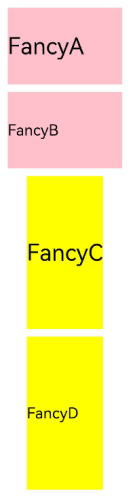

# 动态构建UI元素

[基本UI描述](arkts-basic-ui-description.md)介绍的是如何创建一个内部UI结构固定的自定义组件，为了满足开发者自定义组件内部UI结构的需求，ArkTS同时提供了动态构建UI元素的能力。

## @Builder

可通过@Builder装饰器进行描述，该装饰器可以修饰一个函数，此函数可以在build函数之外声明，并在build函数中或其他@Builder修饰的函数中使用，从而实现在一个自定义组件内快速生成多个布局内容。使用方式如下面示例所示。

```ts
// xxx.ets
@Component
struct CompB {
  @State CompValue: string = ''

  aboutToAppear() {
    console.info('CompB aboutToAppear.')
  }

  aboutToDisappear() {
    console.info('CompB aboutToDisappear.')
  }

  build() {
    Column() {
      Button(this.CompValue)
        .margin(5)
    }
  }
}

@Entry
@Component
struct CompA {
  size1: number = 100
  @State CompValue1: string = "Hello,CompValue1"
  @State CompValue2: string = "Hello,CompValue2"
  @State CompValue3: string = "Hello,CompValue3"

  // @Builder装饰的函数CompC内使用自定义组件CompB
  @Builder CompC(value: string) {
    CompB({ CompValue: value })
  }

  @Builder SquareText(label: string) {
    Text(label)
      .fontSize(18)
      .width(1 * this.size1)
      .height(1 * this.size1)
  }

  // @Builder装饰的函数RowOfSquareTexts内使用@Builder装饰的函数SquareText
  @Builder RowOfSquareTexts(label1: string, label2: string) {
    Row() {
      this.SquareText(label1)
      this.SquareText(label2)
    }
    .width(2 * this.size1)
    .height(1 * this.size1)
  }

  build() {
    Column() {
      Row() {
        this.SquareText("A")
        this.SquareText("B")
      }
      .width(2 * this.size1)
      .height(1 * this.size1)

      this.RowOfSquareTexts("C", "D")
      Column() {
        // 使用三次@Builder装饰的自定义组件
        this.CompC(this.CompValue1)
        this.CompC(this.CompValue2)
        this.CompC(this.CompValue3)
      }
      .width(2 * this.size1)
      .height(2 * this.size1)
    }
    .width(2 * this.size1)
    .height(2 * this.size1)
  }
}
```


## @BuilderParam<sup>8+<sup>

@BuilderParam装饰器用于修饰自定义组件内函数类型的属性（例如：`@BuilderParam noParam: () => void`），并且在初始化自定义组件时被@BuilderParam修饰的属性必须赋值。

### 引入动机

当开发者创建自定义组件，并想对该组件添加特定功能时（例如在自定义组件中添加一个点击跳转操作）。若直接在组件内嵌入事件方法，将会导致所有引入该自定义组件的地方均增加了该功能。为解决此问题，引入了@BuilderParam装饰器，此装饰器修饰的属性值可为@Builder装饰的函数，开发者可在初始化自定义组件时对此属性进行赋值，为自定义组件增加特定的功能。

### 参数初始化组件

通过参数初始化组件时，将@Builder装饰的函数赋值给@BuilderParam修饰的属性，并在自定义组件内调用该属性值。若@BuilderParam修饰的属性在进行赋值时不带参数（如：`noParam: this.specificNoParam`），则此属性的类型需定义为无返回值的函数（如：`@BuilderParam noParam: () => void`）；若带参数（如：`withParam: this.SpecificWithParam('WithParamA')`），则此属性的类型需定义成any（如：`@BuilderParam withParam: any`）。

```ts
// xxx.ets
@Component
struct CustomContainer {
  header: string = ''
  @BuilderParam noParam: () => void
  @BuilderParam withParam: any
  footer: string = ''

  build() {
    Column() {
      Text(this.header)
        .fontSize(30)
      this.noParam()
      this.withParam()
      Text(this.footer)
        .fontSize(30)
    }
  }
}

@Entry
@Component
struct CustomContainerUser {
  @Builder specificNoParam() {
    Column() {
      Text('noParam').fontSize(30)
    }
  }

  @Builder SpecificWithParam(label: string) {
    Column() {
      Text(label).fontSize(30)
    }
  }

  build() {
    Column() {
      CustomContainer({
        header: 'HeaderA',
        noParam: this.specificNoParam,
        withParam: this.SpecificWithParam('WithParamA'),
        footer: 'FooterA'
      })
      Divider()
        .strokeWidth(3)
        .margin(10)
      CustomContainer({
        header: 'HeaderB',
        noParam: this.specificNoParam,
        withParam: this.SpecificWithParam('WithParamB'),
        footer: 'FooterB'
      })
    }
  }
}
```


### 尾随闭包初始化组件

在自定义组件中使用@BuilderParam修饰的属性时也可通过尾随闭包进行初始化（在初始化自定义组件时，组件后紧跟一个大括号“{}”形成尾随闭包场景（`CustomContainer(){}`）。开发者可把尾随闭包看做一个容器，向其中填充内容，如在闭包内增加组件（`{Column(){...}`），闭包内语法规范与build函数一致。此场景下自定义组件内有且仅有一个使用@BuilderParam修饰的属性。

示例：在闭包内添加Column组件并设置点击事件，在Column组件内调用@Builder修饰的specificParam函数，点击Column组件后将自定义组件CustomContainer中header的属性值由“header”改变为“changeHeader”。在初始化自定义组件CustomContainer时，尾随闭包的内容会被赋值给@BuilderParam修饰的closer属性。

```ts
// xxx.ets
@Component
struct CustomContainer {
  header: string = ''
  @BuilderParam closer: () => void

  build() {
    Column() {
      Text(this.header)
        .fontSize(30)
      this.closer()
    }
  }
}

@Builder function specificParam(label1: string, label2: string) {
  Column() {
    Text(label1)
      .fontSize(30)
    Text(label2)
      .fontSize(30)
  }
}

@Entry
@Component
struct CustomContainerUser {
  @State text: string = 'header'

  build() {
    Column() {
      CustomContainer({
        header: this.text,
      }) {
        Column() {
          specificParam('testA', 'testB')
        }.backgroundColor(Color.Yellow)
        .onClick(() => {
          this.text = 'changeHeader'
        })
      }
    }
  }
}
```


## @Styles

ArkTS为了避免开发者对重复样式的设置，通过@Styles装饰器可以将多个样式设置提炼成一个方法，直接在组件声明时调用，通过@Styles装饰器可以快速定义并复用自定义样式。当前@Styles仅支持通用属性。

@Styles可以定义在组件内或组件外，在组件外定义时需在方法名前面添加function关键字，组件内定义时则不需要添加function关键字。

```ts
// xxx.ets
@Styles function globalFancy () {
  .width(150)
  .height(100)
  .backgroundColor(Color.Pink)
}

@Entry
@Component
struct FancyUse {
  @Styles componentFancy() {
    .width(100)
    .height(200)
    .backgroundColor(Color.Yellow)
  }

  build() {
    Column({ space: 10 }) {
      Text('FancyA')
        .globalFancy()
        .fontSize(30)
      Text('FancyB')
        .globalFancy()
        .fontSize(20)
      Text('FancyC')
        .componentFancy()
        .fontSize(30)
      Text('FancyD')
        .componentFancy()
        .fontSize(20)
    }
  }
}
```



@Styles还可以在[StateStyles](../reference/arkui-ts/ts-universal-attributes-polymorphic-style.md)属性内部使用，在组件处于不同的状态时赋予相应的属性。

在StateStyles内可以直接调用组件外定义的@Styles方法，但需要通过this关键字调用组件内定义的@Styles方法。

```ts
// xxx.ets
@Styles function globalFancy () {
  .width(120)
  .height(120)
  .backgroundColor(Color.Green)
}

@Entry
@Component
struct FancyUse {
  @Styles componentFancy() {
    .width(80)
    .height(80)
    .backgroundColor(Color.Red)
  }

  build() {
    Row({ space: 10 }) {
      Button('Fancy')
        .stateStyles({
          normal: {
            .width(100)
            .height(100)
            .backgroundColor(Color.Blue)
          },
          disabled: this.componentFancy,
          pressed: globalFancy
        })
    }
  }
}
```


## @Extend

@Extend装饰器将新的属性方法添加到Text、Column、Button等内置组件上，通过@Extend装饰器可以快速地扩展原生组件。@Extend不能定义在自定义组件struct内。

```ts
// xxx.ets
@Extend(Text) function fancy (fontSize: number) {
  .fontColor(Color.Red)
  .fontSize(fontSize)
  .fontStyle(FontStyle.Italic)
  .fontWeight(600)
}

@Entry
@Component
struct FancyUse {
  build() {
    Row({ space: 10 }) {
      Text("Fancy")
        .fancy(16)
      Text("Fancy")
        .fancy(24)
      Text("Fancy")
        .fancy(32)
    }
  }
}

```

> **说明：**
>
> - @Extend装饰器不能定义在自定义组件struct内。
> - @Extend装饰器内仅支持属性方法设置。


## @CustomDialog

@CustomDialog装饰器用于装饰自定义弹窗组件，使得弹窗可以动态设置内容及样式。

```ts
// xxx.ets
@CustomDialog
struct DialogExample {
  controller: CustomDialogController
  action: () => void

  build() {
    Row() {
      Button('Close CustomDialog')
        .onClick(() => {
          this.controller.close()
          this.action()
        })
    }.padding(20)
  }
}

@Entry
@Component
struct CustomDialogUser {
  dialogController: CustomDialogController = new CustomDialogController({
    builder: DialogExample({ action: this.onAccept }),
    cancel: this.existApp,
    autoCancel: true
  });

  onAccept() {
    console.info('onAccept');
  }

  existApp() {
    console.info('Cancel dialog!');
  }

  build() {
    Column() {
      Button('Click to open Dialog')
        .onClick(() => {
          this.dialogController.open()
        })
    }
  }
}
```

