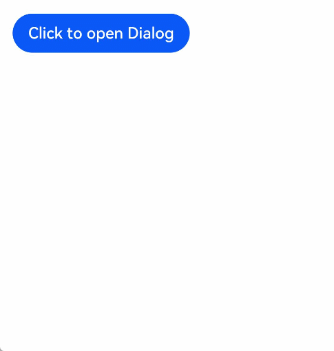

# 动态构建UI元素

前面章节介绍的是如何创建一个组件内部UI结构固定的自定义组件，为了满足开发者自定义组件内部UI结构的需求，ArkTS同时提供了动态构建UI元素的能力。

## @Builder


可通过@Builder装饰器进行描述，该装饰器可以修饰一个函数，此函数可以在build函数之外声明，并在build函数中或其他@Builder修饰的函数中使用，在一个自定义组件内快速生成多个布局内容。使用方式如下面示例所示。


```ts
// xxx.ets

@Component
struct CompB {
  @State CompValue: string = '';

  aboutToAppear() {
    console.info('CompB aboutToAppear.');
  }

  aboutToDisappear() {
    console.info('CompB aboutToDisappear.');
  }

  build() {
    Column() {
      Button(this.CompValue);
    }
  }
}

@Entry
@Component
struct CompA {
  size1: number = 100;
  @State CompValue1: string = "Hello,CompValue1";
  @State CompValue2: string = "Hello,CompValue2";
  @State CompValue3: string = "Hello,CompValue3";

  // @Builder装饰的函数内使用自定义组件
  @Builder CompC(value: string) {
    CompB({ CompValue: value });
  }

  @Builder SquareText(label: string) {
    Text(label)
      .width(1 * this.size1)
      .height(1 * this.size1)
  }

  @Builder RowOfSquareTexts(label1: string, label2: string) {
    Row() {
      this.SquareText(label1)
      this.SquareText(label2)
    }
    .width(2 * this.size1)
    .height(1 * this.size1)
  }

  build() {
    Column() {
      Row() {
        this.SquareText("A")
        this.SquareText("B")
        // or as long as tsc is used
      }
      .width(2 * this.size1)
      .height(1 * this.size1)

      this.RowOfSquareTexts("C", "D")
      Column() {
        // 使用三次@Builder装饰的自定义组件
        this.CompC(this.CompValue1);
        this.CompC(this.CompValue2);
        this.CompC(this.CompValue3);
      }
      .width(2 * this.size1)
      .height(2 * this.size1)
    }
    .width(2 * this.size1)
    .height(2 * this.size1)
  }
}
```
## @BuilderParam<sup>8+<sup>

@BuilderParam装饰器用于修饰自定义组件内函数类型的属性（例如：`@BuilderParam content: () => any;`），并且在初始化自定义组件时被@BuilderParam修饰的属性必须赋值。

### 引入动机

当开发者创建自定义组件，想对该组件添加特定功能时（如：仅对自定义组件添加一个点击跳转操作）。若直接在组件内嵌入事件方法，将会导致所有初始化该组件的地方均增加了该功能。为解决此问题，引入了@BuilderParam装饰器，此装饰器修饰的属性值可为@Builder修饰的方法，开发者可在初始化自定义组件时对此属性进行赋值，为自定义组件增加特定的的功能。

### 参数初始化组件

通过参数初始化组件时，将@Builder装饰的方法赋值给@BuilderParam修饰的属性，并在自定义组件内调用content属性值。对@BuilderParam修饰的属性进行赋值时不带参数（如：`content: this.specificParam`），则此属性的类型需定义成无返回值的函数（如：`@BuilderParam content: () => void`）。若带参数（如：`callContent: this.specificParam1("111")`），则此属性的类型需定义成any（如：`@BuilderParam callContent: any;`）。

```ts
// xxx.ets
@Component
struct CustomContainer {
  header: string = "";
  @BuilderParam noParam: () => void;
  @BuilderParam withParam: any;
  footer: string = "";
  build() {
    Column() {
      Text(this.header)
        .fontSize(50)
      this.noParam()
      this.withParam()
      Text(this.footer)
        .fontSize(50)
    }
  }
}

@Entry
@Component
struct CustomContainerUser {
  @Builder specificNoParam() {
    Column() {
      Text("noParam").fontSize(50)
    }
  }
  @Builder SpecificWithParam(label: string) {
    Column() {
      Text(label).fontSize(50)
    }
  }

  build() {
    Column() {
      CustomContainer({
        header: "Header",
        noParam: this.specificNoParam,
        withParam: this.SpecificWithParam("WithParam"),
        footer: "Footer",
      })
    }
  }
}
```

### 尾随闭包初始化组件

在自定义组件中使用@BuilderParam修饰的属性接收尾随闭包（在初始化自定义组件时，组件名称紧跟一个大括号“{}”形成尾随闭包场景（`CustomComponent(){}`）。开发者可把尾随闭包看做一个容器，向其填充内容，如在闭包内增加组件（`{Column(){Text("content")}`），闭包内语法规范与build函数一致。此场景下自定义组件内有且仅有一个使用@BuilderParam修饰的属性。

示例：在闭包内增加Column组件并添加点击事件，在新增的Column组件内调用@Builder修饰的specificParam方法，点击Column组件后该改变自定义组件中header的属性值为“changeHeader”。并且在初始化自定义组件时会把尾随闭包的内容赋值给使用@BuilderParam修饰的closer属性。

```ts
// xxx.ets
@Component
struct CustomContainer {
  header: string = "";
  @BuilderParam closer: () => void;
  build() {
    Column() {
      Text(this.header)
        .fontSize(50)
      this.closer()
    }
  }
}
@Builder function specificParam(label1: string, label2: string) {
  Column() {
    Text(label1)
      .fontSize(50)
    Text(label2)
      .fontSize(50)
  }
}
@Entry
@Component
struct CustomContainerUser {
  @State text: string = "header"
  build() {
    Column() {
      CustomContainer({
        header: this.text,
      }){
        Column(){
          specificParam("111", "22")
        }.onClick(()=>{
          this.text = "changeHeader"
        })
      }
    }
  }
}
```

## @Styles

ArkTS为了避免开发者对重复样式的设置，通过@Styles装饰器可以将多条样式设置提炼成一个方法，直接在组件声明的位置使用。@Styles装饰器将新的属性函数添加到基本组件上，如Text、Column、Button等。当前@Styles仅支持通用属性。通过@Styles装饰器可以快速定义并复用组件的自定义样式。

@Styles可以定义在组件内或组件外，在组件外定义时需在方法前添加function关键字，组件内定义时不需要添加function关键字。

```ts
// xxx.ets
@Styles function globalFancy() {
  .backgroundColor(Color.Red)
}

@Entry
@Component
struct FancyUse {
  @Styles componentFancy() {
    .backgroundColor(Color.Blue)
  }
  build() {
    Column({ space: 10 }) {
      Text("Fancy")
        .globalFancy()
        .width(100)
        .height(100)
        .fontSize(30)
      Text("Fancy")
        .componentFancy()
        .width(100)
        .height(100)
        .fontSize(30)
    }
  }
}
```

@Styles还可以在[StateStyles](../reference/arkui-ts/ts-universal-attributes-polymorphic-style.md)属性内部使用，在组件处于不同的状态时赋予相应的属性。

在StateStyles内可以直接调用组件外定义的Styles，但需要通过this关键字调用组件内定义的Styles。

```ts
// xxx.ets
@Styles function globalFancy() {
  .width(100)
  .height(100)
}

@Entry
@Component
struct FancyUse {
  @Styles componentFancy() {
    .width(50)
    .height(50)
  }
  build() {
    Row({ space: 10 }) {
      Button() {
      	Text("Fancy")
      }
      .stateStyles({
      	normal: {
      	  .width(80)
      	  .height(80)
      	},
      	disabled: this.componentFancy,
      	pressed: globalFancy
      })
    }
  }
}
```

## @Extend

@Extend装饰器将新的属性函数添加到内置组件上，如Text、Column、Button等。通过@Extend装饰器可以快速的扩展原生组件。@Extend装饰器不能用在自定义组件struct定义框内。

```ts
// xxx.ets
@Extend(Text) function fancy(fontSize: number) {
  .fontColor(Color.Red)
  .fontSize(fontSize)
  .fontStyle(FontStyle.Italic)
}

@Entry
@Component
struct FancyUse {
  build() {
    Row({ space: 10 }) {
      Text("Fancy")
        .fancy(16)
      Text("Fancy")
        .fancy(24)
    }
  }
}
```

> **说明：**
>
> - @Extend装饰器不能用在自定义组件struct定义框内。
> - @Extend装饰器内仅支持属性函数语句。

## @CustomDialog

@CustomDialog装饰器用于装饰自定义弹窗，使得弹窗可以动态设置样式。

```ts
// custom-dialog-demo.ets
@CustomDialog
struct DialogExample {
    controller: CustomDialogController;
    action: () => void;

    build() {
        Row() {
            Button ("Close CustomDialog")
                .onClick(() => {
                    this.controller.close();
                    this.action();
                })
        }.padding(20)
    }
}

@Entry
@Component
struct CustomDialogUser {
    dialogController : CustomDialogController = new CustomDialogController({
        builder: DialogExample({action: this.onAccept}),
        cancel: this.existApp,
        autoCancel: true
    });

    onAccept() {
        console.log("onAccept");
    }
    existApp() {
        console.log("Cancel dialog!");
    }

    build() {
        Column() {
            Button("Click to open Dialog")
                .onClick(() => {
                    this.dialogController.open()
                })
        }
    }
}
```

