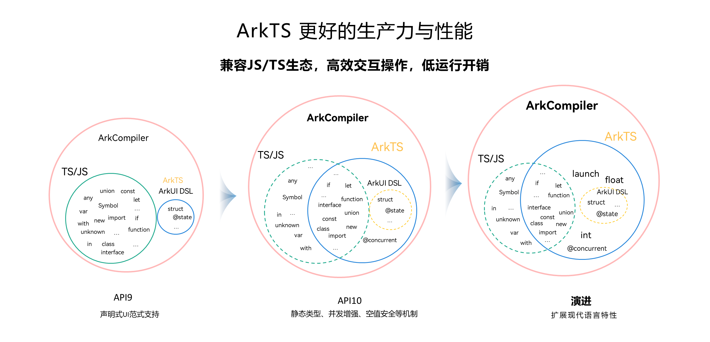

# 初识ArkTS语言

<!--Kit: ArkTS-->
<!--Subsystem: ArkCompiler-->
<!--Owner: @liwentao_uiw-->
<!--Designer: @qyhuo32-->
<!--Tester: @kirl75; @zsw_zhushiwei-->
<!--Adviser: @zhang_yixin13-->

ArkTS是OpenHarmony应用的默认开发语言，在[TypeScript](https://www.typescriptlang.org/)（简称TS）生态基础上做了扩展，保持TS的基本风格。通过规范定义，从而强化了开发期的静态检查和分析，提升了程序执行的稳定性和性能。

深入学习请看[ArkTS学习路线](https://developer.huawei.com/consumer/cn/arkts/)和[ArkTS视频课程](https://developer.huawei.com/consumer/cn/training/course/slightMooc/C101717496870909384?pathId=101667550095504391)。

自API version 10起，ArkTS进一步通过规范强化静态检查和分析，其主要特性及标准TS的差异包括[从TypeScript到ArkTS的适配规则](typescript-to-arkts-migration-guide.md)：

- 强制使用静态类型：静态类型是ArkTS最重要的特性之一。如果使用静态类型，那么程序中变量的类型就是确定的。同时，由于所有类型在程序实际运行前都是已知的，编译器可以验证代码的正确性，从而减少运行时的类型检查，有助于性能提升。

- 禁止在运行时改变对象布局：为实现最优性能，ArkTS禁止在程序执行期间更改对象布局。

- 限制运算符语义：为获得更好的性能并鼓励编写清晰的代码，ArkTS限制了部分运算符的语义。例如，一元加法运算符仅能作用于数字，不能用于其他类型变量。

- 不支持Structural typing：对Structural typing的支持需要在语言、编译器和运行时进行大量的考虑和仔细的实现，当前ArkTS不支持该特性。根据实际场景的需求和反馈，后续会重新考虑是否支持Structural typing。

ArkTS兼容TS/JavaScript（简称JS）生态，开发者可以使用TS/JS进行开发或复用已有代码。OpenHarmony系统对TS/JS支持的详细情况见[兼容TS/JS的约束](arkts-migration-background.md#方舟运行时兼容tsjs)。

未来，ArkTS会结合应用开发/运行的需求持续演进，逐步增强并行和并发能力、扩展系统类型，以及引入分布式开发范式等更多特性。

如需深入了解ArkTS语言，可参考[ArkTS具体指南](../arkts-utils/arkts-overview.md)。