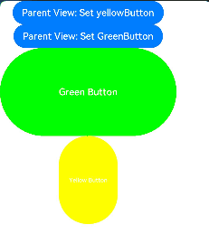
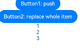

# \@Link装饰器：父子双向同步


子组件中被\@Link装饰的变量与其父组件中对应的数据源建立双向数据绑定。


> **说明：**
>
> 从API version 9开始，该装饰器支持在ArkTS卡片中使用。
>
> 从API version 11开始，该装饰器支持在原子化服务中使用。

## 概述

\@Link装饰的变量与其父组件中的数据源共享相同的值。


## 限制条件

- \@Link装饰器不能在[\@Entry](./arkts-create-custom-components.md#自定义组件的基本结构)装饰的自定义组件中使用。


## 装饰器使用规则说明

| \@Link变量装饰器                                             | 说明                                                         |
| ------------------------------------------------------------ | ------------------------------------------------------------ |
| 装饰器参数                                                   | 无                                                           |
| 同步类型                                                     | 双向同步。<br/>父组件中的状态变量可以与子组件\@Link建立双向同步，当其中一方改变时，另外一方能够感知到变化。 |
| 允许装饰的变量类型                                           | Object、class、string、number、boolean、enum类型，以及这些类型的数组。<br/>支持Date类型。<br/>API11及以上支持Map、Set类型。<br/>支持ArkUI框架定义的联合类型Length、ResourceStr、ResourceColor类型。<br/>类型必须被指定，且和双向绑定状态变量的类型相同。<br/>支持类型的场景请参考[观察变化](#观察变化)。<br/>不支持any。<br/>API11及以上支持上述支持类型的联合类型，比如string \| number, string \| undefined 或者 ClassA \| null，示例见[Link支持联合类型实例](#link支持联合类型实例)。 <br/>**注意**<br/>当使用undefined和null的时候，建议显式指定类型，遵循TypeScript类型校验，比如：`@Link a : string \| undefined`。 |
| 被装饰变量的初始值                                           | 无，禁止本地初始化。                                         |


## 变量的传递/访问规则说明

| 传递/访问      | 说明                                       |
| ---------- | ---------------------------------------- |
| 从父组件初始化和更新 | 必选。与父组件\@State,&nbsp;\@StorageLink和\@Link&nbsp;建立双向绑定。允许父组件中[\@State](./arkts-state.md)、\@Link、[\@Prop](./arkts-prop.md)、[\@Provide](./arkts-provide-and-consume.md)、[\@Consume](./arkts-provide-and-consume.md)、[\@ObjectLink](./arkts-observed-and-objectlink.md)、[\@StorageLink](./arkts-appstorage.md#storagelink)、[\@StorageProp](./arkts-appstorage.md#storageprop)、[\@LocalStorageLink](./arkts-localstorage.md#localstoragelink)和[\@LocalStorageProp](./arkts-localstorage.md#localstorageprop)装饰变量初始化子组件\@Link。<br/>从API&nbsp;version&nbsp;9开始，\@Link子组件从父组件初始化\@State的语法为Comp({&nbsp;aLink:&nbsp;this.aState&nbsp;})。同样Comp({aLink:&nbsp;$aState})也支持。 |
| 用于初始化子组件   | 允许，可用于初始化常规变量、\@State、\@Link、\@Prop、\@Provide。 |
| 是否支持组件外访问  | 私有，只能在所属组件内访问。                           |

  **图1** 初始化规则图示  


## 观察变化和行为表现


### 观察变化

- 当装饰的数据类型为boolean、string、number类型时，可以同步观察到数值的变化，示例请参考[简单类型和类对象类型的@Link](#简单类型和类对象类型的link)。

- 当装饰的数据类型为class或者Object时，可以观察到赋值和属性赋值的变化，即Object.keys(observedObject)返回的所有属性，示例请参考[简单类型和类对象类型的@Link](#简单类型和类对象类型的link)。

- 当装饰的对象是array时，可以观察到数组添加、删除、更新数组单元的变化，示例请参考[数组类型的@Link](#数组类型的link)。

- 当装饰的对象是Date时，可以观察到Date整体的赋值，同时可通过调用Date的接口`setFullYear`, `setMonth`, `setDate`, `setHours`, `setMinutes`, `setSeconds`, `setMilliseconds`, `setTime`, `setUTCFullYear`, `setUTCMonth`, `setUTCDate`, `setUTCHours`, `setUTCMinutes`, `setUTCSeconds`, `setUTCMilliseconds` 更新Date的属性。

```ts
@Component
struct DateComponent {
  @Link selectedDate: Date;

  build() {
    Column() {
      Button(`child increase the year by 1`).onClick(() => {
        this.selectedDate.setFullYear(this.selectedDate.getFullYear() + 1)
      })
      Button('child update the new date')
        .margin(10)
        .onClick(() => {
          this.selectedDate = new Date('2023-09-09')
        })
      DatePicker({
        start: new Date('1970-1-1'),
        end: new Date('2100-1-1'),
        selected: this.selectedDate
      })
    }

  }
}

@Entry
@Component
struct ParentComponent {
  @State parentSelectedDate: Date = new Date('2021-08-08');

  build() {
    Column() {
      Button('parent increase the month by 1')
        .margin(10)
        .onClick(() => {
          this.parentSelectedDate.setMonth(this.parentSelectedDate.getMonth() + 1)
        })
      Button('parent update the new date')
        .margin(10)
        .onClick(() => {
          this.parentSelectedDate = new Date('2023-07-07')
        })
      DatePicker({
        start: new Date('1970-1-1'),
        end: new Date('2100-1-1'),
        selected: this.parentSelectedDate
      })

      DateComponent({ selectedDate:this.parentSelectedDate })
    }
  }
}
```

- 当装饰的变量是Map时，可以观察到Map整体的赋值，同时可通过调用Map的接口`set`, `clear`, `delete` 更新Map的值。详见[装饰Map类型变量](#装饰map类型变量)。

- 当装饰的变量是Set时，可以观察到Set整体的赋值，同时可通过调用Set的接口`add`, `clear`, `delete` 更新Set的值。详见[装饰Set类型变量](#装饰set类型变量)。

### 框架行为

\@Link装饰的变量和其所属的自定义组件共享生命周期。

为了了解\@Link变量初始化和更新机制，有必要先了解父组件和拥有\@Link变量的子组件的关系，初始渲染和双向更新的流程（以父组件为\@State为例）。

1. 初始渲染：执行父组件的build()函数后将创建子组件的新实例。初始化过程如下：
   1. 必须指定父组件中的\@State变量，用于初始化子组件的\@Link变量。子组件的\@Link变量值与其父组件的数据源变量保持同步（双向数据同步）。
   2. 父组件的\@State状态变量包装类通过构造函数传给子组件，子组件的\@Link包装类拿到父组件的\@State的状态变量后，将当前\@Link包装类this指针注册给父组件的\@State变量。

2. \@Link的数据源的更新：即父组件中状态变量更新，引起相关子组件的\@Link的更新。处理步骤：
   1. 通过初始渲染的步骤可知，子组件\@Link包装类把当前this指针注册给父组件。父组件\@State变量变更后，会遍历更新所有依赖它的系统组件（elementid）和状态变量（比如\@Link包装类）。
   2. 通知\@Link包装类更新后，子组件中所有依赖\@Link状态变量的系统组件（elementId）都会被通知更新。以此实现父组件对子组件的状态数据同步。

3. \@Link的更新：当子组件中\@Link更新后，处理步骤如下（以父组件为\@State为例）：
   1. \@Link更新后，调用父组件的\@State包装类的set方法，将更新后的数值同步回父组件。
   2. 子组件\@Link和父组件\@State分别遍历依赖的系统组件，进行对应的UI的更新。以此实现子组件\@Link同步回父组件\@State。


## 使用场景


### 简单类型和类对象类型的\@Link

以下示例中，点击父组件ShufflingContainer中的“Parent View: Set yellowButton”和“Parent View: Set GreenButton”，可以从父组件将变化同步给子组件。

  1.点击子组件GreenButton和YellowButton中的Button，子组件会发生相应变化，将变化同步给父组件。因为@Link是双向同步，会将变化同步给@State。
  
  2.当点击父组件ShufflingContainer中的Button时，@State变化，也会同步给@Link，子组件也会发生对应的刷新。

```ts
class GreenButtonState {
  width: number = 0;

  constructor(width: number) {
    this.width = width;
  }
}

@Component
struct GreenButton {
  @Link greenButtonState: GreenButtonState;

  build() {
    Button('Green Button')
      .width(this.greenButtonState.width)
      .height(40)
      .backgroundColor('#64bb5c')
      .fontColor('#FFFFFF，90%')
      .onClick(() => {
        if (this.greenButtonState.width < 700) {
          // 更新class的属性，变化可以被观察到同步回父组件
          this.greenButtonState.width += 60;
        } else {
          // 更新class，变化可以被观察到同步回父组件
          this.greenButtonState = new GreenButtonState(180);
        }
      })
  }
}

@Component
struct YellowButton {
  @Link yellowButtonState: number;

  build() {
    Button('Yellow Button')
      .width(this.yellowButtonState)
      .height(40)
      .backgroundColor('#f7ce00')
      .fontColor('#FFFFFF，90%')
      .onClick(() => {
        // 子组件的简单类型可以同步回父组件
        this.yellowButtonState += 40.0;
      })
  }
}

@Entry
@Component
struct ShufflingContainer {
  @State greenButtonState: GreenButtonState = new GreenButtonState(180);
  @State yellowButtonProp: number = 180;

  build() {
    Column() {
      Flex({ direction: FlexDirection.Column, alignItems: ItemAlign.Center }) {
        // 简单类型从父组件@State向子组件@Link数据同步
        Button('Parent View: Set yellowButton')
          .width(312)
          .height(40)
          .margin(12)
          .fontColor('#FFFFFF，90%')
          .onClick(() => {
            this.yellowButtonProp = (this.yellowButtonProp < 700) ? this.yellowButtonProp + 40 : 100;
          })
        // class类型从父组件@State向子组件@Link数据同步
        Button('Parent View: Set GreenButton')
          .width(312)
          .height(40)
          .margin(12)
          .fontColor('#FFFFFF，90%')
          .onClick(() => {
            this.greenButtonState.width = (this.greenButtonState.width < 700) ? this.greenButtonState.width + 100 : 100;
          })
        // class类型初始化@Link
        GreenButton({ greenButtonState: $greenButtonState }).margin(12)
        // 简单类型初始化@Link
        YellowButton({ yellowButtonState: $yellowButtonProp }).margin(12)
      }
    }
  }
}
```



### 数组类型的\@Link


```ts
@Component
struct Child {
  @Link items: number[];

  build() {
    Column() {
      Button(`Button1: push`)
        .margin(12)
        .width(312)
        .height(40)
        .fontColor('#FFFFFF，90%')
        .onClick(() => {
          this.items.push(this.items.length + 1);
        })
      Button(`Button2: replace whole item`)
        .margin(12)
        .width(312)
        .height(40)
        .fontColor('#FFFFFF，90%')
        .onClick(() => {
          this.items = [100, 200, 300];
        })
    }
  }
}

@Entry
@Component
struct Parent {
  @State arr: number[] = [1, 2, 3];

  build() {
    Column() {
      Child({ items: $arr })
        .margin(12)
      ForEach(this.arr,
        (item: number) => {
          Button(`${item}`)
            .margin(12)
            .width(312)
            .height(40)
            .backgroundColor('#11a2a2a2')
            .fontColor('#e6000000')
        },
        (item: ForEachInterface) => item.toString()
      )
    }
  }
}
```



上文所述，ArkUI框架可以观察到数组元素的添加，删除和替换。在该示例中\@State和\@Link的类型是相同的number[]，不允许将\@Link定义成number类型（\@Link item : number），并在父组件中用\@State数组中每个数据项创建子组件。如果要使用这个场景，可以参考[\@Prop](arkts-prop.md)和[\@Observed](./arkts-observed-and-objectlink.md)。

### 装饰Map类型变量

> **说明：**
>
> 从API version 11开始，\@Link支持Map类型。

在下面的示例中，value类型为Map\<number, string\>，点击Button改变message的值，视图会随之刷新。

```ts
@Component
struct Child {
  @Link value: Map<number, string>

  build() {
    Column() {
      ForEach(Array.from(this.value.entries()), (item: [number, string]) => {
        Text(`${item[0]}`).fontSize(30)
        Text(`${item[1]}`).fontSize(30)
        Divider()
      })
      Button('child init map').onClick(() => {
        this.value = new Map([[0, "a"], [1, "b"], [3, "c"]])
      })
      Button('child set new one').onClick(() => {
        this.value.set(4, "d")
      })
      Button('child clear').onClick(() => {
        this.value.clear()
      })
      Button('child replace the first one').onClick(() => {
        this.value.set(0, "aa")
      })
      Button('child delete the first one').onClick(() => {
        this.value.delete(0)
      })
    }
  }
}


@Entry
@Component
struct MapSample2 {
  @State message: Map<number, string> = new Map([[0, "a"], [1, "b"], [3, "c"]])

  build() {
    Row() {
      Column() {
        Child({ value: this.message })
      }
      .width('100%')
    }
    .height('100%')
  }
}
```

### 装饰Set类型变量

> **说明：**
>
> 从API version 11开始，\@Link支持Set类型。

在下面的示例中，message类型为Set\<number\>，点击Button改变message的值，视图会随之刷新。

```ts
@Component
struct Child {
  @Link message: Set<number>

  build() {
    Column() {
      ForEach(Array.from(this.message.entries()), (item: [number, string]) => {
        Text(`${item[0]}`).fontSize(30)
        Divider()
      })
      Button('init set').onClick(() => {
        this.message = new Set([0, 1, 2, 3, 4])
      })
      Button('set new one').onClick(() => {
        this.message.add(5)
      })
      Button('clear').onClick(() => {
        this.message.clear()
      })
      Button('delete the first one').onClick(() => {
        this.message.delete(0)
      })
    }
    .width('100%')
  }
}


@Entry
@Component
struct SetSample1 {
  @State message: Set<number> = new Set([0, 1, 2, 3, 4])

  build() {
    Row() {
      Column() {
        Child({ message: this.message })
      }
      .width('100%')
    }
    .height('100%')
  }
}
```

### 使用双向同步机制更改本地其他变量

使用[\@Watch](./arkts-watch.md)可以在双向同步时，更改本地变量。

下面的示例中，在\@Link的\@Watch里面修改了一个\@State装饰的变量sourceNumber，实现了父子组件间的变量同步。但是\@State装饰的变量memberMessage在本地修改又不会影响到父组件中的变量改变。

```ts
@Entry
@Component
struct Parent {
  @State sourceNumber: number = 0;

  build() {
    Column() {
      Text(`父组件的sourceNumber：` + this.sourceNumber)
      Child({ sourceNumber: this.sourceNumber })
      Button('父组件更改sourceNumber')
        .onClick(() => {
          this.sourceNumber++;
        })
    }
    .width('100%')
    .height('100%')
  }
}

@Component
struct Child {
  @State memberMessage: string = 'Hello World';
  @Link @Watch('onSourceChange') sourceNumber: number;

  onSourceChange() {
    this.memberMessage = this.sourceNumber.toString();
  }

  build() {
    Column() {
      Text(this.memberMessage)
      Text(`子组件的sourceNumber：` + this.sourceNumber.toString())
      Button('子组件更改memberMessage')
        .onClick(() => {
          this.memberMessage = 'Hello memberMessage';
        })
    }
  }
}
```

## Link支持联合类型实例

@Link支持联合类型和undefined和null，在下面的示例中，name类型为string | undefined，点击父组件Index中的Button改变name的属性或者类型，Child中也会对应刷新。

```ts
@Component
struct Child {
  @Link name: string | undefined

  build() {
    Column() {

      Button('Child change name to Bob')
        .onClick(() => {
          this.name = "Bob"
        })

      Button('Child change animal to undefined')
        .onClick(() => {
          this.name = undefined
        })

    }.width('100%')
  }
}

@Entry
@Component
struct Index {
  @State name: string | undefined = "mary"

  build() {
    Column() {
      Text(`The name is  ${this.name}`).fontSize(30)

      Child({ name: this.name })

      Button('Parents change name to Peter')
        .onClick(() => {
          this.name = "Peter"
        })

      Button('Parents change name to undefined')
        .onClick(() => {
          this.name = undefined
        })
    }
  }
}
```

## 常见问题

### \@Link装饰状态变量类型错误

在子组件中使用\@Link装饰状态变量需要保证该变量与数据源类型完全相同，且该数据源需为被诸如\@State等装饰器装饰的状态变量。

【反例】

```ts
@Observed
class ClassA {
  public c: number = 0;

  constructor(c: number) {
    this.c = c;
  }
}

@Component
struct LinkChild {
  @Link testNum: number;

  build() {
    Text(`LinkChild testNum ${this.testNum}`)
  }
}

@Entry
@Component
struct Parent {
  @State testNum: ClassA = new ClassA(1);

  build() {
    Column() {
      Text(`Parent testNum ${this.testNum.c}`)
        .onClick(() => {
          this.testNum.c += 1;
        })
      // @Link装饰的变量需要和数据源@State类型一致
      LinkChild({ testNum: this.testNum.c })
    }
  }
}
```

\@Link testNum: number从父组件的LinkChild({testNum:this.testNum.c})初始化。\@Link的数据源必须是装饰器装饰的状态变量，简而言之，\@Link装饰的数据必须和数据源类型相同，比如\@Link: T和\@State : T。所以，这里应该改为\@Link testNum: ClassA，从父组件初始化的方式为LinkChild({testNum: this.testNum})

【正例】

```ts
@Observed
class ClassA {
  public c: number = 0;

  constructor(c: number) {
    this.c = c;
  }
}

@Component
struct LinkChild {
  @Link testNum: ClassA;

  build() {
    Text(`LinkChild testNum ${this.testNum?.c}`)
      .onClick(() => {
        this.testNum.c += 1;
      })
  }
}

@Entry
@Component
struct Parent {
  @State testNum: ClassA = new ClassA(1);

  build() {
    Column() {
      Text(`Parent testNum ${this.testNum.c}`)
        .onClick(() => {
          this.testNum.c += 1;
        })
      // @Link装饰的变量需要和数据源@State类型一致
      LinkChild({ testNum: this.testNum })
    }
  }
}
```

### 使用a.b(this.object)形式调用，不会触发UI刷新

在build方法内，当@Link装饰的变量是Object类型、且通过a.b(this.object)形式调用时，b方法内传入的是this.object的原生对象，修改其属性，无法触发UI刷新。如下例中，通过静态方法Score.changeScore1或者this.changeScore2修改Child组件中的this.score.value时，UI不会刷新。

【反例】

```ts
class Score {
  value: number;
  constructor(value: number) {
    this.value = value;
  }

  static changeScore1(score:Score) {
    score.value += 1;
  }
}

@Entry
@Component
struct Parent {
  @State score: Score = new Score(1);

  build() {
    Column({space:8}) {
      Text(`The value in Parent is ${this.score.value}.`)
        .fontSize(30)
        .fontColor(Color.Red)
      Child({ score: this.score })
    }
    .width('100%')
    .height('100%')
  }
}

@Component
struct Child {
  @Link score: Score;

  changeScore2(score:Score) {
    score.value += 2;
  }

  build() {
    Column({space:8}) {
      Text(`The value in Child is ${this.score.value}.`)
        .fontSize(30)
      Button(`changeScore1`)
        .onClick(()=>{
          // 通过静态方法调用，无法触发UI刷新
          Score.changeScore1(this.score);
        })
      Button(`changeScore2`)
        .onClick(()=>{
          // 使用this通过自定义组件内部方法调用，无法触发UI刷新
          this.changeScore2(this.score);
        })
    }
  }
}
```

可以通过如下先赋值、再调用新赋值的变量的方式为this.score加上Proxy代理，实现UI刷新。

【正例】

```ts
class Score {
  value: number;
  constructor(value: number) {
    this.value = value;
  }

  static changeScore1(score:Score) {
    score.value += 1;
  }
}

@Entry
@Component
struct Parent {
  @State score: Score = new Score(1);

  build() {
    Column({space:8}) {
      Text(`The value in Parent is ${this.score.value}.`)
        .fontSize(30)
        .fontColor(Color.Red)
      Child({ score: this.score })
    }
    .width('100%')
    .height('100%')
  }
}

@Component
struct Child {
  @Link score: Score;

  changeScore2(score:Score) {
    score.value += 2;
  }

  build() {
    Column({space:8}) {
      Text(`The value in Child is ${this.score.value}.`)
        .fontSize(30)
      Button(`changeScore1`)
        .onClick(()=>{
          // 通过赋值添加 Proxy 代理
          let score1 = this.score;
          Score.changeScore1(score1);
        })
      Button(`changeScore2`)
        .onClick(()=>{
          // 通过赋值添加 Proxy 代理
          let score2 = this.score;
          this.changeScore2(score2);
        })
    }
  }
}
```

### \@State放在build后定义时初始化\@Link报错

当\@State变量放在build函数后定义，用来初始化\@Link变量时，会被识别为常量，而\@Link变量不能被常量初始化，所以会造成编译报错。

【反例】

```ts
@Entry
@Component
struct Index {
  build() {
    Column() {
      child({ count: this.count })
      Button(`click times: ${this.count}`)
        .onClick(() => {
          this.count += 1;
        })
    }
  }
  // 在build函数之后定义@State变量
  @State count: number = 0;
}

@Component
struct child {
  @Link count: number;

  build() {
    Text(`cout: ${this.count}`).fontSize(30)
  }
}
```


正确的写法，可以把\@State变量放在build函数前定义。

【正例】

```ts
@Entry
@Component
struct Index {
  @State count: number = 0;

  build() {
    Column() {
      child({ count: this.count })
      Button(`click times: ${this.count}`)
        .onClick(() => {
          this.count += 1;
        })
    }
  }
}

@Component
struct child {
  @Link count: number;

  build() {
    Text(`cout: ${this.count}`).fontSize(30)
  }
}
```

<!--no_check-->
