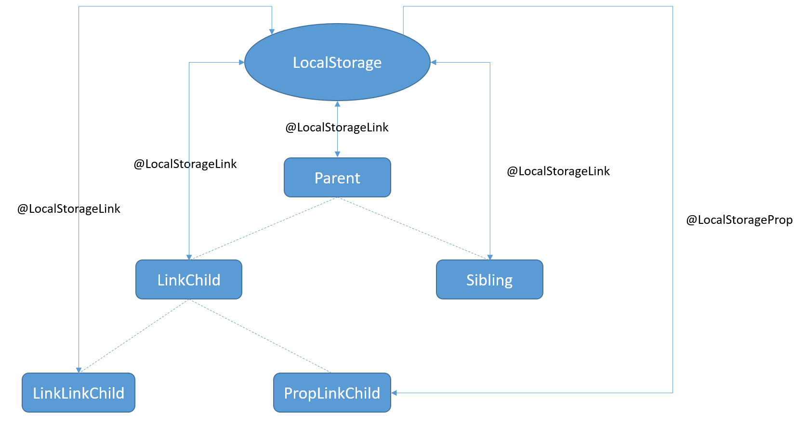
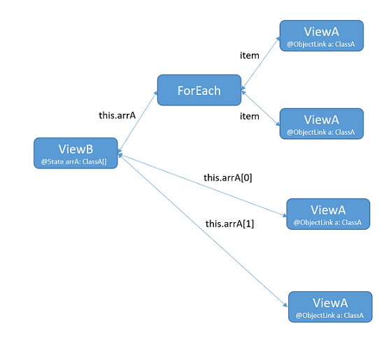
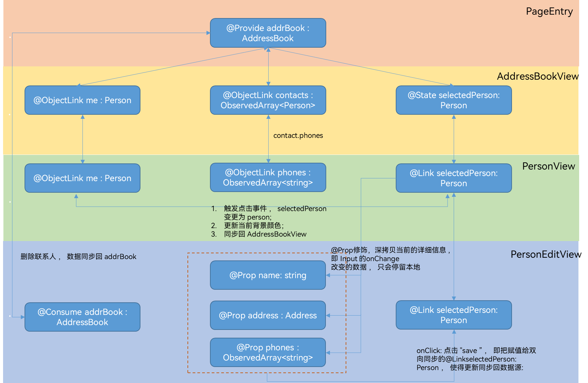

# MVVM模式


应用通过状态去渲染更新UI是程序设计中相对复杂，但又十分重要的，往往决定了应用程序的性能。程序的状态数据通常包含了数组、对象，或者是嵌套对象组合而成。在这些情况下，ArkUI采取MVVM = Model + View + ViewModel模式，其中状态管理模块起到的就是ViewModel的作用，将数据与视图绑定在一起，更新数据的时候直接更新视图。


- Model层：存储数据和相关逻辑的模型。它表示组件或其他相关业务逻辑之间传输的数据。Model是对原始数据的进一步处理。

- View层：在ArkUI中通常是\@Component装饰组件渲染的UI。

- ViewModel层：在ArkUI中，ViewModel是存储在自定义组件的状态变量、LocalStorage和AppStorage中的数据。
  - 自定义组件通过执行其build()方法或者\@Builder装饰的方法来渲染UI，即ViewModel可以渲染View。
  - View可以通过相应event handler来改变ViewModel，即事件驱动ViewModel的改变，另外ViewModel提供了\@Watch回调方法用于监听状态数据的改变。
  - 在ViewModel被改变时，需要同步回Model层，这样才能保证ViewModel和Model的一致性，即应用自身数据的一致性。
  - ViewModel结构设计应始终为了适配自定义组件的构建和更新，这也是将Model和ViewModel分开的原因。


目前很多关于UI构造和更新的问题，都是由于ViewModel的设计并没有很好的支持自定义组件的渲染，或者试图去让自定义组件强行适配Model层，而中间没有用ViewModel来进行分离。例如，一个应用程序直接将SQL数据库中的数据读入内存，这种数据模型不能很好的直接适配自定义组件的渲染，所以在应用程序开发中需要适配ViewModel层。


根据上面涉及SQL数据库的示例，应用程序应设计为：


- Model：针对数据库高效操作的数据模型。

- ViewModel：针对ArkUI状态管理功能进行高效的UI更新的视图模型。

- 部署 converters/adapters： converters/adapters作用于Model和ViewModel的相互转换。
  - converters/adapters可以转换最初从数据库读取的Model，来创建并初始化ViewModel。
  - 在应用的使用场景中，UI会通过event handler改变ViewModel，此时converters/adapters需要将ViewModel的更新数据同步回Model。


虽然与强制将UI拟合到SQL数据库模式（MV模式）相比，MVVM的设计比较复杂，但应用程序开发人员可以通过ViewModel层的隔离，来简化UI的设计和实现，以此来收获更好的UI性能。


## ViewModel的数据源


ViewModel通常包含多个顶层数据源。\@State和\@Provide装饰的变量以及LocalStorage和AppStorage都是顶层数据源，其余装饰器都是与数据源做同步的数据。装饰器的选择取决于状态需要在自定义组件之间的共享范围。共享范围从小到大的排序是：


- \@State：组件级别的共享，通过命名参数机制传递，例如：CompA: ({ aProp: this.aProp })，表示传递层级（共享范围）是父子之间的传递。

- \@Provide：组件级别的共享，可以通过key和\@Consume绑定，因此不用参数传递，实现多层级的数据共享，共享范围大于\@State。

- LocalStorage：页面级别的共享，可以通过\@Entry在当前组件树上共享LocalStorage实例。

- AppStorage：应用全局的UI状态存储，和应用进程绑定，在整个应用内的状态数据的共享。


### \@State装饰的变量与一个或多个子组件共享状态数据


\@State可以初始化多种状态变量，\@Prop、\@Link和\@ObjectLink可以和其建立单向或双向同步，详情见[@State使用规范](arkts-state.md)。


1. 使用Parent根节点中\@State装饰的testNum作为ViewModel数据项。将testNum传递给其子组件LinkChild和Sibling。

   ```ts
   // xxx.ets
   @Entry
   @Component
   struct Parent {
     @State @Watch("testNumChange1") testNum: number = 1;
   
     testNumChange1(propName: string): void {
       console.log(`Parent: testNumChange value ${this.testNum}`)
     }
   
     build() {
       Column() {
         LinkChild({ testNum: $testNum })
         Sibling({ testNum: $testNum })
       }
     }
   }
   ```

2. LinkChild和Sibling中用\@Link和父组件的数据源建立双向同步。其中LinkChild中创建了LinkLinkChild和PropLinkChild。

   ```ts
   @Component
   struct Sibling {
     @Link @Watch("testNumChange") testNum: number;
   
     testNumChange(propName: string): void {
       console.log(`Sibling: testNumChange value ${this.testNum}`);
     }
   
     build() {
       Text(`Sibling: ${this.testNum}`)
     }
   }
   
   @Component
   struct LinkChild {
     @Link @Watch("testNumChange") testNum: number;
   
     testNumChange(propName: string): void {
       console.log(`LinkChild: testNumChange value ${this.testNum}`);
     }
   
     build() {
       Column() {
         Button('incr testNum')
           .onClick(() => {
             console.log(`LinkChild: before value change value ${this.testNum}`);
             this.testNum = this.testNum + 1
             console.log(`LinkChild: after value change value ${this.testNum}`);
           })
         Text(`LinkChild: ${this.testNum}`)
         LinkLinkChild({ testNumGrand: $testNum })
         PropLinkChild({ testNumGrand: this.testNum })
       }
       .height(200).width(200)
     }
   }
   ```

3. LinkLinkChild和PropLinkChild声明如下，PropLinkChild中的\@Prop和其父组件建立单向同步关系。

   ```ts
   @Component
   struct LinkLinkChild {
     @Link @Watch("testNumChange") testNumGrand: number;
   
     testNumChange(propName: string): void {
       console.log(`LinkLinkChild: testNumGrand value ${this.testNumGrand}`);
     }
   
     build() {
       Text(`LinkLinkChild: ${this.testNumGrand}`)
     }
   }
   
   
   @Component
   struct PropLinkChild {
     @Prop @Watch("testNumChange") testNumGrand: number = 0;
   
     testNumChange(propName: string): void {
       console.log(`PropLinkChild: testNumGrand value ${this.testNumGrand}`);
     }
   
     build() {
       Text(`PropLinkChild: ${this.testNumGrand}`)
         .height(70)
         .backgroundColor(Color.Red)
         .onClick(() => {
           this.testNumGrand += 1;
         })
     }
   }
   ```

   

   当LinkChild中的\@Link testNum更改时。

   1. 更改首先同步到其父组件Parent，然后更改从Parent同步到Sibling。

   2. LinkChild中的\@Link testNum更改也同步给子组件LinkLinkChild和PropLinkChild。

   \@State装饰器与\@Provide、LocalStorage、AppStorage的区别：

   - \@State如果想要将更改传递给孙子节点，需要先将更改传递给子组件，再从子节点传递给孙子节点。
   - 共享只能通过构造函数的参数传递，即命名参数机制CompA: ({ aProp: this.aProp })。

   完整的代码示例如下：


   ```ts
   @Component
   struct LinkLinkChild {
     @Link @Watch("testNumChange") testNumGrand: number;
   
     testNumChange(propName: string): void {
       console.log(`LinkLinkChild: testNumGrand value ${this.testNumGrand}`);
     }
   
     build() {
       Text(`LinkLinkChild: ${this.testNumGrand}`)
     }
   }
   
   
   @Component
   struct PropLinkChild {
     @Prop @Watch("testNumChange") testNumGrand: number = 0;
   
     testNumChange(propName: string): void {
       console.log(`PropLinkChild: testNumGrand value ${this.testNumGrand}`);
     }
   
     build() {
       Text(`PropLinkChild: ${this.testNumGrand}`)
         .height(70)
         .backgroundColor(Color.Red)
         .onClick(() => {
           this.testNumGrand += 1;
         })
     }
   }
   
   
   @Component
   struct Sibling {
     @Link @Watch("testNumChange") testNum: number;
   
     testNumChange(propName: string): void {
       console.log(`Sibling: testNumChange value ${this.testNum}`);
     }
   
     build() {
       Text(`Sibling: ${this.testNum}`)
     }
   }
   
   @Component
   struct LinkChild {
     @Link @Watch("testNumChange") testNum: number;
   
     testNumChange(propName: string): void {
       console.log(`LinkChild: testNumChange value ${this.testNum}`);
     }
   
     build() {
       Column() {
         Button('incr testNum')
           .onClick(() => {
             console.log(`LinkChild: before value change value ${this.testNum}`);
             this.testNum = this.testNum + 1
             console.log(`LinkChild: after value change value ${this.testNum}`);
           })
         Text(`LinkChild: ${this.testNum}`)
         LinkLinkChild({ testNumGrand: $testNum })
         PropLinkChild({ testNumGrand: this.testNum })
       }
       .height(200).width(200)
     }
   }
   
   
   @Entry
   @Component
   struct Parent {
     @State @Watch("testNumChange1") testNum: number = 1;
   
     testNumChange1(propName: string): void {
       console.log(`Parent: testNumChange value ${this.testNum}`)
     }
   
     build() {
       Column() {
         LinkChild({ testNum: $testNum })
         Sibling({ testNum: $testNum })
       }
     }
   }
   ```


### \@Provide装饰的变量与任何后代组件共享状态数据

\@Provide装饰的变量可以与任何后代组件共享状态数据，其后代组件使用\@Consume创建双向同步，详情见[@Provide和@Consume](arkts-provide-and-consume.md)。

因此，\@Provide-\@Consume模式比使用\@State-\@Link-\@Link从父组件将更改传递到孙子组件更方便。\@Provide-\@Consume适合在单个页面UI组件树中共享状态数据。

使用\@Provide-\@Consume模式时，\@Consume和其祖先组件中的\@Provide通过绑定相同的key连接，而不是在组件的构造函数中通过参数来进行传递。

以下示例通过\@Provide-\@Consume模式，将更改从父组件传递到孙子组件。


```ts
@Component
struct LinkLinkChild {
  @Consume @Watch("testNumChange") testNum: number;

  testNumChange(propName: string): void {
    console.log(`LinkLinkChild: testNum value ${this.testNum}`);
  }

  build() {
    Text(`LinkLinkChild: ${this.testNum}`)
  }
}

@Component
struct PropLinkChild {
  @Prop @Watch("testNumChange") testNumGrand: number = 0;

  testNumChange(propName: string): void {
    console.log(`PropLinkChild: testNumGrand value ${this.testNumGrand}`);
  }

  build() {
    Text(`PropLinkChild: ${this.testNumGrand}`)
      .height(70)
      .backgroundColor(Color.Red)
      .onClick(() => {
        this.testNumGrand += 1;
      })
  }
}

@Component
struct Sibling {
  @Consume @Watch("testNumChange") testNum: number;

  testNumChange(propName: string): void {
    console.log(`Sibling: testNumChange value ${this.testNum}`);
  }

  build() {
    Text(`Sibling: ${this.testNum}`)
  }
}

@Component
struct LinkChild {
  @Consume @Watch("testNumChange") testNum: number;

  testNumChange(propName: string): void {
    console.log(`LinkChild: testNumChange value ${this.testNum}`);
  }

  build() {
    Column() {
      Button('incr testNum')
        .onClick(() => {
          console.log(`LinkChild: before value change value ${this.testNum}`);
          this.testNum = this.testNum + 1
          console.log(`LinkChild: after value change value ${this.testNum}`);
        })
      Text(`LinkChild: ${this.testNum}`)
      LinkLinkChild({ /* empty */ })
      PropLinkChild({ testNumGrand: this.testNum })
    }
    .height(200).width(200)
  }
}

@Entry
@Component
struct Parent {
  @Provide @Watch("testNumChange1") testNum: number = 1;

  testNumChange1(propName: string): void {
    console.log(`Parent: testNumChange value ${this.testNum}`)
  }

  build() {
    Column() {
      LinkChild({ /* empty */ })
      Sibling({ /* empty */ })
    }
  }
}
```


### 给LocalStorage实例中对应的属性建立双向或单向同步

通过\@LocalStorageLink和\@LocalStorageProp，给LocalStorage实例中的属性建立双向或单向同步。可以将LocalStorage实例视为\@State变量的Map，使用详情参考[LocalStorage](arkts-localstorage.md)。

LocalStorage对象可以在ArkUI应用程序的几个页面上共享。因此，使用\@LocalStorageLink、\@LocalStorageProp和LocalStorage可以在应用程序的多个页面上共享状态。

以下示例中：

1. 创建一个LocalStorage实例，并通过\@Entry(storage)将其注入根节点。

2. 在Parent组件中初始化\@LocalStorageLink("testNum")变量时，将在LocalStorage实例中创建testNum属性，并设置指定的初始值为1，即\@LocalStorageLink("testNum") testNum: number = 1。

3. 在其子组件中，都使用\@LocalStorageLink或\@LocalStorageProp绑定同一个属性名key来传递数据。

LocalStorage可以被认为是\@State变量的Map，属性名作为Map中的key。

\@LocalStorageLink和LocalStorage中对应的属性的同步行为，和\@State和\@Link一致，都为双向数据同步。

以下为组件的状态更新图：




```ts
@Component
struct LinkLinkChild {
  @LocalStorageLink("testNum") @Watch("testNumChange") testNum: number = 1;

  testNumChange(propName: string): void {
    console.log(`LinkLinkChild: testNum value ${this.testNum}`);
  }

  build() {
    Text(`LinkLinkChild: ${this.testNum}`)
  }
}

@Component
struct PropLinkChild {
  @LocalStorageProp("testNum") @Watch("testNumChange") testNumGrand: number = 1;

  testNumChange(propName: string): void {
    console.log(`PropLinkChild: testNumGrand value ${this.testNumGrand}`);
  }

  build() {
    Text(`PropLinkChild: ${this.testNumGrand}`)
      .height(70)
      .backgroundColor(Color.Red)
      .onClick(() => {
        this.testNumGrand += 1;
      })
  }
}

@Component
struct Sibling {
  @LocalStorageLink("testNum") @Watch("testNumChange") testNum: number = 1;

  testNumChange(propName: string): void {
    console.log(`Sibling: testNumChange value ${this.testNum}`);
  }

  build() {
    Text(`Sibling: ${this.testNum}`)
  }
}

@Component
struct LinkChild {
  @LocalStorageLink("testNum") @Watch("testNumChange") testNum: number = 1;

  testNumChange(propName: string): void {
    console.log(`LinkChild: testNumChange value ${this.testNum}`);
  }

  build() {
    Column() {
      Button('incr testNum')
        .onClick(() => {
          console.log(`LinkChild: before value change value ${this.testNum}`);
          this.testNum = this.testNum + 1
          console.log(`LinkChild: after value change value ${this.testNum}`);
        })
      Text(`LinkChild: ${this.testNum}`)
      LinkLinkChild({ /* empty */ })
      PropLinkChild({ /* empty */ })
    }
    .height(200).width(200)
  }
}

// create LocalStorage object to hold the data
const storage = new LocalStorage();
@Entry(storage)
@Component
struct Parent {
  @LocalStorageLink("testNum") @Watch("testNumChange1") testNum: number = 1;

  testNumChange1(propName: string): void {
    console.log(`Parent: testNumChange value ${this.testNum}`)
  }

  build() {
    Column() {
      LinkChild({ /* empty */ })
      Sibling({ /* empty */ })
    }
  }
}
```


### 给AppStorage中对应的属性建立双向或单向同步

AppStorage是LocalStorage的单例对象，ArkUI在应用程序启动时创建该对象，在页面中使用\@StorageLink和\@StorageProp为多个页面之间共享数据，具体使用方法和LocalStorage类似。

也可以使用PersistentStorage将AppStorage中的特定属性持久化到本地磁盘的文件中，再次启动的时候\@StorageLink和\@StorageProp会恢复上次应用退出的数据。详情请参考[PersistentStorage文档](arkts-persiststorage.md)。

示例如下：


```ts
@Component
struct LinkLinkChild {
  @StorageLink("testNum") @Watch("testNumChange") testNum: number = 1;

  testNumChange(propName: string): void {
    console.log(`LinkLinkChild: testNum value ${this.testNum}`);
  }

  build() {
    Text(`LinkLinkChild: ${this.testNum}`)
  }
}

@Component
struct PropLinkChild {
  @StorageProp("testNum") @Watch("testNumChange") testNumGrand: number = 1;

  testNumChange(propName: string): void {
    console.log(`PropLinkChild: testNumGrand value ${this.testNumGrand}`);
  }

  build() {
    Text(`PropLinkChild: ${this.testNumGrand}`)
      .height(70)
      .backgroundColor(Color.Red)
      .onClick(() => {
        this.testNumGrand += 1;
      })
  }
}

@Component
struct Sibling {
  @StorageLink("testNum") @Watch("testNumChange") testNum: number = 1;

  testNumChange(propName: string): void {
    console.log(`Sibling: testNumChange value ${this.testNum}`);
  }

  build() {
    Text(`Sibling: ${this.testNum}`)
  }
}

@Component
struct LinkChild {
  @StorageLink("testNum") @Watch("testNumChange") testNum: number = 1;

  testNumChange(propName: string): void {
    console.log(`LinkChild: testNumChange value ${this.testNum}`);
  }

  build() {
    Column() {
      Button('incr testNum')
        .onClick(() => {
          console.log(`LinkChild: before value change value ${this.testNum}`);
          this.testNum = this.testNum + 1
          console.log(`LinkChild: after value change value ${this.testNum}`);
        })
      Text(`LinkChild: ${this.testNum}`)
      LinkLinkChild({ /* empty */
      })
      PropLinkChild({ /* empty */
      })
    }
    .height(200).width(200)
  }
}


@Entry
@Component
struct Parent {
  @StorageLink("testNum") @Watch("testNumChange1") testNum: number = 1;

  testNumChange1(propName: string): void {
    console.log(`Parent: testNumChange value ${this.testNum}`)
  }

  build() {
    Column() {
      LinkChild({ /* empty */
      })
      Sibling({ /* empty */
      })
    }
  }
}
```


## ViewModel的嵌套场景


大多数情况下，ViewModel数据项都是复杂类型的，例如，对象数组、嵌套对象或者这些类型的组合。对于嵌套场景，可以使用\@Observed搭配\@Prop或者\@ObjectLink来观察变化。


### \@Prop和\@ObjectLink嵌套数据结构

推荐设计单独的自定义组件来渲染每一个数组或对象。此时，对象数组或嵌套对象（属性是对象的对象称为嵌套对象）需要两个自定义组件，一个自定义组件呈现外部数组/对象，另一个自定义组件呈现嵌套在数组/对象内的类对象。 \@State、\@Prop、\@Link、\@ObjectLink装饰的变量只能观察到第一层的变化。

- 对于类：
  - 可以观察到赋值的变化：this.obj=new ClassObj(...)
  - 可以观察到对象属性的更改：this.obj.a=new ClassA(...)
  - 不能观察更深层级的属性更改：this.obj.a.b = 47

- 对于数组：
  - 可以观察到数组的整体赋值：this.arr=[...]
  - 可以观察到数据项的删除、插入和替换：this.arr[1] = new ClassA()、this.arr.pop()、 this.arr.push(new ClassA(...))、this.arr.sort(...)
  - 不能观察更深层级的数组变化：this.arr[1].b = 47

如果要观察嵌套类的内部对象的变化，可以使用\@ObjectLink或\@Prop。优先考虑\@ObjectLink，其通过嵌套对象内部属性的引用初始化自身。\@Prop会对嵌套在内部的对象的深度拷贝来进行初始化，以实现单向同步。在性能上\@Prop的深度拷贝比\@ObjectLink的引用拷贝慢很多。

\@ObjectLink或\@Prop可以用来存储嵌套内部的类对象，该类必须用\@Observed类装饰器装饰，否则类的属性改变并不会触发更新，UI并不会刷新。\@Observed为其装饰的类实现自定义构造函数，此构造函数创建了一个类的实例，并使用ES6代理包装（由ArkUI框架实现），拦截装饰class属性的所有“get”和“set”。“set”观察属性值，当发生赋值操作时，通知ArkUI框架更新。“get”收集哪些UI组件依赖该状态变量，实现最小化UI更新。

如果嵌套场景中，嵌套数据内部是数组或者class时，需根据以下场景使用\@Observed类装饰器。

- 如果嵌套数据内部是class，直接被\@Observed装饰。

- 如果嵌套数据内部是数组，可以通过以下方式来观察数组变化。

  ```ts
  @Observed class ObservedArray<T> extends Array<T> {
      constructor(args: T[]) {
          if (args instanceof Array) {
            super(...args);
          } else {
            super(args)
          }
      }
      /* otherwise empty */
  }
  ```

  ViewModel为外层class。


  ```ts
  class Outer {
    innerArrayProp : ObservedArray<string> = [];
    ...
  }
  ```


### 嵌套数据结构中\@Prop和\@ObjectLink之间的区别

以下示例中：

- 父组件ViewB渲染\@State arrA：Array&lt;ClassA&gt;。\@State可以观察新数组的分配、数组项插入、删除和替换。

- 子组件ViewA渲染每一个ClassA的对象。

- 类装饰器\@Observed ClassA与\@ObjectLink a: ClassA。

  - 可以观察嵌套在Array内的ClassA对象的变化。

  - 不使用\@Observed时：
    ViewB中的this.arrA[Math.floor(this.arrA.length/2)].c=10将不会被观察到，相应的ViewA组件也不会更新。

    对于数组中的第一个和第二个数组项，每个数组项都初始化了两个ViewA的对象，渲染了同一个ViewA实例。在一个ViewA中的属性赋值this.a.c += 1;时不会引发另外一个使用同一个ClassA初始化的ViewA的渲染更新。




```ts
let NextID: number = 1;

// 类装饰器@Observed装饰ClassA
@Observed
class ClassA {
  public id: number;
  public c: number;

  constructor(c: number) {
    this.id = NextID++;
    this.c = c;
  }
}

@Component
struct ViewA {
  @ObjectLink a: ClassA;
  label: string = "ViewA1";

  build() {
    Row() {
      Button(`ViewA [${this.label}] this.a.c= ${this.a.c} +1`)
        .onClick(() => {
          // 改变对象属性
          this.a.c += 1;
        })
    }
  }
}

@Entry
@Component
struct ViewB {
  @State arrA: ClassA[] = [new ClassA(0), new ClassA(0)];

  build() {
    Column() {
      ForEach(this.arrA,
        (item: ClassA) => {
          ViewA({ label: `#${item.id}`, a: item })
        },
        (item: ClassA): string => { return item.id.toString(); }
      )

      Divider().height(10)

      if (this.arrA.length) {
        ViewA({ label: `ViewA this.arrA[first]`, a: this.arrA[0] })
        ViewA({ label: `ViewA this.arrA[last]`, a: this.arrA[this.arrA.length-1] })
      }

      Divider().height(10)

      Button(`ViewB: reset array`)
        .onClick(() => {
          // 替换整个数组，会被@State this.arrA观察到
          this.arrA = [new ClassA(0), new ClassA(0)];
        })
      Button(`array push`)
        .onClick(() => {
          // 数组中插入数据，会被@State this.arrA观察到
          this.arrA.push(new ClassA(0))
        })
      Button(`array shift`)
        .onClick(() => {
          // 数组中移除数据，会被@State this.arrA观察到
          this.arrA.shift()
        })
      Button(`ViewB: chg item property in middle`)
        .onClick(() => {
          // 替换数组中的某个元素，会被@State this.arrA观察到
          this.arrA[Math.floor(this.arrA.length / 2)] = new ClassA(11);
        })
      Button(`ViewB: chg item property in middle`)
        .onClick(() => {
          // 改变数组中某个元素的属性c，会被ViewA中的@ObjectLink观察到
          this.arrA[Math.floor(this.arrA.length / 2)].c = 10;
        })
    }
  }
}
```

在ViewA中，将\@ObjectLink替换为\@Prop。


```ts
@Component
struct ViewA {

  @Prop a: ClassA = new ClassA(0);
  label : string = "ViewA1";

  build() {
     Row() {
        Button(`ViewA [${this.label}] this.a.c= ${this.a.c} +1`)
        .onClick(() => {
            // change object property
            this.a.c += 1;
        })
     }
  }
}
```

与用\@Prop装饰不同，用\@ObjectLink装饰时，点击数组的第一个或第二个元素，后面两个ViewA会发生同步的变化。

\@Prop是单向数据同步，ViewA内的Button只会触发Button自身的刷新，不会传播到其他的ViewA实例中。在ViewA中的ClassA只是一个副本，并不是其父组件中\@State arrA : Array&lt;ClassA&gt;中的对象，也不是其他ViewA的ClassA，这使得数组的元素和ViewA中的元素表面是传入的同一个对象，实际上在UI上渲染使用的是两个互不相干的对象。

需要注意\@Prop和\@ObjectLink还有一个区别：\@ObjectLink装饰的变量是仅可读的，不能被赋值；\@Prop装饰的变量可以被赋值。

- \@ObjectLink实现双向同步，因为它是通过数据源的引用初始化的。

- \@Prop是单向同步，需要深拷贝数据源。

- 对于\@Prop赋值新的对象，就是简单地将本地的值覆写，但是对于实现双向数据同步的\@ObjectLink，覆写新的对象相当于要更新数据源中的数组项或者class的属性，这个对于 TypeScript/JavaScript是不能实现的。


## MVVM应用示例


以下示例深入探讨了嵌套ViewModel的应用程序设计，特别是自定义组件如何渲染一个嵌套的Object，该场景在实际的应用开发中十分常见。


开发一个电话簿应用，实现功能如下：


- 显示联系人和设备（"Me"）电话号码 。

- 选中联系人时，进入可编辑态“Edit”，可以更新该联系人详细信息，包括电话号码，住址。

- 在更新联系人信息时，只有在单击保存“Save Changes”之后，才会保存更改。

- 可以点击删除联系人“Delete Contact”，可以在联系人列表删除该联系人。


ViewModel需要包括：


- AddressBook（class）
  - me（设备）: 存储一个Person类。
  - contacts（设备联系人）：存储一个Person类数组。


AddressBook类声明如下：


```ts
export class AddressBook {
  me: Person;
  contacts: ObservedArray<Person>;
  
  constructor(me: Person, contacts: Person[]) {
    this.me = me;
    this.contacts = new ObservedArray<Person>(contacts);
  }
}
```


- Person (class)
  - name : string
  - address : Address
  - phones: ObservedArray&lt;string&gt;
  - Address (class)
    - street : string
    - zip : number
    - city : string


Address类声明如下：


```ts
@Observed
export class Address {
  street: string;
  zip: number;
  city: string;

  constructor(street: string,
              zip: number,
              city: string) {
    this.street = street;
    this.zip = zip;
    this.city = city;
  }
}
```


Person类声明如下：


```ts
let nextId = 0;

@Observed
export class Person {
  id_: string;
  name: string;
  address: Address;
  phones: ObservedArray<string>;

  constructor(name: string,
              street: string,
              zip: number,
              city: string,
              phones: string[]) {
    this.id_ = `${nextId}`;
    nextId++;
    this.name = name;
    this.address = new Address(street, zip, city);
    this.phones = new ObservedArray<string>(phones);
  }
}
```


需要注意的是，因为phones是嵌套属性，如果要观察到phones的变化，需要extends array，并用\@Observed装饰它。ObservedArray类的声明如下。


```ts
@Observed
export class ObservedArray<T> extends Array<T> {
  constructor(args: T[]) {
    console.log(`ObservedArray: ${JSON.stringify(args)} `)
    if (args instanceof Array) {
      super(...args);
    } else {
      super(args)
    }
  }
}
```


- selected : 对Person的引用。


更新流程如下：


1. 在根节点PageEntry中初始化所有的数据，将me和contacts和其子组件AddressBookView建立双向数据同步，selectedPerson默认为me，需要注意，selectedPerson并不是PageEntry数据源中的数据，而是数据源中，对某一个Person的引用。
   PageEntry和AddressBookView声明如下：


   ```ts
   @Component
   struct AddressBookView {
   
       @ObjectLink me : Person;
       @ObjectLink contacts : ObservedArray<Person>;
       @State selectedPerson: Person = new Person("", "", 0, "", []);
   
       aboutToAppear() {
           this.selectedPerson = this.me;
       }
   
       build() {
           Flex({ direction: FlexDirection.Column, justifyContent: FlexAlign.Start}) {
               Text("Me:")
               PersonView({
                person: this.me,
                phones: this.me.phones,
                selectedPerson: this.selectedPerson
              })
   
               Divider().height(8)
   
              ForEach(this.contacts, (contact: Person) => {
                PersonView({
                  person: contact,
                  phones: contact.phones as ObservedArray<string>,
                  selectedPerson: this.selectedPerson
                })
              },
                (contact: Person): string => { return contact.id_; }
              )

               Divider().height(8)
   
               Text("Edit:")
               PersonEditView({ 
                selectedPerson: this.selectedPerson, 
                name: this.selectedPerson.name, 
                address: this.selectedPerson.address, 
                phones: this.selectedPerson.phones 
              })
           }
               .borderStyle(BorderStyle.Solid).borderWidth(5).borderColor(0xAFEEEE).borderRadius(5)
       }
   }
   
   @Entry
   @Component
   struct PageEntry {
     @Provide addrBook: AddressBook = new AddressBook(
       new Person("Gigi", "Itamerenkatu 9", 180, "Helsinki", ["18*********", "18*********", "18*********"]),
       [
         new Person("Oly", "Itamerenkatu 9", 180, "Helsinki", ["18*********", "18*********"]),
         new Person("Sam", "Itamerenkatu 9", 180, "Helsinki", ["18*********", "18*********"]),
         new Person("Vivi", "Itamerenkatu 9", 180, "Helsinki", ["18*********", "18*********"]),
       ]);
   
     build() {
       Column() {
         AddressBookView({ 
          me: this.addrBook.me, 
          contacts: this.addrBook.contacts, 
          selectedPerson: this.addrBook.me 
        })
       }
     }
   }
   ```

2. PersonView，即电话簿中联系人姓名和首选电话的View，当用户选中，即高亮当前Person，需要同步回其父组件AddressBookView的selectedPerson，所以需要通过\@Link建立双向同步。
   PersonView声明如下：


   ```ts
   // 显示联系人姓名和首选电话
   // 为了更新电话号码，这里需要@ObjectLink person和@ObjectLink phones，
   // 显示首选号码不能使用this.person.phones[0]，因为@ObjectLink person只代理了Person的属性，数组内部的变化观察不到
   // 触发onClick事件更新selectedPerson
   @Component
   struct PersonView {
   
       @ObjectLink person : Person;
       @ObjectLink phones :  ObservedArray<string>;
   
       @Link selectedPerson : Person;
   
       build() {
           Flex({ direction: FlexDirection.Row, justifyContent: FlexAlign.SpaceBetween }) {
             Text(this.person.name)
             if (this.phones.length > 0) {
               Text(this.phones[0])
             }
           }
           .height(55)
           .backgroundColor(this.selectedPerson.name == this.person.name ? "#ffa0a0" : "#ffffff")
           .onClick(() => {
               this.selectedPerson = this.person;
           })
       }
   }
   ```

3. 选中的Person会在PersonEditView中显示详细信息，对于PersonEditView的数据同步分为以下三种方式：

   - 在Edit状态通过Input.onChange回调事件接受用户的键盘输入时，在点击“Save Changes”之前，这个修改是不希望同步回数据源的，但又希望刷新在当前的PersonEditView中，所以\@Prop深拷贝当前Person的详细信息；

   - PersonEditView通过\@Link selectedPerson: Person和AddressBookView的`selectedPerson`建立双向同步，当用户点击“Save Changes”的时候，\@Prop的修改将被赋值给\@Link selectedPerson: Person，这就意味这，数据将被同步回数据源。

   - PersonEditView中通过\@Consume addrBook: AddressBook和根节点PageEntry建立跨组件层级的直接的双向同步关系，当用户在PersonEditView界面删除某一个联系人时，会直接同步回PageEntry，PageEntry的更新会通知AddressBookView刷新contracts的列表页。 PersonEditView声明如下：

     ```ts
     // 渲染Person的详细信息
     // @Prop装饰的变量从父组件AddressBookView深拷贝数据，将变化保留在本地, TextInput的变化只会在本地副本上进行修改。
     // 点击 "Save Changes" 会将所有数据的复制通过@Prop到@Link, 同步到其他组件
     @Component
     struct PersonEditView {
     
         @Consume addrBook : AddressBook;
     
         /* 指向父组件selectedPerson的引用 */
         @Link selectedPerson: Person;
     
         /*在本地副本上编辑，直到点击保存*/
         @Prop name: string = "";
         @Prop address : Address = new Address("", 0, "");
         @Prop phones : ObservedArray<string> = [];
     
         selectedPersonIndex() : number {
             return this.addrBook.contacts.findIndex((person: Person) => person.id_ == this.selectedPerson.id_);
         }
     
         build() {
             Column() {
                 TextInput({ text: this.name})
                     .onChange((value) => {
                         this.name = value;
                       })
                 TextInput({text: this.address.street})
                     .onChange((value) => {
                         this.address.street = value;
                     })
     
                 TextInput({text: this.address.city})
                     .onChange((value) => {
                         this.address.city = value;
                     })
     
                 TextInput({text: this.address.zip.toString()})
                     .onChange((value) => {
                         const result = Number.parseInt(value);
                         this.address.zip= Number.isNaN(result) ? 0 : result;
                     })
     
                 if (this.phones.length > 0) {
                   ForEach(this.phones,
                     (phone: ResourceStr, index?:number) => {
                       TextInput({ text: phone })
                         .width(150)
                         .onChange((value) => {
                           console.log(`${index}. ${value} value has changed`)
                           this.phones[index!] = value;
                         })
                     },
                     (phone: ResourceStr, index?:number) => `${index}`
                   )
                 }

                 Flex({ direction: FlexDirection.Row, justifyContent: FlexAlign.SpaceBetween }) {
                     Text("Save Changes")
                         .onClick(() => {
                             // 将本地副本更新的值赋值给指向父组件selectedPerson的引用
                             // 避免创建新对象，在现有属性上进行修改
                             this.selectedPerson.name = this.name;
                             this.selectedPerson.address = new Address(this.address.street, this.address.zip, this.address.city)
                             this.phones.forEach((phone : string, index : number) => { this.selectedPerson.phones[index] = phone } );
                         })
                     if (this.selectedPersonIndex()!=-1) {
                         Text("Delete Contact")
                             .onClick(() => {
                                 let index = this.selectedPersonIndex();
                                 console.log(`delete contact at index ${index}`);
     
                                 // 删除当前联系人
                                 this.addrBook.contacts.splice(index, 1);
     
                                 // 删除当前selectedPerson，选中态前移一位
                                 index = (index < this.addrBook.contacts.length) ? index : index-1;
     
                                 // 如果contract被删除完，则设置me为选中态
                                 this.selectedPerson = (index>=0) ? this.addrBook.contacts[index] : this.addrBook.me;
                             })
                     }
                 }
     
             }
         }
     }
     ```

     其中关于\@ObjectLink和\@Link的区别要注意以下几点：

     1. 在AddressBookView中实现和父组件PageView的双向同步，需要用\@ObjectLink me : Person和\@ObjectLink contacts : ObservedArray&lt;Person&gt;，而不能用\@Link，原因如下：
        - \@Link需要和其数据源类型完全相同，且仅能观察到第一层的变化；
        - \@ObjectLink可以被数据源的属性初始化，且代理了\@Observed装饰类的属性，可以观察到被装饰类属性的变化。
     2. 当 联系人姓名 (Person.name) 或者首选电话号码 (Person.phones[0]) 发生更新时，PersonView也需要同步刷新，其中Person.phones[0]属于第二层的更新，如果使用\@Link将无法观察到，而且\@Link需要和其数据源类型完全相同。所以在PersonView中也需要使用\@ObjectLink，即\@ObjectLink person : Person和\@ObjectLink phones :  ObservedArray&lt;string&gt;。

     

     在这个例子中，我们可以大概了解到如何构建ViewModel，在应用的根节点中，ViewModel的数据可能是可以巨大的嵌套数据，但是在ViewModel和View的适配和渲染中，我们尽可能将ViewModel的数据项和View相适配，这样的话在针对每一层的View，都是一个相对“扁平”的数据，仅观察当前层就可以了。

     在应用实际开发中，也许我们无法避免去构建一个十分庞大的Model，但是我们可以在UI树状结构中合理地去拆分数据，使得ViewModel和View更好的适配，从而搭配最小化更新来实现高性能开发。

     完整应用代码如下：


```ts
// ViewModel classes
let nextId = 0;

@Observed
export class ObservedArray<T> extends Array<T> {
  constructor(args: T[]) {
    console.log(`ObservedArray: ${JSON.stringify(args)} `)
    if (args instanceof Array) {
      super(...args);
    } else {
      super(args)
    }
  }
}

@Observed
export class Address {
  street: string;
  zip: number;
  city: string;

  constructor(street: string,
              zip: number,
              city: string) {
    this.street = street;
    this.zip = zip;
    this.city = city;
  }
}

@Observed
export class Person {
  id_: string;
  name: string;
  address: Address;
  phones: ObservedArray<string>;

  constructor(name: string,
              street: string,
              zip: number,
              city: string,
              phones: string[]) {
    this.id_ = `${nextId}`;
    nextId++;
    this.name = name;
    this.address = new Address(street, zip, city);
    this.phones = new ObservedArray<string>(phones);
  }
}

export class AddressBook {
  me: Person;
  contacts: ObservedArray<Person>;

  constructor(me: Person, contacts: Person[]) {
    this.me = me;
    this.contacts = new ObservedArray<Person>(contacts);
  }
}

// 渲染出Person对象的名称和Observed数组<string>中的第一个号码
// 为了更新电话号码，这里需要@ObjectLink person和@ObjectLink phones，
// 不能使用this.person.phones，内部数组的更改不会被观察到。
// 在AddressBookView、PersonEditView中的onClick更新selectedPerson
@Component
struct PersonView {
  @ObjectLink person: Person;
  @ObjectLink phones: ObservedArray<string>;
  @Link selectedPerson: Person;

  build() { 
    Flex({ direction: FlexDirection.Row, justifyContent: FlexAlign.SpaceBetween }) {
      Text(this.person.name)
      if (this.phones.length) {
        Text(this.phones[0])
      }
    }
    .height(55)
    .backgroundColor(this.selectedPerson.name == this.person.name ? "#ffa0a0" : "#ffffff")
    .onClick(() => {
      this.selectedPerson = this.person;
    })
  }
}

@Component
struct phonesNumber {
  @ObjectLink phoneNumber: ObservedArray<string>

  build() {
    Column() {

      ForEach(this.phoneNumber,
        (phone: ResourceStr, index?: number) => {
          TextInput({ text: phone })
            .width(150)
            .onChange((value) => {
              console.log(`${index}. ${value} value has changed`)
              this.phoneNumber[index!] = value;
            })
        },
        (phone: ResourceStr, index: number) => `${this.phoneNumber[index] + index}`
      )
    }
  }
}


// 渲染Person的详细信息
// @Prop装饰的变量从父组件AddressBookView深拷贝数据，将变化保留在本地, TextInput的变化只会在本地副本上进行修改。
// 点击 "Save Changes" 会将所有数据的复制通过@Prop到@Link, 同步到其他组件
@Component
struct PersonEditView {
  @Consume addrBook: AddressBook;
  /* 指向父组件selectedPerson的引用 */
  @Link selectedPerson: Person;
  /*在本地副本上编辑，直到点击保存*/
  @Prop name: string = "";
  @Prop address: Address = new Address("", 0, "");
  @Prop phones: ObservedArray<string> = [];

  selectedPersonIndex(): number {
    return this.addrBook.contacts.findIndex((person: Person) => person.id_ == this.selectedPerson.id_);
  }

  build() {
    Column() {
      TextInput({ text: this.name })
        .onChange((value) => {
          this.name = value;
        })
      TextInput({ text: this.address.street })
        .onChange((value) => {
          this.address.street = value;
        })

      TextInput({ text: this.address.city })
        .onChange((value) => {
          this.address.city = value;
        })

      TextInput({ text: this.address.zip.toString() })
        .onChange((value) => {
          const result = Number.parseInt(value);
          this.address.zip = Number.isNaN(result) ? 0 : result;
        })

      if (this.phones.length > 0) {
        phonesNumber({ phoneNumber: this.phones })
      }

      Flex({ direction: FlexDirection.Row, justifyContent: FlexAlign.SpaceBetween }) {
        Text("Save Changes")
          .onClick(() => {
            // 将本地副本更新的值赋值给指向父组件selectedPerson的引用
            // 避免创建新对象，在现有属性上进行修改
            this.selectedPerson.name = this.name;
            this.selectedPerson.address = new Address(this.address.street, this.address.zip, this.address.city)
            this.phones.forEach((phone: string, index: number) => {
              this.selectedPerson.phones[index] = phone
            });
          })
        if (this.selectedPersonIndex() != -1) {
          Text("Delete Contact")
            .onClick(() => {
              let index = this.selectedPersonIndex();
              console.log(`delete contact at index ${index}`);

              // 删除当前联系人
              this.addrBook.contacts.splice(index, 1);

              // 删除当前selectedPerson，选中态前移一位
              index = (index < this.addrBook.contacts.length) ? index : index - 1;

              // 如果contract被删除完，则设置me为选中态
              this.selectedPerson = (index >= 0) ? this.addrBook.contacts[index] : this.addrBook.me;
            })
        }
      }

    }
  }
}

@Component
struct AddressBookView {
  @ObjectLink me: Person;
  @ObjectLink contacts: ObservedArray<Person>;
  @State selectedPerson: Person = new Person("", "", 0, "", []);

  aboutToAppear() {
    this.selectedPerson = this.me;
  }

  build() {
    Flex({ direction: FlexDirection.Column, justifyContent: FlexAlign.Start }) {
      Text("Me:")
      PersonView({
        person: this.me,
        phones: this.me.phones,
        selectedPerson: this.selectedPerson
      })

      Divider().height(8)

      ForEach(this.contacts, (contact: Person) => {
        PersonView({
          person: contact,
          phones: contact.phones as ObservedArray<string>,
          selectedPerson: this.selectedPerson
        })
      },
        (contact: Person): string => {
          return contact.id_;
        }
      )

      Divider().height(8)

      Text("Edit:")
      PersonEditView({
        selectedPerson: this.selectedPerson,
        name: this.selectedPerson.name,
        address: this.selectedPerson.address,
        phones: this.selectedPerson.phones
      })
    }
    .borderStyle(BorderStyle.Solid).borderWidth(5).borderColor(0xAFEEEE).borderRadius(5)
  }
}

@Entry
@Component
struct PageEntry {
  @Provide addrBook: AddressBook = new AddressBook(
    new Person("Gigi", "Itamerenkatu 9", 180, "Helsinki", ["18*********", "18*********", "18*********"]),
    [
      new Person("Oly", "Itamerenkatu 9", 180, "Helsinki", ["11*********", "12*********"]),
      new Person("Sam", "Itamerenkatu 9", 180, "Helsinki", ["13*********", "14*********"]),
      new Person("Vivi", "Itamerenkatu 9", 180, "Helsinki", ["15*********", "168*********"]),
    ]);

  build() {
    Column() {
      AddressBookView({
        me: this.addrBook.me,
        contacts: this.addrBook.contacts,
        selectedPerson: this.addrBook.me
      })
    }
  }
}
```