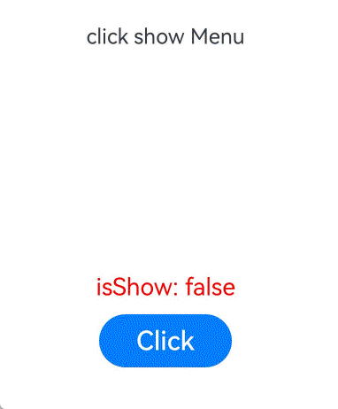

# !!语法：双向绑定
在状态管理V1中使用[$$](./arkts-two-way-sync.md)用于内置组件双向绑定。
在状态管理V2中，提供了归一处理，提供`!!`语法糖作为统一处理双向绑定语法。


>**说明：**
>
>`!!`语法从API version 12开始支持。
>
>当前状态管理（V2试用版）仍在逐步开发中，相关功能尚未成熟，建议开发者尝鲜试用。

## 概述

`!!`双向绑定语法，是一个语法糖方便开发者实现数据双向绑定，用于初始化子组件的\@Param和\@Event。其中\@Event方法名需要声明为“$”+ \@Param属性名，详见[使用场景](#使用场景)。

- 如果父组件使用了`!!`双向绑定语法，则表明父组件的变化会同步给子组件，子组件的变化也会同步给父组件。
- 如果父组件没有使用`!!`，则父组件发生的变化是单向的。


## 使用限制
`!!`双向绑定语法不支持多层父子组件传递。


## 使用场景

### 自定义组件间双向绑定
1. Index中构造Star子组件，双向绑定父子组件中的value，初始化子组件的`@Param value`和`@Event $value`
- 双向绑定语法糖可视为：

    ```
    Star({ value: this.value, $value: (val: number) => { this.value = val }})
    ```
2. 点击改变Index中的Button，改变value，父组件Index和子组件Star中Text更新。
3. 点击改变子组件Star中的Button，调用`this.$value(10)`，父组件Index和子组件Star中Text更新。

```ts
@Entry
@ComponentV2
struct Index {
  @Local value: number = 0;

  build() {
    Column() {
      Text(`${this.value}`)
      Button(`change value`).onClick(() => {
        this.value++;
      })
      Star({ value: this.value!! })
    }
  }
}


@ComponentV2
struct Star {
  @Param value: number = 0;
  @Event $value: (val: number) => void = (val: number) => {};

  build() {
    Column() {
      Text(`${this.value}`)
      Button(`change value `).onClick(() => {
        this.$value(10);
      })
    }
  }
}
```


### 内置组件参数双向绑定

!!运算符为系统内置组件提供TS变量的引用，使得TS变量和系统内置组件的内部状态保持同步。添加方式是在变量名后添加，例如isShow!!。

内部状态具体指什么取决于组件。例如，[bindMenu](../reference/apis-arkui/arkui-ts/ts-universal-attributes-menu.md)组件的isShow参数。

#### 使用规则

- 当前!!支持以下接口参数基础类型变量的双向绑定，也就是参数同步当前弹出菜单或气泡状态。!!双向绑定支持基础类型变量，当该变量使用状态管理V2[\@Local](arkts-new-local.md)或状态管理V1[\@State](arkts-state.md)装饰时，变量值的变化会触发UI刷新。

  | 属性                                                         | 支持的参数 | 起始API版本 |
  | ------------------------------------------------------------ | --------------- | ----------- |
  | [bindMenu](../reference/apis-arkui/arkui-ts/ts-universal-attributes-menu.md#bindmenu11) | isShow | 13          |
  | [bindContextMenu](../reference/apis-arkui/arkui-ts/ts-universal-attributes-menu.md#bindcontextmenu12) | isShown | 13          |
  | [bindPopup](../reference/apis-arkui/arkui-ts/ts-universal-attributes-popup.md#bindpopup) | show | 13   |

- !!绑定的[\@Local](arkts-new-local.md)变量变化时，会触发UI的同步刷新。


#### 使用示例

bindMenu接口isShow参数双向绑定功能

```ts
@Entry
@ComponentV2
struct BindMenuInterface {
  @Local isShow: boolean = false;

  build() {
    Column() {
      Row() {
        Text('click show Menu')
          .bindMenu(this.isShow!!, // 双向绑定
            [
              {
                value: 'Menu1',
                action: () => {
                  console.info('handle Menu1 click');
                }
              },
              {
                value: 'Menu2',
                action: () => {
                  console.info('handle Menu2 click');
                }
              },
            ])
      }.height('50%')
      Text("当前isShow: " + this.isShow).fontSize(18).fontColor(Color.Red)
      Row() {
        Button("Click")
          .onClick(() => {
            this.isShow = true;
          })
          .width(100)
          .fontSize(20)
          .margin(10)
      }
    }.width('100%')
  }
}
```


