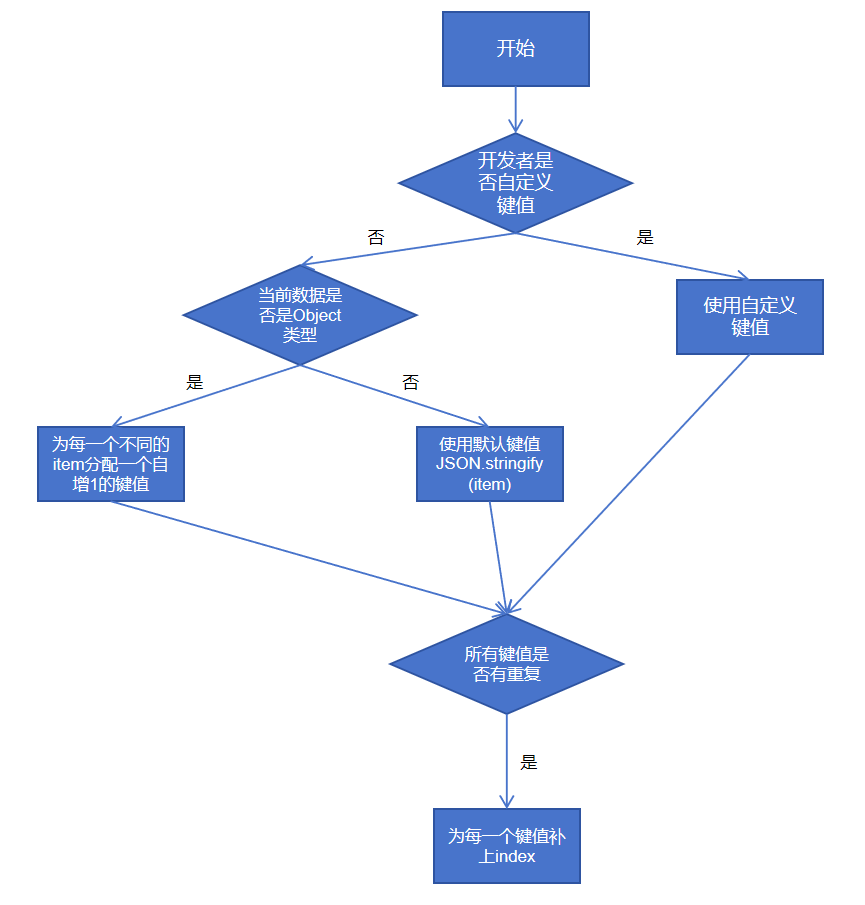
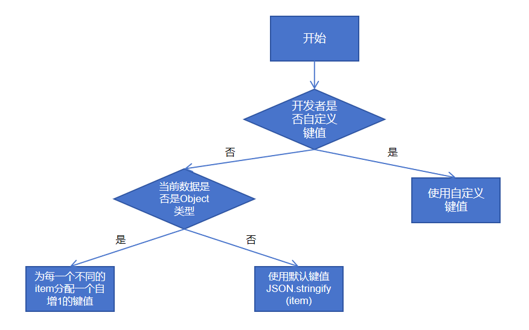
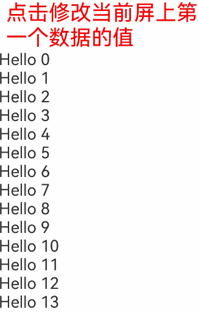
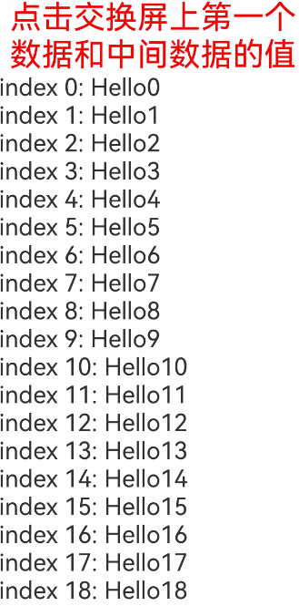
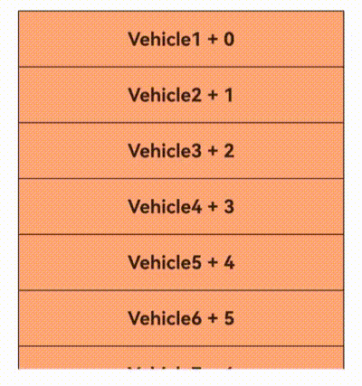

# Repeat：子组件复用

>**说明：**
>
>Repeat从API version 12开始支持。
>
>当前状态管理（V2试用版）仍在逐步开发中，相关功能尚未成熟，建议开发者尝鲜试用。

Repeat组件不开启virtualScroll开关时，Repeat基于数组类型数据来进行循环渲染，需要与容器组件配合使用，且接口返回的组件应当是允许包含在Repeat父容器组件中的子组件。Repeat循环渲染和ForEach相比有两个区别，一是优化了部分更新场景下的渲染性能，二是组件生成函数的索引index由框架侧来维护。

Repeat组件开启virtualScroll开关时，Repeat将从提供的数据源中按需迭代数据，并在每次迭代过程中创建相应的组件。当在滚动容器中使用了Repeat，框架会根据滚动容器可视区域按需创建组件，当组件滑出可视区域外时，框架会缓存组件，并在下一次迭代中使用。

## 接口描述

### Repeat组件构造

```ts
declare const Repeat: <T>(arr: Array<T>) => RepeatAttribute<T>
```

参数说明：

| 参数名 | 参数类型   | 是否必填 | 参数描述                                               |
| ------ | ---------- | -------- | ------------------------------------------------------ |
| arr    | Array\<T\> | 是       | 数据源，为`Array<T>`类型的数组，由开发者决定数据类型。 |

### Repeat组件属性

```ts
declare class RepeatAttribute<T> {
  each(itemGenerator: (repeatItem: RepeatItem<T>) => void): RepeatAttribute<T>;
  key(keyGenerator: (item: T, index: number) => string): RepeatAttribute<T>;
  virtualScroll(virtualScrollOptions?: VirtualScrollOptions): RepeatAttribute<T>;
  template(type: string, itemBuilder: RepeatItemBuilder<T>, templateOptions?: TemplateOptions): RepeatAttribute<T>;
  templateId(typedFunc: TemplateTypedFunc<T>): RepeatAttribute<T>;
}
```

参数说明：

| 属性名        | 参数类型                                                     | 参数描述                                                     |
| ------------- | ------------------------------------------------------------ | ------------------------------------------------------------ |
| each          | itemGenerator: (repeatItem: RepeatItem\<T\>) => void         | 组件生成函数。<br/>**说明：**<br/>- `each`属性必须有，否则运行时会报错。<br/>- `itemGenerator`的参数为`RepeatItem`，该参数将`item`和`index`结合到了一起，请勿将`RepeatItem`参数拆开使用。 |
| key           | keyGenerator: (item: T, index: number) => string             | 键值生成函数。<br/>- 为数组中的每个元素创建对应的键值。<br/>- `item`：`arr`数组中的数据项。<br/>- `index`：`arr`数组中的数据项索引。 |
| virtualScroll | virtualScrollOptions?: VirtualScrollOptions                  | `Repeat`开启虚拟滚动。<br/>-`virtualScrollOptions`：虚拟滚动配置项。 |
| template      | type: string, itemBuilder: RepeatItemBuilder\<T\>, templateOptions?: TemplateOptions | 复用模板。<br/>未开启virtualScroll时暂不支持，复用有问题。<br/>-`type`：当前模板类型。<br/>-`itemBuilder`：组件生成函数。<br/>-`templateOptions`：当前模板配置项。 |
| templateId    | typedFunc: TemplateTypedFunc\<T\>                              | 为当前数据项分配模板类型。<br/>-`typedFunc`：生成当前数据项对应的模板类型。<br/>template和templateId匹配不上的数据项走默认生成函数each。 |

### RepeatItem类型

```ts
interface RepeatItem<T> {
  item: T,
  index?: number
}
```

属性说明：

| 属性名 | 类型   | 是否必填 | 描述                                         |
| ------ | ------ | -------- | -------------------------------------------- |
| item   | T      | 是       | arr中每一个数据项。T为开发者传入的数据类型。 |
| index  | number | 否       | 当前数据项对应的索引。                       |

### VirtualScrollOptions类型

```
interface VirtualScrollOptions {
  totalCount?: number;
}
```

属性说明：

| 属性名     | 类型   | 是否必填 | 描述                                                         |
| ---------- | ------ | -------- | ------------------------------------------------------------ |
| totalCount | number | 否       | 定义数据源长度为arrLength，以下为totalCount的判断规则：<br/>1) totalCount == undefined \|\| totalCount <= 0 \|\| totalCount == arrLength时，totalCount为数据源长度，列表正常滚动<br/>2) 0 < totalCount < arrLength时，界面中数据源被截断，只渲染“totalCount”个数据<br/>3) totalCount > arrLength时，滚动条样式正常，无数据项的位置显示空白，当滚动动画停止时，滚动条停留在最后一个数据项的位置。这样用户可以不同步请求所有数据，也能实现正确的滚动条样式。 |

### RepeatItemBuilder类型

```
declare type RepeatItemBuilder<T> = (repeatItem: RepeatItem<T>) => void;
```

参数说明：

| 参数名     | 类型          | 是否必填      | 描述                                    |
| ---------- | ------------- | --------------------------------------- | --------------------------------------- |
| repeatItem | RepeatItem\<T\> | 是 | 将item和index结合到一起的一个状态变量。 |

### TemplateOptions类型

```
interface TemplateOptions {
  cachedCount?: number
}
```

属性说明：

| 属性名      | 类型   | 是否必填 | 描述                                                         |
| ----------- | ------ | -------- | ------------------------------------------------------------ |
| cachedCount | number | 否       | 当前模板在Repeat的缓存池中可缓存子节点的最大数量，默认值为1，仅在开启virtualScroll后生效。<br/>将cachedCount设置为当前模板的节点在屏上可能出现的最大数量时，Repeat可以做到尽可能多的复用。但后果是当屏上没有当前模板的节点时，缓存池也不会释放，应用内存会增大。需要开发者依据具体情况自行把控。<br/>each方法的cachedCount默认为1，目前不能修改。 |

### TemplateTypedFunc类型

```
declare type TemplateTypedFunc<T> = (item : T, index : number) => string;
```

参数说明：

| 参数名 | 类型   | 是否必填 | 描述                                         |
| ------ | ------ | -------- | -------------------------------------------- |
| item   | T      | 是       | arr中每一个数据项。T为开发者传入的数据类型。 |
| index  | number | 是       | 当前数据项对应的索引。                       |

## 使用限制

- Repeat必须在容器组件内使用，仅有[List](../reference/apis-arkui/arkui-ts/ts-container-list.md)、[ListItemGroup](../reference/apis-arkui/arkui-ts/ts-container-listitemgroup.md)、[Grid](../reference/apis-arkui/arkui-ts/ts-container-grid.md)、[Swiper](../reference/apis-arkui/arkui-ts/ts-container-swiper.md)以及[WaterFlow](../reference/apis-arkui/arkui-ts/ts-container-waterflow.md)组件支持虚拟滚动（此时配置cachedCount会生效）。其它容器组件使用Repeat时请不要打开virtualScroll开关。
- Repeat开启virtualScroll后，在每次迭代中，必须创建且只允许创建一个子组件。不开启virtualScroll没有该限制。
- 生成的子组件必须是允许包含在Repeat父容器组件中的子组件。
- 允许Repeat包含在if/else条件渲染语句中，也允许Repeat中出现if/else条件渲染语句。
- Repeat内部使用键值作为标识，因此键值生成器必须针对每个数据生成唯一的值，如果多个数据同一时刻生成的键值相同，会导致UI组件渲染出现问题。
- 未开启virtualScroll目前暂时不支持template模板，复用会有问题。

## 键值生成规则

### non-virtualScroll规则



### virtualScroll规则

和non-virtualScroll的键值生成规则基本一致，但是不会自动处理重复的键值，需要开发者自己保证键值的唯一性。



## 组件生成及复用规则

### non-virtualScroll规则

子组件在Repeat首次渲染时全部创建，在数据更新时会对原组件进行复用。

在Repeat组件进行数据更新时，它会依次对比上次的所有键值和本次更新之后的区别。若当前键值和上次的某一项键值相同，Repeat会直接复用子组件并对RepeatItem.index索引做对应的更新。

当Repeat将所有重复的键值对比完并做了相应的复用后，若上次的键值有不重复的且本次更新之后有新的键值生成需要新建子组件时，Repeat会复用上次多余的子组件并更新RepeatItem.item数据源和RepeatItem.index索引并刷新UI。

若上次的剩余>=本次新更新的数量，则组件完全复用并释放多余的未被复用的组件。若上次的剩余小于本次新更新的数量，将剩余的组件复用完后，Repeat会新建多出来的数据项对应的组件。

### virtualScroll规则

子组件在Repeat首次渲染只生成当前需要的组件，在滑动和数据更新时会缓存下屏的节点，在需要生成新的组件时，对缓存里的组件进行复用。

#### 滑动场景

滑动前节点现状如下图所示


当前Repeat组件templateId有a和b两种，templateId a对应的缓存池，其最大缓存值为3，templateId b对应的缓存池，其最大缓存值为4，其父组件默认预加载节点1个。这时，我们将屏幕右滑，Repeat将开始复用缓存池中的节点。


index=18的数据进入屏幕及父组件预加载的范围内，此时计算出其templateId为b，这时Repeat会从type=b的缓存池中取出一个节点进行复用，更新它的key&index&data，该子节点内部使用了该项数据及索引的其他孙子节点会根据V2状态管理的规则做同步更新。

index=10的节点划出了屏幕及父组件预加载的范围。当UI主线程空闲时，会去检测type=a的缓存池是否还有空间，此时缓存池中有四个节点，超过了额定的3个，Repeat会释放掉最后一个节点。


#### 数据更新场景


此时我们做如下更新操作，删除index=12节点，更新index=13节点的数据，更新index=14节点的templateId为a，更新index=15节点的key。


此时Repeat会通知父组件重新布局，首先会一一对比key值，若和原节点key值相同且templateId相同，则复用该节点，更新index和data，若key值不同，则复用相同的templateId缓存池中的节点，并更新key、index和data。


上图显示node13节点更新了数据data和index，node14更新了templateId，node15由于key值发生变化，于是从缓存池中取走一个复用，并同步更新key、index、data，node16和node17均只更新index。index=17的节点是新的，从缓存池中复用。


## 使用场景

### non-virtualScroll

#### 数据源变化

在Repeat组件进行非首次渲染时，它会依次对比上次的所有键值和本次更新之后的区别。若当前键值和上次的某一项键值相同，Repeat会直接复用子组件并对RepeatItem.index索引做对应的更新。

当Repeat将所有重复的键值对比完并做了相应的复用后，若上次的键值有不重复的且本次更新之后有新的键值生成需要新建子组件时，Repeat会复用上次多余的子组件并更新RepeatItem.item数据源和RepeatItem.index索引。

若上次的剩余>=本次新更新的数量，则组件完全复用，若上次的剩余小于本次新更新的数量，将剩余的组件复用完后，Repeat会新建多出来的数据项对应的组件。

```ts
@Entry
@ComponentV2
struct Parent {
  @Local simpleList: Array<string> = ['one', 'two', 'three'];

  build() {
    Row() {
      Column() {
        Text('点击修改第3个数组项的值')
          .fontSize(24)
          .fontColor(Color.Red)
          .onClick(() => {
            this.simpleList[2] = 'new three';
          })

        Repeat<string>(this.simpleList)
            .each((obj: RepeatItem<string>)=>{
              ChildItem({ item: obj.item })
                .margin({top: 20})
            })
            .key((item: string) => item)
      }
      .justifyContent(FlexAlign.Center)
      .width('100%')
      .height('100%')
    }
    .height('100%')
    .backgroundColor(0xF1F3F5)
  }
}

@ComponentV2
struct ChildItem {
  @Param @Require item: string;

  build() {
    Text(this.item)
      .fontSize(30)
  }
}
```


第三个数组项重新渲染时会复用之前的第三项的组件，仅对数据做了刷新。

#### 索引值变化

下方例子当我们交换数组项1和2时，若键值和上次保持一致，Repeat会复用之前的组件，仅对使用了index索引值的组件做数据刷新。

```ts
@Entry
@ComponentV2
struct Parent {
  @Local simpleList: Array<string> = ['one', 'two', 'three'];

  build() {
    Row() {
      Column() {
        Text('交换数组项1，2')
          .fontSize(24)
          .fontColor(Color.Red)
          .onClick(() => {
            let temp: string = this.simpleList[2]
            this.simpleList[2] = this.simpleList[1]
            this.simpleList[1] = temp
          })
          .margin({bottom: 20})

        Repeat<string>(this.simpleList)
          .each((obj: RepeatItem<string>)=>{
            Text("index: " + obj.index)
              .fontSize(30)
            ChildItem({ item: obj.item })
              .margin({bottom: 20})
          })
          .key((item: string) => item)
      }
      .justifyContent(FlexAlign.Center)
      .width('100%')
      .height('100%')
    }
    .height('100%')
    .backgroundColor(0xF1F3F5)
  }
}

@ComponentV2
struct ChildItem {
  @Param @Require item: string;

  build() {
    Text(this.item)
      .fontSize(30)
  }
}
```


### virtualScroll

#### 数据源变化

```ts
@ObservedV2
class Wrap1 {
    @Trace message: string = '';
    
    constructor(message: string) {
        this.message = message;
    }
}

@Entry
@ComponentV2
struct Parent {
    @Local simpleList: Array<Wrap1> = [];
    @Local start: number = 0;
    
    aboutToAppear(): void {
        for (let i=0; i<100; i++) {
            this.simpleList.push(new Wrap1('Hello' + i));
        }
    }
    
    build() {
        Column() {
            Text('点击修改当前屏上第一个数据的值')
            	.fontSize(40)
            	.fontColor(Color.Red)
            	.onClick(()=>{
                	this.simpleList[this.start] = new Wrap1(this.simpleList[this.start].message + ' new');
            	})
            
            List() {
                Repeat<Wrap1>(this.simpleList)
                	.each((obj: RepeatItem<Wrap1>)=>{
                    	ListItem() {
                            Text(obj.item.message)
                            	.fontSize(30)
                        }
                	})
            }
            .onScrollIndex((start: number)=>{
                this.start = start;
            })
            .cachedCount(5)
            .width('100%')
            .height('100%')
        }
        .height(700)
    }
}
```



#### 索引值变化

```ts
@ObservedV2
class Wrap1 {
    @Trace message: string = '';
    
    constructor(message: string) {
        this.message = message;
    }
}

@Entry
@ComponentV2
struct Parent {
    @Local simpleList: Array<Wrap1> = [];
    @Local start: number = 0;
    @Local center: number = 0;
    
    aboutToAppear(): void {
        for (let i=0; i<100; i++) {
            this.simpleList.push(new Wrap1('Hello' + i));
        }
    }
    
    build() {
        Column() {
            Text('点击交换屏上第一个数据和中间数据的值')
            	.fontSize(40)
            	.fontColor(Color.Red)
            	.onClick(()=>{
                	let temp: number = this.simpleList[this.start];
                	this.simpleList[this.start] = this.simpleList[this.center];
                	this.simpleList[this.center] = temp;
            	})
            
            List() {
                Repeat<Wrap1>(this.simpleList)
                	.each((obj: RepeatItem<Wrap1>)=>{
                    	ListItem() {
                            Text('index ' + obj.index + ': ')
                            	.fontSize(30)
                            Text(obj.item.message)
                            	.fontSize(30)
                        }
                	})
            }
            .onScrollIndex((start: number, end: number, center: number)=>{
                this.start = start;
                this.center = center;
            })
            .cachedCount(5)
            .width('100%')
            .height('100%')
        }
        .height(700)
    }
}
```



当key值不变时，组件会直接复用并更新index的值。

#### 使用template

```
@ObservedV2
class Wrap1 {
    @Trace message: string = '';
    
    constructor(message: string) {
        this.message = message;
    }
}

@Entry
@ComponentV2
struct Parent {
    @Local simpleList: Array<Wrap1> = [];
    
    aboutToAppear(): void {
        for (let i=0; i<100; i++) {
            this.simpleList.push(new Wrap1('Hello' + i));
        }
    }
    
    build() {
        Column() {
            List() {
                Repeat<Wrap1>(this.simpleList)
                	.each((obj: RepeatItem<Wrap1>)=>{
                    	ListItem() {
                    		Row() {
                    			Text('default index ' + obj.index + ': ')
                            		.fontSize(30)
                            	Text(obj.item.message)
                            		.fontSize(30)
                    		}
                        }
                        .margin(20)
                	})
                	.template('odd', (obj: RepeatItem<Wrap1>)=>{
                    	ListItem() {
                    		Row() {
                    			Text('odd index ' + obj.index + ': ')
                            		.fontSize(30)
                            		.fontColor(Color.Blue)
                            	Text(obj.item.message)
                            		.fontSize(30)
                            		.fontColor(Color.Blue)
                    		}
                        }
                        .margin(20)
                	})
                	.template('even', (obj: RepeatItem<Wrap1>)=>{
                    	ListItem() {
                    		Row() {
                    			Text('even index ' + obj.index + ': ')
                            		.fontSize(30)
                            		.fontColor(Color.Green)
                            	Text(obj.item.message)
                            		.fontSize(30)
                            		.fontColor(Color.Green)
                    		}
                        }
                        .margin(20)
                	})
                	.templateId((item: Wrap1, index: number) => {
                		return index%2 ? 'odd' : 'even';
                	})
                	.key((item: Wrap1, index: number) => {
                		return item.message;
                	})
            }
            .cachedCount(5)
            .width('100%')
            .height('100%')
        }
        .height('100%')
    }
}
```


## 常见问题

### 屏幕外的列表数据发生变化时，保证滚动条位置不变

在List组件中声明Repeat组件，实现key值生成逻辑和each逻辑（如下示例代码），点击按钮“insert”，在屏幕显示的第一个元素前面插入一个元素，屏幕出现向下滚动。

```ts
// 定义一个类，标记为可观察的
// 类中自定义一个数组，标记为可追踪的
@ObservedV2
class ArrayHolder {
  @Trace arr: Array<number> = [];

  // constructor，用于初始化数组个数
  constructor(count: number) {
    for (let i = 0; i < count; i++) {
      this.arr.push(i);
    }
  }
}

@Entry
@ComponentV2
export struct RepeatTemplateSingle {
  @Local arrayHolder: ArrayHolder = new ArrayHolder(100);
  @Local totalCount: number = this.arrayHolder.arr.length;
  scroller: Scroller = new Scroller();

  build() {
    Column({ space: 5 }) {
      List({ space: 20, initialIndex: 19, scroller: this.scroller }) {
        Repeat(this.arrayHolder.arr)
          .virtualScroll({ totalCount: this.totalCount })
          .templateId((item, index) => {
            return 'number';
          })
          .template('number', (r) => {
            ListItem() {
              Text(r.index! + ":" + r.item + "Reuse");
            }
          })
          .each((r) => {
            ListItem() {
              Text(r.index! + ":" + r.item + "eachMessage");
            }
          })
      }
      .height('30%')

      Button(`insert totalCount ${this.totalCount}`)
        .height(60)
        .onClick(() => {
          // 插入元素，元素位置为屏幕显示的前一个元素
          this.arrayHolder.arr.splice(18, 0, this.totalCount);
          this.totalCount = this.arrayHolder.arr.length;
        })
    }
    .width('100%')
    .margin({ top: 5 })
  }
}
```

运行效果：


在一些场景中，我们不希望屏幕外的数据源变化影响屏幕中List列表Scroller停留的位置，可以通过List组件的[onScrollIndex](../ui/arkts-layout-development-create-list.md#响应滚动位置)事件对列表滚动动作进行监听，当列表发生滚动时，获取列表滚动位置。使用Scroller组件的[scrollToIndex](../reference/apis-arkui/arkui-ts/ts-container-scroll.md#scrolltoindex)特性，滑动到指定index位置，实现屏幕外的数据源增加/删除数据时，Scroller停留的位置不变的效果。

示例代码仅对增加数据的情况进行展示。

```ts
// 定义一个类，标记为可观察的
// 类中自定义一个数组，标记为可追踪的
@ObservedV2
class ArrayHolder {
  @Trace arr: Array<number> = [];

  // constructor，用于初始化数组个数
  constructor(count: number) {
    for (let i = 0; i < count; i++) {
      this.arr.push(i);
    }
  }
}

@Entry
@ComponentV2
export struct RepeatTemplateSingle {
  @Local arrayHolder: ArrayHolder = new ArrayHolder(100);
  @Local totalCount: number = this.arrayHolder.arr.length;
  scroller: Scroller = new Scroller();

  private start: number = 1;
  private end: number = 1;

  build() {
    Column({ space: 5 }) {
      List({ space: 20, initialIndex: 19, scroller: this.scroller }) {
        Repeat(this.arrayHolder.arr)
          .virtualScroll({ totalCount: this.totalCount })
          .templateId((item, index) => {
            return 'number';
          })
          .template('number', (r) => {
            ListItem() {
              Text(r.index! + ":" + r.item + "Reuse");
            }
          })
          .each((r) => {
            ListItem() {
              Text(r.index! + ":" + r.item + "eachMessage");
            }
          })
      }
      .onScrollIndex((start, end) => {
        this.start = start;
        this.end = end;
      })
      .height('30%')

      Button(`insert totalCount ${this.totalCount}`)
        .height(60)
        .onClick(() => {
          // 插入元素，元素位置为屏幕显示的前一个元素
          this.arrayHolder.arr.splice(18, 0, this.totalCount);
          let rect = this.scroller.getItemRect(this.start); // 获取子组件的大小位置
          this.scroller.scrollToIndex(this.start + 1); // 滑动到指定index
          this.scroller.scrollBy(0, -rect.y); // 滑动指定距离
          this.totalCount = this.arrayHolder.arr.length;
        })
    }
    .width('100%')
    .margin({ top: 5 })
  }
}
```

运行效果：


### totalCount值大于页面数据源长度

当数据源总长度很大时，会使用数据源懒加载的方式提高加载速度，这导致了页面上加载的数据长度很可能是小于总长度的。为了使Repeat显示正确的滚动条样式，需要将数据总长度赋值给totalCount，当totalCount大于当前页面加载的数据长度时，会出现循环滚动的异常现象。异常现象示例：



为了避免这个问题，开发者需要在数据滚动的事件中加入懒加载数据的请求逻辑，保证在列表滑动的过程中不会出现空白，直到数据源全部加载完成。示例代码如下：

```ts
@ObservedV2
class VehicleData {
  @Trace name: string;
  @Trace price: number;

  constructor(name: string, price: number) {
    this.name = name;
    this.price = price;
  }
}

@ObservedV2
class VehicleDB {
  public vehicleItems: VehicleData[] = [];

  constructor() {
    // init data size 20
    for (let i = 1; i <= 20; i++) {
      this.vehicleItems.push(new VehicleData(`Vehicle${i}`, i));
    }
  }
}

@Entry
@ComponentV2
struct entryCompSucc {
  @Local vehicleItems: VehicleData[] = new VehicleDB().vehicleItems;
  @Local listChildrenSize: ChildrenMainSize = new ChildrenMainSize(60);
  @Local totalCount: number = this.vehicleItems.length;
  scroller: Scroller = new Scroller();

  build() {
    Column({ space: 3 }) {
      List({ scroller: this.scroller }) {
        Repeat(this.vehicleItems)
          .virtualScroll({ totalCount: 50 }) // total data size 50
          .templateId(() => 'default')
          .template('default', (ri) => {
            ListItem() {
              Column() {
                Text(`${ri.item.name} + ${ri.index}`)
                  .width('90%')
                  .height(this.listChildrenSize.childDefaultSize)
                  .backgroundColor(0xFFA07A)
                  .textAlign(TextAlign.Center)
                  .fontSize(20)
                  .fontWeight(FontWeight.Bold)
              }
            }.border({ width: 1 })
          }, { cachedCount: 5 })
          .each((ri) => {
            ListItem() {
              Text("Wrong: " + `${ri.item.name} + ${ri.index}`)
                .width('90%')
                .height(this.listChildrenSize.childDefaultSize)
                .backgroundColor(0xFFA07A)
                .textAlign(TextAlign.Center)
                .fontSize(20)
                .fontWeight(FontWeight.Bold)
            }.border({ width: 1 })
          })
          .key((item, index) => `${index}:${item}`)
      }
      .height('50%')
      .margin({ top: 20 })
      .childrenMainSize(this.listChildrenSize)
      .alignListItem(ListItemAlign.Center)
      .onScrollIndex((start, end) => {
        console.log('onScrollIndex', start, end);
        // lazy data loading
        if (this.vehicleItems.length < 50) {
          for (let i = 0; i < 10; i++) {
            if (this.vehicleItems.length < 50) {
              this.vehicleItems.push(new VehicleData("Vehicle_loaded", i));
            }
          }
        }
      })
    }
  }
}
```

示例代码运行效果：

