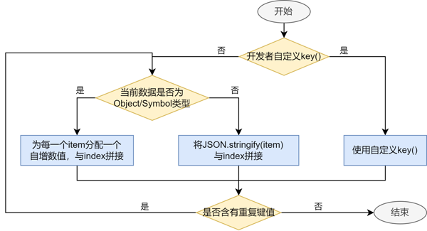
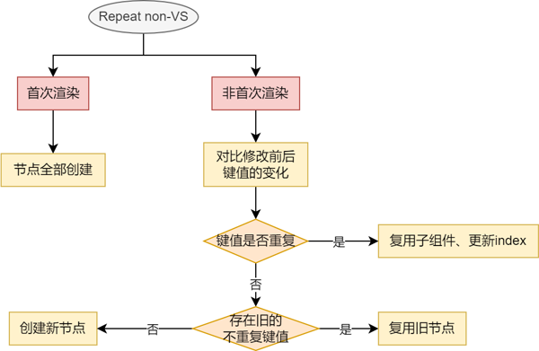
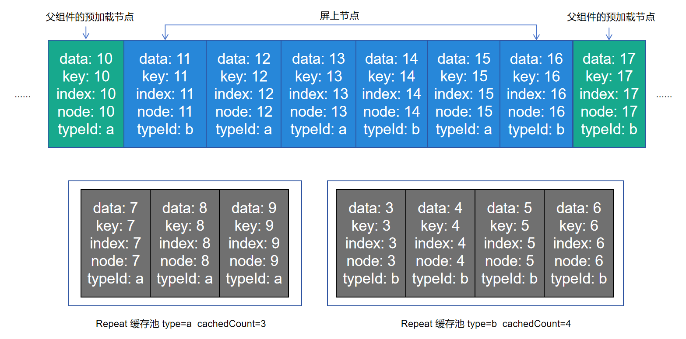
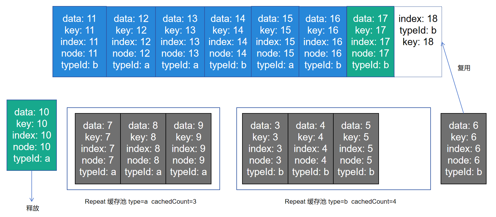
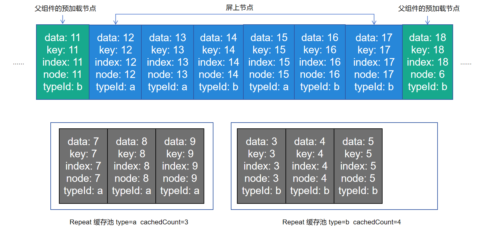
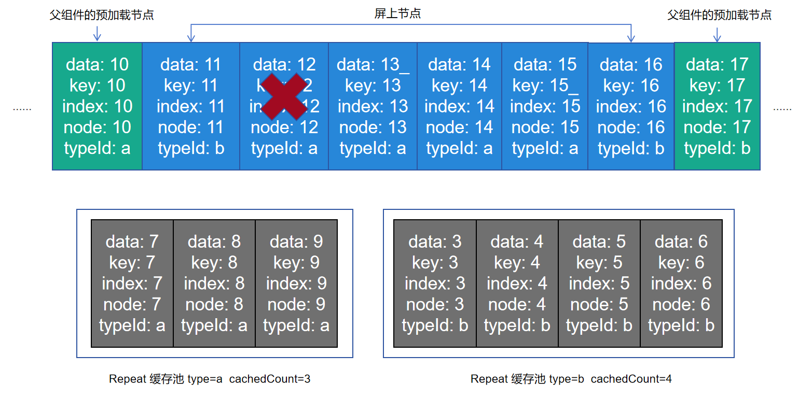
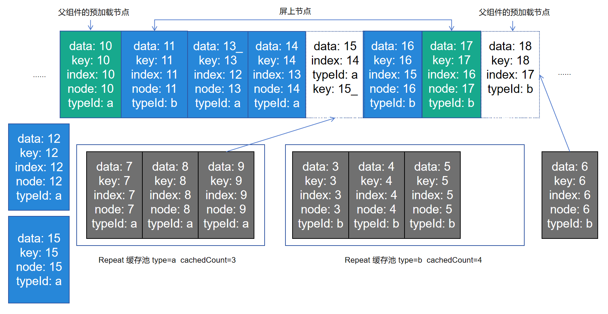
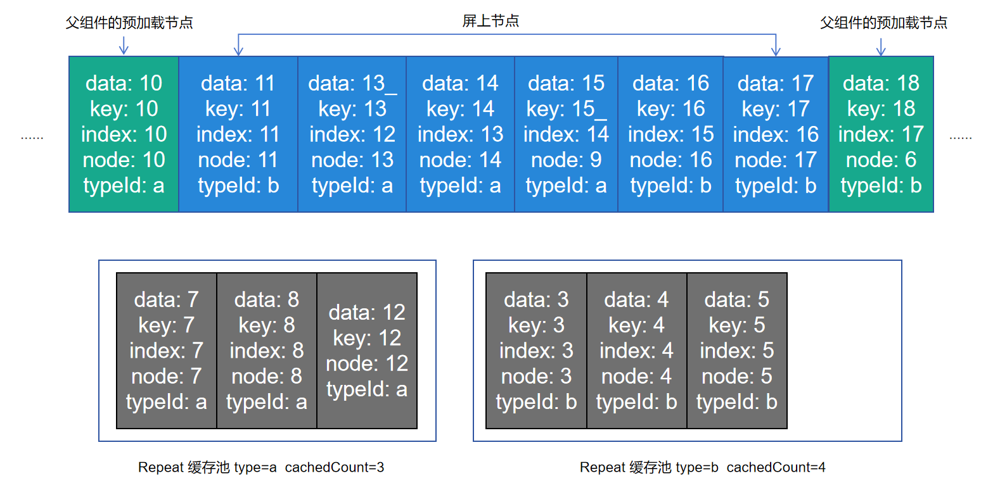
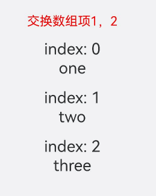
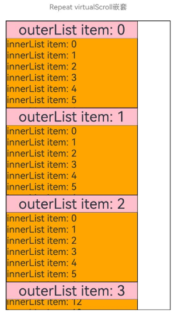

# Repeat：子组件复用

> **说明：**
> 
> Repeat从API version 12开始支持。

本文档仅为开发者指南。API参数说明见：[Repeat API参数说明](../reference/apis-arkui/arkui-ts/ts-rendering-control-repeat.md)。

Repeat组件non-virtualScroll场景（不开启virtualScroll开关）中，Repeat基于数据源进行循环渲染，需要与容器组件配合使用，且接口返回的组件应当是允许包含在Repeat父容器组件中的子组件。Repeat循环渲染和ForEach相比有两个区别，一是优化了部分更新场景下的渲染性能，二是组件生成函数的索引index由框架侧来维护。

Repeat组件virtualScroll场景中，Repeat将从提供的数据源中按需迭代数据，并在每次迭代过程中创建相应的组件，必须与滚动类容器组件配合使用。当在滚动类容器组件中使用了Repeat，框架会根据滚动容器可视区域按需创建组件，当组件滑出可视区域外时，框架会缓存组件，并在下一次迭代中使用。

## 使用限制

- Repeat使用键值作为标识，因此键值生成函数`key()`必须针对每个数据生成唯一的值。
- Repeat virtualScroll场景必须在滚动类容器组件内使用，仅有[List](../reference/apis-arkui/arkui-ts/ts-container-list.md)、[Grid](../reference/apis-arkui/arkui-ts/ts-container-grid.md)、[Swiper](../reference/apis-arkui/arkui-ts/ts-container-swiper.md)以及[WaterFlow](../reference/apis-arkui/arkui-ts/ts-container-waterflow.md)组件支持virtualScroll场景（此时配置cachedCount会生效）。其它容器组件只适用于non-virtualScroll场景。
- Repeat开启virtualScroll后，在每次迭代中，必须创建且只允许创建一个子组件。不开启virtualScroll没有该限制。生成的子组件必须是允许包含在Repeat父容器组件中的子组件。
- 当Repeat与自定义组件/@Builder函数混用时，必须将RepeatItem类型整体进行传参，组件才能监听到数据变化，如果只传递`RepeatItem.item`或`RepeatItem.index`，将会出现UI渲染异常。
- template模板目前只支持virtualScroll场景。当多个template type相同时，Repeat会覆盖旧的`template()`函数，仅生效最新的`template()`。
- totalCount > array.length时，在父组件容器滚动过程中，应用需要保证列表即将滑动到数据源末尾时请求后续数据，直到数据源全部加载完成，否则列表滑动的过程中会出现滚动效果异常。解决方案见[totalCount值大于数据源长度](#totalcount值大于数据源长度)。
- 在滚动容器组件（List、Grid、Swiper、WaterFlow）内使用Repeat的时候，只能包含一个Repeat。以List为例，同时包含ListItem、ForEach、LazyForEach的场景是不推荐的；同时包含多个Repeat也是不推荐的。
- Repeat组件的virtualScroll场景不支持V1装饰器，使用V1装饰器存在渲染异常，不建议开发者同时使用。

## 键值生成规则

键值生成函数`key()`的目的是允许Repeat识别数组更改的细节：添加了哪些数据、删除了哪些数据，以及哪些数据改变了位置（索引）。

开发者使用建议：

- 即使数据项有重复，开发者也必须保证键值key唯一（即使数据源发生变化）。
- 每次执行`key()`函数时，使用相同的数据项作为输入，输出必须是一致的。
- `key()`中使用index是允许的，但不建议这样使用。原因是数据项移动时索引发生变化，即键值发生变化。因此Repeat会认为数据项发生了变化，并触发UI重新渲染，会降低性能表现。
- 推荐将简单类型数组转换为类对象数组，并添加一个`readonly id`属性，在构造函数中给它赋一个唯一的值。

### non-virtualScroll规则

`key()`可以缺省，Repeat会生成默认key值。



### virtualScroll规则

和non-virtualScroll的键值生成规则基本一致，`key()`可以缺省。


## 组件生成及复用规则

### non-virtualScroll规则

子组件在Repeat首次渲染时全部创建，在数据更新时会对原组件进行复用。

在Repeat组件进行数据更新时，它会依次对比上次的所有键值和本次更新之后的区别。若当前键值和上次的某一项键值相同，Repeat会直接复用子组件并对RepeatItem.index索引做对应的更新。

当Repeat将所有重复的键值对比完并做了相应的复用后，若上次的键值有不重复的且本次更新之后有新的键值生成需要新建子组件时，Repeat会复用上次多余的子组件并更新RepeatItem.item数据源和RepeatItem.index索引并刷新UI。

若上次的剩余>=本次新更新的数量，则组件完全复用并释放多余的未被复用的组件。若上次的剩余小于本次新更新的数量，将剩余的组件复用完后，Repeat会新建多出来的数据项对应的组件。



### virtualScroll规则

子组件在Repeat首次渲染只生成当前需要的组件，在滑动和数据更新时会缓存下屏的节点，在需要生成新的组件时，对缓存里的组件进行复用。

Repeat组件在virtualScroll模式下默认启用复用功能。从API version 16开始，可以通过配置reusable字段选择是否启用复用功能。为提高渲染性能，建议启用复用功能。

#### 滑动场景

滑动前节点现状如下图所示



当前Repeat组件template type有a和b两种，template type等于a对应的缓存池，其最大缓存值为3，template type等于b对应的缓存池，其最大缓存值为4，其父组件默认预加载节点1个。这时，我们将屏幕向右滑动，Repeat将开始复用缓存池中的节点。



index=18的数据进入屏幕及父组件预加载的范围内，此时计算出其template type等于b，这时Repeat会从template type等于b的缓存池中取出一个节点进行复用，更新它的key&index&data，该子节点内部使用了该项数据及索引的其他孙子节点会根据V2状态管理的规则做同步更新。

index=10的节点划出了屏幕及父组件预加载的范围。当UI主线程空闲时，会去检测template type等于a的缓存池是否还有空间，此时缓存池中有四个节点，超过了额定的3个，Repeat会释放掉最后一个节点。



#### 数据更新场景


此时我们做如下更新操作，删除index=12节点，更新index=13节点的数据，更新index=14节点的template type为a，更新index=15节点的key。



此时Repeat会通知父组件重新布局，逐一对比template type值，若和原节点template type值相同，则复用该节点，更新key、index和data，若template type值发生变化，则复用相应template type的缓存池中的节点，并更新key、index和data。



上图显示node13节点更新了数据data和index；node14更新了template type和index，于是从缓存池中取走一个复用；node15由于key值发生变化并且template type不变，复用自身节点并同步更新key、index、data；node16和node17均只更新index。index=17的节点是新的，从缓存池中复用。



## totalCount规则

数据源的总长度，可以大于已加载数据项的数量。令arr.length表示数据源长度，以下为totalCount的处理规则：

- totalCount缺省/非自然数时，totalCount默认为arr.length，列表正常滚动。
- 0 <= totalCount < arr.length时，界面中只渲染“totalCount”个数据。
- totalCount > arr.length时，代表Repeat将渲染totalCount个数据，滚动条样式根据totalCount值变化。

> **注意：** 
>
> 当totalCount > arr.length时，在父组件容器滚动过程中，应用需要保证列表即将滑动到数据源末尾时请求后续数据，开发者需要对数据请求的错误场景（如网络延迟）进行保护操作，直到数据源全部加载完成，否则列表滑动的过程中会出现滚动效果异常。

## cachedCount规则

cachedCount是当前模板在Repeat的缓存池中可缓存子节点的最大数量，仅在virtualScroll场景下生效。

首先需要明确滚动类容器组件 `.cachedCount()`属性方法和Repeat `cachedCount`的区别。这两者都是为了平衡性能和内存，但是其含义是不同的。

- 滚动类容器组件 `.cachedCount()`：是指在可见范围外预加载的节点，这些节点会位于组件树上，但不是可见范围内，List/Grid等容器组件会额外渲染这些可见范围外的节点，从而达到其性能收益。Repeat会将这些节点视为“可见”的。
- Repeat `cachedCount`: 是指Repeat视为“不可见”的节点，这些节点是空闲的，框架会暂时保存，在需要使用的时候更新这些节点，从而实现复用。

将cachedCount设置为当前模板的节点在屏上可能出现的最大数量时，Repeat可以做到尽可能多的复用。但后果是当屏上没有当前模板的节点时，缓存池也不会释放，应用内存会增大。需要开发者依据具体情况自行把控。

- cachedCount缺省时，框架会分别对不同template，根据屏上节点+预加载的节点个数来计算cachedCount。当屏上节点+预加载的节点个数变多时，cachedCount也会对应增长。需要注意cachedCount数量不会减少。
- 显式指定cachedCount，推荐设置成和屏幕上节点个数一致。需要注意，不推荐设置cachedCount小于2，因为这会导致在快速滑动场景下创建新的节点，从而导致性能劣化。

## 使用场景

### non-virtualScroll数据展示&操作

#### 数据源变化

```ts
@Entry
@ComponentV2
struct Parent {
  @Local simpleList: Array<string> = ['one', 'two', 'three'];

  build() {
    Row() {
      Column() {
        Text('点击修改第3个数组项的值')
          .fontSize(24)
          .fontColor(Color.Red)
          .onClick(() => {
            this.simpleList[2] = 'new three';
          })

        Repeat<string>(this.simpleList)
            .each((obj: RepeatItem<string>)=>{
              ChildItem({ item: obj.item })
                .margin({top: 20})
            })
            .key((item: string) => item)
      }
      .justifyContent(FlexAlign.Center)
      .width('100%')
      .height('100%')
    }
    .height('100%')
    .backgroundColor(0xF1F3F5)
  }
}

@ComponentV2
struct ChildItem {
  @Param @Require item: string;

  build() {
    Text(this.item)
      .fontSize(30)
  }
}
```


第三个数组项重新渲染时会复用之前的第三项的组件，仅对数据做了刷新。

#### 索引值变化

下方例子当交换数组项1和2时，若键值和上次保持一致，Repeat会复用之前的组件，仅对使用了index索引值的组件做数据刷新。

```ts
@Entry
@ComponentV2
struct Parent {
  @Local simpleList: Array<string> = ['one', 'two', 'three'];

  build() {
    Row() {
      Column() {
        Text('交换数组项1，2')
          .fontSize(24)
          .fontColor(Color.Red)
          .onClick(() => {
            let temp: string = this.simpleList[2]
            this.simpleList[2] = this.simpleList[1]
            this.simpleList[1] = temp
          })
          .margin({bottom: 20})

        Repeat<string>(this.simpleList)
          .each((obj: RepeatItem<string>)=>{
            Text("index: " + obj.index)
              .fontSize(30)
            ChildItem({ item: obj.item })
              .margin({bottom: 20})
          })
          .key((item: string) => item)
      }
      .justifyContent(FlexAlign.Center)
      .width('100%')
      .height('100%')
    }
    .height('100%')
    .backgroundColor(0xF1F3F5)
  }
}

@ComponentV2
struct ChildItem {
  @Param @Require item: string;

  build() {
    Text(this.item)
      .fontSize(30)
  }
}
```



### virtualScroll数据展示&操作

本小节将展示virtualScroll场景下，Repeat的实际使用场景和组件节点的复用情况。根据复用规则可以衍生出大量的测试场景，篇幅原因，只对典型的数据变化进行解释。

#### 一个template

下面的代码设计了Repeat组件的virtualScroll场景典型数据源操作，包括**插入数据、修改数据、删除数据、交换数据**。点击下拉框选择index值，点击相应的按钮即可进行数据修改操作。依次点击数据项可以交换被点击的两个数据项。

```ts
@ObservedV2
class Repeat005Clazz {
  @Trace message: string = '';

  constructor(message: string) {
    this.message = message;
  }
}

@Entry
@ComponentV2
struct RepeatVirtualScroll {
  @Local simpleList: Array<Repeat005Clazz> = [];
  private exchange: number[] = [];
  private counter: number = 0;
  @Local selectOptions: SelectOption[] = [];
  @Local selectIdx: number = 0;

  @Monitor("simpleList")
  reloadSelectOptions(): void {
    this.selectOptions = [];
    for (let i = 0; i < this.simpleList.length; ++i) {
      this.selectOptions.push({ value: i.toString() });
    }
    if (this.selectIdx >= this.simpleList.length) {
      this.selectIdx = this.simpleList.length - 1;
    }
  }

  aboutToAppear(): void {
    for (let i = 0; i < 100; i++) {
      this.simpleList.push(new Repeat005Clazz(`item_${i}`));
    }
    this.reloadSelectOptions();
  }

  handleExchange(idx: number): void { // 点击交换子组件
    this.exchange.push(idx);
    if (this.exchange.length === 2) {
      let _a = this.exchange[0];
      let _b = this.exchange[1];
      let temp: Repeat005Clazz = this.simpleList[_a];
      this.simpleList[_a] = this.simpleList[_b];
      this.simpleList[_b] = temp;
      this.exchange = [];
    }
  }

  build() {
    Column({ space: 10 }) {
      Text('virtualScroll each()&template() 1t')
        .fontSize(15)
        .fontColor(Color.Gray)
      Text('Select an index and press the button to update data.')
        .fontSize(15)
        .fontColor(Color.Gray)

      Select(this.selectOptions)
        .selected(this.selectIdx)
        .value(this.selectIdx.toString())
        .key('selectIdx')
        .onSelect((index: number) => {
          this.selectIdx = index;
        })
      Row({ space: 5 }) {
        Button('Add No.' + this.selectIdx)
          .onClick(() => {
            this.simpleList.splice(this.selectIdx, 0, new Repeat005Clazz(`${this.counter++}_add_item`));
            this.reloadSelectOptions();
          })
        Button('Modify No.' + this.selectIdx)
          .onClick(() => {
            this.simpleList.splice(this.selectIdx, 1, new Repeat005Clazz(`${this.counter++}_modify_item`));
          })
        Button('Del No.' + this.selectIdx)
          .onClick(() => {
            this.simpleList.splice(this.selectIdx, 1);
            this.reloadSelectOptions();
          })
      }
      Button('Update array length to 5.')
        .onClick(() => {
          this.simpleList = this.simpleList.slice(0, 5);
          this.reloadSelectOptions();
        })

      Text('Click on two items to exchange.')
        .fontSize(15)
        .fontColor(Color.Gray)

      List({ space: 10 }) {
        Repeat<Repeat005Clazz>(this.simpleList)
          .each((obj: RepeatItem<Repeat005Clazz>) => {
            ListItem() {
              Text(`[each] index${obj.index}: ${obj.item.message}`)
                .fontSize(25)
                .onClick(() => {
                  this.handleExchange(obj.index);
                })
            }
          })
          .key((item: Repeat005Clazz, index: number) => {
            return item.message;
          })
          .virtualScroll({ totalCount: this.simpleList.length })
          .templateId(() => "a")
          .template('a', (ri) => {
            Text(`[a] index${ri.index}: ${ri.item.message}`)
              .fontSize(25)
              .onClick(() => {
                this.handleExchange(ri.index);
              })
          }, { cachedCount: 3 })
      }
      .cachedCount(2)
      .border({ width: 1 })
      .width('95%')
      .height('40%')
    }
    .justifyContent(FlexAlign.Center)
    .width('100%')
    .height('100%')
  }
}
```
该应用列表内容为100项自定义类`RepeatClazz`的`message`字符串属性，List组件的cachedCount设为2，模板'a'的缓存池大小设为3。应用界面如下图所示：


#### 多个template

```
@ObservedV2
class Repeat006Clazz {
  @Trace message: string = '';

  constructor(message: string) {
    this.message = message;
  }
}

@Entry
@ComponentV2
struct RepeatVirtualScroll2T {
  @Local simpleList: Array<Repeat006Clazz> = [];
  private exchange: number[] = [];
  private counter: number = 0;
  @Local selectOptions: SelectOption[] = [];
  @Local selectIdx: number = 0;

  @Monitor("simpleList")
  reloadSelectOptions(): void {
    this.selectOptions = [];
    for (let i = 0; i < this.simpleList.length; ++i) {
      this.selectOptions.push({ value: i.toString() });
    }
    if (this.selectIdx >= this.simpleList.length) {
      this.selectIdx = this.simpleList.length - 1;
    }
  }

  aboutToAppear(): void {
    for (let i = 0; i < 100; i++) {
      this.simpleList.push(new Repeat006Clazz(`item_${i}`));
    }
    this.reloadSelectOptions();
  }

  handleExchange(idx: number): void { // 点击交换子组件
    this.exchange.push(idx);
    if (this.exchange.length === 2) {
      let _a = this.exchange[0];
      let _b = this.exchange[1];
      let temp: Repeat006Clazz = this.simpleList[_a];
      this.simpleList[_a] = this.simpleList[_b];
      this.simpleList[_b] = temp;
      this.exchange = [];
    }
  }

  build() {
    Column({ space: 10 }) {
      Text('virtualScroll each()&template() 2t')
        .fontSize(15)
        .fontColor(Color.Gray)
      Text('Select an index and press the button to update data.')
        .fontSize(15)
        .fontColor(Color.Gray)

      Select(this.selectOptions)
        .selected(this.selectIdx)
        .value(this.selectIdx.toString())
        .key('selectIdx')
        .onSelect((index: number) => {
          this.selectIdx = index;
        })
      Row({ space: 5 }) {
        Button('Add No.' + this.selectIdx)
          .onClick(() => {
            this.simpleList.splice(this.selectIdx, 0, new Repeat006Clazz(`${this.counter++}_add_item`));
            this.reloadSelectOptions();
          })
        Button('Modify No.' + this.selectIdx)
          .onClick(() => {
            this.simpleList.splice(this.selectIdx, 1, new Repeat006Clazz(`${this.counter++}_modify_item`));
          })
        Button('Del No.' + this.selectIdx)
          .onClick(() => {
            this.simpleList.splice(this.selectIdx, 1);
            this.reloadSelectOptions();
          })
      }
      Button('Update array length to 5.')
        .onClick(() => {
          this.simpleList = this.simpleList.slice(0, 5);
          this.reloadSelectOptions();
        })

      Text('Click on two items to exchange.')
        .fontSize(15)
        .fontColor(Color.Gray)

      List({ space: 10 }) {
        Repeat<Repeat006Clazz>(this.simpleList)
          .each((obj: RepeatItem<Repeat006Clazz>) => {
            ListItem() {
              Text(`[each] index${obj.index}: ${obj.item.message}`)
                .fontSize(25)
                .onClick(() => {
                  this.handleExchange(obj.index);
                })
            }
          })
          .key((item: Repeat006Clazz, index: number) => {
            return item.message;
          })
          .virtualScroll({ totalCount: this.simpleList.length })
          .templateId((item: Repeat006Clazz, index: number) => {
            return (index % 2 === 0) ? 'odd' : 'even';
          })
          .template('odd', (ri) => {
            Text(`[odd] index${ri.index}: ${ri.item.message}`)
              .fontSize(25)
              .fontColor(Color.Blue)
              .onClick(() => {
                this.handleExchange(ri.index);
              })
          }, { cachedCount: 3 })
          .template('even', (ri) => {
            Text(`[even] index${ri.index}: ${ri.item.message}`)
              .fontSize(25)
              .fontColor(Color.Green)
              .onClick(() => {
                this.handleExchange(ri.index);
              })
          }, { cachedCount: 1 })
      }
      .cachedCount(2)
      .border({ width: 1 })
      .width('95%')
      .height('40%')
    }
    .justifyContent(FlexAlign.Center)
    .width('100%')
    .height('100%')
  }
}
```


### Repeat嵌套

Repeat支持嵌套使用。示例代码：

```ts
// Repeat嵌套
@Entry
@ComponentV2
struct RepeatNest {
  @Local outerList: string[] = [];
  @Local innerList: number[] = [];

  aboutToAppear(): void {
    for (let i = 0; i < 20; i++) {
      this.outerList.push(i.toString());
      this.innerList.push(i);
    }
  }

  build() {
    Column({ space: 20 }) {
      Text('Repeat virtualScroll嵌套')
        .fontSize(15)
        .fontColor(Color.Gray)
      List() {
        Repeat<string>(this.outerList)
          .each((obj) => {
            ListItem() {
              Column() {
                Text('outerList item: ' + obj.item)
                  .fontSize(30)
                List() {
                  Repeat<number>(this.innerList)
                    .each((subObj) => {
                      ListItem() {
                        Text('innerList item: ' + subObj.item)
                          .fontSize(20)
                      }
                    })
                    .key((item) => "innerList_" + item)
                }
                .width('80%')
                .border({ width: 1 })
                .backgroundColor(Color.Orange)
              }
              .height('30%')
              .backgroundColor(Color.Pink)
            }
            .border({ width: 1 })
          })
          .key((item) => "outerList_" + item)
      }
      .width('80%')
      .border({ width: 1 })
    }
    .justifyContent(FlexAlign.Center)
    .width('90%')
    .height('80%')
  }
}
```

运行效果：



## 父容器组件应用场景

### 与List组合使用

在List容器组件中使用Repeat的virtualScroll模式，示例如下：

```ts
class DemoListItemInfo {
  name: string;
  icon: Resource;

  constructor(name: string, icon: Resource) {
    this.name = name;
    this.icon = icon;
  }
}

@Entry
@ComponentV2
struct DemoList {
  @Local videoList: Array<DemoListItemInfo> = [];

  aboutToAppear(): void {
    for (let i = 0; i < 10; i++) {
      // 此处app.media.listItem0、app.media.listItem1、app.media.listItem2仅作示例，请开发者自行替换
      this.videoList.push(new DemoListItemInfo('视频' + i,
        i % 3 == 0 ? $r("app.media.listItem0") :
        i % 3 == 1 ? $r("app.media.listItem1") : $r("app.media.listItem2")));
    }
  }

  @Builder
  itemEnd(index: number) {
    Button('删除')
      .backgroundColor(Color.Red)
      .onClick(() => {
        this.videoList.splice(index, 1);
      })
  }

  build() {
    Column({ space: 10 }) {
      Text('List容器组件中包含Repeat组件')
        .fontSize(15)
        .fontColor(Color.Gray)

      List({ space: 5 }) {
        Repeat<DemoListItemInfo>(this.videoList)
          .each((obj: RepeatItem<DemoListItemInfo>) => {
            ListItem() {
              Column() {
                Image(obj.item.icon)
                  .width('80%')
                  .margin(10)
                Text(obj.item.name)
                  .fontSize(20)
              }
            }
            .swipeAction({
              end: {
                builder: () => {
                  this.itemEnd(obj.index);
                }
              }
            })
            .onAppear(() => {
              console.info('AceTag', obj.item.name);
            })
          })
          .key((item: DemoListItemInfo) => item.name)
          .virtualScroll()
      }
      .cachedCount(2)
      .height('90%')
      .border({ width: 1 })
      .listDirection(Axis.Vertical)
      .alignListItem(ListItemAlign.Center)
      .divider({
        strokeWidth: 1,
        startMargin: 60,
        endMargin: 60,
        color: '#ffe9f0f0'
      })

      Row({ space: 10 }) {
        Button('删除第1项')
          .onClick(() => {
            this.videoList.splice(0, 1);
          })
        Button('删除第5项')
          .onClick(() => {
            this.videoList.splice(4, 1);
          })
      }
    }
    .width('100%')
    .height('100%')
    .justifyContent(FlexAlign.Center)
  }
}
```
右滑并点击按钮，或点击底部按钮，可删除视频卡片：


### 与Grid组合使用

在Grid容器组件中使用Repeat的virtualScroll模式，示例如下：

```ts
class DemoGridItemInfo {
  name: string;
  icon: Resource;

  constructor(name: string, icon: Resource) {
    this.name = name;
    this.icon = icon;
  }
}

@Entry
@ComponentV2
struct DemoGrid {
  @Local itemList: Array<DemoGridItemInfo> = [];
  @Local isRefreshing: boolean = false;
  private layoutOptions: GridLayoutOptions = {
    regularSize: [1, 1],
    irregularIndexes: [10]
  }
  private GridScroller: Scroller = new Scroller();
  private num: number = 0;

  aboutToAppear(): void {
    for (let i = 0; i < 10; i++) {
      // 此处app.media.gridItem0、app.media.gridItem1、app.media.gridItem2仅作示例，请开发者自行替换
      this.itemList.push(new DemoGridItemInfo('视频' + i,
        i % 3 == 0 ? $r("app.media.gridItem0") :
        i % 3 == 1 ? $r("app.media.gridItem1") : $r("app.media.gridItem2")));
    }
  }

  build() {
    Column({ space: 10 }) {
      Text('Grid容器组件中包含Repeat组件')
        .fontSize(15)
        .fontColor(Color.Gray)

      Refresh({ refreshing: $$this.isRefreshing }) {
        Grid(this.GridScroller, this.layoutOptions) {
          Repeat<DemoGridItemInfo>(this.itemList)
            .each((obj: RepeatItem<DemoGridItemInfo>) => {
              if (obj.index === 10 ) {
                GridItem() {
                  Text('先前浏览至此，点击刷新')
                    .fontSize(20)
                }
                .height(30)
                .border({ width: 1 })
                .onClick(() => {
                  this.GridScroller.scrollToIndex(0);
                  this.isRefreshing = true;
                })
                .onAppear(() => {
                  console.info('AceTag', obj.item.name);
                })
              } else {
                GridItem() {
                  Column() {
                    Image(obj.item.icon)
                      .width('100%')
                      .height(80)
                      .objectFit(ImageFit.Cover)
                      .borderRadius({ topLeft: 16, topRight: 16 })
                    Text(obj.item.name)
                      .fontSize(15)
                      .height(20)
                  }
                }
                .height(100)
                .borderRadius(16)
                .backgroundColor(Color.White)
                .onAppear(() => {
                  console.info('AceTag', obj.item.name);
                })
              }
            })
            .key((item: DemoGridItemInfo) => item.name)
            .virtualScroll()
        }
        .columnsTemplate('repeat(auto-fit, 150)')
        .cachedCount(4)
        .rowsGap(15)
        .columnsGap(10)
        .height('100%')
        .padding(10)
        .backgroundColor('#F1F3F5')
      }
      .onRefreshing(() => {
        setTimeout(() => {
          this.itemList.splice(10, 1);
          this.itemList.unshift(new DemoGridItemInfo('refresh', $r('app.media.gridItem0'))); // 此处app.media.gridItem0仅作示例，请开发者自行替换
          for (let i = 0; i < 10; i++) {
            // 此处aapp.media.gridItem0、app.media.gridItem1、app.media.gridItem2仅作示例，请开发者自行替换
            this.itemList.unshift(new DemoGridItemInfo('新视频' + this.num,
              i % 3 == 0 ? $r("app.media.gridItem0") :
              i % 3 == 1 ? $r("app.media.gridItem1") : $r("app.media.gridItem2")));
            this.num++;
          }
          this.isRefreshing = false;
        }, 1000);
        console.info('AceTag', 'onRefreshing');
      })
      .refreshOffset(64)
      .pullToRefresh(true)
      .width('100%')
      .height('85%')

      Button('刷新')
        .onClick(() => {
          this.GridScroller.scrollToIndex(0);
          this.isRefreshing = true;
        })
    }
    .width('100%')
    .height('100%')
    .justifyContent(FlexAlign.Center)
  }
}
```
下拉屏幕，或点击刷新按钮，或点击“先前浏览至此，点击刷新”，可加载新的视频内容：


### 与Swiper组合使用

在Swiper容器组件中使用Repeat的virtualScroll模式，示例如下：

```ts
const remotePictures: Array<string> = [
  'https://www.example.com/xxx/0001.jpg', // 请填写具体的网络图片地址
  'https://www.example.com/xxx/0002.jpg',
  'https://www.example.com/xxx/0003.jpg',
  'https://www.example.com/xxx/0004.jpg',
  'https://www.example.com/xxx/0005.jpg',
  'https://www.example.com/xxx/0006.jpg',
  'https://www.example.com/xxx/0007.jpg',
  'https://www.example.com/xxx/0008.jpg',
  'https://www.example.com/xxx/0009.jpg',
]

@ObservedV2
class DemoSwiperItemInfo {
  id: string;
  @Trace url: string = 'default';

  constructor(id: string) {
    this.id = id;
  }
}

@Entry
@ComponentV2
struct DemoSwiper {
  @Local pics: Array<DemoSwiperItemInfo> = [];

  aboutToAppear(): void {
    for (let i = 0; i < 9; i++) {
      this.pics.push(new DemoSwiperItemInfo('pic' + i));
    }
    setTimeout(() => {
      this.pics[0].url = remotePictures[0];
    }, 1000);
  }

  build() {
    Column() {
      Text('Swiper容器组件中包含Repeat组件')
        .fontSize(15)
        .fontColor(Color.Gray)

      Stack() {
        Text('图片加载中')
          .fontSize(15)
          .fontColor(Color.Gray)
        Swiper() {
          Repeat(this.pics)
            .each((obj: RepeatItem<DemoSwiperItemInfo>) => {
              Image(obj.item.url)
                .onAppear(() => {
                  console.info('AceTag', obj.item.id);
                })
            })
            .key((item: DemoSwiperItemInfo) => item.id)
            .virtualScroll()
        }
        .cachedCount(9)
        .height('50%')
        .loop(false)
        .indicator(true)
        .onChange((index) => {
          setTimeout(() => {
            this.pics[index].url = remotePictures[index];
          }, 1000);
        })
      }
      .width('100%')
      .height('100%')
      .backgroundColor(Color.Black)
    }
  }
}
```
定时1秒后加载图片，模拟网络延迟：


## 常见问题

### 屏幕外的列表数据发生变化时，保证滚动条位置不变

在List组件中声明Repeat组件，实现key值生成逻辑和each逻辑（如下示例代码），点击按钮“insert”，在屏幕显示的第一个元素前面插入一个元素，屏幕出现向下滚动。

```ts
// 定义一个类，标记为可观察的
// 类中自定义一个数组，标记为可追踪的
@ObservedV2
class ArrayHolder {
  @Trace arr: Array<number> = [];

  // constructor，用于初始化数组个数
  constructor(count: number) {
    for (let i = 0; i < count; i++) {
      this.arr.push(i);
    }
  }
}

@Entry
@ComponentV2
struct RepeatTemplateSingle {
  @Local arrayHolder: ArrayHolder = new ArrayHolder(100);
  @Local totalCount: number = this.arrayHolder.arr.length;
  scroller: Scroller = new Scroller();

  build() {
    Column({ space: 5 }) {
      List({ space: 20, initialIndex: 19, scroller: this.scroller }) {
        Repeat(this.arrayHolder.arr)
          .virtualScroll({ totalCount: this.totalCount })
          .templateId((item, index) => {
            return 'number';
          })
          .template('number', (r) => {
            ListItem() {
              Text(r.index! + ":" + r.item + "Reuse");
            }
          })
          .each((r) => {
            ListItem() {
              Text(r.index! + ":" + r.item + "eachMessage");
            }
          })
      }
      .height('30%')

      Button(`insert totalCount ${this.totalCount}`)
        .height(60)
        .onClick(() => {
          // 插入元素，元素位置为屏幕显示的前一个元素
          this.arrayHolder.arr.splice(18, 0, this.totalCount);
          this.totalCount = this.arrayHolder.arr.length;
        })
    }
    .width('100%')
    .margin({ top: 5 })
  }
}
```

运行效果：


在一些场景中，我们不希望屏幕外的数据源变化影响屏幕中List列表Scroller停留的位置，可以通过List组件的[onScrollIndex](../ui/arkts-layout-development-create-list.md#响应滚动位置)事件对列表滚动动作进行监听，当列表发生滚动时，获取列表滚动位置。使用Scroller组件的[scrollToIndex](../reference/apis-arkui/arkui-ts/ts-container-scroll.md#scrolltoindex)特性，滑动到指定index位置，实现屏幕外的数据源增加/删除数据时，Scroller停留的位置不变的效果。

示例代码仅对增加数据的情况进行展示。

```ts
// ...ArrayHolder的定义和上述demo代码一致

@Entry
@ComponentV2
struct RepeatTemplateSingle {
  @Local arrayHolder: ArrayHolder = new ArrayHolder(100);
  @Local totalCount: number = this.arrayHolder.arr.length;
  scroller: Scroller = new Scroller();

  private start: number = 1;
  private end: number = 1;

  build() {
    Column({ space: 5 }) {
      List({ space: 20, initialIndex: 19, scroller: this.scroller }) {
        Repeat(this.arrayHolder.arr)
          .virtualScroll({ totalCount: this.totalCount })
          .templateId((item, index) => {
            return 'number';
          })
          .template('number', (r) => {
            ListItem() {
              Text(r.index! + ":" + r.item + "Reuse");
            }
          })
          .each((r) => {
            ListItem() {
              Text(r.index! + ":" + r.item + "eachMessage");
            }
          })
      }
      .onScrollIndex((start, end) => {
        this.start = start;
        this.end = end;
      })
      .height('30%')

      Button(`insert totalCount ${this.totalCount}`)
        .height(60)
        .onClick(() => {
          // 插入元素，元素位置为屏幕显示的前一个元素
          this.arrayHolder.arr.splice(18, 0, this.totalCount);
          let rect = this.scroller.getItemRect(this.start); // 获取子组件的大小位置
          this.scroller.scrollToIndex(this.start + 1); // 滑动到指定index
          this.scroller.scrollBy(0, -rect.y); // 滑动指定距离
          this.totalCount = this.arrayHolder.arr.length;
        })
    }
    .width('100%')
    .margin({ top: 5 })
  }
}
```

运行效果：


### totalCount值大于数据源长度

当数据源总长度很大时，会使用懒加载的方式先加载一部分数据，为了使Repeat显示正确的滚动条样式，需要将数据总长度赋值给totalCount，即数据源全部加载完成前，totalCount大于array.length。

totalCount > array.length时，在父组件容器滚动过程中，应用需要保证列表即将滑动到数据源末尾时请求后续数据，开发者需要对数据请求的错误场景（如网络延迟）进行保护操作，直到数据源全部加载完成，否则列表滑动的过程中会出现滚动效果异常。

上述规范可以通过实现父组件List/Grid的[onScrollIndex](../ui/arkts-layout-development-create-list.md#响应滚动位置)属性的回调函数完成。示例代码如下：

```ts
@ObservedV2
class VehicleData {
  @Trace name: string;
  @Trace price: number;

  constructor(name: string, price: number) {
    this.name = name;
    this.price = price;
  }
}

@ObservedV2
class VehicleDB {
  public vehicleItems: VehicleData[] = [];

  constructor() {
    // init data size 20
    for (let i = 1; i <= 20; i++) {
      this.vehicleItems.push(new VehicleData(`Vehicle${i}`, i));
    }
  }
}

@Entry
@ComponentV2
struct entryCompSucc {
  @Local vehicleItems: VehicleData[] = new VehicleDB().vehicleItems;
  @Local listChildrenSize: ChildrenMainSize = new ChildrenMainSize(60);
  @Local totalCount: number = this.vehicleItems.length;
  scroller: Scroller = new Scroller();

  build() {
    Column({ space: 3 }) {
      List({ scroller: this.scroller }) {
        Repeat(this.vehicleItems)
          .virtualScroll({ totalCount: 50 }) // total data size 50
          .templateId(() => 'default')
          .template('default', (ri) => {
            ListItem() {
              Column() {
                Text(`${ri.item.name} + ${ri.index}`)
                  .width('90%')
                  .height(this.listChildrenSize.childDefaultSize)
                  .backgroundColor(0xFFA07A)
                  .textAlign(TextAlign.Center)
                  .fontSize(20)
                  .fontWeight(FontWeight.Bold)
              }
            }.border({ width: 1 })
          }, { cachedCount: 5 })
          .each((ri) => {
            ListItem() {
              Text("Wrong: " + `${ri.item.name} + ${ri.index}`)
                .width('90%')
                .height(this.listChildrenSize.childDefaultSize)
                .backgroundColor(0xFFA07A)
                .textAlign(TextAlign.Center)
                .fontSize(20)
                .fontWeight(FontWeight.Bold)
            }.border({ width: 1 })
          })
          .key((item, index) => `${index}:${item}`)
      }
      .height('50%')
      .margin({ top: 20 })
      .childrenMainSize(this.listChildrenSize)
      .alignListItem(ListItemAlign.Center)
      .onScrollIndex((start, end) => {
        console.log('onScrollIndex', start, end);
        // lazy data loading
        if (this.vehicleItems.length < 50) {
          for (let i = 0; i < 10; i++) {
            if (this.vehicleItems.length < 50) {
              this.vehicleItems.push(new VehicleData("Vehicle_loaded", i));
            }
          }
        }
      })
    }
  }
}
```

示例代码运行效果：


### Repeat与@Builder混用的限制

当Repeat与@Builder混用时，必须将RepeatItem类型整体进行传参，组件才能监听到数据变化，如果只传递`RepeatItem.item`或`RepeatItem.index`，将会出现UI渲染异常。

示例代码如下：

```ts
@Entry
@ComponentV2
struct RepeatBuilderPage {
  @Local simpleList1: Array<number> = [];
  @Local simpleList2: Array<number> = [];

  aboutToAppear(): void {
    for (let i = 0; i < 100; i++) {
      this.simpleList1.push(i)
      this.simpleList2.push(i)
    }
  }

  build() {
    Column({ space: 20 }) {
      Text('Repeat与@Builder混用，左边是异常场景，右边是正常场景，向下滑动一段距离可以看出差别')
        .fontSize(15)
        .fontColor(Color.Gray)

      Row({ space: 20 }) {
        List({ initialIndex: 5, space: 20 }) {
          Repeat<number>(this.simpleList1)
            .each((ri) => {})
            .virtualScroll({ totalCount: this.simpleList1.length })
            .templateId((item: number, index: number) => "default")
            .template('default', (ri) => {
              ListItem() {
                Column() {
                  Text('Text id = ' + ri.item)
                    .fontSize(20)
                  this.buildItem1(ri.item) // 修改为：this.buildItem1(ri)
                }
              }
              .border({ width: 1 })
            }, { cachedCount: 3 })
        }
        .cachedCount(1)
        .border({ width: 1 })
        .width('45%')
        .height('60%')

        List({ initialIndex: 5, space: 20 }) {
          Repeat<number>(this.simpleList2)
            .each((ri) => {})
            .virtualScroll({ totalCount: this.simpleList2.length })
            .templateId((item: number, index: number) => "default")
            .template('default', (ri) => {
              ListItem() {
                Column() {
                  Text('Text id = ' + ri.item)
                    .fontSize(20)
                  this.buildItem2(ri)
                }
              }
              .border({ width: 1 })
            }, { cachedCount: 3 })
        }
        .cachedCount(1)
        .border({ width: 1 })
        .width('45%')
        .height('60%')
      }
    }
    .height('100%')
    .justifyContent(FlexAlign.Center)
  }

  @Builder
  // @Builder参数必须传RepeatItem类型才能正常渲染
  buildItem1(item: number) {
    Text('Builder1 id = ' + item)
      .fontSize(20)
      .fontColor(Color.Red)
      .margin({ top: 2 })
  }

  @Builder
  buildItem2(ri: RepeatItem<number>) {
    Text('Builder2 id = ' + ri.item)
      .fontSize(20)
      .fontColor(Color.Red)
      .margin({ top: 2 })
  }
}
```

界面展示如下图，进入页面后向下滑动一段距离可以看出差别，左边是错误用法，右边是正确用法（Text组件为黑色，Builder组件为红色）。上述代码展示了开发过程中易出错的场景，即在@Builder构造函数中传参方式为值传递。

