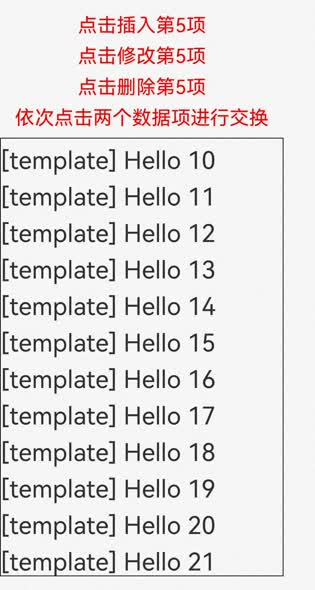
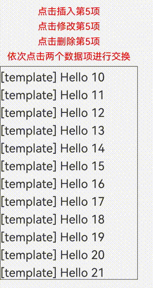
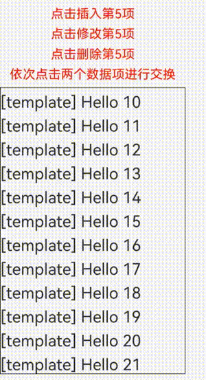
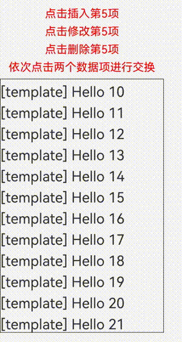
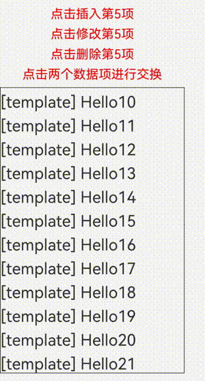

# Repeat：子组件复用

>**说明：**
>
>Repeat从API version 12开始支持。
>
>当前状态管理（V2试用版）仍在逐步开发中，相关功能尚未成熟，建议开发者尝鲜试用。

API参数说明见：[Repeat API参数说明](../reference/apis-arkui/arkui-ts/ts-rendering-control-repeat.md)

Repeat组件non-virtualScroll场景（不开启virtualScroll开关）中，Repeat基于数据源进行循环渲染，需要与容器组件配合使用，且接口返回的组件应当是允许包含在Repeat父容器组件中的子组件。Repeat循环渲染和ForEach相比有两个区别，一是优化了部分更新场景下的渲染性能，二是组件生成函数的索引index由框架侧来维护。

Repeat组件virtualScroll场景中，Repeat将从提供的数据源中按需迭代数据，并在每次迭代过程中创建相应的组件，必须与滚动类容器组件配合使用。当在滚动类容器组件中使用了Repeat，框架会根据滚动容器可视区域按需创建组件，当组件滑出可视区域外时，框架会缓存组件，并在下一次迭代中使用。

> **注意：**
>
> Repeat组件的virtualScroll场景不完全兼容V1装饰器，使用V1装饰器存在渲染异常，不建议开发者同时使用。

## 使用限制

- Repeat使用键值作为标识，因此键值生成函数`key()`必须针对每个数据生成唯一的值。
- Repeat virtualScroll场景必须在滚动类容器组件内使用，仅有[List](../reference/apis-arkui/arkui-ts/ts-container-list.md)、[Grid](../reference/apis-arkui/arkui-ts/ts-container-grid.md)、[Swiper](../reference/apis-arkui/arkui-ts/ts-container-swiper.md)以及[WaterFlow](../reference/apis-arkui/arkui-ts/ts-container-waterflow.md)组件支持virtualScroll场景（此时配置cachedCount会生效）。其它容器组件只适用于non-virtualScroll场景。
- Repeat开启virtualScroll后，在每次迭代中，必须创建且只允许创建一个子组件。不开启virtualScroll没有该限制。生成的子组件必须是允许包含在Repeat父容器组件中的子组件。
- 当Repeat与@Builder混用时，必须将RepeatItem类型整体进行传参，组件才能监听到数据变化，如果只传递`RepeatItem.item`或`RepeatItem.index`，将会出现UI渲染异常。
- template模板目前只支持virtualScroll场景。当多个template type相同时，Repeat会覆盖旧的`template()`函数，仅生效最新的`template()`。
- totalCount > array.length时，在父组件容器滚动过程中，应用需要保证列表即将滑动到数据源末尾时请求后续数据，直到数据源全部加载完成，否则列表滑动的过程中会出现滚动效果异常。解决方案见[totalCount值大于数据源长度](#totalcount值大于数据源长度)。

## 键值生成规则

键值生成函数`key()`的目的是允许Repeat识别数组更改的细节：添加了哪些数据、删除了哪些数据，以及哪些数据改变了位置（索引）。

开发者使用建议：

- 即使数据项有重复，开发者也必须保证键值key唯一（即使数据源发生变化）；
- 每次执行`key()`函数时，使用相同的数据项作为输入，输出必须是一致的；
- `key()`中使用index是允许的，但不建议这样使用。原因是数据项移动时索引发生变化，即键值发生变化。因此Repeat会认为数据项发生了变化，并触发UI重新渲染，会降低性能表现；
- 推荐将简单类型数组转换为类对象数组，并添加一个`readonly id`属性，在构造函数中给它赋一个唯一的值。

### non-virtualScroll规则

`key()`可以缺省，Repeat会生成默认key值。


### virtualScroll规则

和non-virtualScroll的键值生成规则基本一致，`key()`可以缺省。


## 组件生成及复用规则

### non-virtualScroll规则


子组件在Repeat首次渲染时全部创建，在数据更新时会对原组件进行复用。

在Repeat组件进行数据更新时，它会依次对比上次的所有键值和本次更新之后的区别。若当前键值和上次的某一项键值相同，Repeat会直接复用子组件并对RepeatItem.index索引做对应的更新。

当Repeat将所有重复的键值对比完并做了相应的复用后，若上次的键值有不重复的且本次更新之后有新的键值生成需要新建子组件时，Repeat会复用上次多余的子组件并更新RepeatItem.item数据源和RepeatItem.index索引并刷新UI。

若上次的剩余>=本次新更新的数量，则组件完全复用并释放多余的未被复用的组件。若上次的剩余小于本次新更新的数量，将剩余的组件复用完后，Repeat会新建多出来的数据项对应的组件。

### virtualScroll规则

子组件在Repeat首次渲染只生成当前需要的组件，在滑动和数据更新时会缓存下屏的节点，在需要生成新的组件时，对缓存里的组件进行复用。

#### 滑动场景

滑动前节点现状如下图所示


当前Repeat组件templateId有a和b两种，templateId a对应的缓存池，其最大缓存值为3，templateId b对应的缓存池，其最大缓存值为4，其父组件默认预加载节点1个。这时，我们将屏幕右滑，Repeat将开始复用缓存池中的节点。


index=18的数据进入屏幕及父组件预加载的范围内，此时计算出其templateId为b，这时Repeat会从type=b的缓存池中取出一个节点进行复用，更新它的key&index&data，该子节点内部使用了该项数据及索引的其他孙子节点会根据V2状态管理的规则做同步更新。

index=10的节点划出了屏幕及父组件预加载的范围。当UI主线程空闲时，会去检测type=a的缓存池是否还有空间，此时缓存池中有四个节点，超过了额定的3个，Repeat会释放掉最后一个节点。


#### 数据更新场景


此时我们做如下更新操作，删除index=12节点，更新index=13节点的数据，更新index=14节点的templateId为a，更新index=15节点的key。


此时Repeat会通知父组件重新布局，逐一对比templateId值，若和原节点templateId值相同，则复用该节点，更新key、index和data，若templateId值发生变化，则复用相应的templateId缓存池中的节点，并更新key、index和data。


上图显示node13节点更新了数据data和index；node14更新了templateId和index，于是从缓存池中取走一个复用；node15由于key值发生变化并且templateId不变，复用自身节点并同步更新key、index、data；node16和node17均只更新index。index=17的节点是新的，从缓存池中复用。


## totalCount规则

数据源的总长度，可以大于已加载数据项的数量。令arr.length表示数据源长度，以下为totalCount的处理规则：

- totalCount缺省/非自然数时，totalCount默认为arr.length，列表正常滚动；
- 0 <= totalCount < arr.length时，界面中只渲染“totalCount”个数据；
- totalCount > arr.length时，代表Repeat将渲染totalCount个数据，滚动条样式根据totalCount值变化。

> **注意：** 当totalCount < arr.length时，在父组件容器滚动过程中，应用需要保证列表即将滑动到数据源末尾时请求后续数据，开发者需要对数据请求的错误场景（如网络延迟）进行保护操作，直到数据源全部加载完成，否则列表滑动的过程中会出现滚动效果异常。

## cachedCount规则

cachedCount是当前模板在Repeat的缓存池中可缓存子节点的最大数量，仅在virtualScroll场景下生效。

首先需要明确滚动类容器组件 `.cachedCount()`属性方法和Repeat `cachedCount`的区别。这两者都是为了平衡性能和内存，但是其含义是不同的。

- 滚动类容器组件 `.cachedCount()`：是指在可见范围外预加载的节点，这些节点会位于组件树上，但不是可见范围内，List/Grid等容器组件会额外渲染这些可见范围外的节点，从而达到其性能收益。Repeat会将这些节点视为“可见”的。
- Repeat `cachedCount`: 是指Repeat视为“不可见”的节点，这些节点是空闲的，框架会暂时保存，在需要使用的时候更新这些节点，从而实现复用。

将cachedCount设置为当前模板的节点在屏上可能出现的最大数量时，Repeat可以做到尽可能多的复用。但后果是当屏上没有当前模板的节点时，缓存池也不会释放，应用内存会增大。需要开发者依据具体情况自行把控。

- cachedCount缺省时，框架会分别对不同template，根据屏上节点+预加载的节点个数来计算cachedCount。当屏上节点+预加载的节点个数变多时，cachedCount也会对应增长。需要注意cachedCount数量不会减少。
- 显式指定cachedCount，推荐设置成和屏幕上节点个数一致。需要注意，不推荐设置cachedCount小于2，因为这会导致在快速滑动场景下创建新的节点，从而导致性能劣化。


## 使用场景

### non-virtualScroll

#### 数据源变化

在Repeat组件进行非首次渲染时，它会依次对比上次的所有键值和本次更新之后的区别。若当前键值和上次的某一项键值相同，Repeat会直接复用子组件并对RepeatItem.index索引做对应的更新。

当Repeat将所有重复的键值对比完并做了相应的复用后，若上次的键值有不重复的且本次更新之后有新的键值生成需要新建子组件时，Repeat会复用上次多余的子组件并更新RepeatItem.item数据源和RepeatItem.index索引。

若上次的剩余>=本次新更新的数量，则组件完全复用，若上次的剩余小于本次新更新的数量，将剩余的组件复用完后，Repeat会新建多出来的数据项对应的组件。

```ts
@Entry
@ComponentV2
struct Parent {
  @Local simpleList: Array<string> = ['one', 'two', 'three'];

  build() {
    Row() {
      Column() {
        Text('点击修改第3个数组项的值')
          .fontSize(24)
          .fontColor(Color.Red)
          .onClick(() => {
            this.simpleList[2] = 'new three';
          })

        Repeat<string>(this.simpleList)
            .each((obj: RepeatItem<string>)=>{
              ChildItem({ item: obj.item })
                .margin({top: 20})
            })
            .key((item: string) => item)
      }
      .justifyContent(FlexAlign.Center)
      .width('100%')
      .height('100%')
    }
    .height('100%')
    .backgroundColor(0xF1F3F5)
  }
}

@ComponentV2
struct ChildItem {
  @Param @Require item: string;

  build() {
    Text(this.item)
      .fontSize(30)
  }
}
```


第三个数组项重新渲染时会复用之前的第三项的组件，仅对数据做了刷新。

#### 索引值变化

下方例子当我们交换数组项1和2时，若键值和上次保持一致，Repeat会复用之前的组件，仅对使用了index索引值的组件做数据刷新。

```ts
@Entry
@ComponentV2
struct Parent {
  @Local simpleList: Array<string> = ['one', 'two', 'three'];

  build() {
    Row() {
      Column() {
        Text('交换数组项1，2')
          .fontSize(24)
          .fontColor(Color.Red)
          .onClick(() => {
            let temp: string = this.simpleList[2]
            this.simpleList[2] = this.simpleList[1]
            this.simpleList[1] = temp
          })
          .margin({bottom: 20})

        Repeat<string>(this.simpleList)
          .each((obj: RepeatItem<string>)=>{
            Text("index: " + obj.index)
              .fontSize(30)
            ChildItem({ item: obj.item })
              .margin({bottom: 20})
          })
          .key((item: string) => item)
      }
      .justifyContent(FlexAlign.Center)
      .width('100%')
      .height('100%')
    }
    .height('100%')
    .backgroundColor(0xF1F3F5)
  }
}

@ComponentV2
struct ChildItem {
  @Param @Require item: string;

  build() {
    Text(this.item)
      .fontSize(30)
  }
}
```


### virtualScroll

本小节将展示virtualScroll场景下，Repeat的实际使用场景和组件节点的复用情况。根据复用规则可以衍生出大量的测试场景，篇幅原因，只对典型的数据变化进行解释。

#### 应用示例

下面的代码设计了Repeat组件的virtualScroll场景典型数据源操作，包括**插入数据、修改数据、删除数据、交换数据**。点击相应的文字可以触发数据的变化，依次点击数据项可以交换被点击的两个数据项。

```ts
@ObservedV2
class Clazz {
  @Trace message: string = '';

  constructor(message: string) {
    this.message = message;
  }
}

@Entry
@ComponentV2
struct TestPage {
  @Local simpleList: Array<Clazz> = [];
  private exchange: number[] = [];
  private counter: number = 0;

  aboutToAppear(): void {
    for (let i = 0; i < 100; i++) {
      this.simpleList.push(new Clazz('Hello ' + i));
    }
  }

  build() {
    Column({ space: 10 }) {
      Text('点击插入第5项')
        .fontSize(24)
        .fontColor(Color.Red)
        .onClick(() => {
          this.simpleList.splice(4, 0, new Clazz(`${this.counter++}_new item`));
        })
      Text('点击修改第5项')
        .fontSize(24)
        .fontColor(Color.Red)
        .onClick(() => {
          this.simpleList[4].message = `${this.counter++}_new item`;
        })
      Text('点击删除第5项')
        .fontSize(24)
        .fontColor(Color.Red)
        .onClick(() => {
          this.simpleList.splice(4, 1);
        })
      Text('依次点击两个数据项进行交换')
        .fontSize(24)
        .fontColor(Color.Red)

      List({ initialIndex: 10 }) {
        Repeat<Clazz>(this.simpleList)
          .each((obj: RepeatItem<Clazz>) => {
            ListItem() {
              Text('[each] ' + obj.item.message)
                .fontSize(30)
                .margin({ top: 10 })
            }
          })
          .key((item: Clazz, index: number) => {
            return item.message;
          })
          .virtualScroll({ totalCount: this.simpleList.length })
          .templateId((item: Clazz, index: number) => "default")
          .template('default', (ri) => {
            Text('[template] ' + ri.item.message)
              .fontSize(30)
              .margin({ top: 10 })
              .onClick(() => {
                this.exchange.push(ri.index);
                if (this.exchange.length === 2) {
                  let _a = this.exchange[0];
                  let _b = this.exchange[1];
                  // click to exchange
                  let temp: string = this.simpleList[_a].message;
                  this.simpleList[_a].message = this.simpleList[_b].message;
                  this.simpleList[_b].message = temp;
                  this.exchange = [];
                }
              })
          }, { cachedCount: 3 })
      }
      .cachedCount(1)
      .border({ width: 1 })
      .width('90%')
      .height('70%')
    }
    .height('100%')
    .justifyContent(FlexAlign.Center)
  }
}
```
该应用列表内容为100项自定义类`Clazz`的`message`字符串属性，List组件的cachedCount设为1，template “default”缓存池大小设为3。应用界面如下图所示：



#### 节点操作实例

当进行数据源变化操作时，key值改变的节点会被重新创建。如果相对应的template的缓存池中有缓存节点，就会进行节点复用。当key值不变时，组件会直接复用并更新index的值。

**插入数据**

数据操作：



本例做了四次插入数据操作，前两次为屏幕上方插入数据，后两次为当前屏幕插入数据。打印onUpdateNode函数执行情况“[旧节点key值] -> [新节点key值]”，代表“旧节点”复用“新节点”。节点复用情况如下：

```
// 屏幕上方两次插入
onUpdateNode [Hello 22] -> [Hello 8]
onUpdateNode [Hello 21] -> [Hello 7]
// 当前屏幕两次插入
onUpdateNode [Hello 11] -> [2_new item]
onUpdateNode [Hello 10] -> [3_new item]
```

在屏幕上方插入数据时，会发生节点移动，引起当前屏幕的预加载节点改变，预加载节点发生了复用，即下方出缓存的节点22复用给了上方进入缓存的节点8。在当前屏幕插入数据时，会产生新数据项，新的节点会复用屏幕下方出缓存的预加载节点。本应用中屏幕下方添加数据时不会发生复用。

**修改数据**

数据操作：



本例做了四次修改数据操作，前两次为屏幕上方修改数据，后两次为当前屏幕修改数据。打印onUpdateNode函数执行情况“[旧节点key值] -> [新节点key值]”，代表“旧节点”复用“新节点”。节点复用情况如下：

```
// 当前屏幕两次修改
onUpdateNode [1_new item] -> [2_new item]
onUpdateNode [2_new item] -> [3_new item]
```

由于屏幕上方/下方的数据不存在渲染节点，所以不会发生节点复用。在当前屏幕修改节点时，由于节点templateId值没有改变，所以复用自身节点，节点id不变。

**交换数据**

数据操作：



本例在当前屏幕做了两次交换数据操作。由于key值未发生改变，直接交换两个节点，没有节点复用。

**删除数据**

数据操作：



本例做了五次删除数据操作，前两次为屏幕上方删除数据，后三次为当前屏幕删除数据。打印onUpdateNode函数执行情况“[旧节点key值] -> [新节点key值]”，代表“旧节点”复用“新节点”。节点复用情况如下：

```
// 屏幕上方两次删除
onUpdateNode [Hello 9] -> [Hello 23]
onUpdateNode [Hello 10] -> [Hello 24]
// 当前屏幕两次删除没有调用onUpdateNode
// 当前屏幕第三次删除
onUpdateNode [Hello 6] -> [Hello 17]
```

在屏幕上方删除数据时，会发生节点移动，引起当前屏幕的预加载节点改变，预加载节点发生了复用，即上方出缓存的节点9复用给了下方进入缓存的节点23。当前屏幕删除数据时，由于List组件的cachedCount预加载属性，前两次删除操作中，进入屏幕的节点已经渲染，不会发生复用，被删除的节点进入对应template的缓存池中。第三次删除时，下方进入预加载缓存的节点17复用了缓存池中的节点6。

#### 使用多个template

```
@ObservedV2
class Wrap1 {
    @Trace message: string = '';
    
    constructor(message: string) {
        this.message = message;
    }
}

@Entry
@ComponentV2
struct Parent {
    @Local simpleList: Array<Wrap1> = [];
    
    aboutToAppear(): void {
        for (let i=0; i<100; i++) {
            this.simpleList.push(new Wrap1('Hello' + i));
        }
    }
    
    build() {
        Column() {
            List() {
                Repeat<Wrap1>(this.simpleList)
                	.each((obj: RepeatItem<Wrap1>)=>{
                    	ListItem() {
                    		Row() {
                    			Text('default index ' + obj.index + ': ')
                            		.fontSize(30)
                            	Text(obj.item.message)
                            		.fontSize(30)
                    		}
                        }
                        .margin(20)
                	})
                	.template('odd', (obj: RepeatItem<Wrap1>)=>{
                    	ListItem() {
                    		Row() {
                    			Text('odd index ' + obj.index + ': ')
                            		.fontSize(30)
                            		.fontColor(Color.Blue)
                            	Text(obj.item.message)
                            		.fontSize(30)
                            		.fontColor(Color.Blue)
                    		}
                        }
                        .margin(20)
                	})
                	.template('even', (obj: RepeatItem<Wrap1>)=>{
                    	ListItem() {
                    		Row() {
                    			Text('even index ' + obj.index + ': ')
                            		.fontSize(30)
                            		.fontColor(Color.Green)
                            	Text(obj.item.message)
                            		.fontSize(30)
                            		.fontColor(Color.Green)
                    		}
                        }
                        .margin(20)
                	})
                	.templateId((item: Wrap1, index: number) => {
                		return index%2 ? 'odd' : 'even';
                	})
                	.key((item: Wrap1, index: number) => {
                		return item.message;
                	})
            }
            .cachedCount(5)
            .width('100%')
            .height('100%')
        }
        .height('100%')
    }
}
```


## 常见问题

### 屏幕外的列表数据发生变化时，保证滚动条位置不变

在List组件中声明Repeat组件，实现key值生成逻辑和each逻辑（如下示例代码），点击按钮“insert”，在屏幕显示的第一个元素前面插入一个元素，屏幕出现向下滚动。

```ts
// 定义一个类，标记为可观察的
// 类中自定义一个数组，标记为可追踪的
@ObservedV2
class ArrayHolder {
  @Trace arr: Array<number> = [];

  // constructor，用于初始化数组个数
  constructor(count: number) {
    for (let i = 0; i < count; i++) {
      this.arr.push(i);
    }
  }
}

@Entry
@ComponentV2
export struct RepeatTemplateSingle {
  @Local arrayHolder: ArrayHolder = new ArrayHolder(100);
  @Local totalCount: number = this.arrayHolder.arr.length;
  scroller: Scroller = new Scroller();

  build() {
    Column({ space: 5 }) {
      List({ space: 20, initialIndex: 19, scroller: this.scroller }) {
        Repeat(this.arrayHolder.arr)
          .virtualScroll({ totalCount: this.totalCount })
          .templateId((item, index) => {
            return 'number';
          })
          .template('number', (r) => {
            ListItem() {
              Text(r.index! + ":" + r.item + "Reuse");
            }
          })
          .each((r) => {
            ListItem() {
              Text(r.index! + ":" + r.item + "eachMessage");
            }
          })
      }
      .height('30%')

      Button(`insert totalCount ${this.totalCount}`)
        .height(60)
        .onClick(() => {
          // 插入元素，元素位置为屏幕显示的前一个元素
          this.arrayHolder.arr.splice(18, 0, this.totalCount);
          this.totalCount = this.arrayHolder.arr.length;
        })
    }
    .width('100%')
    .margin({ top: 5 })
  }
}
```

运行效果：


在一些场景中，我们不希望屏幕外的数据源变化影响屏幕中List列表Scroller停留的位置，可以通过List组件的[onScrollIndex](../ui/arkts-layout-development-create-list.md#响应滚动位置)事件对列表滚动动作进行监听，当列表发生滚动时，获取列表滚动位置。使用Scroller组件的[scrollToIndex](../reference/apis-arkui/arkui-ts/ts-container-scroll.md#scrolltoindex)特性，滑动到指定index位置，实现屏幕外的数据源增加/删除数据时，Scroller停留的位置不变的效果。

示例代码仅对增加数据的情况进行展示。

```ts
// 定义一个类，标记为可观察的
// 类中自定义一个数组，标记为可追踪的
@ObservedV2
class ArrayHolder {
  @Trace arr: Array<number> = [];

  // constructor，用于初始化数组个数
  constructor(count: number) {
    for (let i = 0; i < count; i++) {
      this.arr.push(i);
    }
  }
}

@Entry
@ComponentV2
export struct RepeatTemplateSingle {
  @Local arrayHolder: ArrayHolder = new ArrayHolder(100);
  @Local totalCount: number = this.arrayHolder.arr.length;
  scroller: Scroller = new Scroller();

  private start: number = 1;
  private end: number = 1;

  build() {
    Column({ space: 5 }) {
      List({ space: 20, initialIndex: 19, scroller: this.scroller }) {
        Repeat(this.arrayHolder.arr)
          .virtualScroll({ totalCount: this.totalCount })
          .templateId((item, index) => {
            return 'number';
          })
          .template('number', (r) => {
            ListItem() {
              Text(r.index! + ":" + r.item + "Reuse");
            }
          })
          .each((r) => {
            ListItem() {
              Text(r.index! + ":" + r.item + "eachMessage");
            }
          })
      }
      .onScrollIndex((start, end) => {
        this.start = start;
        this.end = end;
      })
      .height('30%')

      Button(`insert totalCount ${this.totalCount}`)
        .height(60)
        .onClick(() => {
          // 插入元素，元素位置为屏幕显示的前一个元素
          this.arrayHolder.arr.splice(18, 0, this.totalCount);
          let rect = this.scroller.getItemRect(this.start); // 获取子组件的大小位置
          this.scroller.scrollToIndex(this.start + 1); // 滑动到指定index
          this.scroller.scrollBy(0, -rect.y); // 滑动指定距离
          this.totalCount = this.arrayHolder.arr.length;
        })
    }
    .width('100%')
    .margin({ top: 5 })
  }
}
```

运行效果：


### totalCount值大于数据源长度

当数据源总长度很大时，会使用懒加载的方式先加载一部分数据，为了使Repeat显示正确的滚动条样式，需要将数据总长度赋值给totalCount，即数据源全部加载完成前，totalCount大于array.length。

totalCount > array.length时，在父组件容器滚动过程中，应用需要保证列表即将滑动到数据源末尾时请求后续数据，开发者需要对数据请求的错误场景（如网络延迟）进行保护操作，直到数据源全部加载完成，否则列表滑动的过程中会出现滚动效果异常。

上述规范可以通过实现父组件List/Grid的[onScrollIndex](../ui/arkts-layout-development-create-list.md#响应滚动位置)属性的回调函数完成。示例代码如下：

```ts
@ObservedV2
class VehicleData {
  @Trace name: string;
  @Trace price: number;

  constructor(name: string, price: number) {
    this.name = name;
    this.price = price;
  }
}

@ObservedV2
class VehicleDB {
  public vehicleItems: VehicleData[] = [];

  constructor() {
    // init data size 20
    for (let i = 1; i <= 20; i++) {
      this.vehicleItems.push(new VehicleData(`Vehicle${i}`, i));
    }
  }
}

@Entry
@ComponentV2
struct entryCompSucc {
  @Local vehicleItems: VehicleData[] = new VehicleDB().vehicleItems;
  @Local listChildrenSize: ChildrenMainSize = new ChildrenMainSize(60);
  @Local totalCount: number = this.vehicleItems.length;
  scroller: Scroller = new Scroller();

  build() {
    Column({ space: 3 }) {
      List({ scroller: this.scroller }) {
        Repeat(this.vehicleItems)
          .virtualScroll({ totalCount: 50 }) // total data size 50
          .templateId(() => 'default')
          .template('default', (ri) => {
            ListItem() {
              Column() {
                Text(`${ri.item.name} + ${ri.index}`)
                  .width('90%')
                  .height(this.listChildrenSize.childDefaultSize)
                  .backgroundColor(0xFFA07A)
                  .textAlign(TextAlign.Center)
                  .fontSize(20)
                  .fontWeight(FontWeight.Bold)
              }
            }.border({ width: 1 })
          }, { cachedCount: 5 })
          .each((ri) => {
            ListItem() {
              Text("Wrong: " + `${ri.item.name} + ${ri.index}`)
                .width('90%')
                .height(this.listChildrenSize.childDefaultSize)
                .backgroundColor(0xFFA07A)
                .textAlign(TextAlign.Center)
                .fontSize(20)
                .fontWeight(FontWeight.Bold)
            }.border({ width: 1 })
          })
          .key((item, index) => `${index}:${item}`)
      }
      .height('50%')
      .margin({ top: 20 })
      .childrenMainSize(this.listChildrenSize)
      .alignListItem(ListItemAlign.Center)
      .onScrollIndex((start, end) => {
        console.log('onScrollIndex', start, end);
        // lazy data loading
        if (this.vehicleItems.length < 50) {
          for (let i = 0; i < 10; i++) {
            if (this.vehicleItems.length < 50) {
              this.vehicleItems.push(new VehicleData("Vehicle_loaded", i));
            }
          }
        }
      })
    }
  }
}
```

示例代码运行效果：

