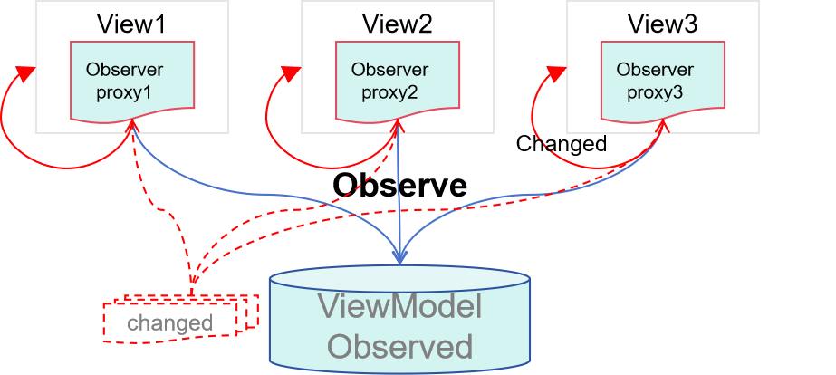

# 状态管理（推荐）概述

在了解现有状态管理框架的基础上，ArkUI框架推出一种更加推荐使用的状态管理框架。

## 状态管理现状

现有状态管理框架使用代理观察数据，当创建一个状态变量时，同时也创建了一个数据代理观察者。该观察者可感知代理变化，但无法感知实际数据变化，因此在使用上有如下限制：

- 状态变量不能独立于UI存在，同一个数据被多个视图代理时，在其中一个视图的更改不会通知其他视图更新。
- 只能感知对象属性第一层的变化，无法做到深度观测和深度监听。
- 在更改对象中属性以及更改数组中元素的场景下存在冗余更新的问题。
- 装饰器间配合使用限制多，不易用。组件中没有明确状态变量的输入与输出，不利于组件化。

## 状态管理（推荐）介绍

新的状态管理框架将观察能力增强到数据本身，数据本身就是可观察的，更改数据会触发相应的视图的更新。相较于当前的状态管理框架，新框架有如下优点：

- 状态变量独立于UI，更改数据会触发相应视图的更新。

- 支持对象的深度观测和深度监听，且深度观测机制不影响观测性能。

- 支持对象中属性级精准更新及数组中元素的最小化更新。

- 装饰器易用性高、拓展性强，在组件中明确输入与输出，有利于组件化。

  

## 装饰器总览

新的状态管理框架提供了一套全新的装饰器。

- [\@ObservedV2](arkts-new-ObservedV2-and-Trace.md)：\@ObservedV2装饰器装饰class，使得被装饰的class具有深度监听的能力。\@ObservedV2和\@Trace配合使用可以使class中的属性具有深度观测的能力。
- [\@Trace](arkts-new-ObservedV2-and-Trace.md)：\@Trace装饰器装饰被\@ObservedV2装饰的class中的属性，被装饰的属性具有深度观测的能力。
- [\@Monitor](arkts-new-monitor.md)：\@Monitor装饰器用在被\@ObservedV2装饰的class中，使得被@Trace装饰的成员属性具有深度监听的能力。

## 使用限制

由于新的状态管理框架采用了和现有状态管理框架不同的实现，因此不能将新的状态管理框架和现有状态管理框架混合使用，这项限制包括如下场景：

- 将新装饰器装饰的变量传递给现有装饰器装饰的变量。
- 将现有装饰器[\@Observed](arkts-observed-and-objectlink.md)、[\@Track](arkts-track.md)与新装饰器[\@ObservedV2](arkts-new-ObservedV2-and-Trace.md)、[\@Trace](arkts-new-ObservedV2-and-Trace.md)混合使用。

将新装饰器与现有装饰器混合使用，会出现未定义行为，表现为冗余刷新、失去深度观测能力、失去自身属性观测能力、失去属性级更新能力等。因此，不能将新的状态管理框架与现有状态管理框架混合使用。