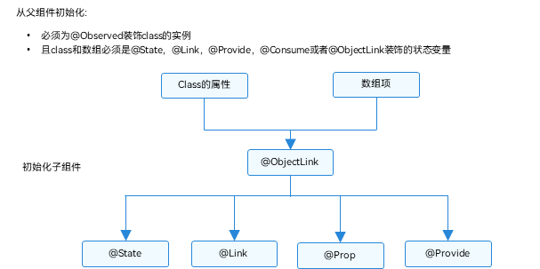
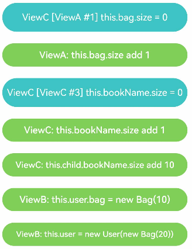
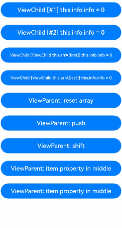
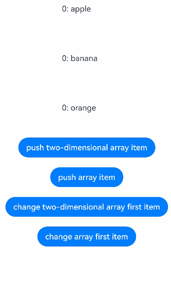
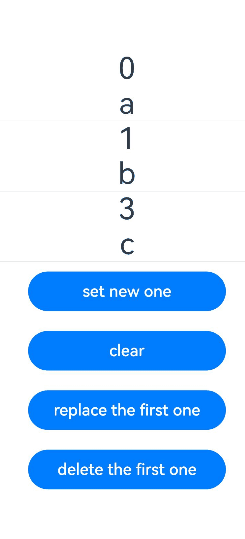
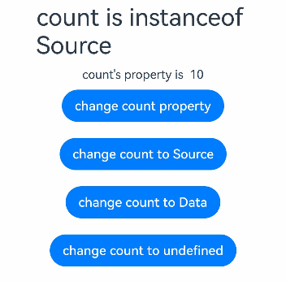
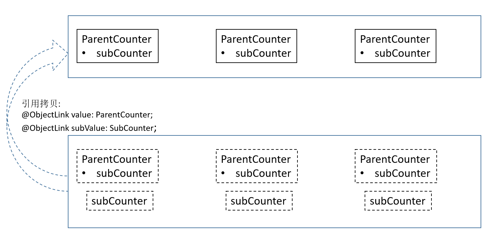

# \@Observed装饰器和\@ObjectLink装饰器：嵌套类对象属性变化


上文所述的装饰器仅能观察到第一层的变化，但是在实际应用开发中，应用会根据开发需要，封装自己的数据模型。对于多层嵌套的情况，比如二维数组，或者数组项class，或者class的属性是class，他们的第二层的属性变化是无法观察到的。这就引出了\@Observed/\@ObjectLink装饰器。

\@Observed/\@ObjectLink配套使用是用于嵌套场景的观察，主要是为了弥补装饰器仅能观察一层的能力限制，开发者最好对装饰器的基本观察能力有一定的了解，再来对比阅读该文档。建议提前阅读：[\@State](./arkts-state.md)的基本用法。

> **说明：**
>
> 从API version 9开始，这两个装饰器支持在ArkTS卡片中使用。
>
> 从API version 11开始，这两个装饰器支持在原子化服务中使用。

## 概述

\@ObjectLink和\@Observed类装饰器用于在涉及嵌套对象或数组的场景中进行双向数据同步：

- 使用new创建被\@Observed装饰的类，可以被观察到属性的变化；

- 子组件中\@ObjectLink装饰器装饰的状态变量用于接收\@Observed装饰的类的实例，和父组件中对应的状态变量建立双向数据绑定。这个实例可以是数组中的被\@Observed装饰的项，或者是class object中的属性，这个属性同样也需要被\@Observed装饰。

- \@Observed用于嵌套类场景中，观察对象类属性变化，要配合自定义组件使用（示例详见[嵌套对象](#嵌套对象)），如果要做数据双/单向同步，需要搭配\@ObjectLink或者\@Prop使用（示例详见[\@Prop与\@ObjectLink的差异](#prop与objectlink的差异)）。


## 装饰器说明

| \@Observed类装饰器 | 说明                                |
| -------------- | --------------------------------- |
| 装饰器参数          | 无                                 |
| 类装饰器           | 装饰class。需要放在class的定义前，使用new创建类对象。 |

| \@ObjectLink变量装饰器 | 说明                                       |
| ----------------- | ---------------------------------------- |
| 装饰器参数             | 无                                        |
| 允许装饰的变量类型         | 必须为被\@Observed装饰的class实例，必须指定类型。<br/>\@ObjectLink不支持简单类型，如果开发者需要使用简单类型，可以使用[\@Prop](arkts-prop.md)。<br/>支持继承Date、[Array](#二维数组)的class实例，API11及以上支持继承[Map](#继承map类)、[Set](#继承set类)的class实例。示例见[观察变化](#观察变化)。<br/>API11及以上支持\@Observed装饰类和undefined或null组成的联合类型，比如ClassA \| ClassB, ClassA \| undefined 或者 ClassA \| null, 示例见[@ObjectLink支持联合类型](#objectlink支持联合类型)。<br/>\@ObjectLink的属性是可以改变的，但是变量的分配是不允许的，也就是说这个装饰器装饰变量是只读的，不能被改变。 |
| 被装饰变量的初始值         | 不允许。                                     |

\@ObjectLink装饰的数据为可读示例。


```ts
// 允许@ObjectLink装饰的数据属性赋值
this.objLink.a= ...
// 不允许@ObjectLink装饰的数据自身赋值
this.objLink= ...
```

> **说明：**
>
> \@ObjectLink装饰的变量不能被赋值，如果要使用赋值操作，请使用[@Prop](arkts-prop.md)。
>
> - \@Prop装饰的变量和数据源的关系是是单向同步，\@Prop装饰的变量在本地拷贝了数据源，所以它允许本地更改，如果父组件中的数据源有更新，\@Prop装饰的变量本地的修改将被覆盖；
>
> - \@ObjectLink装饰的变量和数据源的关系是双向同步，\@ObjectLink装饰的变量相当于指向数据源的指针。禁止对\@ObjectLink装饰的变量赋值，如果一旦发生\@ObjectLink装饰的变量的赋值，则同步链将被打断。因为\@ObjectLink装饰的变量通过数据源（Object）引用来初始化。对于实现双向数据同步的@ObjectLink，赋值相当于更新父组件中的数组项或者class的属性，TypeScript/JavaScript不能实现，会发生运行时报错。


## 变量的传递/访问规则说明

| \@ObjectLink传递/访问 | 说明                                       |
| ----------------- | ---------------------------------------- |
| 从父组件初始化           | 必须指定。<br/>初始化\@ObjectLink装饰的变量必须同时满足以下场景：<br/>-&nbsp;类型必须是\@Observed装饰的class。<br/>-&nbsp;初始化的数值需要是数组项，或者class的属性。<br/>-&nbsp;同步源的class或者数组必须是[\@State](./arkts-state.md)，[\@Link](./arkts-link.md)，[\@Provide](./arkts-provide-and-consume.md)，[\@Consume](./arkts-provide-and-consume.md)或者\@ObjectLink装饰的数据。<br/>同步源是数组项的示例请参考[对象数组](#对象数组)。初始化的class的示例请参考[嵌套对象](#嵌套对象)。 |
| 与源对象同步            | 双向。                                      |
| 可以初始化子组件          | 允许，可用于初始化常规变量、\@State、\@Link、\@Prop、\@Provide |


  **图1** 初始化规则图示  





## 观察变化和行为表现


### 观察变化

\@Observed装饰的类，如果其属性为非简单类型，比如class、Object或者数组，也需要被\@Observed装饰，否则将观察不到其属性的变化。


```ts
class Child {
  public num: number;

  constructor(num: number) {
    this.num = num;
  }
}

@Observed
class Parent {
  public child: Child;
  public count: number;

  constructor(child: Child, count: number) {
    this.child = child;
    this.count = count;
  }
}
```

以上示例中，Parent被\@Observed装饰，其成员变量的赋值的变化是可以被观察到的，但对于Child，没有被\@Observed装饰，其属性的修改不能被观察到。


```ts
@ObjectLink parent: Parent

// 赋值变化可以被观察到
this.parent.child = new Child(5)
this.parent.count = 5

// Child没有被@Observed装饰，其属性的变化观察不到
this.parent.child.num = 5
```

\@ObjectLink：\@ObjectLink只能接收被\@Observed装饰class的实例，推荐设计单独的自定义组件来渲染每一个数组或对象。此时，对象数组或嵌套对象（属性是对象的对象称为嵌套对象）需要两个自定义组件，一个自定义组件呈现外部数组/对象，另一个自定义组件呈现嵌套在数组/对象内的类对象。可以观察到：

- 其属性的数值的变化，其中属性是指Object.keys(observedObject)返回的所有属性，示例请参考[嵌套对象](#嵌套对象)。

- 如果数据源是数组，则可以观察到数组item的替换，如果数据源是class，可观察到class的属性的变化，示例请参考[对象数组](#对象数组)。

继承Date的class时，可以观察到Date整体的赋值，同时可通过调用Date的接口`setFullYear`, `setMonth`, `setDate`, `setHours`, `setMinutes`, `setSeconds`, `setMilliseconds`, `setTime`, `setUTCFullYear`, `setUTCMonth`, `setUTCDate`, `setUTCHours`, `setUTCMinutes`, `setUTCSeconds`, `setUTCMilliseconds` 更新Date的属性。

```ts
@Observed
class DateClass extends Date {
  constructor(args: number | string) {
    super(args)
  }
}

@Observed
class NewDate {
  public data: DateClass;

  constructor(data: DateClass) {
    this.data = data;
  }
}

@Component
struct Child {
  label: string = 'date';
  @ObjectLink data: DateClass;

  build() {
    Column() {
      Button(`child increase the day by 1`)
        .onClick(() => {
          this.data.setDate(this.data.getDate() + 1);
        })
      DatePicker({
        start: new Date('1970-1-1'),
        end: new Date('2100-1-1'),
        selected: this.data
      })
    }
  }
}

@Entry
@Component
struct Parent {
  @State newData: NewDate = new NewDate(new DateClass('2023-1-1'));

  build() {
    Column() {
      Child({ label: 'date', data: this.newData.data })

      Button(`parent update the new date`)
        .onClick(() => {
          this.newData.data = new DateClass('2023-07-07');
        })
      Button(`ViewB: this.newData = new NewDate(new DateClass('2023-08-20'))`)
        .onClick(() => {
          this.newData = new NewDate(new DateClass('2023-08-20'));
        })
    }
  }
}
```

继承Map的class时，可以观察到Map整体的赋值，同时可通过调用Map的接口`set`, `clear`, `delete` 更新Map的值。详见[继承Map类](#继承map类)。

继承Set的class时，可以观察到Set整体的赋值，同时可通过调用Set的接口`add`, `clear`, `delete` 更新Set的值。详见[继承Set类](#继承set类)。


### 框架行为

1. 初始渲染：
   1. \@Observed装饰的class的实例会被不透明的代理对象包装，代理了class上的属性的setter和getter方法
   2. 子组件中\@ObjectLink装饰的从父组件初始化，接收被\@Observed装饰的class的实例，\@ObjectLink的包装类会将自己注册给\@Observed class。

2. 属性更新：当\@Observed装饰的class属性改变时，会执行到代理的setter和getter，然后遍历依赖它的\@ObjectLink包装类，通知数据更新。


## 限制条件

1. 使用\@Observed装饰class会改变class原始的原型链，\@Observed和其他类装饰器装饰同一个class可能会带来问题。

2. \@ObjectLink装饰器不能在\@Entry装饰的自定义组件中使用。

3. \@ObjectLink装饰的变量类型需要为显式的被@Observed装饰的类，如果未指定类型，或其不是\@Observed装饰的class，编译期会报错。

```ts
@Observed
class Info {
  count: number;

  constructor(count: number) {
    this.count = count;
  }
}

class Test {
  msg: number;

  constructor(msg: number) {
    this.msg = msg;
  }
}

// 错误写法，编译报错
@ObjectLink count;
@ObjectLink test: Test;

// 正确写法
@ObjectLink count: Info;
```

4. \@ObjectLink装饰的变量不能本地初始化，仅能通过构造参数从父组件传入初始值，否则编译期会报错。

```ts
@Observed
class Info {
  count: number;

  constructor(count: number) {
    this.count = count;
  }
}

// 错误写法，编译报错
@ObjectLink count: Info = new Info(10);

// 正确写法
@ObjectLink count: Info;
```

5. \@ObjectLink装饰的变量是只读的，不能被赋值，否则会有运行时报错提示Cannot set property when setter is undefined。如果需要对\@ObjectLink装饰的变量进行整体替换，可以在父组件对其进行整体替换。

【反例】

```ts
@Observed
class Info {
  count: number;

  constructor(count: number) {
    this.count = count;
  }
}

@Component
struct Child {
  @ObjectLink num: Info;

  build() {
    Column() {
      Text(`num的值: ${this.num.count}`)
        .onClick(() => {
          // 错误写法，@ObjectLink装饰的变量不能被赋值
          this.num = new Info(10);
        })
    }
  }
}

@Entry
@Component
struct Parent {
  @State num: Info = new Info(10);

  build() {
    Column() {
      Text(`count的值: ${this.num}`)
      Child({num: this.num})
    }
  }
}
```

【正例】

```ts
@Observed
class Info {
  count: number;

  constructor(count: number) {
    this.count = count;
  }
}

@Component
struct Child {
  @ObjectLink num: Info;

  build() {
    Column() {
      Text(`num的值: ${this.num.count}`)
        .onClick(() => {
          // 正确写法，可以更改@ObjectLink装饰变量的成员属性
          this.num.count = 20;
        })
    }
  }
}

@Entry
@Component
struct Parent {
  @State num: Info = new Info(10);

  build() {
    Column() {
      Text(`count的值: ${this.num}`)
      Button('click')
        .onClick(() => {
          // 可以在父组件做整体替换
          this.num = new Info(30);
        })
      Child({num: this.num})
    }
  }
}
```


## 使用场景


### 嵌套对象

> **说明：**
>
> NextID是用来在[ForEach循环渲染](./arkts-rendering-control-foreach.md)过程中，为每个数组元素生成一个唯一且持久的键值，用于标识对应的组件。


```ts
// objectLinkNestedObjects.ets
let NextID: number = 1;

@Observed
class Bag {
  public id: number;
  public size: number;

  constructor(size: number) {
    this.id = NextID++;
    this.size = size;
  }
}

@Observed
class User {
  public bag: Bag;

  constructor(bag: Bag) {
    this.bag = bag;
  }
}

@Observed
class Book {
  public bookName: BookName;

  constructor(bookName: BookName) {
    this.bookName = bookName;
  }
}

@Observed
class BookName extends Bag {
  public nameSize: number;

  constructor(nameSize: number) {
    // 调用父类方法对nameSize进行处理
    super(nameSize);
    this.nameSize = nameSize;
  }
}

@Component
struct ViewA {
  label: string = 'ViewA';
  @ObjectLink bag: Bag;

  build() {
    Column() {
      Text(`ViewA [${this.label}] this.bag.size = ${this.bag.size}`)
        .fontColor('#ffffffff')
        .backgroundColor('#ff3d9dba')
        .width(320)
        .height(50)
        .borderRadius(25)
        .margin(10)
        .textAlign(TextAlign.Center)
      Button(`ViewA: this.bag.size add 1`)
        .width(320)
        .backgroundColor('#ff17a98d')
        .margin(10)
        .onClick(() => {
          this.bag.size += 1;
        })
    }
  }
}

@Component
struct ViewC {
  label: string = 'ViewC1';
  @ObjectLink bookName: BookName;

  build() {
    Row() {
      Column() {
        Text(`ViewC [${this.label}] this.bookName.size = ${this.bookName.size}`)
          .fontColor('#ffffffff')
          .backgroundColor('#ff3d9dba')
          .width(320)
          .height(50)
          .borderRadius(25)
          .margin(10)
          .textAlign(TextAlign.Center)
        Button(`ViewC: this.bookName.size add 1`)
          .width(320)
          .backgroundColor('#ff17a98d')
          .margin(10)
          .onClick(() => {
            this.bookName.size += 1;
            console.log('this.bookName.size:' + this.bookName.size)
          })
      }
      .width(320)
    }
  }
}

@Entry
@Component
struct ViewB {
  @State user: User = new User(new Bag(0));
  @State child: Book = new Book(new BookName(0));

  build() {
    Column() {
      ViewA({ label: 'ViewA #1', bag: this.user.bag })
        .width(320)
      ViewC({ label: 'ViewC #3', bookName: this.child.bookName })
        .width(320)
      Button(`ViewB: this.child.bookName.size add 10`)
        .width(320)
        .backgroundColor('#ff17a98d')
        .margin(10)
        .onClick(() => {
          this.child.bookName.size += 10
          console.log('this.child.bookName.size:' + this.child.bookName.size)
        })
      Button(`ViewB: this.user.bag = new Bag(10)`)
        .width(320)
        .backgroundColor('#ff17a98d')
        .margin(10)
        .onClick(() => {
          this.user.bag = new Bag(10);
        })
      Button(`ViewB: this.user = new User(new Bag(20))`)
        .width(320)
        .backgroundColor('#ff17a98d')
        .margin(10)
        .onClick(() => {
          this.user = new User(new Bag(20));
        })
    }
  }
}
```



被@Observed装饰的BookName类，可以观测到继承基类的属性的变化。


ViewB中的事件句柄：


- this.user.bag = new Bag(10) 和this.user = new User(new Bag(20))： 对@State装饰的变量size和其属性的修改。

- this.child.bookName.size += ... ：该变化属于第二层的变化，@State无法观察到第二层的变化，但是Bag被\@Observed装饰，Bag的属性size的变化可以被\@ObjectLink观察到。


ViewC中的事件句柄：


- this.bookName.size += 1：对\@ObjectLink变量size的修改，将触发Button组件的刷新。\@ObjectLink和\@Prop不同，\@ObjectLink不拷贝来自父组件的数据源，而是在本地构建了指向其数据源的引用。

- \@ObjectLink变量是只读的，this.bookName = new bookName(...)是不允许的，因为一旦赋值操作发生，指向数据源的引用将被重置，同步将被打断。


### 对象数组

对象数组是一种常用的数据结构。以下示例展示了数组对象的用法。


```ts
let NextID: number = 1;

@Observed
class Info {
  public id: number;
  public info: number;

  constructor(info: number) {
    this.id = NextID++;
    this.info = info;
  }
}

@Component
struct Child {
  // 子组件Child的@ObjectLink的类型是Info
  @ObjectLink info: Info;
  label: string = 'ViewChild';

  build() {
    Row() {
      Button(`ViewChild [${this.label}] this.info.info = ${this.info ? this.info.info : "undefined"}`)
        .width(320)
        .margin(10)
        .onClick(() => {
          this.info.info += 1;
        })
    }
  }
}

@Entry
@Component
struct Parent {
  // Parent中有@State装饰的Info[]
  @State arrA: Info[] = [new Info(0), new Info(0)];

  build() {
    Column() {
      ForEach(this.arrA,
        (item: Info) => {
          Child({ label: `#${item.id}`, info: item })
        },
        (item: Info): string => item.id.toString()
      )
      // 使用@State装饰的数组的数组项初始化@ObjectLink，其中数组项是被@Observed装饰的Info的实例
      Child({ label: `ViewChild this.arrA[first]`, info: this.arrA[0] })
      Child({ label: `ViewChild this.arrA[last]`, info: this.arrA[this.arrA.length-1] })

      Button(`ViewParent: reset array`)
        .width(320)
        .margin(10)
        .onClick(() => {
          this.arrA = [new Info(0), new Info(0)];
        })
      Button(`ViewParent: push`)
        .width(320)
        .margin(10)
        .onClick(() => {
          this.arrA.push(new Info(0))
        })
      Button(`ViewParent: shift`)
        .width(320)
        .margin(10)
        .onClick(() => {
          if (this.arrA.length > 0) {
            this.arrA.shift()
          } else {
            console.log("length <= 0")
          }
        })
      Button(`ViewParent: item property in middle`)
        .width(320)
        .margin(10)
        .onClick(() => {
          this.arrA[Math.floor(this.arrA.length / 2)].info = 10;
        })
      Button(`ViewParent: item property in middle`)
        .width(320)
        .margin(10)
        .onClick(() => {
          this.arrA[Math.floor(this.arrA.length / 2)] = new Info(11);
        })
    }
  }
}
```



- this.arrA[Math.floor(this.arrA.length/2)] = new Info(..) ：该状态变量的改变触发2次更新：
  1. ForEach：数组项的赋值导致ForEach的[itemGenerator](../reference/apis-arkui/arkui-ts/ts-rendering-control-foreach.md)被修改，因此数组项被识别为有更改，ForEach的item builder将执行，创建新的Child组件实例。
  2. Child({ label: `ViewChild this.arrA[last]`, info: this.arrA[this.arrA.length-1] })：上述更改改变了数组中第二个元素，所以绑定this.arrA[1]的Child将被更新。

- this.arrA.push(new Info(0)) ： 将触发2次不同效果的更新：
  1. ForEach：新添加的Info对象对于ForEach是未知的[itemGenerator](../reference/apis-arkui/arkui-ts/ts-rendering-control-foreach.md)，ForEach的item builder将执行，创建新的Child组件实例。
  2. Child({ label: `ViewChild this.arrA[last]`, info: this.arrA[this.arrA.length-1] })：数组的最后一项有更改，因此引起第二个Child的实例的更改。对于Child({ label: `ViewChild this.arrA[first]`, info: this.arrA[0] })，数组的更改并没有触发一个数组项更改的改变，所以第一个Child不会刷新。

- this.arrA[Math.floor(this.arrA.length/2)].info：@State无法观察到第二层的变化，但是Info被\@Observed装饰，Info的属性的变化将被\@ObjectLink观察到。


### 二维数组

使用\@Observed观察二维数组的变化。可以声明一个被\@Observed装饰的继承Array的子类。


```ts
@Observed
class StringArray extends Array<string> {
}
```

使用new StringArray()来构造StringArray的实例，new运算符使得\@Observed生效，\@Observed观察到StringArray的属性变化。

声明一个从Array扩展的类class StringArray extends Array&lt;string&gt; {}，并创建StringArray的实例。\@Observed装饰的类需要使用new运算符来构建class实例。


```ts
@Observed
class StringArray extends Array<string> {
}

@Component
struct ItemPage {
  @ObjectLink itemArr: StringArray;

  build() {
    Row() {
      Text('ItemPage')
        .width(100).height(100)

      ForEach(this.itemArr,
        (item: string | Resource) => {
          Text(item)
            .width(100).height(100)
        },
        (item: string) => item
      )
    }
  }
}

@Entry
@Component
struct IndexPage {
  @State arr: Array<StringArray> = [new StringArray(), new StringArray(), new StringArray()];

  build() {
    Column() {
      ItemPage({ itemArr: this.arr[0] })
      ItemPage({ itemArr: this.arr[1] })
      ItemPage({ itemArr: this.arr[2] })
      Divider()


      ForEach(this.arr,
        (itemArr: StringArray) => {
          ItemPage({ itemArr: itemArr })
        },
        (itemArr: StringArray) => itemArr[0]
      )

      Divider()

      Button('update')
        .onClick(() => {
          console.error('Update all items in arr');
          if ((this.arr[0] as StringArray)[0] !== undefined) {
            // 正常情况下需要有一个真实的ID来与ForEach一起使用，但此处没有
            // 因此需要确保推送的字符串是唯一的。
            this.arr[0].push(`${this.arr[0].slice(-1).pop()}${this.arr[0].slice(-1).pop()}`);
            this.arr[1].push(`${this.arr[1].slice(-1).pop()}${this.arr[1].slice(-1).pop()}`);
            this.arr[2].push(`${this.arr[2].slice(-1).pop()}${this.arr[2].slice(-1).pop()}`);
          } else {
            this.arr[0].push('Hello');
            this.arr[1].push('World');
            this.arr[2].push('!');
          }
        })
    }
  }
}
```



### 继承Map类

> **说明：**
>
> 从API version 11开始，\@ObjectLink支持\@Observed装饰Map类型和继承Map类的类型。

在下面的示例中，myMap类型为MyMap\<number, string\>，点击Button改变myMap的属性，视图会随之刷新。

```ts
@Observed
class Info {
  public info: MyMap<number, string>;

  constructor(info: MyMap<number, string>) {
    this.info = info;
  }
}


@Observed
export class MyMap<K, V> extends Map<K, V> {
  public name: string;

  constructor(name?: string, args?: [K, V][]) {
    super(args);
    this.name = name ? name : "My Map";
  }

  getName() {
    return this.name;
  }
}

@Entry
@Component
struct MapSampleNested {
  @State message: Info = new Info(new MyMap("myMap", [[0, "a"], [1, "b"], [3, "c"]]));

  build() {
    Row() {
      Column() {
        MapSampleNestedChild({ myMap: this.message.info })
      }
      .width('100%')
    }
    .height('100%')
  }
}

@Component
struct MapSampleNestedChild {
  @ObjectLink myMap: MyMap<number, string>

  build() {
    Row() {
      Column() {
        ForEach(Array.from(this.myMap.entries()), (item: [number, string]) => {
          Text(`${item[0]}`).fontSize(30)
          Text(`${item[1]}`).fontSize(30)
          Divider().strokeWidth(5)
        })

        Button('set new one')
          .width(200)
          .margin(10)
          .onClick(() => {
            this.myMap.set(4, "d")
          })
        Button('clear')
          .width(200)
          .margin(10)
          .onClick(() => {
            this.myMap.clear()
          })
        Button('replace the first one')
          .width(200)
          .margin(10)
          .onClick(() => {
            this.myMap.set(0, "aa")
          })
        Button('delete the first one')
          .width(200)
          .margin(10)
          .onClick(() => {
            this.myMap.delete(0)
          })
      }
      .width('100%')
    }
    .height('100%')
  }
}
```



### 继承Set类

> **说明：**
>
> 从API version 11开始，\@ObjectLink支持\@Observed装饰Set类型和继承Set类的类型。

在下面的示例中，mySet类型为MySet\<number\>，点击Button改变mySet的属性，视图会随之刷新。

```ts
@Observed
class Info {
  public info: MySet<number>;

  constructor(info: MySet<number>) {
    this.info = info;
  }
}


@Observed
export class MySet<T> extends Set<T> {
  public name: string;

  constructor(name?: string, args?: T[]) {
    super(args);
    this.name = name ? name : "My Set";
  }

  getName() {
    return this.name;
  }
}

@Entry
@Component
struct SetSampleNested {
  @State message: Info = new Info(new MySet("Set", [0, 1, 2, 3, 4]));

  build() {
    Row() {
      Column() {
        SetSampleNestedChild({ mySet: this.message.info })
      }
      .width('100%')
    }
    .height('100%')
  }
}

@Component
struct SetSampleNestedChild {
  @ObjectLink mySet: MySet<number>

  build() {
    Row() {
      Column() {
        ForEach(Array.from(this.mySet.entries()), (item: [number, number]) => {
          Text(`${item}`).fontSize(30)
          Divider()
        })
        Button('set new one')
          .width(200)
          .margin(10)
          .onClick(() => {
            this.mySet.add(5)
          })
        Button('clear')
          .width(200)
          .margin(10)
          .onClick(() => {
            this.mySet.clear()
          })
        Button('delete the first one')
          .width(200)
          .margin(10)
          .onClick(() => {
            this.mySet.delete(0)
          })
      }
      .width('100%')
    }
    .height('100%')
  }
}
```


## ObjectLink支持联合类型

@ObjectLink支持@Observed装饰类和undefined或null组成的联合类型，在下面的示例中，count类型为Source | Data | undefined，点击父组件Parent中的Button改变count的属性或者类型，Child中也会对应刷新。

```ts
@Observed
class Source {
  public source: number;

  constructor(source: number) {
    this.source = source;
  }
}

@Observed
class Data {
  public data: number;

  constructor(data: number) {
    this.data = data;
  }
}

@Entry
@Component
struct Parent {
  @State count: Source | Data | undefined = new Source(10)

  build() {
    Column() {
      Child({ count: this.count })

      Button('change count property')
        .onClick(() => {
          // 判断count的类型，做属性的更新
          if (this.count instanceof Source) {
            this.count.source += 1
          } else if (this.count instanceof Data) {
            this.count.data += 1
          } else {
            console.info('count is undefined, cannot change property')
          }
        })

      Button('change count to Source')
        .onClick(() => {
          // 赋值为Source的实例
          this.count = new Source(100)
        })

      Button('change count to Data')
        .onClick(() => {
          // 赋值为Data的实例
          this.count = new Data(100)
        })

      Button('change count to undefined')
        .onClick(() => {
          // 赋值为undefined
          this.count = undefined
        })
    }.width('100%')
  }
}

@Component
struct Child {
  @ObjectLink count: Source | Data | undefined

  build() {
    Column() {
      Text(`count is instanceof ${this.count instanceof Source ? 'Source' :
        this.count instanceof Data ? 'Data' : 'undefined'}`)
        .fontSize(30)

      Text(`count's property is  ${this.count instanceof Source ? this.count.source : this.count?.data}`).fontSize(15)

    }.width('100%')
  }
}
```



## 常见问题

### 在子组件中给@ObjectLink装饰的变量赋值

在子组件中给@ObjectLink装饰的变量赋值是不允许的。

【反例】

```ts
@Observed
class Info {
  public info: number = 0;

  constructor(info: number) {
    this.info = info;
  }
}

@Component
struct ObjectLinkChild {
  @ObjectLink testNum: Info;

  build() {
    Text(`ObjectLinkChild testNum ${this.testNum.info}`)
      .onClick(() => {
        // ObjectLink不能被赋值
        this.testNum = new Info(47);
      })
  }
}

@Entry
@Component
struct Parent {
  @State testNum: Info[] = [new Info(1)];

  build() {
    Column() {
      Text(`Parent testNum ${this.testNum[0].info}`)
        .onClick(() => {
          this.testNum[0].info += 1;
        })

      ObjectLinkChild({ testNum: this.testNum[0] })
    }
  }
}
```

点击ObjectLinkChild给\@ObjectLink装饰的变量赋值：

```
this.testNum = new Info(47); 
```

这是不允许的，对于实现双向数据同步的\@ObjectLink，赋值相当于要更新父组件中的数组项或者class的属性，这个对于 TypeScript/JavaScript是不能实现的。框架对于这种行为会发生运行时报错。

【正例】

```ts
@Observed
class Info {
  public info: number = 0;

  constructor(info: number) {
    this.info = info;
  }
}

@Component
struct ObjectLinkChild {
  @ObjectLink testNum: Info;

  build() {
    Text(`ObjectLinkChild testNum ${this.testNum.info}`)
      .onClick(() => {
        // 可以对ObjectLink装饰对象的属性赋值
        this.testNum.info = 47;
      })
  }
}

@Entry
@Component
struct Parent {
  @State testNum: Info[] = [new Info(1)];

  build() {
    Column() {
      Text(`Parent testNum ${this.testNum[0].info}`)
        .onClick(() => {
          this.testNum[0].info += 1;
        })

      ObjectLinkChild({ testNum: this.testNum[0] })
    }
  }
}
```

### 基础嵌套对象属性更改失效

在应用开发中，有很多嵌套对象场景，例如，开发者更新了某个属性，但UI没有进行对应的更新。

每个装饰器都有自己可以观察的能力，并不是所有的改变都可以被观察到，只有可以被观察到的变化才会进行UI更新。\@Observed装饰器可以观察到嵌套对象的属性变化，其他装饰器仅能观察到第一层的变化。

【反例】

下面的例子中，一些UI组件并不会更新。


```ts
class Parent {
  parentId: number;

  constructor(parentId: number) {
    this.parentId = parentId;
  }

  getParentId(): number {
    return this.parentId;
  }

  setParentId(parentId: number): void {
    this.parentId = parentId;
  }
}

class Child {
  childId: number;

  constructor(childId: number) {
    this.childId = childId;
  }

  getChildId(): number {
    return this.childId;
  }

  setChildId(childId: number): void {
    this.childId = childId;
  }
}

class Cousin extends Parent {
  cousinId: number = 47;
  child: Child;

  constructor(parentId: number, cousinId: number, childId: number) {
    super(parentId);
    this.cousinId = cousinId;
    this.child = new Child(childId);
  }

  getCousinId(): number {
    return this.cousinId;
  }

  setCousinId(cousinId: number): void {
    this.cousinId = cousinId;
  }

  getChild(): number {
    return this.child.getChildId();
  }

  setChild(childId: number): void {
    return this.child.setChildId(childId);
  }
}

@Entry
@Component
struct MyView {
  @State cousin: Cousin = new Cousin(10, 20, 30);

  build() {
    Column({ space: 10 }) {
      Text(`parentId: ${this.cousin.parentId}`)
      Button("Change Parent.parent")
        .onClick(() => {
          this.cousin.parentId += 1;
        })

      Text(`cousinId: ${this.cousin.cousinId}`)
      Button("Change Cousin.cousinId")
        .onClick(() => {
          this.cousin.cousinId += 1;
        })

      Text(`childId: ${this.cousin.child.childId}`)
      Button("Change Cousin.Child.childId")
        .onClick(() => {
          // 点击时上面的Text组件不会刷新
          this.cousin.child.childId += 1;
        })
    }
  }
}
```

- 最后一个Text组件Text('child: ${this.cousin.child.childId}')，当点击该组件时UI不会刷新。 因为，\@State cousin : Cousin 只能观察到this.cousin属性的变化，比如this.cousin.parentId, this.cousin.cousinId 和this.cousin.child的变化，但是无法观察嵌套在属性中的属性，即this.cousin.child.childId（属性childId是内嵌在cousin中的对象Child的属性）。

- 为了观察到嵌套于内部的Child的属性，需要做如下改变：
  - 构造一个子组件，用于单独渲染Child的实例。 该子组件可以使用\@ObjectLink child : Child或\@Prop child : Child。通常会使用\@ObjectLink，除非子组件需要对其Child对象进行本地修改。
  - 嵌套的Child必须用\@Observed装饰。当在Cousin中创建Child对象时（本示例中的Cousin(10, 20, 30）)，它将被包装在ES6代理中，当Child属性更改时（this.cousin.child.childId += 1），该代码将修改通知到\@ObjectLink变量。

【正例】

以下示例使用\@Observed/\@ObjectLink来观察嵌套对象的属性更改。


```ts
class Parent {
  parentId: number;

  constructor(parentId: number) {
    this.parentId = parentId;
  }

  getParentId(): number {
    return this.parentId;
  }

  setParentId(parentId: number): void {
    this.parentId = parentId;
  }
}

@Observed
class Child {
  childId: number;

  constructor(childId: number) {
    this.childId = childId;
  }

  getChildId(): number {
    return this.childId;
  }

  setChildId(childId: number): void {
    this.childId = childId;
  }
}

class Cousin extends Parent {
  cousinId: number = 47;
  child: Child;

  constructor(parentId: number, cousinId: number, childId: number) {
    super(parentId);
    this.cousinId = cousinId;
    this.child = new Child(childId);
  }

  getCousinId(): number {
    return this.cousinId;
  }

  setCousinId(cousinId: number): void {
    this.cousinId = cousinId;
  }

  getChild(): number {
    return this.child.getChildId();
  }

  setChild(childId: number): void {
    return this.child.setChildId(childId);
  }
}

@Component
struct ViewChild {
  @ObjectLink child: Child;

  build() {
    Column({ space: 10 }) {
      Text(`childId: ${this.child.getChildId()}`)
      Button("Change childId")
        .onClick(() => {
          this.child.setChildId(this.child.getChildId() + 1);
        })
    }
  }
}

@Entry
@Component
struct MyView {
  @State cousin: Cousin = new Cousin(10, 20, 30);

  build() {
    Column({ space: 10 }) {
      Text(`parentId: ${this.cousin.parentId}`)
      Button("Change Parent.parentId")
        .onClick(() => {
          this.cousin.parentId += 1;
        })

      Text(`cousinId: ${this.cousin.cousinId}`)
      Button("Change Cousin.cousinId")
        .onClick(() => {
          this.cousin.cousinId += 1;
        })

      ViewChild({ child: this.cousin.child }) // Text(`childId: ${this.cousin.child.childId}`)的替代写法
      Button("Change Cousin.Child.childId")
        .onClick(() => {
          this.cousin.child.childId += 1;
        })
    }
  }
}
```

### 复杂嵌套对象属性更改失效

【反例】

以下示例创建了一个带有\@ObjectLink装饰变量的子组件，用于渲染一个含有嵌套属性的ParentCounter，用\@Observed装饰嵌套在ParentCounter中的SubCounter。


```ts
let nextId = 1;
@Observed
class SubCounter {
  counter: number;
  constructor(c: number) {
    this.counter = c;
  }
}
@Observed
class ParentCounter {
  id: number;
  counter: number;
  subCounter: SubCounter;
  incrCounter() {
    this.counter++;
  }
  incrSubCounter(c: number) {
    this.subCounter.counter += c;
  }
  setSubCounter(c: number): void {
    this.subCounter.counter = c;
  }
  constructor(c: number) {
    this.id = nextId++;
    this.counter = c;
    this.subCounter = new SubCounter(c);
  }
}
@Component
struct CounterComp {
  @ObjectLink value: ParentCounter;
  build() {
    Column({ space: 10 }) {
      Text(`${this.value.counter}`)
        .fontSize(25)
        .onClick(() => {
          this.value.incrCounter();
        })
      Text(`${this.value.subCounter.counter}`)
        .onClick(() => {
          this.value.incrSubCounter(1);
        })
      Divider().height(2)
    }
  }
}
@Entry
@Component
struct ParentComp {
  @State counter: ParentCounter[] = [new ParentCounter(1), new ParentCounter(2), new ParentCounter(3)];
  build() {
    Row() {
      Column() {
        CounterComp({ value: this.counter[0] })
        CounterComp({ value: this.counter[1] })
        CounterComp({ value: this.counter[2] })
        Divider().height(5)
        ForEach(this.counter,
          (item: ParentCounter) => {
            CounterComp({ value: item })
          },
          (item: ParentCounter) => item.id.toString()
        )
        Divider().height(5)
        // 第一个点击事件
        Text('Parent: incr counter[0].counter')
          .fontSize(20).height(50)
          .onClick(() => {
            this.counter[0].incrCounter();
            // 每次触发时自增10
            this.counter[0].incrSubCounter(10);
          })
        // 第二个点击事件
        Text('Parent: set.counter to 10')
          .fontSize(20).height(50)
          .onClick(() => {
            // 无法将value设置为10，UI不会刷新
            this.counter[0].setSubCounter(10);
          })
        Text('Parent: reset entire counter')
          .fontSize(20).height(50)
          .onClick(() => {
            this.counter = [new ParentCounter(1), new ParentCounter(2), new ParentCounter(3)];
          })
      }
    }
  }
}
```

对于Text('Parent: incr counter[0].counter')的onClick事件，this.counter[0].incrSubCounter(10)调用incrSubCounter方法使SubCounter的counter值增加10，UI同步刷新。

但是，在Text('Parent: set.counter to 10')的onClick中调用this.counter[0].setSubCounter(10)，SubCounter的counter值却无法重置为10。

incrSubCounter和setSubCounter都是同一个SubCounter的函数。在第一个点击处理时调用incrSubCounter可以正确更新UI，而第二个点击处理调用setSubCounter时却没有更新UI。实际上incrSubCounter和setSubCounter两个函数都不能触发Text('${this.value.subCounter.counter}')的更新，因为\@ObjectLink value : ParentCounter仅能观察其代理ParentCounter的属性，对于this.value.subCounter.counter是SubCounter的属性，无法观察到嵌套类的属性。

但是，第一个click事件调用this.counter[0].incrCounter()将CounterComp自定义组件中\@ObjectLink value: ParentCounter标记为已更改。此时触发Text('${this.value.subCounter.counter}')的更新。 如果在第一个点击事件中删除this.counter[0].incrCounter()，也无法更新UI。

【正例】

对于上述问题，为了直接观察SubCounter中的属性，以便this.counter[0].setSubCounter(10)操作有效，可以利用下面的方法：


```ts
CounterComp({ value: this.counter[0] }); // ParentComp组件传递 ParentCounter 给 CounterComp 组件
@ObjectLink value：ParentCounter; // @ObjectLink 接收 ParentCounter

CounterChild({ subValue: this.value.subCounter }); // CounterComp组件 传递 SubCounter 给 CounterChild 组件
@ObjectLink subValue：SubCounter; // @ObjectLink 接收 SubCounter
```

该方法使得\@ObjectLink分别代理了ParentCounter和SubCounter的属性，这样对于这两个类的属性的变化都可以观察到，即都会对UI视图进行刷新。即使删除了上面所说的this.counter[0].incrCounter()，UI也会进行正确的刷新。

该方法可用于实现“两个层级”的观察，即外部对象和内部嵌套对象的观察。但是该方法只能用于\@ObjectLink装饰器，无法作用于\@Prop（\@Prop通过深拷贝传入对象）。详情参考[@Prop与@ObjectLink的差异](#prop与objectlink的差异)。


```ts
let nextId = 1;

@Observed
class SubCounter {
  counter: number;

  constructor(c: number) {
    this.counter = c;
  }
}

@Observed
class ParentCounter {
  id: number;
  counter: number;
  subCounter: SubCounter;

  incrCounter() {
    this.counter++;
  }

  incrSubCounter(c: number) {
    this.subCounter.counter += c;
  }

  setSubCounter(c: number): void {
    this.subCounter.counter = c;
  }

  constructor(c: number) {
    this.id = nextId++;
    this.counter = c;
    this.subCounter = new SubCounter(c);
  }
}

@Component
struct CounterComp {
  @ObjectLink value: ParentCounter;

  build() {
    Column({ space: 10 }) {
      Text(`${this.value.counter}`)
        .fontSize(25)
        .onClick(() => {
          this.value.incrCounter();
        })
      CounterChild({ subValue: this.value.subCounter })
      Divider().height(2)
    }
  }
}

@Component
struct CounterChild {
  @ObjectLink subValue: SubCounter;

  build() {
    Text(`${this.subValue.counter}`)
      .onClick(() => {
        this.subValue.counter += 1;
      })
  }
}

@Entry
@Component
struct ParentComp {
  @State counter: ParentCounter[] = [new ParentCounter(1), new ParentCounter(2), new ParentCounter(3)];

  build() {
    Row() {
      Column() {
        CounterComp({ value: this.counter[0] })
        CounterComp({ value: this.counter[1] })
        CounterComp({ value: this.counter[2] })
        Divider().height(5)
        ForEach(this.counter,
          (item: ParentCounter) => {
            CounterComp({ value: item })
          },
          (item: ParentCounter) => item.id.toString()
        )
        Divider().height(5)
        Text('Parent: reset entire counter')
          .fontSize(20).height(50)
          .onClick(() => {
            this.counter = [new ParentCounter(1), new ParentCounter(2), new ParentCounter(3)];
          })
        Text('Parent: incr counter[0].counter')
          .fontSize(20).height(50)
          .onClick(() => {
            this.counter[0].incrCounter();
            this.counter[0].incrSubCounter(10);
          })
        Text('Parent: set.counter to 10')
          .fontSize(20).height(50)
          .onClick(() => {
            this.counter[0].setSubCounter(10);
          })
      }
    }
  }
}
```

### \@Prop与\@ObjectLink的差异

在下面的示例代码中，\@ObjectLink装饰的变量是对数据源的引用，即this.value.subCounter和this.subValue都是同一个对象的不同引用，所以在点击CounterComp的click handler，改变this.value.subCounter.counter时，this.subValue.counter也会改变，对应的组件Text(`this.subValue.counter: ${this.subValue.counter}`)会刷新。


```ts
let nextId = 1;

@Observed
class SubCounter {
  counter: number;

  constructor(c: number) {
    this.counter = c;
  }
}

@Observed
class ParentCounter {
  id: number;
  counter: number;
  subCounter: SubCounter;

  incrCounter() {
    this.counter++;
  }

  incrSubCounter(c: number) {
    this.subCounter.counter += c;
  }

  setSubCounter(c: number): void {
    this.subCounter.counter = c;
  }

  constructor(c: number) {
    this.id = nextId++;
    this.counter = c;
    this.subCounter = new SubCounter(c);
  }
}

@Component
struct CounterComp {
  @ObjectLink value: ParentCounter;

  build() {
    Column({ space: 10 }) {
      CountChild({ subValue: this.value.subCounter })
      Text(`this.value.counter：increase 7 `)
        .fontSize(30)
        .onClick(() => {
          // 点击后Text(`this.subValue.counter: ${this.subValue.counter}`)会刷新
          this.value.incrSubCounter(7);
        })
      Divider().height(2)
    }
  }
}

@Component
struct CountChild {
  @ObjectLink subValue: SubCounter;

  build() {
    Text(`this.subValue.counter: ${this.subValue.counter}`)
      .fontSize(30)
  }
}

@Entry
@Component
struct ParentComp {
  @State counter: ParentCounter[] = [new ParentCounter(1), new ParentCounter(2), new ParentCounter(3)];

  build() {
    Row() {
      Column() {
        CounterComp({ value: this.counter[0] })
        CounterComp({ value: this.counter[1] })
        CounterComp({ value: this.counter[2] })
        Divider().height(5)
        ForEach(this.counter,
          (item: ParentCounter) => {
            CounterComp({ value: item })
          },
          (item: ParentCounter) => item.id.toString()
        )
        Divider().height(5)
        Text('Parent: reset entire counter')
          .fontSize(20).height(50)
          .onClick(() => {
            this.counter = [new ParentCounter(1), new ParentCounter(2), new ParentCounter(3)];
          })
        Text('Parent: incr counter[0].counter')
          .fontSize(20).height(50)
          .onClick(() => {
            this.counter[0].incrCounter();
            this.counter[0].incrSubCounter(10);
          })
        Text('Parent: set.counter to 10')
          .fontSize(20).height(50)
          .onClick(() => {
            this.counter[0].setSubCounter(10);
          })
      }
    }
  }
}
```

\@ObjectLink图示如下：



【反例】

如果用\@Prop替代\@ObjectLink。点击Text(`this.subValue.counter: ${this.subValue.counter}`)，UI刷新正常。但是点击Text(`this.value.counter：increase 7 `)，\@Prop 对变量做了一个本地拷贝，CounterComp的第一个Text并不会刷新。

  this.value.subCounter和this.subValue并不是同一个对象。所以this.value.subCounter的改变，并没有改变this.subValue的拷贝对象，Text(`this.subValue.counter: ${this.subValue.counter}`)不会刷新。

```ts
@Component
struct CounterComp {
  @Prop value: ParentCounter = new ParentCounter(0);
  @Prop subValue: SubCounter = new SubCounter(0);
  build() {
    Column({ space: 10 }) {
      Text(`this.subValue.counter: ${this.subValue.counter}`)
        .fontSize(20)
        .onClick(() => {
          this.subValue.counter += 7;
        })
      Text(`this.value.counter：increase 7 `)
        .fontSize(20)
        .onClick(() => {
          this.value.incrSubCounter(7);
        })
      Divider().height(2)
    }
  }
}
```

\@Prop拷贝的关系图示如下：


【正例】

可以通过从ParentComp到CounterComp仅拷贝一份\@Prop value: ParentCounter，同时必须避免再多拷贝一份SubCounter。

- 在CounterComp组件中只使用一个\@Prop counter：Counter。

- 添加另一个子组件SubCounterComp，其中包含\@ObjectLink subCounter: SubCounter。此\@ObjectLink可确保观察到SubCounter对象属性更改，并且UI更新正常。

- \@ObjectLink subCounter: SubCounter与CounterComp中的\@Prop counter：Counter的this.counter.subCounter共享相同的SubCounter对象。

  

```ts
let nextId = 1;

@Observed
class SubCounter {
  counter: number;
  constructor(c: number) {
    this.counter = c;
  }
}

@Observed
class ParentCounter {
  id: number;
  counter: number;
  subCounter: SubCounter;
  incrCounter() {
    this.counter++;
  }
  incrSubCounter(c: number) {
    this.subCounter.counter += c;
  }
  setSubCounter(c: number): void {
    this.subCounter.counter = c;
  }
  constructor(c: number) {
    this.id = nextId++;
    this.counter = c;
    this.subCounter = new SubCounter(c);
  }
}

@Component
struct SubCounterComp {
  @ObjectLink subValue: SubCounter;
  build() {
    Text(`SubCounterComp: this.subValue.counter: ${this.subValue.counter}`)
      .onClick(() => {
        this.subValue.counter = 7;
      })
  }
}
@Component
struct CounterComp {
  @Prop value: ParentCounter;
  build() {
    Column({ space: 10 }) {
      Text(`this.value.incrCounter(): this.value.counter: ${this.value.counter}`)
        .fontSize(20)
        .onClick(() => {
          this.value.incrCounter();
        })
      SubCounterComp({ subValue: this.value.subCounter })
      Text(`this.value.incrSubCounter()`)
        .onClick(() => {
          this.value.incrSubCounter(77);
        })
      Divider().height(2)
    }
  }
}
@Entry
@Component
struct ParentComp {
  @State counter: ParentCounter[] = [new ParentCounter(1), new ParentCounter(2), new ParentCounter(3)];
  build() {
    Row() {
      Column() {
        CounterComp({ value: this.counter[0] })
        CounterComp({ value: this.counter[1] })
        CounterComp({ value: this.counter[2] })
        Divider().height(5)
        ForEach(this.counter,
          (item: ParentCounter) => {
            CounterComp({ value: item })
          },
          (item: ParentCounter) => item.id.toString()
        )
        Divider().height(5)
        Text('Parent: reset entire counter')
          .fontSize(20).height(50)
          .onClick(() => {
            this.counter = [new ParentCounter(1), new ParentCounter(2), new ParentCounter(3)];
          })
        Text('Parent: incr counter[0].counter')
          .fontSize(20).height(50)
          .onClick(() => {
            this.counter[0].incrCounter();
            this.counter[0].incrSubCounter(10);
          })
        Text('Parent: set.counter to 10')
          .fontSize(20).height(50)
          .onClick(() => {
            this.counter[0].setSubCounter(10);
          })
      }
    }
  }
}
```


拷贝关系图示如下：


### 在@Observed装饰类的构造函数中延时更改成员变量

在状态管理中，使用@Observed装饰类后，会给该类使用一层“代理”进行包装。当在组件中改变该类的成员变量时，会被该代理进行拦截，在更改数据源中值的同时，也会将变化通知给绑定的组件，从而实现观测变化与触发刷新。

当开发者在类的构造函数中对成员变量进行赋值或者修改时，此修改不会经过代理（因为是直接对数据源中的值进行修改），也就无法被观测到。所以，如果开发者在类的构造函数中使用定时器修改类中的成员变量，即使该修改成功执行了，也不会触发UI的刷新。

【反例】

```ts
@Observed
class RenderClass {
  waitToRender: boolean = false;

  constructor() {
    setTimeout(() => {
      this.waitToRender = true;
      console.log("更改waitToRender的值为：" + this.waitToRender);
    }, 1000)
  }
}

@Entry
@Component
struct Index {
  @State @Watch('renderClassChange') renderClass: RenderClass = new RenderClass();
  @State textColor: Color = Color.Black;

  renderClassChange() {
    console.log("renderClass的值被更改为：" + this.renderClass.waitToRender);
  }

  build() {
    Row() {
      Column() {
        Text("renderClass的值为：" + this.renderClass.waitToRender)
          .fontSize(20)
          .fontColor(this.textColor)
        Button("Show")
          .onClick(() => {
            // 使用其他状态变量强行刷新UI的做法并不推荐，此处仅用来检测waitToRender的值是否更新
            this.textColor = Color.Red;
          })
      }
      .width('100%')
    }
    .height('100%')
  }
}
```

上文的示例代码中在RenderClass的构造函数中使用定时器在1秒后修改了waitToRender的值，但是不会触发UI的刷新。此时点击按钮，强行刷新Text组件可以看到waitToRender的值已经被修改成了true。

【正例】

```ts
@Observed
class RenderClass {
  waitToRender: boolean = false;

  constructor() {
  }
}

@Entry
@Component
struct Index {
  @State @Watch('renderClassChange') renderClass: RenderClass = new RenderClass();

  renderClassChange() {
    console.log("renderClass的值被更改为：" + this.renderClass.waitToRender);
  }

  onPageShow() {
    setTimeout(() => {
      this.renderClass.waitToRender = true;
      console.log("更改renderClass的值为：" + this.renderClass.waitToRender);
    }, 1000)
  }

  build() {
    Row() {
      Column() {
        Text("renderClass的值为：" + this.renderClass.waitToRender)
          .fontSize(20)
      }
      .width('100%')
    }
    .height('100%')
  }
}
```

上文的示例代码将定时器修改移入到组件内，此时界面显示时会先显示“renderClass的值为：false”。待定时器触发时，renderClass的值改变，触发[@Watch](./arkts-watch.md)回调，此时界面刷新显示“renderClass的值为：true”，日志输出“renderClass的值被更改为：true”。

因此，更推荐开发者在组件中对@Observed装饰的类成员变量进行修改实现刷新。

### \@ObjectLink数据源更新时机

```ts
@Observed
class Person {
  name: string = '';
  age: number = 0;

  constructor(name: string, age: number) {
    this.name = name;
    this.age = age;
  }
}

@Observed
class Info {
  person: Person;

  constructor(person: Person) {
    this.person = person;
  }
}

@Entry
@Component
struct Parent {
  @State @Watch('onChange01') info: Info = new Info(new Person('Bob', 10));

  onChange01() {
    console.log(':::onChange01:' + this.info.person.name); // 2
  }

  build() {
    Column() {
      Text(this.info.person.name).height(40)
      Child({
        per: this.info.person, clickEvent: () => {
          console.log(':::clickEvent before', this.info.person.name); // 1
          this.info.person = new Person('Jack', 12);
          console.log(':::clickEvent after', this.info.person.name); // 3
        }
      })
    }
  }
}

@Component
struct Child {
  @ObjectLink @Watch('onChange02') per: Person;
  clickEvent?: () => void;

  onChange02() {
    console.log(':::onChange02:' + this.per.name); // 5
  }

  build() {
    Column() {
      Button(this.per.name)
        .height(40)
        .onClick(() => {
          this.onClickType();
        })
    }
  }

  private onClickType() {
    if (this.clickEvent) {
      this.clickEvent();
    }
    console.log(':::--------此时Child中的this.per.name值仍然是：' + this.per.name); // 4
  }
}
```

\@ObjectLink的数据源更新依赖其父组件，当父组件中数据源改变引起父组件刷新时，会重新设置子组件\@ObjectLink的数据源。这个过程不是在父组件数据源变化后立刻发生的，而是在父组件实际刷新时才会进行。上述示例中，Parent包含Child，Parent传递箭头函数给Child，在点击时，日志打印顺序是1-2-3-4-5，打印到日志4时，点击事件流程结束，此时仅仅是将子组件Child标记为需要父组件更新的节点，因此日志4打印的this.per.name的值仍为1，等到父组件真正更新时，才会更新Child的数据源。

当@ObjectLink @Watch('onChange02') per: Person的\@Watch函数执行时，说明\@ObjectLink的数据源已被父组件更新，此时日志5打印的值为更新后的2。

日志的含义为：
- 日志1：对Parent @State @Watch('onChange01') info: Info = new Info(new Person('Bob', 10)) 赋值前。

- 日志2：对Parent @State @Watch('onChange01') info: Info = new Info(new Person('Bob', 10)) 赋值，执行其\@Watch函数，同步执行。

- 日志3：对Parent @State @Watch('onChange01') info: Info = new Info(new Person('Bob', 10)) 赋值完成。

- 日志4：onClickType方法内clickEvent执行完，此时只是将子组件Child标记为需要父组件更新的节点，未将最新的值更新给Child @ObjectLink @Watch('onChange02') per: Person，所以日志4打印的this.per.name的值仍然是1。

- 日志5：下一次vsync信号触发Child更新，@ObjectLink @Watch('onChange02') per: Person被更新，触发其\@Watch方法，此时@ObjectLink @Watch('onChange02') per: Person为新值2。

\@Prop父子同步原理同\@ObjectLink一致。

当clickEvent中更改this.info.person.name时，修改会立刻生效，此时日志4打印的值是2。

```ts
Child({
  per: this.info.person, clickEvent: () => {
    console.log(':::clickEvent before', this.info.person.name); // 1
    this.info.person.name = 'Jack';
    console.log(':::clickEvent after', this.info.person.name); // 3
  }
})
```

此时Parent中Text组件不会刷新，因为this.info.person.name属于两层嵌套。

### 使用a.b(this.object)形式调用，不会触发UI刷新

在build方法内，当@Observed与@ObjectLink联合装饰的变量是Object类型、且通过a.b(this.object)形式调用时，b方法内传入的是this.object的原生对象，修改其属性，无法触发UI刷新。如下例中，通过静态方法或者使用this调用组件内部方法，修改组件中的this.weather.temperature时，UI不会刷新。

【反例】

```ts
@Observed
class Weather {
  temperature:number;

  constructor(temperature:number) {
    this.temperature = temperature;
  }

  static increaseTemperature(weather:Weather) {
    weather.temperature++;
  }
}

class Day {
  weather:Weather;
  week:string;
  constructor(weather:Weather, week:string) {
    this.weather = weather;
    this.week = week;
  }
}

@Entry
@Component
struct Parent {
  @State day1: Day = new Day(new Weather(15), 'Monday');

  build() {
    Column({ space:10 }) {
      Child({ weather: this.day1.weather})
    }
    .height('100%')
    .width('100%')
  }
}

@Component
struct Child {
  @ObjectLink weather: Weather;

  reduceTemperature (weather:Weather) {
    weather.temperature--;
  }

  build() {
    Column({ space:10 }) {
      Text(`The temperature of day1 is ${this.weather.temperature} degrees.`)
        .fontSize(20)
      Button('increaseTemperature')
        .onClick(()=>{
          // 通过静态方法调用，无法触发UI刷新
          Weather.increaseTemperature(this.weather);
        })
      Button('reduceTemperature')
        .onClick(()=>{
          // 使用this通过自定义组件内部方法调用，无法触发UI刷新
          this.reduceTemperature(this.weather);
        })
    }
    .height('100%')
    .width('100%')
  }
}
```

可以通过如下先赋值、再调用新赋值的变量的方式为this.weather加上Proxy代理，实现UI刷新。

【正例】

```ts
@Observed
class Weather {
  temperature:number;

  constructor(temperature:number) {
    this.temperature = temperature;
  }

  static increaseTemperature(weather:Weather) {
    weather.temperature++;
  }
}

class Day {
  weather:Weather;
  week:string;
  constructor(weather:Weather, week:string) {
    this.weather = weather;
    this.week = week;
  }
}

@Entry
@Component
struct Parent {
  @State day1: Day = new Day(new Weather(15), 'Monday');

  build() {
    Column({ space:10 }) {
      Child({ weather: this.day1.weather})
    }
    .height('100%')
    .width('100%')
  }
}

@Component
struct Child {
  @ObjectLink weather: Weather;

  reduceTemperature (weather:Weather) {
    weather.temperature--;
  }

  build() {
    Column({ space:10 }) {
      Text(`The temperature of day1 is ${this.weather.temperature} degrees.`)
        .fontSize(20)
      Button('increaseTemperature')
        .onClick(()=>{
          // 通过赋值添加 Proxy 代理
          let weather1 = this.weather;
          Weather.increaseTemperature(weather1);
        })
      Button('reduceTemperature')
        .onClick(()=>{
          // 通过赋值添加 Proxy 代理
          let weather2 = this.weather;
          this.reduceTemperature(weather2);
        })
    }
    .height('100%')
    .width('100%')
  }
}
```
