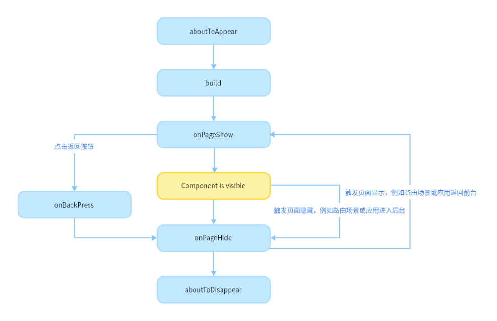

# 页面和自定义组件生命周期


在开始之前，我们先明确自定义组件和页面的关系：


- 自定义组件：\@Component装饰的UI单元，可以组合多个系统组件实现UI的复用。

- 页面：即应用的UI页面。可以由一个或者多个自定义组件组成，\@Entry装饰的自定义组件为页面的入口组件，即页面的根节点，一个页面有且仅能有一个\@Entry。只有被\@Entry装饰的组件才可以调用页面的生命周期。


页面生命周期，即被\@Entry装饰的组件生命周期，提供以下生命周期接口：


- [onPageShow](../reference/arkui-ts/ts-custom-component-lifecycle.md#onpageshow)：页面每次显示时触发。

- [onPageHide](../reference/arkui-ts/ts-custom-component-lifecycle.md#onpagehide)：页面每次隐藏时触发一次。

- [onBackPress](../reference/arkui-ts/ts-custom-component-lifecycle.md#onbackpress)：当用户点击返回按钮时触发。


组件生命周期，即一般用\@Component装饰的自定义组件的生命周期，提供以下生命周期接口：


- [aboutToAppear](../reference/arkui-ts/ts-custom-component-lifecycle.md#abouttoappear)：组件即将出现时回调该接口，具体时机为在创建自定义组件的新实例后，在执行其build()函数之前执行。

- [aboutToDisappear](../reference/arkui-ts/ts-custom-component-lifecycle.md#abouttodisappear)：在自定义组件即将析构销毁时执行。


生命周期流程如下图所示，下图展示的是被\@Entry装饰的组件（首页）生命周期。





根据上面的流程图，我们从自定义组件的初始创建、重新渲染和删除来详细解释。


## 自定义组件的创建和渲染流程

1. 自定义组件的创建：自定义组件的实例由ArkUI框架创建。

2. 初始化自定义组件的成员变量：通过本地默认值或者构造方法传递参数来初始化自定义组件的成员变量，初始化顺序为成员变量的定义顺序。

3. 如果开发者定义了aboutToAppear，则执行aboutToAppear方法。

4. 在首次渲染的时候，执行build方法渲染系统组件，如果有自定义子组件，则创建自定义组件的实例。在执行build()函数的过程中，框架会观察每个状态变量的读取状态，将保存两个map：
   1. 状态变量 -&gt; UI组件（包括ForEach和if）。
   2. UI组件 -&gt; 此组件的更新函数，即一个lambda方法，作为build()函数的子集，创建对应的UI组件并执行其属性方法，示意如下。


   ```ts
   build() {
     ...
     this.observeComponentCreation(() => {
       Button.create();
     })

     this.observeComponentCreation(() => {
       Text.create();
     })
     ...
   }
   ```


当应用在后台启动时，此时应用进程并没有销毁，所以仅需要执行onPageShow。


## 自定义组件重新渲染

当事件句柄被触发（比如设置了点击事件，即触发点击事件）改变了状态变量时，或者LocalStorage / AppStorage中的属性更改，并导致绑定的状态变量更改其值时：


1. 框架观察到了变化，将启动重新渲染。

2. 根据框架持有的两个map（自定义组件的创建和渲染流程中第4步），框架可以知道该状态变量管理了哪些UI组件，以及这些UI组件对应的更新函数。执行这些UI组件的更新函数，实现最小化更新。


## 自定义组件的删除

如果if组件的分支改变，或者ForEach循环渲染中数组的个数改变，组件将被删除：


1. 在删除组件之前，将调用其aboutToDisappear生命周期函数，标记着该节点将要被销毁。ArkUI的节点删除机制是：后端节点直接从组件树上摘下，后端节点被销毁，对前端节点解引用，当前端节点已经没有引用时，将被JS虚拟机垃圾回收。

2. 自定义组件和它的变量将被删除，如果其有同步的变量，比如[@Link](arkts-link.md)、[@Prop](arkts-prop.md)、[@StorageLink](arkts-appstorage.md#storagelink)，将从[同步源](arkts-state-management-overview.md#基本概念)上取消注册。


不建议在生命周期aboutToDisappear内使用async await，如果在生命周期的aboutToDisappear使用异步操作（Promise或者回调方法），自定义组件将被保留在Promise的闭包中，直到回调方法被执行完，这个行为阻止了自定义组件的垃圾回收。


以下示例展示了生命周期的调用时机：


```ts
// Index.ets
import router from '@ohos.router';

@Entry
@Component
struct MyComponent {
  @State showChild: boolean = true;

  // 只有被@Entry装饰的组件才可以调用页面的生命周期
  onPageShow() {
    console.info('Index onPageShow');
  }
  // 只有被@Entry装饰的组件才可以调用页面的生命周期
  onPageHide() {
    console.info('Index onPageHide');
  }

  // 只有被@Entry装饰的组件才可以调用页面的生命周期
  onBackPress() {
    console.info('Index onBackPress');
  }

  // 组件生命周期
  aboutToAppear() {
    console.info('MyComponent aboutToAppear');
  }

  // 组件生命周期
  aboutToDisappear() {
    console.info('MyComponent aboutToDisappear');
  }

  build() {
    Column() {
      // this.showChild为true，创建Child子组件，执行Child aboutToAppear
      if (this.showChild) {
        Child()
      }
      // this.showChild为false，删除Child子组件，执行Child aboutToDisappear
      Button('delete Child').onClick(() => {
        this.showChild = false;
      })
      // push到Page2页面，执行onPageHide
      Button('push to next page')
        .onClick(() => {
          router.pushUrl({ url: 'pages/Page2' });
        })
    }

  }
}

@Component
struct Child {
  @State title: string = 'Hello World';
  // 组件生命周期
  aboutToDisappear() {
    console.info('[lifeCycle] Child aboutToDisappear')
  }
  // 组件生命周期
  aboutToAppear() {
    console.info('[lifeCycle] Child aboutToAppear')
  }

  build() {
    Text(this.title).fontSize(50).onClick(() => {
      this.title = 'Hello ArkUI';
    })
  }
}
```


以上示例中，Index页面包含两个自定义组件，一个是被\@Entry装饰的MyComponent，也是页面的入口组件，即页面的根节点；一个是Child，是MyComponent的子组件。只有\@Entry装饰的节点才可以生效页面的生命周期方法，所以MyComponent中声明了当前Index页面的页面生命周期函数。MyComponent和其子组件Child也同时声明了组件的生命周期函数。


- 应用冷启动的初始化流程为：MyComponent aboutToAppear --&gt; MyComponent build --&gt; Child aboutToAppear --&gt; Child build --&gt; Child build执行完毕 --&gt; MyComponent build执行完毕 --&gt; Index onPageShow。

- 点击“delete Child”，if绑定的this.showChild变成false，删除Child组件，会执行Child aboutToDisappear方法。


- 点击“push to next page”，调用router.pushUrl接口，跳转到另外一个页面，当前Index页面隐藏，执行页面生命周期Index onPageHide。此处调用的是router.pushUrl接口，Index页面被隐藏，并没有销毁，所以只调用onPageHide。跳转到新页面后，执行初始化新页面的生命周期的流程。

- 如果调用的是router.replaceUrl，则当前Index页面被销毁，执行的生命周期流程将变为：Index onPageHide --&gt; MyComponent aboutToDisappear --&gt; Child aboutToDisappear。上文已经提到，组件的销毁是从组件树上直接摘下子树，所以先调用父组件的aboutToDisappear，再调用子组件的aboutToDisAppear，然后执行初始化新页面的生命周期流程。

- 点击返回按钮，触发页面生命周期Index onBackPress。最小化应用或者应用进入后台，触发Index onPageHide。这两个状态下应用都没有被销毁，所以并不会执行组件的aboutToDisappear 。应用回到前台，执行Index onPageShow。


- 退出应用，执行Index onPageHide --&gt; MyComponent aboutToDisappear --&gt; Child aboutToDisappear。
