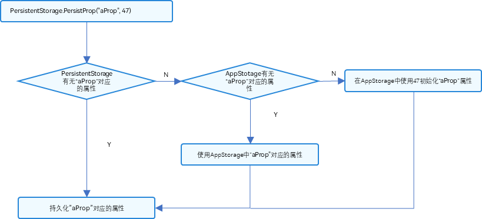

# PersistentStorage：持久化存储UI状态


前两个小节介绍的LocalStorage和AppStorage都是运行时的内存，但是在应用退出再次启动后，依然能保存选定的结果，是应用开发中十分常见的现象，这就需要用到PersistentStorage。


PersistentStorage是应用程序中的可选单例对象。此对象的作用是持久化存储选定的AppStorage属性，以确保这些属性在应用程序重新启动时的值与应用程序关闭时的值相同。


PersistentStorage提供状态变量持久化的能力，但是需要注意，其持久化和读回UI的能力都需要依赖AppStorage。在阅读本文档前，建议提前阅读：[AppStorage](./arkts-appstorage.md)，[PersistentStorage API文档](../reference/apis-arkui/arkui-ts/ts-state-management.md#persistentstorage)。

## 概述

PersistentStorage将选定的AppStorage属性保留在设备磁盘上。应用程序通过API，以决定哪些AppStorage属性应借助PersistentStorage持久化。UI和业务逻辑不直接访问PersistentStorage中的属性，所有属性访问都是对AppStorage的访问，AppStorage中的更改会自动同步到PersistentStorage。

PersistentStorage和AppStorage中的属性建立双向同步。应用开发通常通过AppStorage访问PersistentStorage，另外还有一些接口可以用于管理持久化属性，但是业务逻辑始终是通过AppStorage获取和设置属性的。

## 限制条件

PersistentStorage允许的类型和值有：

- `number, string, boolean, enum` 等简单类型。
- 可以被`JSON.stringify()`和`JSON.parse()`重构的对象，但是对象中的成员方法不支持持久化。
- API12及以上支持Map类型，可以观察到Map整体的赋值，同时可通过调用Map的接口`set`, `clear`, `delete` 更新Map的值。且更新的值被持久化存储。详见[装饰Map类型变量](#装饰map类型变量)。
- API12及以上支持Set类型，可以观察到Set整体的赋值，同时可通过调用Set的接口`add`, `clear`, `delete` 更新Set的值。且更新的值被持久化存储。详见[装饰Set类型变量](#装饰set类型变量)。
- API12及以上支持Date类型，可以观察到Date整体的赋值，同时可通过调用Date的接口`setFullYear`, `setMonth`, `setDate`, `setHours`, `setMinutes`, `setSeconds`, `setMilliseconds`, `setTime`, `setUTCFullYear`, `setUTCMonth`, `setUTCDate`, `setUTCHours`, `setUTCMinutes`, `setUTCSeconds`, `setUTCMilliseconds` 更新Date的属性。且更新的值被持久化存储。详见[装饰Date类型变量](#装饰date类型变量)。
- API12及以上支持`undefined` 和 `null`。
- API12及以上[支持联合类型](#支持联合类型)。

PersistentStorage不允许的类型和值有：

- 不支持嵌套对象（对象数组，对象的属性是对象等）。因为目前框架无法检测AppStorage中嵌套对象（包括数组）值的变化，所以无法写回到PersistentStorage中。

持久化数据是一个相对缓慢的操作，应用程序应避免以下情况：

- 持久化大型数据集。

- 持久化经常变化的变量。

PersistentStorage的持久化变量最好是小于2kb的数据，不要大量的数据持久化，因为PersistentStorage写入磁盘的操作是同步的，大量的数据本地化读写会同步在UI线程中执行，影响UI渲染性能。如果开发者需要存储大量的数据，建议使用数据库api。

PersistentStorage和UI实例相关联，持久化操作需要在UI实例初始化成功后（即[loadContent](../reference/apis-arkui/js-apis-window.md#loadcontent9-2)传入的回调被调用时）才可以被调用，早于该时机调用会导致持久化失败。

```ts
// EntryAbility.ets
onWindowStageCreate(windowStage: window.WindowStage): void {
  windowStage.loadContent('pages/Index', (err) => {
    if (err.code) {
      return;
    }
    PersistentStorage.persistProp('aProp', 47);
  });
}
```

## 使用场景


### 从AppStorage中访问PersistentStorage初始化的属性

1. 初始化PersistentStorage：

   ```ts
   PersistentStorage.persistProp('aProp', 47);
   ```

2. 在AppStorage获取对应属性：

   ```ts
   AppStorage.get<number>('aProp'); // returns 47
   ```

   或在组件内部定义：


   ```ts
   @StorageLink('aProp') aProp: number = 48;
   ```

完整代码如下：


```ts
PersistentStorage.persistProp('aProp', 47);

@Entry
@Component
struct Index {
  @State message: string = 'Hello World'
  @StorageLink('aProp') aProp: number = 48

  build() {
    Row() {
      Column() {
        Text(this.message)
        // 应用退出时会保存当前结果。重新启动后，会显示上一次的保存结果
        Text(`${this.aProp}`)
          .onClick(() => {
            this.aProp += 1;
          })
      }
    }
  }
}
```

- 新应用安装后首次启动运行：
  1. 调用persistProp初始化PersistentStorage，首先查询在PersistentStorage本地文件中是否存在“aProp”，查询结果为不存在，因为应用是第一次安装。
  2. 接着查询属性“aProp”在AppStorage中是否存在，依旧不存在。
  3. 在AppStorge中创建名为“aProp”的number类型属性，属性初始值是定义的默认值47。
  4. PersistentStorage将属性“aProp”和值47写入磁盘，AppStorage中“aProp”对应的值和其后续的更改将被持久化。
  5. 在Index组件中创建状态变量\@StorageLink('aProp') aProp，和AppStorage中“aProp”双向绑定，在创建的过程中会在AppStorage中查找，成功找到“aProp”，所以使用其在AppStorage找到的值47。

  **图1** PersistProp初始化流程  



- 触发点击事件后：
  1. 状态变量\@StorageLink('aProp') aProp改变，触发Text组件重新刷新。
  2. \@StorageLink装饰的变量是和AppStorage中建立双向同步的，所以\@StorageLink('aProp') aProp的变化会被同步回AppStorage中。
  3. AppStorage中“aProp”属性的改变会同步到所有绑定该“aProp”的单向或者双向变量，在本示例中没有其他的绑定“aProp”的变量。
  4. 因为“aProp”对应的属性已经被持久化，所以在AppStorage中“aProp”的改变会触发PersistentStorage，将新的改变写入本地磁盘。

- 后续启动应用：
  1. 执行PersistentStorage.persistProp('aProp', 47)，首先在PersistentStorage本地文件查询“aProp”属性，成功查询到。
  2. 将在PersistentStorage查询到的值写入AppStorage中。
  3. 在Index组件里，\@StorageLink绑定的“aProp”为PersistentStorage写入AppStorage中的值，即为上一次退出应用存入的值。


### 在PersistentStorage之前访问AppStorage中的属性

该示例为反例。在调用PersistentStorage.persistProp或者persistProps之前使用接口访问AppStorage中的属性是错误的，因为这样的调用顺序会丢失上一次应用程序运行中的属性值：


```ts
let aProp = AppStorage.setOrCreate('aProp', 47);
PersistentStorage.persistProp('aProp', 48);
```

应用在非首次运行时，先执行AppStorage.setOrCreate('aProp', 47)：属性“aProp”在AppStorage中创建，其类型为number，其值设置为指定的默认值47。“aProp”是持久化的属性，所以会被写回PersistentStorage磁盘中，PersistentStorage存储的上次退出应用的值丢失。

PersistentStorage.persistProp('aProp', 48)：在PersistentStorage中查找到“aProp”，值为刚刚使用AppStorage接口写入的47。

### 在PersistentStorage之后访问AppStorage中的属性

开发者可以先判断是否需要覆盖上一次保存在PersistentStorage中的值，如果需要覆盖，再调用AppStorage的接口进行修改，如果不需要覆盖，则不调用AppStorage的接口。

```ts
PersistentStorage.persistProp('aProp', 48);
if (AppStorage.get('aProp') > 50) {
    // 如果PersistentStorage存储的值超过50，设置为47
    AppStorage.setOrCreate('aProp',47);
}
```

示例代码在读取PersistentStorage储存的数据后判断“aProp”的值是否大于50，如果大于50的话使用AppStorage的接口设置为47。


### 支持联合类型

PersistentStorage支持联合类型和undefined和null，在下面的示例中，使用persistProp方法初始化"P"为undefined。通过@StorageLink("P")绑定变量p，类型为number | undefined | null，点击Button改变P的值，视图会随之刷新。且P的值被持久化存储。

```ts
PersistentStorage.persistProp("P", undefined);

@Entry
@Component
struct TestCase6 {
  @StorageLink("P") p: number | undefined | null = 10;

  build() {
    Row() {
      Column() {
        Text(this.p + "")
          .fontSize(50)
          .fontWeight(FontWeight.Bold)
        Button("changeToNumber").onClick(() => {
          this.p = 10;
        })
        Button("changeTo undefined").onClick(() => {
          this.p = undefined;
        })
        Button("changeTo null").onClick(() => {
          this.p = null;
        })
      }  
      .width('100%')
    }
    .height('100%')
  }
}
```


### 装饰Date类型变量

在下面的示例中，@StorageLink装饰的persistedDate类型为Date，点击Button改变persistedDate的值，视图会随之刷新。且persistedDate的值被持久化存储。

```ts
PersistentStorage.persistProp("persistedDate", new Date());

@Entry
@Component
struct PersistedDate {
  @StorageLink("persistedDate") persistedDate: Date = new Date();

  updateDate() {
    this.persistedDate = new Date();
  }

  build() {
    List() {
      ListItem() {
        Column() {
          Text(`Persisted Date is ${this.persistedDate.toString()}`)
            .margin(20)

          Text(`Persisted Date month is ${this.persistedDate.getMonth()}`)
            .margin(20)

          Text(`Persisted Date day is ${this.persistedDate.getDay()}`)
            .margin(20)

          Text(`Persisted Date time is ${this.persistedDate.toLocaleTimeString()}`)
            .margin(20)

          Button() {
            Text('Update Date')
              .fontSize(25)
              .fontWeight(FontWeight.Bold)
              .fontColor(Color.White)
          }
          .type(ButtonType.Capsule)
          .margin({
            top: 20
          })
          .backgroundColor('#0D9FFB')
          .width('60%')
          .height('5%')
          .onClick(() => {
            this.updateDate();
          })

        }.width('100%')
      }
    }
  }
}
```

### 装饰Map类型变量

在下面的示例中，@StorageLink装饰的persistedMapString类型为Map\<number, string\>，点击Button改变persistedMapString的值，视图会随之刷新。且persistedMapString的值被持久化存储。

```ts
PersistentStorage.persistProp("persistedMapString", new Map<number, string>([]));

@Entry
@Component
struct PersistedMap {
  @StorageLink("persistedMapString") persistedMapString: Map<number, string> = new Map<number, string>([]);

  persistMapString() {
    this.persistedMapString = new Map<number, string>([[3, "one"], [6, "two"], [9, "three"]]);
  }

  build() {
    List() {
      ListItem() {
        Column() {
          Text(`Persisted Map String is `)
            .margin(20)
          ForEach(Array.from(this.persistedMapString.entries()), (item: [number, string]) => {
            Text(`${item[0]} ${item[1]}`)
          })

          Button() {
            Text('Persist Map String')
              .fontSize(25)
              .fontWeight(FontWeight.Bold)
              .fontColor(Color.White)
          }
          .type(ButtonType.Capsule)
          .margin({
            top: 20
          })
          .backgroundColor('#0D9FFB')
          .width('60%')
          .height('5%')
          .onClick(() => {
            this.persistMapString();
          })

        }.width('100%')
      }
    }
  }
}
```

### 装饰Set类型变量

在下面的示例中，@StorageLink装饰的persistedSet类型为Set\<number\>，点击Button改变persistedSet的值，视图会随之刷新。且persistedSet的值被持久化存储。

```ts
PersistentStorage.persistProp("persistedSet", new Set<number>([]));

@Entry
@Component
struct PersistedSet {
  @StorageLink("persistedSet") persistedSet: Set<number> = new Set<number>([]);

  persistSet() {
    this.persistedSet = new Set<number>([33, 1, 3]);
  }

  clearSet() {
    this.persistedSet.clear();
  }

  build() {
    List() {
      ListItem() {
        Column() {
          Text(`Persisted Set is `)
            .margin(20)
          ForEach(Array.from(this.persistedSet.entries()), (item: [number, string]) => {
            Text(`${item[1]}`)
          })

          Button() {
            Text('Persist Set')
              .fontSize(25)
              .fontWeight(FontWeight.Bold)
              .fontColor(Color.White)
          }
          .type(ButtonType.Capsule)
          .margin({
            top: 20
          })
          .backgroundColor('#0D9FFB')
          .width('60%')
          .height('5%')
          .onClick(() => {
            this.persistSet();
          })

          Button() {
            Text('Persist Clear')
              .fontSize(25)
              .fontWeight(FontWeight.Bold)
              .fontColor(Color.White)
          }
          .type(ButtonType.Capsule)
          .margin({
            top: 20
          })
          .backgroundColor('#0D9FFB')
          .width('60%')
          .height('5%')
          .onClick(() => {
            this.clearSet();
          })

        }
        .width('100%')
      }
    }
  }
}
```