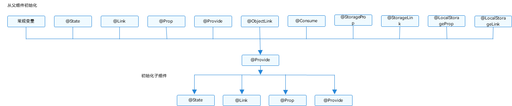
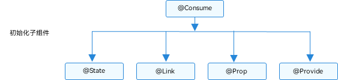

# \@Provide装饰器和\@Consume装饰器：与后代组件双向同步


\@Provide和\@Consume，应用于与后代组件的双向数据同步，应用于状态数据在多个层级之间传递的场景。不同于上文提到的父子组件之间通过命名参数机制传递，\@Provide和\@Consume摆脱参数传递机制的束缚，实现跨层级传递。


其中\@Provide装饰的变量是在祖先节点中，可以理解为被“提供”给后代的状态变量。\@Consume装饰的变量是在后代组件中，去“消费（绑定）”祖先节点提供的变量。


> **说明：**
>
> 从API version 9开始，这两个装饰器支持在ArkTS卡片中使用。


## 概述

\@Provide/\@Consume装饰的状态变量有以下特性：

- \@Provide装饰的状态变量自动对其所有后代组件可用，即该变量被“provide”给他的后代组件。由此可见，\@Provide的方便之处在于，开发者不需要多次在组件之间传递变量。

- 后代通过使用\@Consume去获取\@Provide提供的变量，建立在\@Provide和\@Consume之间的双向数据同步，与\@State/\@Link不同的是，前者可以在多层级的父子组件之间传递。

- \@Provide和\@Consume可以通过相同的变量名或者相同的变量别名绑定，建议类型相同，否则会发生类型隐式转换，从而导致应用行为异常。


```ts
// 通过相同的变量名绑定
@Provide a: number = 0;
@Consume a: number;

// 通过相同的变量别名绑定
@Provide('a') b: number = 0;
@Consume('a') c: number;
```


\@Provide和\@Consume通过相同的变量名或者相同的变量别名绑定时，\@Provide修饰的变量和\@Consume修饰的变量是一对多的关系。不允许在同一个自定义组件内，包括其子组件中声明多个同名或者同别名的\@Provide装饰的变量，@Provide的属性名或别名需要唯一且确定，如果声明多个同名或者同别名的@Provide装饰的变量，会发生运行时报错。


## 装饰器说明

\@State的规则同样适用于\@Provide，差异为\@Provide还作为多层后代的同步源。

| \@Provide变量装饰器 | 说明                                       |
| -------------- | ---------------------------------------- |
| 装饰器参数          | 别名：常量字符串，可选。<br/>如果指定了别名，则通过别名来绑定变量；如果未指定别名，则通过变量名绑定变量。 |
| 同步类型           | 双向同步。<br/>从\@Provide变量到所有\@Consume变量以及相反的方向的数据同步。双向同步的操作与\@State和\@Link的组合相同。 |
| 允许装饰的变量类型      | Object、class、string、number、boolean、enum类型，以及这些类型的数组。<br/>支持Date类型。<br/>支持类型的场景请参考[观察变化](#观察变化)。<br/>不支持any，不支持简单类型和复杂类型的联合类型，不允许使用undefined和null。<br/>必须指定类型。\@Provide变量的\@Consume变量的类型必须相同。<br/>**说明：**<br/>不支持Length、ResourceStr、ResourceColor类型，Length、ResourceStr、ResourceColor为简单类型和复杂类型的联合类型。 |
| 被装饰变量的初始值      | 必须指定。                                    |

| \@Consume变量装饰器 | 说明                                       |
| -------------- | ---------------------------------------- |
| 装饰器参数          | 别名：常量字符串，可选。<br/>如果提供了别名，则必须有\@Provide的变量和其有相同的别名才可以匹配成功；否则，则需要变量名相同才能匹配成功。 |
| 同步类型           | 双向：从\@Provide变量（具体请参见\@Provide）到所有\@Consume变量，以及相反的方向。双向同步操作与\@State和\@Link的组合相同。 |
| 允许装饰的变量类型      | Object、class、string、number、boolean、enum类型，以及这些类型的数组。<br/>支持Date类型。<br/>支持类型的场景请参考[观察变化](#观察变化)。<br/>不支持any，不允许使用undefined和null。<br/>必须指定类型。\@Provide变量的\@Consume变量的类型必须相同。<br/>**说明：**<br/>\@Consume装饰的变量，在其父节点或者祖先节点上，必须有对应的属性和别名的\@Provide装饰的变量。 |
| 被装饰变量的初始值      | 无，禁止本地初始化。                               |


## 变量的传递/访问规则说明


| \@Provide传递/访问 | 说明                                       |
| -------------- | ---------------------------------------- |
| 从父组件初始化和更新     | 可选，允许父组件中常规变量、\@State、\@Link、\@Prop、\@Provide、\@Consume、\@ObjectLink、\@StorageLink、\@StorageProp、\@LocalStorageLink和\@LocalStorageProp装饰的变量装饰变量初始化子组件\@Provide。 |
| 用于初始化子组件       | 允许，可用于初始化\@State、\@Link、\@Prop、\@Provide。 |
| 和父组件同步         | 否。                                       |
| 和后代组件同步        | 和\@Consume双向同步。                          |
| 是否支持组件外访问      | 私有，仅可以在所属组件内访问。                          |


  **图1** \@Provide初始化规则图示  





| \@Consume传递/访问 | 说明                                       |
| -------------- | ---------------------------------------- |
| 从父组件初始化和更新     | 禁止。通过相同的变量名和alias（别名）从\@Provide初始化。      |
| 用于初始化子组件       | 允许，可用于初始化\@State、\@Link、\@Prop、\@Provide。 |
| 和祖先组件同步        | 和\@Provide双向同步。                          |
| 是否支持组件外访问      | 私有，仅可以在所属组件内访问                           |


  **图2** \@Consume初始化规则图示  





## 观察变化和行为表现


### 观察变化

- 当装饰的数据类型为boolean、string、number类型时，可以观察到数值的变化。

- 当装饰的数据类型为class或者Object的时候，可以观察到赋值和属性赋值的变化（属性为Object.keys(observedObject)返回的所有属性）。

- 当装饰的对象是array的时候，可以观察到数组的添加、删除、更新数组单元。

- 当装饰的对象是Date时，可以观察到Date整体的赋值，同时可通过调用Date的接口`setFullYear`, `setMonth`, `setDate`, `setHours`, `setMinutes`, `setSeconds`, `setMilliseconds`, `setTime`, `setUTCFullYear`, `setUTCMonth`, `setUTCDate`, `setUTCHours`, `setUTCMinutes`, `setUTCSeconds`, `setUTCMilliseconds` 更新Date的属性。

```ts
@Component
struct CompD {

  @Consume selectedDate: Date;

  build() {
    Column() {
      Button(`child increase the day by 1`)
        .onClick(() => {
          this.selectedDate.setDate(this.selectedDate.getDate() + 1)
        })
      Button('child update the new date')
        .margin(10)
        .onClick(() => {
          this.selectedDate = new Date('2023-09-09')
        })
      DatePicker({
        start: new Date('1970-1-1'),
        end: new Date('2100-1-1'),
        selected: this.selectedDate
      })
    }
  }
}

@Entry
@Component
struct CompA {

  @Provide selectedDate: Date = new Date('2021-08-08')

  build() {
    Column() {
      Button('parent increase the day by 1')
        .margin(10)
        .onClick(() => {
          this.selectedDate.setDate(this.selectedDate.getDate() + 1)
        })
      Button('parent update the new date')
        .margin(10)
        .onClick(() => {
          this.selectedDate = new Date('2023-07-07')
        })
      DatePicker({
        start: new Date('1970-1-1'),
        end: new Date('2100-1-1'),
        selected: this.selectedDate
      })
      CompD()
    }
  }
}
```

### 框架行为

1. 初始渲染：
   1. \@Provide装饰的变量会以map的形式，传递给当前\@Provide所属组件的所有子组件；
   2. 子组件中如果使用\@Consume变量，则会在map中查找是否有该变量名/alias（别名）对应的\@Provide的变量，如果查找不到，框架会抛出JS ERROR;
   3. 在初始化\@Consume变量时，和\@State/\@Link的流程类似，\@Consume变量会保存在map中查找到的\@Provide变量，并把自己注册给\@Provide。

2. 当\@Provide装饰的数据变化时：
   1. 通过初始渲染的步骤可知，子组件\@Consume已把自己注册给父组件。父组件\@Provide变量变更后，会遍历更新所有依赖它的系统组件（elementid）和状态变量（\@Consume）；
   2. 通知\@Consume更新后，子组件所有依赖\@Consume的系统组件（elementId）都会被通知更新。以此实现\@Provide对\@Consume状态数据同步。

3. 当\@Consume装饰的数据变化时：

   通过初始渲染的步骤可知，子组件\@Consume持有\@Provide的实例。在\@Consume更新后调用\@Provide的更新方法，将更新的数值同步回\@Provide，以此实现\@Consume向\@Provide的同步更新。


## 使用场景

在下面的示例是与后代组件双向同步状态\@Provide和\@Consume场景。当分别点击CompA和CompD组件内Button时，reviewVotes 的更改会双向同步在CompA和CompD中。


```ts
@Component
struct CompD {
  // @Consume装饰的变量通过相同的属性名绑定其祖先组件CompA内的@Provide装饰的变量
  @Consume reviewVotes: number;

  build() {
    Column() {
      Text(`reviewVotes(${this.reviewVotes})`)
      Button(`reviewVotes(${this.reviewVotes}), give +1`)
        .onClick(() => this.reviewVotes += 1)
    }
    .width('50%')
  }
}

@Component
struct CompC {
  build() {
    Row({ space: 5 }) {
      CompD()
      CompD()
    }
  }
}

@Component
struct CompB {
  build() {
    CompC()
  }
}

@Entry
@Component
struct CompA {
  // @Provide装饰的变量reviewVotes由入口组件CompA提供其后代组件
  @Provide reviewVotes: number = 0;

  build() {
    Column() {
      Button(`reviewVotes(${this.reviewVotes}), give +1`)
        .onClick(() => this.reviewVotes += 1)
      CompB()
    }
  }
}
```
