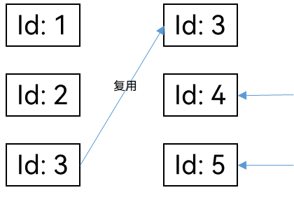

# ForEach：循环渲染


ForEach基于数组类型数据执行循环渲染。

> **说明：**
>
> 从API version 9开始，该接口支持在ArkTS卡片中使用。

## 接口描述


```ts
ForEach(
  arr: Array,
  itemGenerator: (item: Array, index?: number) => void,
  keyGenerator?: (item: Array, index?: number): string => string
)
```


| 参数名           | 参数类型                                     | 必填   | 参数描述                                     |
| ------------- | ---------------------------------------- | ---- | ---------------------------------------- |
| arr           | Array                                    | 是    | 必须是数组，允许设置为空数组，空数组场景下将不会创建子组件。同时允许设置返回值为数组类型的函数，例如arr.slice(1,&nbsp;3)，设置的函数不得改变包括数组本身在内的任何状态变量，如Array.splice、Array.sort或Array.reverse这些改变原数组的函数。 |
| itemGenerator | (item:&nbsp;any,&nbsp;index?:&nbsp;number)&nbsp;=&gt;&nbsp;void | 是    | 生成子组件的lambda函数，为数组中的每一个数据项创建一个或多个子组件，单个子组件或子组件列表必须包括在大括号“{...}”中。<br/>**说明：**<br/>-&nbsp;子组件的类型必须是ForEach的父容器组件所允许的（例如，只有当ForEach父级为List组件时，才允许ListItem子组件）。<br/>-&nbsp;允许子类构造函数返回if或另一个ForEach。ForEach可以在if内的任意位置。<br/>-&nbsp;可选index参数如在函数体中使用，则必须仅在函数签名中指定。 |
| keyGenerator  | (item:&nbsp;any,&nbsp;index?:&nbsp;number)&nbsp;=&gt;&nbsp;string | 否    | 匿名函数，用于给数组中的每一个数据项生成唯一且固定的键值。键值生成器的功能是可选的，但是，为了使开发框架能够更好地识别数组更改，提高性能，建议提供。如将数组反向时，如果没有提供键值生成器，则ForEach中的所有节点都将重建。<br/>**说明：**<br/>-&nbsp;同一数组中的不同项绝对不能计算出相同的ID。<br/>-&nbsp;如果未使用index参数，则项在数组中的位置变动不得改变项的键值。如果使用了index参数，则当项在数组中的位置有变动时，键值必须更改。<br/>-&nbsp;当某个项目被新项替换（值不同）时，被替换的项键值和新项的键值必须不同。<br/>-&nbsp;在构造函数中使用index参数时，键值生成函数也必须使用该参数。<br>-&nbsp;键值生成函数不允许改变任何组件状态。 |


## 使用限制

- ForEach必须在容器组件内使用。

- 生成的子组件应当是允许包含在ForEach父容器组件中的子组件。

- 允许子组件生成器函数中包含if/else条件渲染，同时也允许ForEach包含在if/else条件渲染语句中。

- itemGenerator函数的调用顺序不一定和数组中的数据项相同，在开发过程中不要假设itemGenerator和keyGenerator函数是否执行及其执行顺序。例如，以下示例可能无法正确运行：

    ```ts
    let obj: Object
    ForEach(anArray.map((item1: Object, index1: number): Object => {
        obj.i = index1 + 1
        obj.data = item1
        return obj;
      }),
    (item: string) => Text(`${item.i}. item.data.label`),
    (item: string): string => {
        return item.data.id.toString()
    })
    ```


## 开发建议

- 建议开发者不要假设项构造函数的执行顺序。执行顺序可能不能是数组中项的排列顺序。

- 不要假设数组项是否是初始渲染。ForEach的初始渲染在\@Component首次渲染时构建所有数组项。后续框架版本中可能会将此行为更改为延迟加载模式。

- 使用 index参数对UI更新性能有严重的负面影响，请尽量避免。

- 如果项构造函数中使用index参数，则项索引函数中也必须使用该参数。否则，如果项索引函数未使用index参数，ForEach在生成实际的键值时，框架也会把index考虑进来，默认将index拼接在后面。


## 使用场景


### 简单ForEach示例

根据arr数据分别创建3个Text和Divide组件。


```ts
@Entry
@Component
struct MyComponent {
  @State arr: number[] = [10, 20, 30];

  build() {
    Column({ space: 5 }) {
      Button('Reverse Array')
        .onClick(() => {
          this.arr.reverse();
        })
      ForEach(this.arr, (item: number) => {
        Text(`item value: ${item}`).fontSize(18)
        Divider().strokeWidth(2)
      }, (item: number) => item.toString())
    }
  }
}
```


### 复杂ForEach示例


```ts
@Component
struct CounterView {
  @State label: string = "";
  @State count: number = 0;

  build() {
    Button(`${this.label}-${this.count} click +1`)
      .width(300).height(40)
      .backgroundColor('#a0ffa0')
      .onClick(() => {
        this.count++;
      })
  }
}

@Entry
@Component
struct MainView {
  @State arr: number[] = Array.from(Array(10).keys()); // [0.,.9]
  nextUnused: number = this.arr.length;

  build() {
    Column() {
      Button(`push new item`)
        .onClick(() => {
          this.arr.push(this.nextUnused++)
        })
        .width(300).height(40)
      Button(`pop last item`)
        .onClick(() => {
          this.arr.pop()
        })
        .width(300).height(40)
      Button(`prepend new item (unshift)`)
        .onClick(() => {
          this.arr.unshift(this.nextUnused++)
        })
        .width(300).height(40)
      Button(`remove first item (shift)`)
        .onClick(() => {
          this.arr.shift()
        })
        .width(300).height(40)
      Button(`insert at pos ${Math.floor(this.arr.length / 2)}`)
        .onClick(() => {
          this.arr.splice(Math.floor(this.arr.length / 2), 0, this.nextUnused++);
        })
        .width(300).height(40)
      Button(`remove at pos ${Math.floor(this.arr.length / 2)}`)
        .onClick(() => {
          this.arr.splice(Math.floor(this.arr.length / 2), 1);
        })
        .width(300).height(40)
      Button(`set at pos ${Math.floor(this.arr.length / 2)} to ${this.nextUnused}`)
        .onClick(() => {
          this.arr[Math.floor(this.arr.length / 2)] = this.nextUnused++;
        })
        .width(300).height(40)
      ForEach(this.arr,
        (item: string) => {
          CounterView({ label: item.toString() })
        },
        (item: string) => item.toString()
      )
    }
  }
}
```

MainView拥有一个\@State装饰的数字数组。添加、删除和替换数组项是可观察到的变化事件，当这些事件发生时，MainView内的ForEach都会更新。

项目索引函数为每个数组项创建唯一且持久的键值，ArkUI框架通过此键值确定数组中的项是否有变化，只要键值相同，数组项的值就假定不变，但其索引位置可能会更改。此机制的运行前提是不同的数组项不能有相同的键值。

使用计算出的ID，框架可以对添加、删除和保留的数组项加以区分：

1. 框架将删除已删除数组项的UI组件。

2. 框架仅对新添加的数组项执行项构造函数。

3. 框架不会为保留的数组项执行项构造函数。如果数组中的项索引已更改，框架将仅根据新顺序移动其UI组件，但不会更新该UI组件。

建议使用项目索引函数，但这是可选的。生成的ID必须是唯一的，这意味着不能为数组中的不同项计算出相同的ID。即使两个数组项具有相同的值，其ID也必须不同。

如果数组项值更改，则ID必须更改。
如前所述，id生成函数是可选的。以下是不带项索引函数的ForEach：

  ```ts
let list: Object
ForEach(this.arr,
    (item: Object): string => {
      list.label = item.toString();
      CounterView(list)
    }
  )
  ```

如果没有提供项ID函数，则框架会尝试在更新ForEach时智能检测数组更改。但是，它可能会删除子组件，并为在数组中移动（索引被更改）的数组项重新执行项构造函数。在上面的示例中，这将更改应用程序针对CounterView counter状态的行为。创建新的CounterView实例时，counter的值将初始化为0。


### 使用\@ObjectLink的ForEach示例

当需要保留重复子组件的状态时，\@ObjectLink可将状态在组件树中向父组件推送。


```ts
let NextID: number = 0;

@Observed
class MyCounter {
  public id: number;
  public c: number;

  constructor(c: number) {
    this.id = NextID++;
    this.c = c;
  }
}

@Component
struct CounterView {
  @ObjectLink counter: MyCounter;
  label: string = 'CounterView';

  build() {
    Button(`CounterView [${this.label}] this.counter.c=${this.counter.c} +1`)
      .width(200).height(50)
      .onClick(() => {
        this.counter.c += 1;
      })
  }
}

@Entry
@Component
struct MainView {
  @State firstIndex: number = 0;
  @State counters: Array<MyCounter> = [new MyCounter(0), new MyCounter(0), new MyCounter(0),
    new MyCounter(0), new MyCounter(0)];

  build() {
    Column() {
      ForEach(this.counters.slice(this.firstIndex, this.firstIndex + 3),
        (item: MyCounter) => {
          CounterView({ label: `Counter item #${item.id}`, counter: item })
        },
        (item: MyCounter) => item.id.toString()
      )
      Button(`Counters: shift up`)
        .width(200).height(50)
        .onClick(() => {
          this.firstIndex = Math.min(this.firstIndex + 1, this.counters.length - 3);
        })
      Button(`counters: shift down`)
        .width(200).height(50)
        .onClick(() => {
          this.firstIndex = Math.max(0, this.firstIndex - 1);
        })
    }
  }
}
```

当增加firstIndex的值时，Mainview内的ForEach将更新，并删除与项ID firstIndex-1关联的CounterView子组件。对于ID为firstindex + 3的数组项，将创建新的CounterView子组件实例。由于CounterView子组件的状态变量counter值由父组件Mainview维护，故重建CounterView子组件实例不会重建状态变量counter值。

> **说明：**
>
> 违反上述数组项ID规则是最常见的应用开发错误，尤其是在Array&lt;number&gt;场景下，因为执行过程中很容易添加重复的数字。


### ForEach的嵌套使用

允许将ForEach嵌套在同一组件中的另一个ForEach中，但更推荐将组件拆分为两个，每个构造函数只包含一个ForEach。下面为ForEach嵌套使用反例。


```ts
class Month {
  year: number;
  month: number;
  days: number[];

  constructor(year: number, month: number, ...days: number[]) {
    this.year = year;
    this.month = month;
    this.days = days;
  }
}
@Component
struct CalendarExample {
  // 模拟6个月
   arr28: Array<number> = Array(31).fill(0).map((_: number, i: number): number => i + 1);
   arr30: Array<number> = Array(31).fill(0).map((_: number, i: number): number => i + 1);
   arr31: Array<number> = Array(31).fill(0).map((_: number, i: number): number => i + 1);
  @State calendar : Month[] = [
    new Month(2020, 1, ...(this.arr31)),
    new Month(2020, 2, ...(this.arr28)),
    new Month(2020, 3, ...(this.arr31)),
    new Month(2020, 4, ...(this.arr30)),
    new Month(2020, 5, ...(this.arr31)),
    new Month(2020, 6, ...(this.arr30))
  ]
  build() {
    Column() {
      Button() {
        Text('next month')
      }.onClick(() => {
        this.calendar.shift()
        this.calendar.push(new Month(2020, 7, ...(this.arr31)))
      })
      ForEach(this.calendar,
        (item: Month) => {
          ForEach(item.days,
            (day : number) => {
              // 构建日期块
            },
            (day : number) => day.toString()
          )// 内部ForEach
        },
        (item: Month) => (item.year * 12 + item.month).toString() // 字段与年和月一起使用，作为月份的唯一ID。
      )// 外部ForEach
    }
  }
}
```

以上示例存在两个问题：

1. 代码可读性差。

2. 对于上述的年月份数据的数组结构形式，由于框架无法观察到针对该数组中Month数据结构的改变（比如day数组变化），从而内层的ForEach无法刷新日期显示。

建议应用设计时将Calendar拆分为Year、Month和Day子组件。定义一个“Day”模型类，以保存有关day的信息，并用\@Observed装饰此类。DayView组件利用ObjectLink装饰变量以绑定day数据。对MonthView和Month模型类执行同样的操作。


### ForEach中使用可选index参数示例

可以在构造函数和ID生成函数中使用可选的index参数。


```ts
@Entry
@Component
struct ForEachWithIndex {
  @State arr: number[] = [4, 3, 1, 5];

  build() {
    Column() {
      ForEach(this.arr,
        (it: number, index) => {
          Text(`Item: ${index} - ${it}`)
        },
        (it: number, index) => {
          return `${index} - ${it}`
        }
      )
    }
  }
}
```

必须正确构造ID生成函数。当在项构造函数中使用index参数时，ID生成函数也必须使用index参数，以生成唯一ID和给定源数组项的ID。当数组项在数组中的索引位置发生变化时，其ID会发生变化。

此示例还说明了index参数会造成显著性能下降。即使项在源数组中移动而不做修改，因为索引发生改变，依赖该数组项的UI仍然需要重新渲染。例如，使用索引排序时，数组只需要将ForEach未修改的子UI节点移动到正确的位置，这对于框架来说是一个轻量级操作。而使用索引时，所有子UI节点都需要重新构建，这操作负担要重得多。

## 常见问题

### 在ForEach数据源中添加元素导致ID重复

在ForEach数据源中添加元素导致数组项ID重复。

【反例】

  下面示例使用ForEach方法迭代数组this.arr的每个元素，在Text组件进行显示，并在单击Text('Add arr element')时添加新的数组元素。

```ts
@Entry
@Component
struct Index {
  @State arr: number[] = [1,2,3];

  build() {
      Column() {
       ForEach(this.arr,
         (item: void) => {
           Text(`Item ${item}`)
         },
         (item: string) => item.toString())
       Text('Add arr element')
         .fontSize(20)
         .onClick(()=>{
           this.arr.push(4);  // arr新增的元素，其在ForEach内的键值均为'4'
           console.log("Arr elements: ", this.arr);
         })
      }
    }
}
```

点击两次Text（'Add arr element'）时，数组this.arr每次都会添加新元素 4。但是在ForEach循环渲染中，第三个参数(item)=&gt; item.toString()需要生成Array每一个item对应的id值。该Array Id被要求是唯一的和稳定的。

- 唯一性：键值生成函数生成的每个数组项的id是不同的。

- 稳定性：当数组项ID发生变化时，ArkUI框架认为该数组项被替换或更改。

- ArkUI框架会对重复的ID告警，这种情况下框架的行为是未知的，特别是UI的更新在该场景下可能不起作用。

因此上述示例中，框架不会显示第二次及以后新添加的文本元素。因为这个元素不再是唯一的，他们都含有相同的id4。 但是如果删除ForEach第三个键值生成函数(item) =&gt; item.toString()，则触发onClick事件后每一个新添加的Text元素都会得到更新。这是因为框架使用了默认的Array id生成函数，即(item: any, index : number) =&gt; '${index}__${JSON.stringify(item)}'。它的兼容性更好但可能会导致不必要的UI更新，因此仍建议应用定义自己的键值生成函数。

### ForEach数据源更新未创建新数组项

ForEach数据源更新时，数组项ID与原数组项ID重复不会重新创建该数组项。

【反例】

下面的示例定义了Index和Child两个组件。父组件Index有arr数组成员变量，初始值包含数字1、2、3。Child定义\@Prop value，接收父组件中arr数组中的一个元素。


```ts
@Component
struct Child {
  @Prop value: number = 0;
  build() {
    Text(`${this.value}`)
      .fontSize(50)
      .onClick(() => {
        this.value++  // 点击改变@Prop的值
      })
  }
}
@Entry
@Component
struct Index {
  @State arr: number[] = [1, 2, 3];
  build() {
    Row() {
      Column() {
        // 对照组
        Child({ value: this.arr[0] })
        Child({ value: this.arr[1] })
        Child({ value: this.arr[2] })
        Divider().height(5)
        ForEach(this.arr,
          (item: number) => {
            Child({ value: item })
          },
          (item: string) => item.toString()  // 键值，标识id
        )
        Text('Parent: replace entire arr')
          .fontSize(50)
          .onClick(() => {
            // 两个数组项内均含有'3'，ForEach内的id没有发生变化
            // 意味着ForEach不会更新该Child实例，@Prop也不会在父组件处被更新
            this.arr = (this.arr[0] == 1) ? [3, 4, 5] : [1, 2, 3];
          })
      }
    }
  }
}
```

当触发文本组件Parent: replace entire arr的onClick事件时，状态变量数组arr根据自身第一个元素的值将被[3, 4, 5]或[1, 2, 3]替换，但是ForEach里初始被创建的\@Prop传入值为3的Child组件并不会更新。

因为，老数组和新数组初始均含有同一个值的元素（数字3），而且该元素生成的标识id在父组件里没有变化。因此ForEach没有识别出对应的Child实例需要被新的输入值更新，对应的子组件内\@Prop也没有更新。



可以在arr中用一个唯一的元素代替重复的元素3来观察本事件的行为表现。当恰当的替换掉数组时，接下来应用的表现才是符合预期的。
