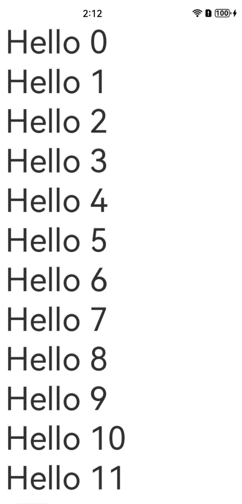
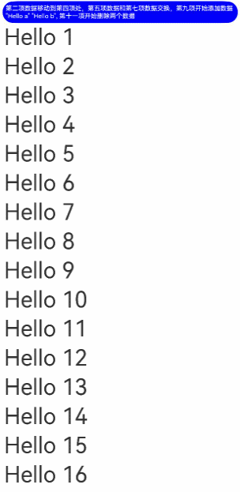
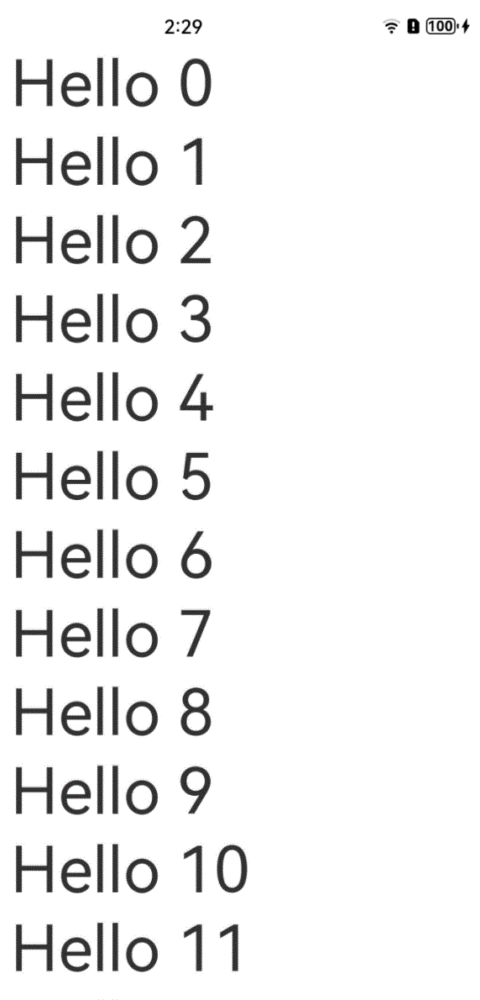
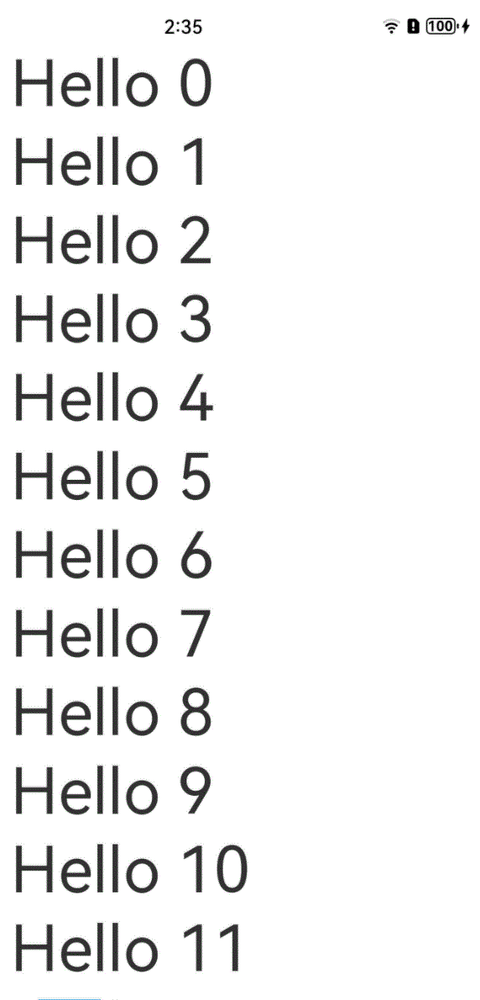
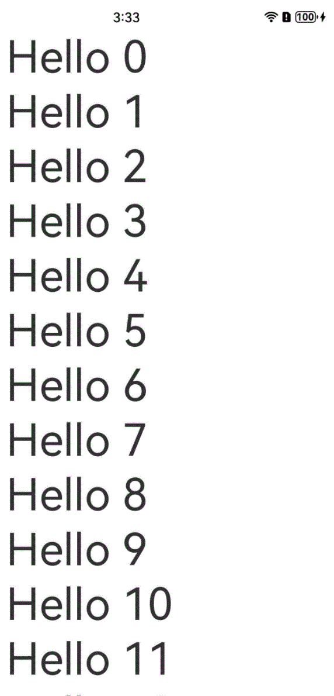
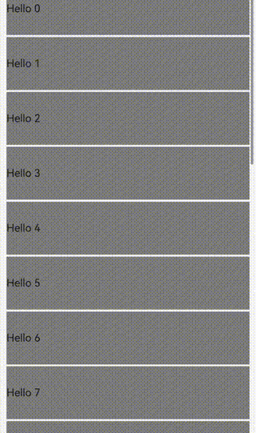

# LazyForEach：数据懒加载

API参数说明见：[LazyForEach API参数说明](../reference/apis-arkui/arkui-ts/ts-rendering-control-lazyforeach.md)

LazyForEach从提供的数据源中按需迭代数据，并在每次迭代过程中创建相应的组件。当在滚动容器中使用了LazyForEach，框架会根据滚动容器可视区域按需创建组件，当组件滑出可视区域外时，框架会进行组件销毁回收以降低内存占用。

## 使用限制

- LazyForEach必须在容器组件内使用，仅有[List](../reference/apis-arkui/arkui-ts/ts-container-list.md)、[Grid](../reference/apis-arkui/arkui-ts/ts-container-grid.md)、[Swiper](../reference/apis-arkui/arkui-ts/ts-container-swiper.md)以及[WaterFlow](../reference/apis-arkui/arkui-ts/ts-container-waterflow.md)组件支持数据懒加载（可配置cachedCount属性，即只加载可视部分以及其前后少量数据用于缓冲），其他组件仍然是一次性加载所有的数据。
- 容器组件内使用LazyForEach的时候，只能包含一个LazyForEach。以List为例，同时包含ListItem、ForEach、LazyForEach的情形是不推荐的；同时包含多个LazyForEach也是不推荐的。
- LazyForEach在每次迭代中，必须创建且只允许创建一个子组件；即LazyForEach的子组件生成函数有且只有一个根组件。
- 生成的子组件必须是允许包含在LazyForEach父容器组件中的子组件。
- 允许LazyForEach包含在if/else条件渲染语句中，也允许LazyForEach中出现if/else条件渲染语句。
- 键值生成器必须针对每个数据生成唯一的值，如果键值相同，将导致键值相同的UI组件渲染出现问题。
- LazyForEach必须使用DataChangeListener对象进行更新，对第一个参数dataSource重新赋值会异常；dataSource使用状态变量时，状态变量改变不会触发LazyForEach的UI刷新。
- 为了高性能渲染，通过DataChangeListener对象的onDataChange方法来更新UI时，需要生成不同于原来的键值来触发组件刷新。
- LazyForEach必须和[@Reusable](https://developer.huawei.com/consumer/cn/doc/best-practices-V5/bpta-component-reuse-V5#section5601835174020)装饰器一起使用才能触发节点复用。使用方法：将@Reusable装饰在LazyForEach列表的组件上，见[使用规则](https://developer.huawei.com/consumer/cn/doc/best-practices-V5/bpta-component-reuse-V5#section5923195311402)。

## 键值生成规则

在`LazyForEach`循环渲染过程中，系统会为每个item生成一个唯一且持久的键值，用于标识对应的组件。当这个键值变化时，ArkUI框架将视为该数组元素已被替换或修改，并会基于新的键值创建一个新的组件。

`LazyForEach`提供了一个名为`keyGenerator`的参数，这是一个函数，开发者可以通过它自定义键值的生成规则。如果开发者没有定义`keyGenerator`函数，则ArkUI框架会使用默认的键值生成函数，即`(item: Object, index: number) => { return viewId + '-' + index.toString(); }`, viewId在编译器转换过程中生成，同一个LazyForEach组件内其viewId是一致的。

## 组件创建规则

在确定键值生成规则后，LazyForEach的第二个参数`itemGenerator`函数会根据键值生成规则为数据源的每个数组项创建组件。组件的创建包括两种情况：[LazyForEach首次渲染](#首次渲染)和[LazyForEach非首次渲染](#非首次渲染)。

### 首次渲染

#### 生成不同键值

在LazyForEach首次渲染时，会根据上述键值生成规则为数据源的每个数组项生成唯一键值，并创建相应的组件。

```ts
// Basic implementation of IDataSource to handle data listener
class BasicDataSource implements IDataSource {
  private listeners: DataChangeListener[] = [];
  private originDataArray: string[] = [];

  public totalCount(): number {
    return 0;
  }

  public getData(index: number): string {
    return this.originDataArray[index];
  }

  // 该方法为框架侧调用，为LazyForEach组件向其数据源处添加listener监听
  registerDataChangeListener(listener: DataChangeListener): void {
    if (this.listeners.indexOf(listener) < 0) {
      console.info('add listener');
      this.listeners.push(listener);
    }
  }

  // 该方法为框架侧调用，为对应的LazyForEach组件在数据源处去除listener监听
  unregisterDataChangeListener(listener: DataChangeListener): void {
    const pos = this.listeners.indexOf(listener);
    if (pos >= 0) {
      console.info('remove listener');
      this.listeners.splice(pos, 1);
    }
  }

  // 通知LazyForEach组件需要重载所有子组件
  notifyDataReload(): void {
    this.listeners.forEach(listener => {
      listener.onDataReloaded();
    })
  }

  // 通知LazyForEach组件需要在index对应索引处添加子组件
  notifyDataAdd(index: number): void {
    this.listeners.forEach(listener => {
      listener.onDataAdd(index);
    })
  }

  // 通知LazyForEach组件在index对应索引处数据有变化，需要重建该子组件
  notifyDataChange(index: number): void {
    this.listeners.forEach(listener => {
      listener.onDataChange(index);
    })
  }

  // 通知LazyForEach组件需要在index对应索引处删除该子组件
  notifyDataDelete(index: number): void {
    this.listeners.forEach(listener => {
      listener.onDataDelete(index);
    })
  }

  // 通知LazyForEach组件将from索引和to索引处的子组件进行交换
  notifyDataMove(from: number, to: number): void {
    this.listeners.forEach(listener => {
      listener.onDataMove(from, to);
    })
  }
}

class MyDataSource extends BasicDataSource {
  private dataArray: string[] = [];

  public totalCount(): number {
    return this.dataArray.length;
  }

  public getData(index: number): string {
    return this.dataArray[index];
  }

  public addData(index: number, data: string): void {
    this.dataArray.splice(index, 0, data);
    this.notifyDataAdd(index);
  }

  public pushData(data: string): void {
    this.dataArray.push(data);
    this.notifyDataAdd(this.dataArray.length - 1);
  }
}

@Entry
@Component
struct MyComponent {
  private data: MyDataSource = new MyDataSource();
   
  aboutToAppear() {
    for (let i = 0; i <= 20; i++) {
      this.data.pushData(`Hello ${i}`)
    }
  }

  build() {
    List({ space: 3 }) {
      LazyForEach(this.data, (item: string) => {
        ListItem() {
          Row() {
            Text(item).fontSize(50)
              .onAppear(() => {
                console.info("appear:" + item)
              })
          }.margin({ left: 10, right: 10 })
        }
      }, (item: string) => item)
    }.cachedCount(5)
  }
}
```

在上述代码中，键值生成规则是`keyGenerator`函数的返回值`item`。在`LazyForEach`循环渲染时，其为数据源数组项依次生成键值`Hello 0`、`Hello 1` ... `Hello 20`，并创建对应的`ListItem`子组件渲染到界面上。

运行效果如下图所示。

**图1**  LazyForEach正常首次渲染  


#### 键值相同时错误渲染

当不同数据项生成的键值相同时，框架的行为是不可预测的。例如，在以下代码中，`LazyForEach`渲染的数据项键值均相同，在滑动过程中，`LazyForEach`会对划入划出当前页面的子组件进行预加载，而新建的子组件和销毁的原子组件具有相同的键值，框架可能存在取用缓存错误的情况，导致子组件渲染有问题。

 ```ts
class BasicDataSource implements IDataSource {
  private listeners: DataChangeListener[] = [];
  private originDataArray: string[] = [];

  public totalCount(): number {
    return 0;
  }

  public getData(index: number): string {
    return this.originDataArray[index];
  }

  registerDataChangeListener(listener: DataChangeListener): void {
    if (this.listeners.indexOf(listener) < 0) {
      console.info('add listener');
      this.listeners.push(listener);
    }
  }

  unregisterDataChangeListener(listener: DataChangeListener): void {
    const pos = this.listeners.indexOf(listener);
    if (pos >= 0) {
      console.info('remove listener');
      this.listeners.splice(pos, 1);
    }
  }

  notifyDataReload(): void {
    this.listeners.forEach(listener => {
      listener.onDataReloaded();
    })
  }

  notifyDataAdd(index: number): void {
    this.listeners.forEach(listener => {
      listener.onDataAdd(index);
    })
  }

  notifyDataChange(index: number): void {
    this.listeners.forEach(listener => {
      listener.onDataChange(index);
    })
  }

  notifyDataDelete(index: number): void {
    this.listeners.forEach(listener => {
      listener.onDataDelete(index);
    })
  }

  notifyDataMove(from: number, to: number): void {
    this.listeners.forEach(listener => {
      listener.onDataMove(from, to);
    })
  }
}

class MyDataSource extends BasicDataSource {
  private dataArray: string[] = [];

  public totalCount(): number {
    return this.dataArray.length;
  }

  public getData(index: number): string {
    return this.dataArray[index];
  }

  public addData(index: number, data: string): void {
    this.dataArray.splice(index, 0, data);
    this.notifyDataAdd(index);
  }

  public pushData(data: string): void {
    this.dataArray.push(data);
    this.notifyDataAdd(this.dataArray.length - 1);
  }
}

@Entry
@Component
struct MyComponent {
  private data: MyDataSource = new MyDataSource();

  aboutToAppear() {
    for (let i = 0; i <= 20; i++) {
      this.data.pushData(`Hello ${i}`)
    }
  }

  build() {
    List({ space: 3 }) {
      LazyForEach(this.data, (item: string) => {
        ListItem() {
          Row() {
            Text(item).fontSize(50)
              .onAppear(() => {
                console.info("appear:" + item)
              })
          }.margin({ left: 10, right: 10 })
        }
      }, (item: string) => 'same key')
    }.cachedCount(5)
  }
}
 ```

运行效果如下图所示。

**图2**  LazyForEach存在相同键值  


### 非首次渲染

当`LazyForEach`数据源发生变化，需要再次渲染时，开发者应根据数据源的变化情况调用`listener`对应的接口，通知`LazyForEach`做相应的更新，各使用场景如下。

#### 添加数据

```ts
class BasicDataSource implements IDataSource {
  private listeners: DataChangeListener[] = [];
  private originDataArray: string[] = [];

  public totalCount(): number {
    return 0;
  }

  public getData(index: number): string {
    return this.originDataArray[index];
  }

  registerDataChangeListener(listener: DataChangeListener): void {
    if (this.listeners.indexOf(listener) < 0) {
      console.info('add listener');
      this.listeners.push(listener);
    }
  }

  unregisterDataChangeListener(listener: DataChangeListener): void {
    const pos = this.listeners.indexOf(listener);
    if (pos >= 0) {
      console.info('remove listener');
      this.listeners.splice(pos, 1);
    }
  }

  notifyDataReload(): void {
    this.listeners.forEach(listener => {
      listener.onDataReloaded();
    })
  }

  notifyDataAdd(index: number): void {
    this.listeners.forEach(listener => {
      listener.onDataAdd(index);
      // 写法2：listener.onDatasetChange([{type: DataOperationType.ADD, index: index}]);
    })
  }

  notifyDataChange(index: number): void {
    this.listeners.forEach(listener => {
      listener.onDataChange(index);
    })
  }

  notifyDataDelete(index: number): void {
    this.listeners.forEach(listener => {
      listener.onDataDelete(index);
    })
  }

  notifyDataMove(from: number, to: number): void {
    this.listeners.forEach(listener => {
      listener.onDataMove(from, to);
    })
  }
}

class MyDataSource extends BasicDataSource {
  private dataArray: string[] = [];

  public totalCount(): number {
    return this.dataArray.length;
  }

  public getData(index: number): string {
    return this.dataArray[index];
  }

  public addData(index: number, data: string): void {
    this.dataArray.splice(index, 0, data);
    this.notifyDataAdd(index);
  }

  public pushData(data: string): void {
    this.dataArray.push(data);
    this.notifyDataAdd(this.dataArray.length - 1);
  }
}

@Entry
@Component
struct MyComponent {
  private data: MyDataSource = new MyDataSource();

  aboutToAppear() {
    for (let i = 0; i <= 20; i++) {
      this.data.pushData(`Hello ${i}`)
    }
  }

  build() {
    List({ space: 3 }) {
      LazyForEach(this.data, (item: string) => {
        ListItem() {
          Row() {
            Text(item).fontSize(50)
              .onAppear(() => {
                console.info("appear:" + item)
              })
          }.margin({ left: 10, right: 10 })
        }
        .onClick(() => {
          // 点击追加子组件
          this.data.pushData(`Hello ${this.data.totalCount()}`);
        })
      }, (item: string) => item)
    }.cachedCount(5)
  }
}
```

当我们点击`LazyForEach`的子组件时，首先调用数据源`data`的`pushData`方法，该方法会在数据源末尾添加数据并调用`notifyDataAdd`方法。在`notifyDataAdd`方法内会又调用`listener.onDataAdd`方法，该方法会通知`LazyForEach`在该处有数据添加，`LazyForEach`便会在该索引处新建子组件。

运行效果如下图所示。

**图3**  LazyForEach添加数据  


#### 删除数据

```ts
class BasicDataSource implements IDataSource {
  private listeners: DataChangeListener[] = [];
  private originDataArray: string[] = [];

  public totalCount(): number {
    return 0;
  }

  public getData(index: number): string {
    return this.originDataArray[index];
  }

  registerDataChangeListener(listener: DataChangeListener): void {
    if (this.listeners.indexOf(listener) < 0) {
      console.info('add listener');
      this.listeners.push(listener);
    }
  }

  unregisterDataChangeListener(listener: DataChangeListener): void {
    const pos = this.listeners.indexOf(listener);
    if (pos >= 0) {
      console.info('remove listener');
      this.listeners.splice(pos, 1);
    }
  }

  notifyDataReload(): void {
    this.listeners.forEach(listener => {
      listener.onDataReloaded();
    })
  }

  notifyDataAdd(index: number): void {
    this.listeners.forEach(listener => {
      listener.onDataAdd(index);
    })
  }

  notifyDataChange(index: number): void {
    this.listeners.forEach(listener => {
      listener.onDataChange(index);
    })
  }

  notifyDataDelete(index: number): void {
    this.listeners.forEach(listener => {
      listener.onDataDelete(index);
      // 写法2：listener.onDatasetChange([{type: DataOperationType.DELETE, index: index}]);
    })
  }

  notifyDataMove(from: number, to: number): void {
    this.listeners.forEach(listener => {
      listener.onDataMove(from, to);
    })
  }
}

class MyDataSource extends BasicDataSource {
  dataArray: string[] = [];

  public totalCount(): number {
    return this.dataArray.length;
  }

  public getData(index: number): string {
    return this.dataArray[index];
  }

  public addData(index: number, data: string): void {
    this.dataArray.splice(index, 0, data);
    this.notifyDataAdd(index);
  }

  public pushData(data: string): void {
    this.dataArray.push(data);
  }
  
  public deleteData(index: number): void {
    this.dataArray.splice(index, 1);
    this.notifyDataDelete(index);
  }
}

@Entry
@Component
struct MyComponent {
  private data: MyDataSource = new MyDataSource();

  aboutToAppear() {
    for (let i = 0; i <= 20; i++) {
      this.data.pushData(`Hello ${i}`)
    }
  }

  build() {
    List({ space: 3 }) {
      LazyForEach(this.data, (item: string, index: number) => {
        ListItem() {
          Row() {
            Text(item).fontSize(50)
              .onAppear(() => {
                console.info("appear:" + item)
              })
          }.margin({ left: 10, right: 10 })
        }
        .onClick(() => {
          // 点击删除子组件
          this.data.deleteData(this.data.dataArray.indexOf(item));
        })
      }, (item: string) => item)
    }.cachedCount(5)
  }
}
```

当我们点击`LazyForEach`的子组件时，首先调用数据源`data`的`deleteData`方法，该方法会删除数据源对应索引处的数据并调用`notifyDataDelete`方法。在`notifyDataDelete`方法内会又调用`listener.onDataDelete`方法，该方法会通知`LazyForEach`在该处有数据删除，`LazyForEach`便会在该索引处删除对应子组件。

运行效果如下图所示。

**图4**  LazyForEach删除数据  


#### 交换数据

```ts
class BasicDataSource implements IDataSource {
  private listeners: DataChangeListener[] = [];
  private originDataArray: string[] = [];

  public totalCount(): number {
    return 0;
  }

  public getData(index: number): string {
    return this.originDataArray[index];
  }

  registerDataChangeListener(listener: DataChangeListener): void {
    if (this.listeners.indexOf(listener) < 0) {
      console.info('add listener');
      this.listeners.push(listener);
    }
  }

  unregisterDataChangeListener(listener: DataChangeListener): void {
    const pos = this.listeners.indexOf(listener);
    if (pos >= 0) {
      console.info('remove listener');
      this.listeners.splice(pos, 1);
    }
  }

  notifyDataReload(): void {
    this.listeners.forEach(listener => {
      listener.onDataReloaded();
    })
  }

  notifyDataAdd(index: number): void {
    this.listeners.forEach(listener => {
      listener.onDataAdd(index);
    })
  }

  notifyDataChange(index: number): void {
    this.listeners.forEach(listener => {
      listener.onDataChange(index);
    })
  }

  notifyDataDelete(index: number): void {
    this.listeners.forEach(listener => {
      listener.onDataDelete(index);
    })
  }

  notifyDataMove(from: number, to: number): void {
    this.listeners.forEach(listener => {
      listener.onDataMove(from, to);
      // 写法2：listener.onDatasetChange(
      //         [{type: DataOperationType.EXCHANGE, index: {start: from, end: to}}]);
    })
  }
}

class MyDataSource extends BasicDataSource {
  dataArray: string[] = [];

  public totalCount(): number {
    return this.dataArray.length;
  }

  public getData(index: number): string {
    return this.dataArray[index];
  }

  public addData(index: number, data: string): void {
    this.dataArray.splice(index, 0, data);
    this.notifyDataAdd(index);
  }

  public pushData(data: string): void {
    this.dataArray.push(data);
  }
  
  public deleteData(index: number): void {
    this.dataArray.splice(index, 1);
    this.notifyDataDelete(index);
  }
  
  public moveData(from: number, to: number): void {
    let temp: string = this.dataArray[from];
    this.dataArray[from] = this.dataArray[to];
    this.dataArray[to] = temp;
    this.notifyDataMove(from, to);
  }
}

@Entry
@Component
struct MyComponent {
  private moved: number[] = [];
  private data: MyDataSource = new MyDataSource();

  aboutToAppear() {
    for (let i = 0; i <= 20; i++) {
      this.data.pushData(`Hello ${i}`)
    }
  }

  build() {
    List({ space: 3 }) {
      LazyForEach(this.data, (item: string, index: number) => {
        ListItem() {
          Row() {
            Text(item).fontSize(50)
              .onAppear(() => {
                console.info("appear:" + item)
              })
          }.margin({ left: 10, right: 10 })
        }
        .onClick(() => {
          this.moved.push(this.data.dataArray.indexOf(item));
          if (this.moved.length === 2) {
          	// 点击交换子组件
          	this.data.moveData(this.moved[0], this.moved[1]);
            this.moved = [];
          }
        })
      }, (item: string) => item)
    }.cachedCount(5)
  }
}
```

当我们首次点击`LazyForEach`的子组件时，在moved成员变量内存入要移动的数据索引，再次点击`LazyForEach`另一个子组件时，我们将首次点击的子组件移到此处。调用数据源`data`的`moveData`方法，该方法会将数据源对应数据移动到预期的位置并调用`notifyDataMove`方法。在`notifyDataMove`方法内会又调用`listener.onDataMove`方法，该方法通知`LazyForEach`在该处有数据需要移动，`LazyForEach`便会将`from`和`to`索引处的子组件进行位置调换。

运行效果如下图所示。

**图5**  LazyForEach交换数据  


#### 改变单个数据

```ts
class BasicDataSource implements IDataSource {
  private listeners: DataChangeListener[] = [];
  private originDataArray: string[] = [];

  public totalCount(): number {
    return 0;
  }

  public getData(index: number): string {
    return this.originDataArray[index];
  }

  registerDataChangeListener(listener: DataChangeListener): void {
    if (this.listeners.indexOf(listener) < 0) {
      console.info('add listener');
      this.listeners.push(listener);
    }
  }

  unregisterDataChangeListener(listener: DataChangeListener): void {
    const pos = this.listeners.indexOf(listener);
    if (pos >= 0) {
      console.info('remove listener');
      this.listeners.splice(pos, 1);
    }
  }

  notifyDataReload(): void {
    this.listeners.forEach(listener => {
      listener.onDataReloaded();
    })
  }

  notifyDataAdd(index: number): void {
    this.listeners.forEach(listener => {
      listener.onDataAdd(index);
    })
  }

  notifyDataChange(index: number): void {
    this.listeners.forEach(listener => {
      listener.onDataChange(index);
      // 写法2：listener.onDatasetChange([{type: DataOperationType.CHANGE, index: index}]);
    })
  }

  notifyDataDelete(index: number): void {
    this.listeners.forEach(listener => {
      listener.onDataDelete(index);
    })
  }

  notifyDataMove(from: number, to: number): void {
    this.listeners.forEach(listener => {
      listener.onDataMove(from, to);
    })
  }
}

class MyDataSource extends BasicDataSource {
  private dataArray: string[] = [];

  public totalCount(): number {
    return this.dataArray.length;
  }

  public getData(index: number): string {
    return this.dataArray[index];
  }

  public addData(index: number, data: string): void {
    this.dataArray.splice(index, 0, data);
    this.notifyDataAdd(index);
  }

  public pushData(data: string): void {
    this.dataArray.push(data);
  }
  
  public deleteData(index: number): void {
    this.dataArray.splice(index, 1);
    this.notifyDataDelete(index);
  }
  
  public changeData(index: number, data: string): void {
    this.dataArray.splice(index, 1, data);
    this.notifyDataChange(index);
  }
}

@Entry
@Component
struct MyComponent {
  private moved: number[] = [];
  private data: MyDataSource = new MyDataSource();

  aboutToAppear() {
    for (let i = 0; i <= 20; i++) {
      this.data.pushData(`Hello ${i}`)
    }
  }


  build() {
    List({ space: 3 }) {
      LazyForEach(this.data, (item: string, index: number) => {
        ListItem() {
          Row() {
            Text(item).fontSize(50)
              .onAppear(() => {
                console.info("appear:" + item)
              })
          }.margin({ left: 10, right: 10 })
        }
        .onClick(() => {
          this.data.changeData(index, item + '00');
        })
      }, (item: string) => item)
    }.cachedCount(5)
  }
}
```

当我们点击`LazyForEach`的子组件时，首先改变当前数据，然后调用数据源`data`的`changeData`方法，在该方法内会调用`notifyDataChange`方法。在`notifyDataChange`方法内会又调用`listener.onDataChange`方法，该方法通知`LazyForEach`组件该处有数据发生变化，`LazyForEach`便会在对应索引处重建子组件。

运行效果如下图所示。

**图6**  LazyForEach改变单个数据  


#### 改变多个数据

```ts
class BasicDataSource implements IDataSource {
  private listeners: DataChangeListener[] = [];
  private originDataArray: string[] = [];

  public totalCount(): number {
    return 0;
  }

  public getData(index: number): string {
    return this.originDataArray[index];
  }

  registerDataChangeListener(listener: DataChangeListener): void {
    if (this.listeners.indexOf(listener) < 0) {
      console.info('add listener');
      this.listeners.push(listener);
    }
  }

  unregisterDataChangeListener(listener: DataChangeListener): void {
    const pos = this.listeners.indexOf(listener);
    if (pos >= 0) {
      console.info('remove listener');
      this.listeners.splice(pos, 1);
    }
  }

  notifyDataReload(): void {
    this.listeners.forEach(listener => {
      listener.onDataReloaded();
      // 写法2：listener.onDatasetChange([{type: DataOperationType.RELOAD}]);
    })
  }

  notifyDataAdd(index: number): void {
    this.listeners.forEach(listener => {
      listener.onDataAdd(index);
    })
  }

  notifyDataChange(index: number): void {
    this.listeners.forEach(listener => {
      listener.onDataChange(index);
    })
  }

  notifyDataDelete(index: number): void {
    this.listeners.forEach(listener => {
      listener.onDataDelete(index);
    })
  }

  notifyDataMove(from: number, to: number): void {
    this.listeners.forEach(listener => {
      listener.onDataMove(from, to);
    })
  }
}

class MyDataSource extends BasicDataSource {
  private dataArray: string[] = [];

  public totalCount(): number {
    return this.dataArray.length;
  }

  public getData(index: number): string {
    return this.dataArray[index];
  }

  public addData(index: number, data: string): void {
    this.dataArray.splice(index, 0, data);
    this.notifyDataAdd(index);
  }

  public pushData(data: string): void {
    this.dataArray.push(data);
  }
  
  public deleteData(index: number): void {
    this.dataArray.splice(index, 1);
    this.notifyDataDelete(index);
  }
  
  public changeData(index: number): void {
    this.notifyDataChange(index);
  }
    
  public reloadData(): void {
    this.notifyDataReload();
  }
    
  public modifyAllData(): void {
    this.dataArray = this.dataArray.map((item: string) => {
        return item + '0';
    })
  }
}

@Entry
@Component
struct MyComponent {
  private moved: number[] = [];
  private data: MyDataSource = new MyDataSource();

  aboutToAppear() {
    for (let i = 0; i <= 20; i++) {
      this.data.pushData(`Hello ${i}`)
    }
  }

  build() {
    List({ space: 3 }) {
      LazyForEach(this.data, (item: string, index: number) => {
        ListItem() {
          Row() {
            Text(item).fontSize(50)
              .onAppear(() => {
                console.info("appear:" + item)
              })
          }.margin({ left: 10, right: 10 })
        }
        .onClick(() => {
          this.data.modifyAllData();
          this.data.reloadData();
        })
      }, (item: string) => item)
    }.cachedCount(5)
  }
}
```

当我们点击`LazyForEach`的子组件时，首先调用`data`的`modifyAllData`方法改变了数据源中的所有数据，然后调用数据源的`reloadData`方法，在该方法内会调用`notifyDataReload`方法。在`notifyDataReload`方法内会又调用`listener.onDataReloaded`方法，通知`LazyForEach`需要重建所有子节点。`LazyForEach`会将原所有数据项和新所有数据项一一做键值比对，若有相同键值则使用缓存，若键值不同则重新构建。

运行效果如下图所示。

**图7**  LazyForEach改变多个数据  


#### 精准批量修改数据

```ts
class BasicDataSource implements IDataSource {
  private listeners: DataChangeListener[] = [];
  private originDataArray: string[] = [];

  public totalCount(): number {
    return 0;
  }

  public getData(index: number): string {
    return this.originDataArray[index];
  }

  registerDataChangeListener(listener: DataChangeListener): void {
    if (this.listeners.indexOf(listener) < 0) {
      console.info('add listener');
      this.listeners.push(listener);
    }
  }

  unregisterDataChangeListener(listener: DataChangeListener): void {
    const pos = this.listeners.indexOf(listener);
    if (pos >= 0) {
      console.info('remove listener');
      this.listeners.splice(pos, 1);
    }
  }

  notifyDatasetChange(operations: DataOperation[]): void {
    this.listeners.forEach(listener => {
      listener.onDatasetChange(operations);
    })
  }
}

class MyDataSource extends BasicDataSource {
  private dataArray: string[] = [];

  public totalCount(): number {
    return this.dataArray.length;
  }

  public getData(index: number): string {
    return this.dataArray[index];
  }

  public operateData(): void {
    console.info(JSON.stringify(this.dataArray));
    this.dataArray.splice(4, 0, this.dataArray[1]);
    this.dataArray.splice(1, 1);
    let temp = this.dataArray[4];
    this.dataArray[4] = this.dataArray[6];
    this.dataArray[6] = temp
    this.dataArray.splice(8, 0, 'Hello 1', 'Hello 2');
    this.dataArray.splice(12, 2);
    console.info(JSON.stringify(this.dataArray));
    this.notifyDatasetChange([
      { type: DataOperationType.MOVE, index: { from: 1, to: 3 } },
      { type: DataOperationType.EXCHANGE, index: { start: 4, end: 6 } },
      { type: DataOperationType.ADD, index: 8, count: 2 },
      { type: DataOperationType.DELETE, index: 10, count: 2 }]);
  }

  public init(): void {
    this.dataArray.splice(0, 0, 'Hello a', 'Hello b', 'Hello c', 'Hello d', 'Hello e', 'Hello f', 'Hello g', 'Hello h',
      'Hello i', 'Hello j', 'Hello k', 'Hello l', 'Hello m', 'Hello n', 'Hello o', 'Hello p', 'Hello q', 'Hello r');
  }
}

@Entry
@Component
struct MyComponent {
  private data: MyDataSource = new MyDataSource();

  aboutToAppear() {
    this.data.init()
  }

  build() {
    Column() {
      Text('第二项数据移动到第四项处，第五项数据和第七项数据交换，第九项开始添加数据 "Hello 1" "Hello 2", 第十一项开始删除两个数据')
        .fontSize(10)
        .backgroundColor(Color.Blue)
        .fontColor(Color.White)
        .borderRadius(50)
        .padding(5)
        .onClick(() => {
          this.data.operateData();
        })
      List({ space: 3 }) {
        LazyForEach(this.data, (item: string, index: number) => {
          ListItem() {
            Row() {
              Text(item).fontSize(35)
                .onAppear(() => {
                  console.info("appear:" + item)
                })
            }.margin({ left: 10, right: 10 })
          }

        }, (item: string) => item + new Date().getTime())
      }.cachedCount(5)
    }
  }
}
```

onDatasetChange接口由开发者一次性通知LazyForEach应该做哪些操作。上述例子展示了LazyForEach同时进行数据添加、删除、移动、交换的操作。  

**图8**  LazyForEach改变多个数据  

  

第二个例子，直接给数组赋值，不涉及 splice 操作。operations直接从比较原数组和新数组得到。
```ts
class BasicDataSource implements IDataSource {
  private listeners: DataChangeListener[] = [];
  private originDataArray: string[] = [];

  public totalCount(): number {
    return 0;
  }

  public getData(index: number): string {
    return this.originDataArray[index];
  }

  registerDataChangeListener(listener: DataChangeListener): void {
    if (this.listeners.indexOf(listener) < 0) {
      console.info('add listener');
      this.listeners.push(listener);
    }
  }

  unregisterDataChangeListener(listener: DataChangeListener): void {
    const pos = this.listeners.indexOf(listener);
    if (pos >= 0) {
      console.info('remove listener');
      this.listeners.splice(pos, 1);
    }
  }

  notifyDatasetChange(operations: DataOperation[]): void {
    this.listeners.forEach(listener => {
      listener.onDatasetChange(operations);
    })
  }
}

class MyDataSource extends BasicDataSource {
  private dataArray: string[] = [];

  public totalCount(): number {
    return this.dataArray.length;
  }

  public getData(index: number): string {
    return this.dataArray[index];
  }

  public operateData(): void {
    this.dataArray =
      ['Hello x', 'Hello 1', 'Hello 2', 'Hello b', 'Hello c', 'Hello e', 'Hello d', 'Hello f', 'Hello g', 'Hello h']
    this.notifyDatasetChange([
      { type: DataOperationType.CHANGE, index: 0 },
      { type: DataOperationType.ADD, index: 1, count: 2 },
      { type: DataOperationType.EXCHANGE, index: { start: 3, end: 4 } },
    ]);
  }

  public init(): void {
    this.dataArray = ['Hello a', 'Hello b', 'Hello c', 'Hello d', 'Hello e', 'Hello f', 'Hello g', 'Hello h'];
  }
}

@Entry
@Component
struct MyComponent {
  private data: MyDataSource = new MyDataSource();

  aboutToAppear() {
    this.data.init()
  }

  build() {
    Column() {
      Text('Multi-Data Change')
        .fontSize(10)
        .backgroundColor(Color.Blue)
        .fontColor(Color.White)
        .borderRadius(50)
        .padding(5)
        .onClick(() => {
          this.data.operateData();
        })
      List({ space: 3 }) {
        LazyForEach(this.data, (item: string, index: number) => {
          ListItem() {
            Row() {
              Text(item).fontSize(35)
                .onAppear(() => {
                  console.info("appear:" + item)
                })
            }.margin({ left: 10, right: 10 })
          }

        }, (item: string) => item + new Date().getTime())
      }.cachedCount(5)
    }
  }
}
```
**图9**  LazyForEach改变多个数据

  

使用该接口时有如下注意事项。

1. onDatasetChange与其它操作数据的接口不能混用。
2. 传入onDatasetChange的operations，其中每一项operation的index均从修改前的原数组内寻找。因此，operations中的index跟操作Datasource中的index不总是一一对应的,而且不能是负数。  
第一个例子清楚地显示了这一点:
```ts
// 修改之前的数组
["Hello a","Hello b","Hello c","Hello d","Hello e","Hello f","Hello g","Hello h","Hello i","Hello j","Hello k","Hello l","Hello m","Hello n","Hello o","Hello p","Hello q","Hello r"]
// 修改之后的数组
["Hello a","Hello c","Hello d","Hello b","Hello g","Hello f","Hello e","Hello h","Hello 1","Hello 2","Hello i","Hello j","Hello m","Hello n","Hello o","Hello p","Hello q","Hello r"]
```
"Hello b" 从第2项变成第4项，因此第一个 operation 为 `{ type: DataOperationType.MOVE, index: { from: 1, to: 3 } }`  
"Hello e" 跟 "Hello g" 对调了，而 "Hello e" 在修改前的原数组中的 index=4，"Hello g" 在修改前的原数组中的 index=6, 因此第二个 operation 为 `{ type: DataOperationType.EXCHANGE, index: { start: 4, end: 6 } }`  
"Hello 1","Hello 2" 在 "Hello h" 之后插入，而 "Hello h" 在修改前的原数组中的 index=7，因此第三个 operation 为 `{ type: DataOperationType.ADD, index: 8, count: 2 }`  
"Hello k","Hello l" 被删除了，而 "Hello k" 在原数组中的 index=10，因此第四个 operation 为 `{ type: DataOperationType.DELETE, index: 10, count: 2 }`  

3. 调用一次onDatasetChange，一个index对应的数据只能被操作一次，若被操作多次，LazyForEach仅使第一个操作生效。
4. 部分操作可以由开发者传入键值，LazyForEach不会再去重复调用keygenerator获取键值，需要开发者保证传入的键值的正确性。
5. 若本次操作集合中有RELOAD操作，则其余操作全不生效。

- ### 改变数据子属性

若仅靠`LazyForEach`的刷新机制，当`item`变化时若想更新子组件，需要将原来的子组件全部销毁再重新构建，在子组件结构较为复杂的情况下，靠改变键值去刷新渲染性能较低。因此框架提供了`@Observed`与@`ObjectLink`机制进行深度观测，可以做到仅刷新使用了该属性的组件，提高渲染性能。开发者可根据其自身业务特点选择使用哪种刷新方式。

```ts
class BasicDataSource implements IDataSource {
  private listeners: DataChangeListener[] = [];
  private originDataArray: StringData[] = [];

  public totalCount(): number {
    return 0;
  }

  public getData(index: number): StringData {
    return this.originDataArray[index];
  }

  registerDataChangeListener(listener: DataChangeListener): void {
    if (this.listeners.indexOf(listener) < 0) {
      console.info('add listener');
      this.listeners.push(listener);
    }
  }

  unregisterDataChangeListener(listener: DataChangeListener): void {
    const pos = this.listeners.indexOf(listener);
    if (pos >= 0) {
      console.info('remove listener');
      this.listeners.splice(pos, 1);
    }
  }

  notifyDataReload(): void {
    this.listeners.forEach(listener => {
      listener.onDataReloaded();
    })
  }

  notifyDataAdd(index: number): void {
    this.listeners.forEach(listener => {
      listener.onDataAdd(index);
    })
  }

  notifyDataChange(index: number): void {
    this.listeners.forEach(listener => {
      listener.onDataChange(index);
    })
  }

  notifyDataDelete(index: number): void {
    this.listeners.forEach(listener => {
      listener.onDataDelete(index);
    })
  }

  notifyDataMove(from: number, to: number): void {
    this.listeners.forEach(listener => {
      listener.onDataMove(from, to);
    })
  }
}

class MyDataSource extends BasicDataSource {
  private dataArray: StringData[] = [];

  public totalCount(): number {
    return this.dataArray.length;
  }

  public getData(index: number): StringData {
    return this.dataArray[index];
  }

  public addData(index: number, data: StringData): void {
    this.dataArray.splice(index, 0, data);
    this.notifyDataAdd(index);
  }

  public pushData(data: StringData): void {
    this.dataArray.push(data);
    this.notifyDataAdd(this.dataArray.length - 1);
  }
}

@Observed
class StringData {
  message: string;
  constructor(message: string) {
    this.message = message;
  }  
}

@Entry
@Component
struct MyComponent {
  private moved: number[] = [];
  private data: MyDataSource = new MyDataSource();

  aboutToAppear() {
    for (let i = 0; i <= 20; i++) {
      this.data.pushData(new StringData(`Hello ${i}`));
    }
  }

  build() {
    List({ space: 3 }) {
      LazyForEach(this.data, (item: StringData, index: number) => {
        ListItem() {
          ChildComponent({data: item})
        }
        .onClick(() => {
          item.message += '0';
        })
      }, (item: StringData, index: number) => index.toString())
    }.cachedCount(5)
  }
}

@Component
struct ChildComponent {
  @ObjectLink data: StringData
  build() {
    Row() {
      Text(this.data.message).fontSize(50)
        .onAppear(() => {
          console.info("appear:" + this.data.message)
        })
    }.margin({ left: 10, right: 10 })
  }
}
```

此时点击`LazyForEach`子组件改变`item.message`时，重渲染依赖的是`ChildComponent`的`@ObjectLink`成员变量对其子属性的监听，此时框架只会刷新`Text(this.data.message)`，不会去重建整个`ListItem`子组件。

**图10**  LazyForEach改变数据子属性  


- ### 使用状态管理V2

状态管理V2提供了`@ObservedV2`与`@Trace`装饰器可以实现对属性的深度观测，使用`@Local`和`@Param`可以实现对子组件的刷新管理，仅刷新使用了对应属性的组件。

#### 嵌套类属性变化观测

```ts
class BasicDataSource implements IDataSource {
  private listeners: DataChangeListener[] = [];
  private originDataArray: StringData[] = [];

  public totalCount(): number {
    return 0;
  }

  public getData(index: number): StringData {
    return this.originDataArray[index];
  }

  registerDataChangeListener(listener: DataChangeListener): void {
    if (this.listeners.indexOf(listener) < 0) {
      console.info('add listener');
      this.listeners.push(listener);
    }
  }

  unregisterDataChangeListener(listener: DataChangeListener): void {
    const pos = this.listeners.indexOf(listener);
    if (pos >= 0) {
      console.info('remove listener');
      this.listeners.splice(pos, 1);
    }
  }

  notifyDataReload(): void {
    this.listeners.forEach(listener => {
      listener.onDataReloaded();
    })
  }

  notifyDataAdd(index: number): void {
    this.listeners.forEach(listener => {
      listener.onDataAdd(index);
    })
  }

  notifyDataChange(index: number): void {
    this.listeners.forEach(listener => {
      listener.onDataChange(index);
    })
  }

  notifyDataDelete(index: number): void {
    this.listeners.forEach(listener => {
      listener.onDataDelete(index);
    })
  }

  notifyDataMove(from: number, to: number): void {
    this.listeners.forEach(listener => {
      listener.onDataMove(from, to);
    })
  }
}

class MyDataSource extends BasicDataSource {
  private dataArray: StringData[] = [];

  public totalCount(): number {
    return this.dataArray.length;
  }

  public getData(index: number): StringData {
    return this.dataArray[index];
  }

  public addData(index: number, data: StringData): void {
    this.dataArray.splice(index, 0, data);
    this.notifyDataAdd(index);
  }

  public pushData(data: StringData): void {
    this.dataArray.push(data);
    this.notifyDataAdd(this.dataArray.length - 1);
  }
}

class StringData {
  firstLayer: FirstLayer;

  constructor(firstLayer: FirstLayer) {
    this.firstLayer = firstLayer;
  }
}

class FirstLayer {
  secondLayer: SecondLayer;

  constructor(secondLayer: SecondLayer) {
    this.secondLayer = secondLayer;
  }
}

class SecondLayer {
  thirdLayer: ThirdLayer;

  constructor(thirdLayer: ThirdLayer) {
    this.thirdLayer = thirdLayer;
  }
}

@ObservedV2
class ThirdLayer {
  @Trace forthLayer: String;

  constructor(forthLayer: String) {
    this.forthLayer = forthLayer;
  }
}

@Entry
@ComponentV2
struct MyComponent {
  private data: MyDataSource = new MyDataSource();

  aboutToAppear() {
    for (let i = 0; i <= 20; i++) {
      this.data.pushData(new StringData(new FirstLayer(new SecondLayer(new ThirdLayer('Hello' + i)))));
    }
  }

  build() {
    List({ space: 3 }) {
      LazyForEach(this.data, (item: StringData, index: number) => {
        ListItem() {
          Text(item.firstLayer.secondLayer.thirdLayer.forthLayer.toString()).fontSize(50)
            .onClick(() => {
              item.firstLayer.secondLayer.thirdLayer.forthLayer += '!';
            })
        }
      }, (item: StringData, index: number) => index.toString())
    }.cachedCount(5)
  }
}
```

`@ObservedV2`与`@Trace`用于装饰类以及类中的属性，配合使用能深度观测被装饰的类和属性。示例中，展示了深度嵌套类结构下，通过`@ObservedV2`和`@Trace`实现对多层嵌套属性变化的观测和子组件刷新。当点击子组件`Text`修改被`@Trace`修饰的嵌套类最内层的类成员属性时，仅重新渲染依赖了该属性的组件。

#### 组件内部状态

```ts
class BasicDataSource implements IDataSource {
  private listeners: DataChangeListener[] = [];
  private originDataArray: StringData[] = [];

  public totalCount(): number {
    return 0;
  }

  public getData(index: number): StringData {
    return this.originDataArray[index];
  }

  registerDataChangeListener(listener: DataChangeListener): void {
    if (this.listeners.indexOf(listener) < 0) {
      console.info('add listener');
      this.listeners.push(listener);
    }
  }

  unregisterDataChangeListener(listener: DataChangeListener): void {
    const pos = this.listeners.indexOf(listener);
    if (pos >= 0) {
      console.info('remove listener');
      this.listeners.splice(pos, 1);
    }
  }

  notifyDataReload(): void {
    this.listeners.forEach(listener => {
      listener.onDataReloaded();
    })
  }

  notifyDataAdd(index: number): void {
    this.listeners.forEach(listener => {
      listener.onDataAdd(index);
    })
  }

  notifyDataChange(index: number): void {
    this.listeners.forEach(listener => {
      listener.onDataChange(index);
    })
  }

  notifyDataDelete(index: number): void {
    this.listeners.forEach(listener => {
      listener.onDataDelete(index);
    })
  }

  notifyDataMove(from: number, to: number): void {
    this.listeners.forEach(listener => {
      listener.onDataMove(from, to);
    })
  }
}

class MyDataSource extends BasicDataSource {
  private dataArray: StringData[] = [];

  public totalCount(): number {
    return this.dataArray.length;
  }

  public getData(index: number): StringData {
    return this.dataArray[index];
  }

  public addData(index: number, data: StringData): void {
    this.dataArray.splice(index, 0, data);
    this.notifyDataAdd(index);
  }

  public pushData(data: StringData): void {
    this.dataArray.push(data);
    this.notifyDataAdd(this.dataArray.length - 1);
  }
}

@ObservedV2
class StringData {
  @Trace message: string;

  constructor(message: string) {
    this.message = message;
  }
}

@Entry
@ComponentV2
struct MyComponent {
  data: MyDataSource = new MyDataSource();

  aboutToAppear() {
    for (let i = 0; i <= 20; i++) {
      this.data.pushData(new StringData('Hello' + i));
    }
  }

  build() {
    List({ space: 3 }) {
      LazyForEach(this.data, (item: StringData, index: number) => {
        ListItem() {
          Row() {

            Text(item.message).fontSize(50)
              .onClick(() => {
                // 修改@ObservedV2装饰类中@Trace装饰的变量，触发刷新此处Text组件
                item.message += '!';
              })
            ChildComponent()
          }
        }
      }, (item: StringData, index: number) => index.toString())
    }.cachedCount(5)
  }
}

@ComponentV2
struct ChildComponent {
  @Local message: string = '?';

  build() {
    Row() {
      Text(this.message).fontSize(50)
        .onClick(() => {
          // 修改@Local装饰的变量，触发刷新此处Text组件
          this.message += '?';
        })
    }
  }
}
```

`@Local`使得自定义组件内被修饰的变量具有观测其变化的能力，该变量必须在组件内部进行初始化。示例中，点击`Text`组件修改`item.message`会触发变量更新并刷新使用该变量的组件，`ChildComponent`中`@Local`装饰的变量`message`变化时也能刷新子组件。

#### 组件外部输入

```ts
class BasicDataSource implements IDataSource {
  private listeners: DataChangeListener[] = [];
  private originDataArray: StringData[] = [];

  public totalCount(): number {
    return 0;
  }

  public getData(index: number): StringData {
    return this.originDataArray[index];
  }

  registerDataChangeListener(listener: DataChangeListener): void {
    if (this.listeners.indexOf(listener) < 0) {
      console.info('add listener');
      this.listeners.push(listener);
    }
  }

  unregisterDataChangeListener(listener: DataChangeListener): void {
    const pos = this.listeners.indexOf(listener);
    if (pos >= 0) {
      console.info('remove listener');
      this.listeners.splice(pos, 1);
    }
  }

  notifyDataReload(): void {
    this.listeners.forEach(listener => {
      listener.onDataReloaded();
    })
  }

  notifyDataAdd(index: number): void {
    this.listeners.forEach(listener => {
      listener.onDataAdd(index);
    })
  }

  notifyDataChange(index: number): void {
    this.listeners.forEach(listener => {
      listener.onDataChange(index);
    })
  }

  notifyDataDelete(index: number): void {
    this.listeners.forEach(listener => {
      listener.onDataDelete(index);
    })
  }

  notifyDataMove(from: number, to: number): void {
    this.listeners.forEach(listener => {
      listener.onDataMove(from, to);
    })
  }
}

class MyDataSource extends BasicDataSource {
  private dataArray: StringData[] = [];

  public totalCount(): number {
    return this.dataArray.length;
  }

  public getData(index: number): StringData {
    return this.dataArray[index];
  }

  public addData(index: number, data: StringData): void {
    this.dataArray.splice(index, 0, data);
    this.notifyDataAdd(index);
  }

  public pushData(data: StringData): void {
    this.dataArray.push(data);
    this.notifyDataAdd(this.dataArray.length - 1);
  }
}

@ObservedV2
class StringData {
  @Trace message: string;

  constructor(message: string) {
    this.message = message;
  }
}

@Entry
@ComponentV2
struct MyComponent {
  data: MyDataSource = new MyDataSource();

  aboutToAppear() {
    for (let i = 0; i <= 20; i++) {
      this.data.pushData(new StringData('Hello' + i));
    }
  }

  build() {
    List({ space: 3 }) {
      LazyForEach(this.data, (item: StringData, index: number) => {
        ListItem() {
          ChildComponent({ data: item.message })
            .onClick(() => {
              item.message += '!';
            })
        }
      }, (item: StringData, index: number) => index.toString())
    }.cachedCount(5)
  }
}

@ComponentV2
struct ChildComponent {
  @Param @Require data: string = '';

  build() {
    Row() {
      Text(this.data).fontSize(50)
    }
  }
}
```

使用`@Param`装饰器可以让子组件接受外部输入的参数，实现父子组件之间的数据同步。在`MyComponent`中创建子组件时，将变量`item.message`传递，使用`@Param`修饰的变量`data`与之关联。点击`ListItem`中的组件修改`item.message`，数据变化会从父组件传递到子组件，并且触发子组件的刷新。

## 拖拽排序
当LazyForEach在List组件下使用，并且设置了onMove事件，可以使能拖拽排序。拖拽排序离手后，如果数据位置发生变化，则会触发onMove事件，上报数据移动原始索引号和目标索引号。在onMove事件中，需要根据上报的起始索引号和目标索引号修改数据源。onMove中修改数据源不需要调用DataChangeListener中接口通知数据源变化。

```ts
class BasicDataSource implements IDataSource {
  private listeners: DataChangeListener[] = [];
  private originDataArray: string[] = [];

  public totalCount(): number {
    return 0;
  }

  public getData(index: number): string {
    return this.originDataArray[index];
  }

  registerDataChangeListener(listener: DataChangeListener): void {
    if (this.listeners.indexOf(listener) < 0) {
      console.info('add listener');
      this.listeners.push(listener);
    }
  }

  unregisterDataChangeListener(listener: DataChangeListener): void {
    const pos = this.listeners.indexOf(listener);
    if (pos >= 0) {
      console.info('remove listener');
      this.listeners.splice(pos, 1);
    }
  }

  notifyDataReload(): void {
    this.listeners.forEach(listener => {
      listener.onDataReloaded();
    })
  }

  notifyDataAdd(index: number): void {
    this.listeners.forEach(listener => {
      listener.onDataAdd(index);
    })
  }

  notifyDataChange(index: number): void {
    this.listeners.forEach(listener => {
      listener.onDataChange(index);
    })
  }

  notifyDataDelete(index: number): void {
    this.listeners.forEach(listener => {
      listener.onDataDelete(index);
    })
  }

  notifyDataMove(from: number, to: number): void {
    this.listeners.forEach(listener => {
      listener.onDataMove(from, to);
    })
  }
}

class MyDataSource extends BasicDataSource {
  private dataArray: string[] = [];

  public totalCount(): number {
    return this.dataArray.length;
  }

  public getData(index: number): string {
    return this.dataArray[index];
  }

  public addData(index: number, data: string): void {
    this.dataArray.splice(index, 0, data);
    this.notifyDataAdd(index);
  }

  public moveDataWithoutNotify(from: number, to: number): void {
    let tmp = this.dataArray.splice(from, 1);
    this.dataArray.splice(to, 0, tmp[0])
  }

  public pushData(data: string): void {
    this.dataArray.push(data);
    this.notifyDataAdd(this.dataArray.length - 1);
  }

  public deleteData(index: number): void {
    this.dataArray.splice(index, 1);
    this.notifyDataDelete(index);
  }
}

@Entry
@Component
struct Parent {
  private data: MyDataSource = new MyDataSource();

  build() {
    Row() {
      List() {
        LazyForEach(this.data, (item: string) => {
            ListItem() {
              Text(item.toString())
                .fontSize(16)
                .textAlign(TextAlign.Center)
                .size({height: 100, width: "100%"})
            }.margin(10)
            .borderRadius(10)
            .backgroundColor("#FFFFFFFF")
          }, (item: string) => item)
          .onMove((from:number, to:number)=>{
            this.data.moveDataWithoutNotify(from, to)
          })
      }
      .width('100%')
      .height('100%')
      .backgroundColor("#FFDCDCDC")
    }
  }
  aboutToAppear(): void {
    for (let i = 0; i < 100; i++) {
      this.data.pushData(i.toString())
    }
  }
}
```

**图11** LazyForEach拖拽排序效果图  


## 常见使用问题

### 渲染结果非预期

  ```ts
  class BasicDataSource implements IDataSource {
    private listeners: DataChangeListener[] = [];
    private originDataArray: string[] = [];
  
    public totalCount(): number {
      return 0;
    }
  
    public getData(index: number): string {
      return this.originDataArray[index];
    }
  
    registerDataChangeListener(listener: DataChangeListener): void {
      if (this.listeners.indexOf(listener) < 0) {
        console.info('add listener');
        this.listeners.push(listener);
      }
    }
  
    unregisterDataChangeListener(listener: DataChangeListener): void {
      const pos = this.listeners.indexOf(listener);
      if (pos >= 0) {
        console.info('remove listener');
        this.listeners.splice(pos, 1);
      }
    }
  
    notifyDataReload(): void {
      this.listeners.forEach(listener => {
        listener.onDataReloaded();
      })
    }
  
    notifyDataAdd(index: number): void {
      this.listeners.forEach(listener => {
        listener.onDataAdd(index);
      })
    }
  
    notifyDataChange(index: number): void {
      this.listeners.forEach(listener => {
        listener.onDataChange(index);
      })
    }
  
    notifyDataDelete(index: number): void {
      this.listeners.forEach(listener => {
        listener.onDataDelete(index);
      })
    }
  
    notifyDataMove(from: number, to: number): void {
      this.listeners.forEach(listener => {
        listener.onDataMove(from, to);
      })
    }
  }
  
  class MyDataSource extends BasicDataSource {
    private dataArray: string[] = [];
  
    public totalCount(): number {
      return this.dataArray.length;
    }
  
    public getData(index: number): string {
      return this.dataArray[index];
    }
  
    public addData(index: number, data: string): void {
      this.dataArray.splice(index, 0, data);
      this.notifyDataAdd(index);
    }
  
    public pushData(data: string): void {
      this.dataArray.push(data);
      this.notifyDataAdd(this.dataArray.length - 1);
    }
    
    public deleteData(index: number): void {
      this.dataArray.splice(index, 1);
      this.notifyDataDelete(index);
    }
  }
  
  @Entry
  @Component
  struct MyComponent {
    private data: MyDataSource = new MyDataSource();
  
    aboutToAppear() {
      for (let i = 0; i <= 20; i++) {
        this.data.pushData(`Hello ${i}`)
      }
    }
  
    build() {
      List({ space: 3 }) {
        LazyForEach(this.data, (item: string, index: number) => {
          ListItem() {
            Row() {
              Text(item).fontSize(50)
                .onAppear(() => {
                  console.info("appear:" + item)
                })
            }.margin({ left: 10, right: 10 })
          }
          .onClick(() => {
            // 点击删除子组件
            this.data.deleteData(index);
          })
        }, (item: string) => item)
      }.cachedCount(5)
    }
  }
  ```

  **图12**  LazyForEach删除数据非预期  
  

  当我们多次点击子组件时，会发现删除的并不一定是我们点击的那个子组件。原因是当我们删除了某一个子组件后，位于该子组件对应的数据项之后的各数据项，其`index`均应减1，但实际上后续的数据项对应的子组件仍然使用的是最初分配的`index`，其`itemGenerator`中的`index`并没有发生变化，所以删除结果和预期不符。

  修复代码如下所示。

  ```ts
  class BasicDataSource implements IDataSource {
    private listeners: DataChangeListener[] = [];
    private originDataArray: string[] = [];
  
    public totalCount(): number {
      return 0;
    }
  
    public getData(index: number): string {
      return this.originDataArray[index];
    }
  
    registerDataChangeListener(listener: DataChangeListener): void {
      if (this.listeners.indexOf(listener) < 0) {
        console.info('add listener');
        this.listeners.push(listener);
      }
    }
  
    unregisterDataChangeListener(listener: DataChangeListener): void {
      const pos = this.listeners.indexOf(listener);
      if (pos >= 0) {
        console.info('remove listener');
        this.listeners.splice(pos, 1);
      }
    }
  
    notifyDataReload(): void {
      this.listeners.forEach(listener => {
        listener.onDataReloaded();
      })
    }
  
    notifyDataAdd(index: number): void {
      this.listeners.forEach(listener => {
        listener.onDataAdd(index);
      })
    }
  
    notifyDataChange(index: number): void {
      this.listeners.forEach(listener => {
        listener.onDataChange(index);
      })
    }
  
    notifyDataDelete(index: number): void {
      this.listeners.forEach(listener => {
        listener.onDataDelete(index);
      })
    }
  
    notifyDataMove(from: number, to: number): void {
      this.listeners.forEach(listener => {
        listener.onDataMove(from, to);
      })
    }
  }
  
  class MyDataSource extends BasicDataSource {
    private dataArray: string[] = [];
  
    public totalCount(): number {
      return this.dataArray.length;
    }
  
    public getData(index: number): string {
      return this.dataArray[index];
    }
  
    public addData(index: number, data: string): void {
      this.dataArray.splice(index, 0, data);
      this.notifyDataAdd(index);
    }
  
    public pushData(data: string): void {
      this.dataArray.push(data);
      this.notifyDataAdd(this.dataArray.length - 1);
    }
    
    public deleteData(index: number): void {
      this.dataArray.splice(index, 1);
      this.notifyDataDelete(index);
    }
      
    public reloadData(): void {
      this.notifyDataReload();
    }
  }
  
  @Entry
  @Component
  struct MyComponent {
    private data: MyDataSource = new MyDataSource();
  
    aboutToAppear() {
      for (let i = 0; i <= 20; i++) {
        this.data.pushData(`Hello ${i}`)
      }
    }
  
    build() {
      List({ space: 3 }) {
        LazyForEach(this.data, (item: string, index: number) => {
          ListItem() {
            Row() {
              Text(item).fontSize(50)
                .onAppear(() => {
                  console.info("appear:" + item)
                })
            }.margin({ left: 10, right: 10 })
          }
          .onClick(() => {
            // 点击删除子组件
            this.data.deleteData(index);
            // 重置所有子组件的index索引
            this.data.reloadData();
          })
        }, (item: string, index: number) => item + index.toString())
      }.cachedCount(5)
    }
  }
  ```

  在删除一个数据项后调用`reloadData`方法，重建后面的数据项，以达到更新`index`索引的目的。要保证`reloadData`方法重建数据项，必须保证数据项能生成新的key。这里用了`item + index.toString()`保证被删除数据项后面的数据项都被重建。如果用`item + Date.now().toString()`替代，那么所有数据项都生成新的key，导致所有数据项都被重建。这种方法，效果是一样的，只是性能略差。

  **图13**  修复LazyForEach删除数据非预期  
  

### 重渲染时图片闪烁

  ```ts
  class BasicDataSource implements IDataSource {
    private listeners: DataChangeListener[] = [];
    private originDataArray: StringData[] = [];
  
    public totalCount(): number {
      return 0;
    }
  
    public getData(index: number): StringData {
      return this.originDataArray[index];
    }
  
    registerDataChangeListener(listener: DataChangeListener): void {
      if (this.listeners.indexOf(listener) < 0) {
        console.info('add listener');
        this.listeners.push(listener);
      }
    }
  
    unregisterDataChangeListener(listener: DataChangeListener): void {
      const pos = this.listeners.indexOf(listener);
      if (pos >= 0) {
        console.info('remove listener');
        this.listeners.splice(pos, 1);
      }
    }
  
    notifyDataReload(): void {
      this.listeners.forEach(listener => {
        listener.onDataReloaded();
      })
    }
  
    notifyDataAdd(index: number): void {
      this.listeners.forEach(listener => {
        listener.onDataAdd(index);
      })
    }
  
    notifyDataChange(index: number): void {
      this.listeners.forEach(listener => {
        listener.onDataChange(index);
      })
    }
  
    notifyDataDelete(index: number): void {
      this.listeners.forEach(listener => {
        listener.onDataDelete(index);
      })
    }
  
    notifyDataMove(from: number, to: number): void {
      this.listeners.forEach(listener => {
        listener.onDataMove(from, to);
      })
    }
  }
  
  class MyDataSource extends BasicDataSource {
    private dataArray: StringData[] = [];
  
    public totalCount(): number {
      return this.dataArray.length;
    }
  
    public getData(index: number): StringData {
      return this.dataArray[index];
    }
  
    public addData(index: number, data: StringData): void {
      this.dataArray.splice(index, 0, data);
      this.notifyDataAdd(index);
    }
  
    public pushData(data: StringData): void {
      this.dataArray.push(data);
      this.notifyDataAdd(this.dataArray.length - 1);
    }
      
    public reloadData(): void {
      this.notifyDataReload();
    }
  }
  
  class StringData {
    message: string;
    imgSrc: Resource;
    constructor(message: string, imgSrc: Resource) {
        this.message = message;
        this.imgSrc = imgSrc;
    }  
  }
  
  @Entry
  @Component
  struct MyComponent {
    private moved: number[] = [];
    private data: MyDataSource = new MyDataSource();
  
    aboutToAppear() {
      for (let i = 0; i <= 20; i++) {
        this.data.pushData(new StringData(`Hello ${i}`, $r('app.media.img')));
      }
    }
  
    build() {
      List({ space: 3 }) {
        LazyForEach(this.data, (item: StringData, index: number) => {
          ListItem() {
            Column() {
              Text(item.message).fontSize(50)
                .onAppear(() => {
                  console.info("appear:" + item.message)
                })
              Image(item.imgSrc)
                .width(500)
                .height(200)
            }.margin({ left: 10, right: 10 })
          }
          .onClick(() => {
            item.message += '00';
            this.data.reloadData();
          })
        }, (item: StringData, index: number) => JSON.stringify(item))
      }.cachedCount(5)
    }
  }
  ```

  **图14**  LazyForEach仅改变文字但是图片闪烁问题  
  

  在我们点击`ListItem`子组件时，我们只改变了数据项的`message`属性，但是`LazyForEach`的刷新机制会导致整个`ListItem`被重建。由于`Image`组件是异步刷新，所以视觉上图片会发生闪烁。为了解决这种情况我们应该使用`@ObjectLink`和`@Observed`去单独刷新使用了`item.message`的`Text`组件。

  修复代码如下所示。

  ```ts
  class BasicDataSource implements IDataSource {
    private listeners: DataChangeListener[] = [];
    private originDataArray: StringData[] = [];
  
    public totalCount(): number {
      return 0;
    }
  
    public getData(index: number): StringData {
      return this.originDataArray[index];
    }
  
    registerDataChangeListener(listener: DataChangeListener): void {
      if (this.listeners.indexOf(listener) < 0) {
        console.info('add listener');
        this.listeners.push(listener);
      }
    }
  
    unregisterDataChangeListener(listener: DataChangeListener): void {
      const pos = this.listeners.indexOf(listener);
      if (pos >= 0) {
        console.info('remove listener');
        this.listeners.splice(pos, 1);
      }
    }
  
    notifyDataReload(): void {
      this.listeners.forEach(listener => {
        listener.onDataReloaded();
      })
    }
  
    notifyDataAdd(index: number): void {
      this.listeners.forEach(listener => {
        listener.onDataAdd(index);
      })
    }
  
    notifyDataChange(index: number): void {
      this.listeners.forEach(listener => {
        listener.onDataChange(index);
      })
    }
  
    notifyDataDelete(index: number): void {
      this.listeners.forEach(listener => {
        listener.onDataDelete(index);
      })
    }
  
    notifyDataMove(from: number, to: number): void {
      this.listeners.forEach(listener => {
        listener.onDataMove(from, to);
      })
    }
  }
  
  class MyDataSource extends BasicDataSource {
    private dataArray: StringData[] = [];
  
    public totalCount(): number {
      return this.dataArray.length;
    }
  
    public getData(index: number): StringData {
      return this.dataArray[index];
    }
  
    public addData(index: number, data: StringData): void {
      this.dataArray.splice(index, 0, data);
      this.notifyDataAdd(index);
    }
  
    public pushData(data: StringData): void {
      this.dataArray.push(data);
      this.notifyDataAdd(this.dataArray.length - 1);
    }
  }
  
  // @Observed类装饰器 和 @ObjectLink 用于在涉及嵌套对象或数组的场景中进行双向数据同步
  @Observed
  class StringData {
    message: string;
    imgSrc: Resource;
    constructor(message: string, imgSrc: Resource) {
        this.message = message;
        this.imgSrc = imgSrc;
    }  
  }
  
  @Entry
  @Component
  struct MyComponent {
    // 用状态变量来驱动UI刷新，而不是通过Lazyforeach的api来驱动UI刷新
    private data: MyDataSource = new MyDataSource();
  
    aboutToAppear() {
      for (let i = 0; i <= 20; i++) {
        this.data.pushData(new StringData(`Hello ${i}`, $r('app.media.img')));
      }
    }
  
    build() {
      List({ space: 3 }) {
        LazyForEach(this.data, (item: StringData, index: number) => {
          ListItem() {
            ChildComponent({data: item})
          }
          .onClick(() => {
            item.message += '0';
          })
        }, (item: StringData, index: number) => index.toString())
      }.cachedCount(5)
    }
  }
  
  @Component
  struct ChildComponent {
    @ObjectLink data: StringData
    build() {
      Column() {
        Text(this.data.message).fontSize(50)
          .onAppear(() => {
            console.info("appear:" + this.data.message)
          })
        Image(this.data.imgSrc)
          .width(500)
          .height(200)
      }.margin({ left: 10, right: 10 })
    }
  }
  ```

  **图15**  修复LazyForEach仅改变文字但是图片闪烁问题  
  

### @ObjectLink属性变化UI未更新

  ```ts
  class BasicDataSource implements IDataSource {
    private listeners: DataChangeListener[] = [];
    private originDataArray: StringData[] = [];
  
    public totalCount(): number {
      return 0;
    }
  
    public getData(index: number): StringData {
      return this.originDataArray[index];
    }
  
    registerDataChangeListener(listener: DataChangeListener): void {
      if (this.listeners.indexOf(listener) < 0) {
        console.info('add listener');
        this.listeners.push(listener);
      }
    }
  
    unregisterDataChangeListener(listener: DataChangeListener): void {
      const pos = this.listeners.indexOf(listener);
      if (pos >= 0) {
        console.info('remove listener');
        this.listeners.splice(pos, 1);
      }
    }
  
    notifyDataReload(): void {
      this.listeners.forEach(listener => {
        listener.onDataReloaded();
      })
    }
  
    notifyDataAdd(index: number): void {
      this.listeners.forEach(listener => {
        listener.onDataAdd(index);
      })
    }
  
    notifyDataChange(index: number): void {
      this.listeners.forEach(listener => {
        listener.onDataChange(index);
      })
    }
  
    notifyDataDelete(index: number): void {
      this.listeners.forEach(listener => {
        listener.onDataDelete(index);
      })
    }
  
    notifyDataMove(from: number, to: number): void {
      this.listeners.forEach(listener => {
        listener.onDataMove(from, to);
      })
    }
  }
  
  class MyDataSource extends BasicDataSource {
    private dataArray: StringData[] = [];
  
    public totalCount(): number {
      return this.dataArray.length;
    }
  
    public getData(index: number): StringData {
      return this.dataArray[index];
    }
  
    public addData(index: number, data: StringData): void {
      this.dataArray.splice(index, 0, data);
      this.notifyDataAdd(index);
    }
  
    public pushData(data: StringData): void {
      this.dataArray.push(data);
      this.notifyDataAdd(this.dataArray.length - 1);
    }
  }
  
  @Observed
  class StringData {
    message: NestedString;
    constructor(message: NestedString) {
      this.message = message;
    }  
  }
  
  @Observed
  class NestedString {
    message: string;
    constructor(message: string) {
      this.message = message;
    }  
  }
  
  @Entry
  @Component
  struct MyComponent {
    private moved: number[] = [];
    private data: MyDataSource = new MyDataSource();
  
    aboutToAppear() {
      for (let i = 0; i <= 20; i++) {
        this.data.pushData(new StringData(new NestedString(`Hello ${i}`)));
      }
    }
  
    build() {
      List({ space: 3 }) {
        LazyForEach(this.data, (item: StringData, index: number) => {
          ListItem() {
            ChildComponent({data: item})
          }
          .onClick(() => {
            item.message.message += '0';
          })
        }, (item: StringData, index: number) => JSON.stringify(item) + index.toString())
      }.cachedCount(5)
    }
  }
  
  @Component
  struct ChildComponent {
    @ObjectLink data: StringData
    build() {
      Row() {
        Text(this.data.message.message).fontSize(50)
          .onAppear(() => {
            console.info("appear:" + this.data.message.message)
          })
      }.margin({ left: 10, right: 10 })
    }
  }
  ```

  **图16**  ObjectLink属性变化后UI未更新  
  
  
  @ObjectLink装饰的成员变量仅能监听到其子属性的变化，再深入嵌套的属性便无法观测到了，因此我们只能改变它的子属性去通知对应组件重新渲染，具体[请查看@ObjectLink与@Observed的详细使用方法和限制条件](./arkts-observed-and-objectlink.md)。
  
  修复代码如下所示。
  
  ```ts
  class BasicDataSource implements IDataSource {
    private listeners: DataChangeListener[] = [];
    private originDataArray: StringData[] = [];
  
    public totalCount(): number {
      return 0;
    }
  
    public getData(index: number): StringData {
      return this.originDataArray[index];
    }
  
    registerDataChangeListener(listener: DataChangeListener): void {
      if (this.listeners.indexOf(listener) < 0) {
        console.info('add listener');
        this.listeners.push(listener);
      }
    }
  
    unregisterDataChangeListener(listener: DataChangeListener): void {
      const pos = this.listeners.indexOf(listener);
      if (pos >= 0) {
        console.info('remove listener');
        this.listeners.splice(pos, 1);
      }
    }
  
    notifyDataReload(): void {
      this.listeners.forEach(listener => {
        listener.onDataReloaded();
      })
    }
  
    notifyDataAdd(index: number): void {
      this.listeners.forEach(listener => {
        listener.onDataAdd(index);
      })
    }
  
    notifyDataChange(index: number): void {
      this.listeners.forEach(listener => {
        listener.onDataChange(index);
      })
    }
  
    notifyDataDelete(index: number): void {
      this.listeners.forEach(listener => {
        listener.onDataDelete(index);
      })
    }
  
    notifyDataMove(from: number, to: number): void {
      this.listeners.forEach(listener => {
        listener.onDataMove(from, to);
      })
    }
  }
  
  class MyDataSource extends BasicDataSource {
    private dataArray: StringData[] = [];
  
    public totalCount(): number {
      return this.dataArray.length;
    }
  
    public getData(index: number): StringData {
      return this.dataArray[index];
    }
  
    public addData(index: number, data: StringData): void {
      this.dataArray.splice(index, 0, data);
      this.notifyDataAdd(index);
    }
  
    public pushData(data: StringData): void {
      this.dataArray.push(data);
      this.notifyDataAdd(this.dataArray.length - 1);
    }
  }
  
  @Observed
  class StringData {
    message: NestedString;
    constructor(message: NestedString) {
      this.message = message;
    }  
  }
  
  @Observed
  class NestedString {
    message: string;
    constructor(message: string) {
      this.message = message;
    }  
  }
  
  @Entry
  @Component
  struct MyComponent {
    private moved: number[] = [];
    private data: MyDataSource = new MyDataSource();
  
    aboutToAppear() {
      for (let i = 0; i <= 20; i++) {
        this.data.pushData(new StringData(new NestedString(`Hello ${i}`)));
      }
    }
  
    build() {
      List({ space: 3 }) {
        LazyForEach(this.data, (item: StringData, index: number) => {
          ListItem() {
            ChildComponent({data: item})
          }
          .onClick(() => {
            // @ObjectLink装饰的成员变量仅能监听到其子属性的变化，再深入嵌套的属性便无法观测到
            item.message = new NestedString(item.message.message + '0');
          })
        }, (item: StringData, index: number) => JSON.stringify(item) + index.toString())
      }.cachedCount(5)
    }
  }
  
  @Component
  struct ChildComponent {
    @ObjectLink data: StringData
    build() {
      Row() {
        Text(this.data.message.message).fontSize(50)
          .onAppear(() => {
            console.info("appear:" + this.data.message.message)
          })
      }.margin({ left: 10, right: 10 })
    }
  }
  ```
  
  **图17**  修复ObjectLink属性变化后UI更新  
  

### 在List内使用屏幕闪烁
在List的onScrollIndex方法中调用onDataReloaded有产生屏幕闪烁的风险。

```ts
class BasicDataSource implements IDataSource {
  private listeners: DataChangeListener[] = [];
  private originDataArray: string[] = [];

  public totalCount(): number {
    return 0;
  }

  public getData(index: number): string {
    return this.originDataArray[index];
  }

  registerDataChangeListener(listener: DataChangeListener): void {
    if (this.listeners.indexOf(listener) < 0) {
      console.info('add listener');
      this.listeners.push(listener);
    }
  }

  unregisterDataChangeListener(listener: DataChangeListener): void {
    const pos = this.listeners.indexOf(listener);
    if (pos >= 0) {
      console.info('remove listener');
      this.listeners.splice(pos, 1);
    }
  }

  notifyDataReload(): void {
    this.listeners.forEach(listener => {
      listener.onDataReloaded();
    })
  }

  notifyDataAdd(index: number): void {
    this.listeners.forEach(listener => {
      listener.onDataAdd(index);
    })
  }

  notifyDataChange(index: number): void {
    this.listeners.forEach(listener => {
      listener.onDataChange(index);
    })
  }

  notifyDataDelete(index: number): void {
    this.listeners.forEach(listener => {
      listener.onDataDelete(index);
    })
  }

  notifyDataMove(from: number, to: number): void {
    this.listeners.forEach(listener => {
      listener.onDataMove(from, to);
    })
  }

  notifyDatasetChange(operations: DataOperation[]):void{
    this.listeners.forEach(listener => {
      listener.onDatasetChange(operations);
    })
  }
}

class MyDataSource extends BasicDataSource {
  private dataArray: string[] = [];

  public totalCount(): number {
    return this.dataArray.length;
  }

  public getData(index: number): string {
    return this.dataArray[index];
  }

  public addData(index: number, data: string): void {
    this.dataArray.splice(index, 0, data);
    this.notifyDataAdd(index);
  }

  public pushData(data: string): void {
    this.dataArray.push(data);
    this.notifyDataAdd(this.dataArray.length - 1);
  }

  public deleteData(index: number): void {
    this.dataArray.splice(index, 1);
    this.notifyDataDelete(index);
  }

  public changeData(index: number): void {
    this.notifyDataChange(index);
  }

  operateData():void {
    const totalCount = this.dataArray.length;
    const batch=5;
    for (let i = totalCount; i < totalCount + batch; i++) {
      this.dataArray.push(`Hello ${i}`)
    }
    this.notifyDataReload();
  }
}

@Entry
@Component
struct MyComponent {
  private moved: number[] = [];
  private data: MyDataSource = new MyDataSource();

  aboutToAppear() {
    for (let i = 0; i <= 10; i++) {
      this.data.pushData(`Hello ${i}`)
    }
  }

  build() {
    List({ space: 3 }) {
      LazyForEach(this.data, (item: string, index: number) => {
        ListItem() {
          Row() {
            Text(item)
              .width('100%')
              .height(80)
              .backgroundColor(Color.Gray)
              .onAppear(() => {
                console.info("appear:" + item)
              })
          }.margin({ left: 10, right: 10 })
        }
      }, (item: string) => item)
    }.cachedCount(10)
    .onScrollIndex((start, end, center) => {
      if (end === this.data.totalCount() - 1) {
        console.log('scroll to end')
        this.data.operateData();
      }
    })
  }
}
```

当List下拉到底的时候，屏闪效果如下图  


用onDatasetChange代替onDataReloaded，不仅可以修复闪屏的问题，还能提升加载性能。

```ts
class BasicDataSource implements IDataSource {
  private listeners: DataChangeListener[] = [];
  private originDataArray: string[] = [];

  public totalCount(): number {
    return 0;
  }

  public getData(index: number): string {
    return this.originDataArray[index];
  }

  registerDataChangeListener(listener: DataChangeListener): void {
    if (this.listeners.indexOf(listener) < 0) {
      console.info('add listener');
      this.listeners.push(listener);
    }
  }

  unregisterDataChangeListener(listener: DataChangeListener): void {
    const pos = this.listeners.indexOf(listener);
    if (pos >= 0) {
      console.info('remove listener');
      this.listeners.splice(pos, 1);
    }
  }

  notifyDataReload(): void {
    this.listeners.forEach(listener => {
      listener.onDataReloaded();
    })
  }

  notifyDataAdd(index: number): void {
    this.listeners.forEach(listener => {
      listener.onDataAdd(index);
    })
  }

  notifyDataChange(index: number): void {
    this.listeners.forEach(listener => {
      listener.onDataChange(index);
    })
  }

  notifyDataDelete(index: number): void {
    this.listeners.forEach(listener => {
      listener.onDataDelete(index);
    })
  }

  notifyDataMove(from: number, to: number): void {
    this.listeners.forEach(listener => {
      listener.onDataMove(from, to);
    })
  }

  notifyDatasetChange(operations: DataOperation[]):void{
    this.listeners.forEach(listener => {
      listener.onDatasetChange(operations);
    })
  }
}

class MyDataSource extends BasicDataSource {
  private dataArray: string[] = [];

  public totalCount(): number {
    return this.dataArray.length;
  }

  public getData(index: number): string {
    return this.dataArray[index];
  }

  public addData(index: number, data: string): void {
    this.dataArray.splice(index, 0, data);
    this.notifyDataAdd(index);
  }

  public pushData(data: string): void {
    this.dataArray.push(data);
    this.notifyDataAdd(this.dataArray.length - 1);
  }

  public deleteData(index: number): void {
    this.dataArray.splice(index, 1);
    this.notifyDataDelete(index);
  }

  public changeData(index: number): void {
    this.notifyDataChange(index);
  }

  operateData():void {
    const totalCount = this.dataArray.length;
    const batch=5;
    for (let i = totalCount; i < totalCount + batch; i++) {
      this.dataArray.push(`Hello ${i}`)
    }
    // 替换 notifyDataReload
    this.notifyDatasetChange([{type:DataOperationType.ADD, index: totalCount-1, count:batch}])
  }
}

@Entry
@Component
struct MyComponent {
  private moved: number[] = [];
  private data: MyDataSource = new MyDataSource();

  aboutToAppear() {
    for (let i = 0; i <= 10; i++) {
      this.data.pushData(`Hello ${i}`)
    }
  }

  build() {
    List({ space: 3 }) {
      LazyForEach(this.data, (item: string, index: number) => {
        ListItem() {
          Row() {
            Text(item)
              .width('100%')
              .height(80)
              .backgroundColor(Color.Gray)
              .onAppear(() => {
                console.info("appear:" + item)
              })
          }.margin({ left: 10, right: 10 })
        }
      }, (item: string) => item)
    }.cachedCount(10)
    .onScrollIndex((start, end, center) => {
      if (end === this.data.totalCount() - 1) {
        console.log('scroll to end')
        this.data.operateData();
      }
    })
  }
}
```

修复后的效果如下图  


### 组件复用渲染异常

`@Reusable`与`@ComponentV2`混用会导致组件渲染异常。

```ts
class BasicDataSource implements IDataSource {
  private listeners: DataChangeListener[] = [];
  private originDataArray: StringData[] = [];

  public totalCount(): number {
    return 0;
  }

  public getData(index: number): StringData {
    return this.originDataArray[index];
  }

  registerDataChangeListener(listener: DataChangeListener): void {
    if (this.listeners.indexOf(listener) < 0) {
      console.info('add listener');
      this.listeners.push(listener);
    }
  }

  unregisterDataChangeListener(listener: DataChangeListener): void {
    const pos = this.listeners.indexOf(listener);
    if (pos >= 0) {
      console.info('remove listener');
      this.listeners.splice(pos, 1);
    }
  }

  notifyDataReload(): void {
    this.listeners.forEach(listener => {
      listener.onDataReloaded();
    })
  }

  notifyDataAdd(index: number): void {
    this.listeners.forEach(listener => {
      listener.onDataAdd(index);
    })
  }

  notifyDataChange(index: number): void {
    this.listeners.forEach(listener => {
      listener.onDataChange(index);
    })
  }

  notifyDataDelete(index: number): void {
    this.listeners.forEach(listener => {
      listener.onDataDelete(index);
    })
  }

  notifyDataMove(from: number, to: number): void {
    this.listeners.forEach(listener => {
      listener.onDataMove(from, to);
    })
  }
}

class MyDataSource extends BasicDataSource {
  private dataArray: StringData[] = [];

  public totalCount(): number {
    return this.dataArray.length;
  }

  public getData(index: number): StringData {
    return this.dataArray[index];
  }

  public addData(index: number, data: StringData): void {
    this.dataArray.splice(index, 0, data);
    this.notifyDataAdd(index);
  }

  public pushData(data: StringData): void {
    this.dataArray.push(data);
    this.notifyDataAdd(this.dataArray.length - 1);
  }
}


class StringData {
  message: string;

  constructor(message: string) {
    this.message = message;
  }
}

@Entry
@ComponentV2
struct MyComponent {
  data: MyDataSource = new MyDataSource();

  aboutToAppear() {
    for (let i = 0; i <= 30; i++) {
      this.data.pushData(new StringData('Hello' + i));
    }
  }

  build() {
    List({ space: 3 }) {
      LazyForEach(this.data, (item: StringData, index: number) => {
        ListItem() {
          ChildComponent({ data: item })
            .onAppear(() => {
              console.log('onAppear: ' + item.message)
            })
        }
      }, (item: StringData, index: number) => index.toString())
    }.cachedCount(5)
  }
}

@Reusable
@Component
struct ChildComponent {
  @State data: StringData = new StringData('');

  aboutToAppear(): void {
    console.log('aboutToAppear: ' + this.data.message);
  }

  aboutToRecycle(): void {
    console.log('aboutToRecycle: ' + this.data.message);
  }

  // 对复用的组件进行数据更新
  aboutToReuse(params: Record<string, ESObject>): void {
    this.data = params.data as StringData;
    console.log('aboutToReuse: ' + this.data.message);
  }

  build() {
    Row() {
      Text(this.data.message).fontSize(50)
    }
  }
}
```

反例中，在`@ComponentV2`装饰的组件`MyComponent`中，`LazyForEach`列表中使用了`@Reusable`装饰的组件`ChildComponent`，导致组件渲染失败，观察日志可以看到组件触发了`onAppear`，但是没有触发`aboutToAppear`。

将`@ComponentV2`修改为`@Component`可以修复渲染异常。修复后，当滑动事件触发组件节点下树时，对应的可复用组件`ChildComponent`从组件树上被加入到复用缓存中而不是被销毁，并触发`aboutToRecycle`事件，打印日志信息。当滑动需要显示新的节点时，会将可复用的组件从复用缓存中重新加入到节点树，并触发`aboutToReuse`刷新组件数据，并打印日志信息。