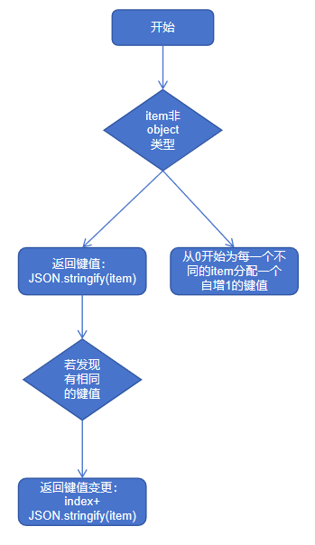

# Repeat：循环渲染(推荐)

Repeat组件基于数组类型数据来进行循环渲染，需要与容器组件配合使用，且接口返回的组件应当是允许包含在Repeat父容器组件中的子组件。例如，ListItem组件要求Repeat的父容器组件必须为[List组件](../reference/apis-arkui/arkui-ts/ts-container-list.md)。

Repeat循环渲染和ForEach相比有两个区别，一是优化了部分更新场景下的渲染性能，二是组件生成函数的索引index由框架侧来维护。

## 接口描述

### Repeat组件构造

```ts
declare const Repeat: <T>(arr: Array<T>) => RepeatAttribute<T>
```
参数说明：

| 参数名        | 参数类型                                | 是否必填 | 参数描述                                                     |
| ------------- | --------------------------------------- | -------- | ------------------------------------------------------------ |
| arr           | Array\<T\>                                   | 是       | 数据源，为`Array<T>`类型的数组，由开发者决定数据类型。 |
### Repeat组件属性

```ts
declare class RepeatAttribute<T> {
  each(itemGenerator: (repeatItem: RepeatItem<T>) => void): RepeatAttribute<T>;
  key(keyGenerator: (item: T, index: number) => string): RepeatAttribute<T>;
}
```
参数说明：

| 属性名        | 参数类型                                | 是否必填 | 参数描述                                                     |
| ------------- | --------------------------------------- | -------- | ------------------------------------------------------------ |
| each       | itemGenerator: (repeatItem: RepeatItem\<T\>) => void | 是       | 组件生成函数。<br/>**说明：**<br/>- each属性必须有，否则运行时会报错。<br/>- itemGenerator的参数为RepeatItem，该参数将item和index结合到了一起。 |
| key | keyGenerator: (item: T, index: number) => string | 是       | 键值生成函数。<br/>- 为数组中的每个元素创建对应的键值。<br/>- `item`：`arr`数组中的数据项。<br/>- `index`：`arr`数组中的数据项索引。 |

### RepeatItem类型

```ts
interface RepeatItem<T> {
  item: T,
  index?: number
}
```

参数说明：

| 参数名        | 参数类型                                | 是否必填 | 参数描述                                                     |
| ------------- | --------------------------------------- | -------- | ------------------------------------------------------------ |
| item          | T                                  | 是       | arr中每一个数据项。T为开发者传入的数据类型。 |
| index | number | 否      | 当前数据项对应的索引。 |

## 事件
### onMove

onMove(handler: Optional<(from: index, to: index) => void>)

拖拽排序数据移动回调。只有在List组件中使用，并且Repeat每次迭代都生成一个ListItem组件时才生效拖拽排序。

**系统能力：** SystemCapability.ArkUI.ArkUI.Full

**参数：** 

| 参数名 | 类型      | 必填 | 说明       |
| ------ | --------- | ---- | ---------- |
| from  | number | 是   | 数据源移动起始索引号。 |
| to  | number | 是   | 数据源移动目标索引号。 |

## 键值生成规则

在`Repeat`循环渲染过程中，系统会为每个数组元素生成一个唯一且持久的键值，用于标识对应的组件。当这个键值变化时，ArkUI框架将视为该数组元素已被替换或修改，会基于此去做对应的更新。若当前数组有数据项对应的键值与其他项重复，`Repeat`会为每一项数据补上`index`作为新的键值。

`Repeat`提供了key属性，参数是一个函数，开发者可以通过它自定义键值的生成规则。如果开发者没有调用`key`属性，则ArkUI框架会使用默认的键值生成函数。

ArkUI框架对于`Repeat`的键值生成有一套特定的判断规则，具体的键值生成规则判断逻辑如下图所示。

**图1** Repeat默认键值生成规则  


## 组件创建规则

在确定键值生成规则后，Repeat会根据键值生成规则为数据源的每个数据项创建组件。组件的创建包括两种情况：[Repeat首次渲染](#首次渲染)和[Repeat非首次渲染](#非首次渲染)。

### 首次渲染

在Repeat首次渲染时，会根据前述键值生成规则为数据源的每个数组项生成唯一键值，并创建相应的组件。

```ts
@Entry
@Component
struct Parent {
  @State simpleList: Array<string> = ['one', 'two', 'three'];

  build() {
    Row() {
      Column() {
        Repeat<string>(this.simpleList)
          .each((obj: RepeatItem<string>)=>{
            ChildItem({ item: obj.item })
          })
          .key((item: string) => item)
      }
      .width('100%')
      .height('100%')
    }
    .height('100%')
    .backgroundColor(0xF1F3F5)
  }
}

@Component
struct ChildItem {
  @Prop item: string;

  build() {
    Text(this.item)
      .fontSize(50)
  }
}
```

运行效果如下图所示。

**图2**  Repeat首次渲染运行效果图  


### 非首次渲染

#### 数据源变化

在Repeat组件进行非首次渲染时，它会依次对比上次的所有键值和本次更新之后的区别。若当前键值和上次的某一项键值相同，Repeat会直接复用子组件并对RepeatItem.index索引做对应的更新。

当Repeat将所有重复的键值对比完并做了相应的复用后，若上次的键值有不重复的且本次更新之后有新的键值生成需要新建子组件时，Repeat会复用上次多余的子组件并更新RepeatItem.item数据源和RepeatItem.index索引。

若上次的剩余>=本次新更新的数量，则组件完全复用，若上次的剩余小于本次新更新的数量，将剩余的组件复用完后，Repeat会新建多出来的数据项对应的组件。

```ts
@Entry
@Component
struct Parent {
  @State simpleList: Array<string> = ['one', 'two', 'three'];

  build() {
    Row() {
      Column() {
        Text('点击修改第3个数组项的值')
          .fontSize(24)
          .fontColor(Color.Red)
          .onClick(() => {
            this.simpleList[2] = 'new three';
          })

        Repeat<string>(this.simpleList)
            .each((obj: RepeatItem<string>)=>{
              ChildItem({ item: obj.item })
                .margin({top: 20})
            })
            .key((item: string) => item)
      }
      .justifyContent(FlexAlign.Center)
      .width('100%')
      .height('100%')
    }
    .height('100%')
    .backgroundColor(0xF1F3F5)
  }
}

@Component
struct ChildItem {
  @Prop item: string;

  build() {
    Text(this.item)
      .fontSize(30)
  }
}
```

运行效果如下图所示。

**图3**  Repeat非首次渲染案例运行效果图  


第三个数组项重新渲染时会复用之前的第三项的组件，仅对数据做了刷新。

#### 索引值变化

下方例子当我们交换数组项1和2时，若键值和上次保持一致，Repeat会复用之前的组件，仅对使用了index索引值的组件做数据刷新。

```ts
@Entry
@Component
struct Parent {
  @State simpleList: Array<string> = ['one', 'two', 'three'];

  build() {
    Row() {
      Column() {
        Text('交换数组项1，2')
          .fontSize(24)
          .fontColor(Color.Red)
          .onClick(() => {
            let temp: string = this.simpleList[2]
            this.simpleList[2] = this.simpleList[1]
            this.simpleList[1] = temp
          })
          .margin({bottom: 20})

        Repeat<string>(this.simpleList)
          .each((obj: RepeatItem<string>)=>{
            Text("index: " + obj.index)
              .fontSize(30)
            ChildItem({ item: obj.item })
              .margin({bottom: 20})
          })
          .key((item: string) => item)
      }
      .justifyContent(FlexAlign.Center)
      .width('100%')
      .height('100%')
    }
    .height('100%')
    .backgroundColor(0xF1F3F5)
  }
}

@Component
struct ChildItem {
  @Prop item: string;

  build() {
    Text(this.item)
      .fontSize(30)
  }
}
```

**图4**  Repeat交换数据更新index运行效果图  


#### 数据源数组项子属性变化

当数据源的数组项为对象数据类型，并且只修改某个数组项的属性值时，由于数据源为复杂数据类型，ArkUI框架无法监听到数据源数组项的属性变化，从而无法触发`Repeat`的重新渲染。为实现`Repeat`重新渲染，需要结合`@ObservedV2`和`@Trace`装饰器使用进行深度观测。

```ts
@ObservedV2
class Wrap2 {
  @Trace message: string = '';

  constructor(message: string) {
    this.message = message;
  }
}
@ObservedV2
class Wrap1 {
  @Trace message: Wrap2 = new Wrap2('');

  constructor(message: string) {
    this.message = new Wrap2(message);
  }
}

@Entry
@ComponentV2
struct Parent {
  @Local simpleList: Array<Wrap1> = [new Wrap1('one'), new Wrap1('two'), new Wrap1('three')];

  build() {
    Row() {
      Column() {
        Text('点击修改第3个数组项的值')
          .fontSize(24)
          .fontColor(Color.Red)
          .onClick(() => {
            this.simpleList[2].message.message = 'new three';
          })

        Repeat<Wrap1>(this.simpleList)
            .each((obj: RepeatItem<Wrap1>)=>{
              ChildItem({ item: obj.item.message.message })
                .margin({top: 20})
            })
            .key((item: Wrap1, index: number) => index.toString())
      }
      .justifyContent(FlexAlign.Center)
      .width('100%')
      .height('100%')
    }
    .height('100%')
    .backgroundColor(0xF1F3F5)
  }
}

@Component
struct ChildItem {
  @Local item: string = "default";
  
  build() {
    Text(this.item)
      .fontSize(30)
  }
}
```

上述代码的运行效果如下图所示。

**图5**  Repeat数据源数组项子属性变化运行效果图  


通过@ObservedV2和@Trace，此框架可以做到监听obj.item.message.message的变化并通知对应UI刷新。
## 拖拽排序
当Repeat在List组件下使用，并且设置了onMove事件，Repeat每次迭代都生成一个ListItem时，可以使能拖拽排序。拖拽排序离手后，如果数据位置发生变化，则会触发onMove事件，上报数据移动原始索引号和目标索引号。在onMove事件中，需要根据上报的起始索引号和目标索引号修改数据源。

```ts
@Entry
@Component
struct RepeatSort {
  @State arr: Array<string> = [];

  build() {
    Row() {
      List() {
        Repeat<string>(this.arr)
          .each((obj: RepeatItem<string>)=> {
            ListItem() {
              Text(obj.item.toString())
                .fontSize(16)
                .textAlign(TextAlign.Center)
                .size({height: 100, width: "100%"})
            }.margin(10)
            .borderRadius(10)
            .backgroundColor("#FFFFFFFF")
          })
          .key((item: string) => item)
          .onMove((from:number, to:number)=>{
            let tmp = this.arr.splice(from, 1);
            this.arr.splice(to, 0, tmp[0])
          })
      }
      .width('100%')
      .height('100%')
      .backgroundColor("#FFDCDCDC")
    }
  }
  aboutToAppear(): void {
    for (let i = 0; i < 100; i++) {
      this.arr.push(i.toString())
    }
  }
}
```

**图6** Repeat拖拽排序效果图  
