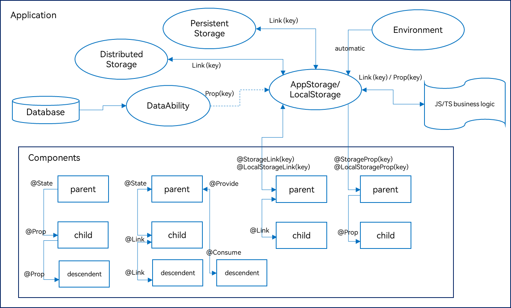

# 状态管理概述


在前文的描述中，我们构建的页面多为静态界面。如果希望构建一个动态的、有交互的界面，就需要引入“状态”的概念。


  **图1** 效果图  


上面的示例中，用户与应用程序的交互触发了文本状态变更，状态变更引起了UI渲染，UI从“Hello World”变更为“Hello ArkUI”。


在声明式UI编程框架中，UI是程序状态的运行结果，用户构建了一个UI模型，其中应用的运行时的状态是参数。当参数改变时，UI作为返回结果，也将进行对应的改变。这些运行时的状态变化所带来的UI的重新渲染，在ArkUI中统称为状态管理机制。


自定义组件拥有变量，变量必须被装饰器装饰才可以成为状态变量，状态变量的改变会引起UI的渲染刷新。如果不使用状态变量，UI只能在初始化时渲染，后续将不会再刷新。 下图展示了State和View（UI）之间的关系。


- View(UI)：UI渲染，一般指自定义组件的build方法和\@Builder装饰的方法内的UI描述。

- State：状态，一般指的是装饰器装饰的数据。用户通过触发组件的事件方法，改变状态数据。状态数据的改变，引起UI的重新渲染。


## 基本概念

- 状态变量：被状态装饰器装饰的变量，改变会引起UI的渲染更新。

- 常规变量：没有状态的变量，通常应用于辅助计算。它的改变永远不会引起UI的刷新。

- 数据源/同步源：状态变量的原始来源，可以同步给不同的状态数据。通常意义为父组件传给子组件的数据。

- 命名参数机制：父组件通过指定参数传递给子组件的状态变量，为父子传递同步参数的主要手段。示例：CompA: ({ aProp: this.aProp })。

- 从父组件初始化：父组件传使用命名参数机制，将指定参数传递给子组件。本地初始化的默认值在有父组件传值的情况下，会被覆盖。示例：

  ```ts
  @Component
  struct MyComponent {
    @State count: number = 0;
    private increaseBy: number = 1;

    build() {
    }
  }

  @Component
  struct Parent {
    build() {
      Column() {
        // 从父组件初始化，覆盖本地定义的默认值
        MyComponent({ count: 1, increaseBy: 2 })
      }
    }
  }
  ```

- 初始化子节点：组件中状态变量可以传递给子组件，初始化子组件对应的状态变量。示例同上。

- 本地初始化：变量声明的时候赋值，作为初始化的默认值。示例：\@State count: number = 0。


## 装饰器总览

ArkUI提供了多种装饰器，通过使用这些装饰器，状态变量不仅可以观察在组件内的改变，还可以在不同组件层级间传递，比如父子组件、跨组件层级，也可以观察全局范围内的变化。根据状态变量的影响范围，将所有的装饰器可以大致分为：


- 管理组件拥有状态的装饰器：组件级别的状态管理，可以观察组件内变化，和不同组件层级的变化，但需要唯一观察同一个组件树上，即同一个页面内。

- 管理应用拥有状态的装饰器：应用级别的状态管理，可以观察不同页面，甚至不同UIAbility的状态变化，是应用内全局的状态管理。


从数据的传递形式和同步类型层面看，装饰器也可分为：


- 只读的单向传递；

- 可变更的双向传递。


图示如下，具体装饰器的介绍，可详见[管理组件拥有的状态](arkts-state.md)和[管理应用拥有的状态](arkts-application-state-management-overview.md)。开发者可以灵活地利用这些能力来实现数据和UI的联动。





上图中，Components部分的装饰器为组件级别的状态管理，Application部分为应用的状态管理。开发者可以通过\@StorageLink/\@LocalStorageLink和\@StorageProp/\@LocalStorageProp实现应用和组件状态的双向和单向同步。图中箭头方向为数据同步方向，单箭头为单向同步，双箭头为双向同步。


[管理组件拥有的状态](arkts-state.md)，即图中Components级别的状态管理：


- \@State：\@State装饰的变量拥有其所属组件的状态，可以作为其子组件单向和双向同步的数据源。当其数值改变时，会引起相关组件的渲染刷新。

- \@Prop：\@Prop装饰的变量可以和父组件建立单向同步关系，\@Prop装饰的变量是可变的，但修改不会同步回父组件。

- \@Link：\@Link装饰的变量和父组件构建双向同步关系的状态变量，父组件会接受来自\@Link装饰的变量的修改的同步，父组件的更新也会同步给\@Link装饰的变量。

- \@Provide/\@Consume：\@Provide/\@Consume装饰的变量用于跨组件层级（多层组件）同步状态变量，可以不需要通过参数命名机制传递，通过alias（别名）或者属性名绑定。

- \@Observed：\@Observed装饰class，需要观察多层嵌套场景的class需要被\@Observed装饰。单独使用\@Observed没有任何作用，需要和\@ObjectLink、\@Prop连用。

- \@ObjectLink：\@ObjectLink装饰的变量接收\@Observed装饰的class的实例，应用于观察多层嵌套场景，和父组件的数据源构建双向同步。

> **说明：**
>
> 仅[\@Observed/\@ObjectLink](arkts-observed-and-objectlink.md)可以观察嵌套场景，其他的状态变量仅能观察第一层，详情见各个装饰器章节的“观察变化和行为表现”小节。


[管理应用拥有的状态](arkts-application-state-management-overview.md)，即图中Application级别的状态管理：


- AppStorage是应用程序中的一个特殊的单例LocalStorage对象，是应用级的数据库，和进程绑定，通过[@StorageProp](arkts-appstorage.md#storageprop)和[@StorageLink](arkts-appstorage.md#storagelink)装饰器可以和组件联动。

- AppStorage是应用状态的“中枢”，需要和组件（UI）交互的数据存入AppStorage，比如持久化数据PersistentStorage和环境变量Environment。UI再通过AppStorage提供的装饰器或者API接口，访问这些数据；

- 框架还提供了LocalStorage，AppStorage是LocalStorage特殊的单例。LocalStorage是应用程序声明的应用状态的内存“数据库”，通常用于页面级的状态共享，通过[@LocalStorageProp](arkts-localstorage.md#localstorageprop)和[@LocalStorageLink](arkts-localstorage.md#localstoragelink)装饰器可以和UI联动。


### 其他状态管理功能

\@Watch用于监听状态变量的变化。


$$运算符：给内置组件提供TS变量的引用，使得TS变量和内置组件的内部状态保持同步。
