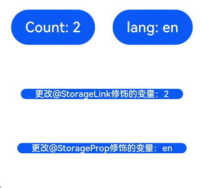

# 应用级变量的状态管理

在前面的章节中，已经讲述了如何管理页面级变量的状态，本章将说明如何管理应用级变量的状态，具体接口说明请参考[应用级变量的状态管理接口](../reference/arkui-ts/ts-state-management.md)。

## AppStorage

[AppStorage](../reference/arkui-ts/ts-state-management.md#appstorage)是应用程序中的单例对象，由UI框架在应用程序启动时创建，在应用程序退出时销毁，为应用程序范围内的可变状态属性提供中央存储。

AppStorage包含整个应用程序中需要访问的所有状态属性，只要应用程序保持运行，AppStorage就会保存所有属性及属性值，属性值可以通过唯一的键值进行访问。

组件可以通过装饰器将应用程序状态数据与AppStorage进行同步，应用业务逻辑的实现也可以通过接口访问AppStorage。

AppStorage的选择状态属性可以与不同的数据源或数据接收器同步，这些数据源和接收器可以是设备上的本地或远程，并具有不同的功能，如数据持久性。这样的数据源和接收器可以独立于UI在业务逻辑中实现。

默认情况下，AppStorage中的属性是可变的，AppStorage还可使用不可变（只读）属性。

> **说明**：[Worker](../reference/apis/js-apis-worker.md)和主线程只能通过[postMessage](../reference/apis/js-apis-worker.md#postmessage)交互，不能使用AppStorage进行交互。

### @StorageLink装饰器

组件通过使用@StorageLink(key)装饰的状态变量，与AppStorage建立双向数据绑定，key为AppStorage中的属性键值。当创建包含@StorageLink的状态变量的组件时，该状态变量的值将使用AppStorage中的值进行初始化。在UI组件中对@StorageLink的状态变量所做的更改将同步到AppStorage，并从AppStorage同步到任何其他绑定实例中，如PersistentStorage或其他绑定的UI组件。

### @StorageProp装饰器

组件通过使用@StorageProp(key)装饰的状态变量，与AppStorage建立单向数据绑定，key标识AppStorage中的属性键值。当创建包含@StorageProp的状态变量的组件时，该状态变量的值将使用AppStorage中的值进行初始化。AppStorage中属性值的更改会导致绑定该状态变量的UI组件进行状态更新。

### 示例

每次用户单击Count按钮时，this.varA变量值都会增加1，此变量与AppStorage中的varA同步。每次用户单击language按钮时，修改AppStorage中的languageCode，此修改会同步给this.languageCode变量。 

```ts
// xxx.ets
@Entry
@Component
struct ComponentA {
  @StorageLink('varA') varA: number = 2
  @StorageProp('languageCode') languageCode: string = 'en'
  private label: string = 'count'

  aboutToAppear() {
    this.label = (this.languageCode === 'zh') ? '数量' : 'Count'
  }

  build() {
    Column() {
      Row({ space: 20 }) {
        Button(`${this.label}: ${this.varA}`)
          .onClick(() => {
            AppStorage.Set<number>('varA', AppStorage.Get<number>('varA') + 1)
          })
        Button(`language: ${this.languageCode}`)
          .onClick(() => {
            if (AppStorage.Get<string>('languageCode') === 'zh') {
              AppStorage.Set<string>('languageCode', 'en')
            } else {
              AppStorage.Set<string>('languageCode', 'zh')
            }
            this.label = (this.languageCode === 'zh') ? '数量' : 'Count'
          })
      }
      .margin({ bottom: 50 })

      Row() {
        Button(`更改@StorageLink修饰的变量：${this.varA}`).height(40).fontSize(14)
          .onClick(() => {
            this.varA++
          })
      }.margin({ bottom: 50 })

      Row() {
        Button(`更改@StorageProp修饰的变量：${this.languageCode}`).height(40).fontSize(14)
          .onClick(() => {
            if (this.languageCode === 'zh') {
              this.languageCode = 'en'
            } else {
              this.languageCode = 'zh'
            }
          })
      }
    }
  }
}
```



## LocalStorage

> **说明：** 
> 
> 该接口从API version 9开始支持。后续版本如有新增内容，则采用上角标单独标记该内容的起始版本。

LocalStorage是应用程序中的存储单元，生命周期跟随其关联的Ability。在Stage模型下，LocalStorage解决AppStorage共享范围过大的问题，提供Ability之间全局数据的隔离。同时，LocalStorage为应用程序范围内的可变状态属性和非可变状态属性提供存储，可变状态属性和非可变状态属性是构建应用程序UI的一部分，如一个Ability的UI。解决App与Ability之间数据互相干扰问题，多实例场景下同一个Ability类的不同Ability实例之间的数据互相干扰问题。在分布式迁移的场景下，Ability是系统调度的最小单元，配合LocalStorage更方便实现组件的数据迁移。

应用层：一个应用程序可以创建多个LocalStorage实例，应用程序的每一个Ability对应一个LocalStorage实例。

Ability：一个应用程序可以拥有多个Ability，一个Ability中的所有子组件最多可以分配一个LocalStorage实例。并且，Ability中的所有子组件都将继承对此LocalStorage实例存储对象的访问权。

一个组件最多可以访问一个LocalStorage实例，一个LocalStorage对象可以分配给多个组件。

### @LocalStorageLink装饰器

组件通过使用@LocalStorageLink(key)装饰的状态变量，key值为LocalStorage中的属性键值，与LocalStorage建立双向数据绑定。当创建包含@LocalStorageLink的状态变量的组件时，该状态变量的值将会使用LocalStorage中的值进行初始化。如果LocalStorage中未定义初始值，将使用@LocalStorageLink定义的初始值。在UI组件中对@LocalStorageLink的状态变量所做的更改将同步到LocalStorage中，并从LocalStorage同步到Ability下的组件中。

### @LocalStorageProp装饰器

组件通过使用LocalStorageProp(key)装饰的状态变量，key值为LocalStorage中的属性键值，与LocalStorage建立单向数据绑定。当创建包含@LocalStorageProp的状态变量的组件时，该状态变量的值将使用LocalStorage中的值进行初始化。LocalStorage中的属性值的更改会导致当前Ability下的所有UI组件进行状态更新。

> **说明：** 创建LocalStorage实例时如未定义初始值，可以使用组件内@LocalStorageLink和@LocalStorageProp的初始值。如果定义时给定了初始值，那么不会再使用@LocalStorageLink和@LocalStorageProp的初始值。

### 示例1（在一个Ability中创建LocalStorage)

LocalStorage通过loadContent接口加载，接口说明详见[loadContent](../reference/apis/js-apis-window.md#loadcontent9-1)。

```ts
// MainAbility.ts
import Ability from '@ohos.application.Ability'

export default class MainAbility extends Ability {
    storage: LocalStorage

    onCreate() {
        this.storage = new LocalStorage()
        this.storage.setOrCreate('storageSimpleProp', 121)
        console.info('[Demo MainAbility onCreate]')
    }

    onDestroy() {
        console.info('[Demo MainAbility onDestroy]')
    }

    onWindowStageCreate(windowStage) {
        // storage作为参数传递给loadContent接口
        windowStage.loadContent('pages/index', this.storage)
    }

    onWindowStageDestroy() {
        console.info('[Demo] MainAbility onWindowStageDestroy')
    }

    onForeground() {
        console.info('[Demo] MainAbility onForeground')
    }

    onBackground() {
        console.info('[Demo] MainAbility onBackground')
    }
}
```

@Component组件获取数据

```ts
// index.ets
let storage = LocalStorage.GetShared()

@Entry(storage)
@Component
struct LocalStorageComponent {
  @LocalStorageLink('storageSimpleProp') simpleVarName: number = 0

  build() {
    Column() {
      Button(`LocalStorageLink: ${this.simpleVarName.toString()}`)
        .margin(20)
        .onClick(() => {
          this.simpleVarName += 1
        })
      Text(JSON.stringify(this.simpleVarName))
        .fontSize(50)
      LocalStorageComponentProp()
    }.width('100%')
  }
}

@Component
struct LocalStorageComponentProp {
  @LocalStorageProp('storageSimpleProp') simpleVarName: number = 0

  build() {
    Column() {
      Button(`LocalStorageProp: ${this.simpleVarName.toString()}`)
        .margin(20)
        .onClick(() => {
          this.simpleVarName += 1
        })
      Text(JSON.stringify(this.simpleVarName))
        .fontSize(50)
    }.width('100%')
  }
}
```


### 示例2（在Entry页面定义LocalStorage）

```ts
// xxx.ets
let storage = new LocalStorage({ "PropA": 47 })

@Entry(storage)
@Component
struct ComA {
  @LocalStorageLink("PropA") storageLink: number = 1

  build() {
    Column() {
      Text(`Parent from LocalStorage ${this.storageLink}`)
        .fontSize(18)
        .margin(20)
        .onClick(() => this.storageLink += 1)
      Child()
    }
  }
}

@Component
struct Child {
  @LocalStorageLink("PropA") storageLink: number = 1

  build() {
    Text(`Child from LocalStorage ${this.storageLink}`)
      .fontSize(18)
      .margin(20)
      .onClick(() => this.storageLink += 1)
  }
}
```


## PersistentStorage

[PersistentStorage](../reference/arkui-ts/ts-state-management.md#persistentstorage)提供了一些静态方法用来管理应用持久化数据，可以将特定标记的持久化数据链接到AppStorage中，并由AppStorage接口访问对应持久化数据，或者通过@StorageLink装饰器来访问对应key的变量。 

> **说明：**
>
> - PersistentStorage的PersistProp接口使用时，需要保证输入对应的key在AppStorage中存在。
> - PersistentStorage的DeleteProp接口使用时，只能对本次应用启动时已经link过的数据生效。

```ts
// xxx.ets
PersistentStorage.PersistProp('highScore', '0')

@Entry
@Component
struct PersistentComponent {
  @StorageLink('highScore') highScore: string = '0'
  @State currentScore: number = 0

  build() {
    Column() {
      if (this.currentScore === Number(this.highScore)) {
        Text(`new highScore : ${this.highScore}`).fontSize(18)
      }
      Button(`goal!, currentScore : ${this.currentScore}`)
        .margin(20)
        .onClick(() => {
          this.currentScore++
          if (this.currentScore > Number(this.highScore)) {
            this.highScore = this.currentScore.toString()
          }
        })
    }.width('100%')
  }
}
```


## Environment

[Environment](../reference/arkui-ts/ts-state-management.md#environment)是框架在应用程序启动时创建的单例对象，它为AppStorage提供了一系列应用程序需要的环境状态数据，这些数据描述了应用程序运行的设备环境，包括系统语言、深浅色模式等等。Environment及其属性是不可变的，所有数据类型均为简单类型。如下示例展示了从Environment获取系统是否开启无障碍屏幕朗读：

```ts
Environment.EnvProp('accessibilityEnabled', 'default')
var enable = AppStorage.Get('accessibilityEnabled')
```

accessibilityEnabled是Environment提供的系统默认变量识别符。首先需要将对应系统属性绑定到AppStorage上，再通过AppStorage中的方法或者装饰器访问对应的系统属性数据。