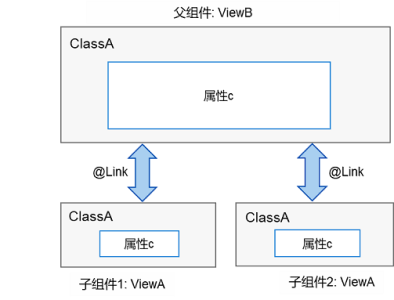
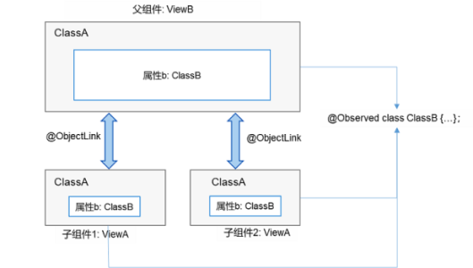

# 页面级变量的状态管理

@State、@Prop、@Link、@Provide、@Consume、@ObjectLink、@Observed和@Watch用于管理页面级变量的状态。

请参考[状态变量多种数据类型声明的使用限制](./arkts-restrictions-and-extensions.md)了解@State、@Provide、 @Link和@Consume四种状态变量的约束条件。

## @State

@State装饰的变量是组件内部的状态数据，当这些状态数据被修改时，将会调用所在组件的build方法进行UI刷新。

@State状态数据具有以下特征：

- 支持多种类型数据：支持class、number、boolean、string强类型数据的值类型和引用类型，以及这些强类型构成的数组，即Array&lt;class&gt;、Array&lt;string&gt;、Array&lt;boolean&gt;、Array&lt;number&gt;。不支持object和any。
- 支持多实例：组件不同实例的内部状态数据独立。
- 内部私有：标记为@State的属性是私有变量，只能在组件内访问。
- 需要本地初始化：必须为所有@State变量分配初始值，变量未初始化可能导致未定义的框架异常行为。
- 创建自定义组件时支持通过状态变量名设置初始值：在创建组件实例时，可以通过变量名显式指定@State状态变量的初始值。

**示例：**

在下面的示例中：

- 用户定义的组件MyComponent定义了@State状态变量count和title。如果count或title的值发生变化，则执行MyComponent的build方法来重新渲染组件；

- EntryComponent中有多个MyComponent组件实例，第一个MyComponent内部状态的更改不会影响第二个MyComponent；

- 创建MyComponent实例时通过变量名给组件内的变量进行初始化，如：

  ```ts
  MyComponent({ title: { value: 'Hello World 2' }, count: 7 })
  ```

```ts
// xxx.ets
class Model {
  value: string

  constructor(value: string) {
    this.value = value
  }
}

@Entry
@Component
struct EntryComponent {
  build() {
    Column() {
      MyComponent({ count: 1, increaseBy: 2 }) // 第1个MyComponent实例
      MyComponent({ title: { value: 'Hello World 2' }, count: 7 }) // 第2个MyComponent实例
    }
  }
}

@Component
struct MyComponent {
  @State title: Model = { value: 'Hello World' }
  @State count: number = 0
  private toggle: string = 'Hello World'
  private increaseBy: number = 1

  build() {
    Column() {
      Text(`${this.title.value}`).fontSize(30)
      Button('Click to change title')
        .margin(20)
        .onClick(() => {
          // 修改内部状态变量title
          this.title.value = (this.toggle == this.title.value) ? 'Hello World' : 'Hello ArkUI'
        })

      Button(`Click to increase count=${this.count}`)
        .margin(20)
        .onClick(() => {
          // 修改内部状态变量count
          this.count += this.increaseBy
        })
    }
  }
}
```


## @Prop

@Prop与@State有相同的语义，但初始化方式不同。@Prop装饰的变量必须使用其父组件提供的@State变量进行初始化，允许组件内部修改@Prop变量，但变量的更改不会通知给父组件，父组件变量的更改会同步到@prop装饰的变量，即@Prop属于单向数据绑定。

@Prop状态数据具有以下特征：

- 支持简单类型：仅支持number、string、boolean等简单数据类型；
- 私有：仅支持组件内访问；
- 支持多个实例：一个组件中可以定义多个标有@Prop的属性；
- 创建自定义组件时将值传递给@Prop变量进行初始化：在创建组件的新实例时，必须初始化所有@Prop变量，不支持在组件内部进行初始化。

**示例：**

在下面的示例中，当按“+1”或“-1”按钮时，父组件状态发生变化，重新执行build方法，此时将创建一个新的CountDownComponent组件实例。父组件的countDownStartValue状态变量被用于初始化子组件的@Prop变量，当按下子组件的“count - costOfOneAttempt”按钮时，其@Prop变量count将被更改，CountDownComponent重新渲染，但是count值的更改不会影响父组件的countDownStartValue值。 

```ts
// xxx.ets
@Entry
@Component
struct ParentComponent {
  @State countDownStartValue: number = 10 // 初始化countDownStartValue

  build() {
    Column() {
      Text(`Grant ${this.countDownStartValue} nuggets to play.`).fontSize(18)
      Button('+1 - Nuggets in New Game')
        .margin(15)
        .onClick(() => {
          this.countDownStartValue += 1
        })

      Button('-1  - Nuggets in New Game')
        .margin(15)
        .onClick(() => {
          this.countDownStartValue -= 1
        })
      // 创建子组件时，必须在构造函数参数中提供其@Prop变量count的初始值，同时初始化常规变量costOfOneAttempt（非Prop变量）
      CountDownComponent({ count: this.countDownStartValue, costOfOneAttempt: 2 })
    }
  }
}

@Component
struct CountDownComponent {
  @Prop count: number
  private costOfOneAttempt: number

  build() {
    Column() {
      if (this.count > 0) {
        Text(`You have ${this.count} Nuggets left`).fontSize(18)
      } else {
        Text('Game over!').fontSize(18)
      }

      Button('count - costOfOneAttempt')
        .margin(15)
        .onClick(() => {
          this.count -= this.costOfOneAttempt
        })
    }
  }
}
```


## @Link

@Link装饰的变量可以和父组件的@State变量建立双向数据绑定：

- 支持多种类型：@Link支持的数据类型与@State相同，即class、number、string、boolean或这些类型的数组；
- 私有：仅支持组件内访问；
- 单个数据源：父组件中用于初始化子组件@Link变量的必须是@State变量；
- 双向通信：子组件对@Link变量的更改将同步修改父组件中的@State变量；
- 创建自定义组件时需要将变量的引用传递给@Link变量，在创建组件的新实例时，必须使用命名参数初始化所有@Link变量。@Link变量可以使用@State变量或@Link变量的引用进行初始化，@State变量可以通过`'$'`操作符创建引用。

> **说明：** 
> 
> @Link变量不能在组件内部进行初始化。

**简单类型示例：**

@Link语义是从`'$'`操作符引出，即`$isPlaying`是`this.isPlaying`内部状态的双向数据绑定。当单击子组件PlayButton中的按钮时，@Link变量更改，PlayButton与父组件中的Text和Button将同时进行刷新，同样地，当点击父组件中的Button修改`this.isPlaying`时，子组件PlayButton与父组件中的Text和Button也将同时刷新。 

```ts
// xxx.ets
@Entry
@Component
struct Player {
  @State isPlaying: boolean = false

  build() {
    Column() {
      PlayButton({ buttonPlaying: $isPlaying })
      Text(`Player is ${this.isPlaying ? '' : 'not'} playing`).fontSize(18)
      Button('Parent:' + this.isPlaying)
        .margin(15)
        .onClick(() => {
          this.isPlaying = !this.isPlaying
        })
    }
  }
}

@Component
struct PlayButton {
  @Link buttonPlaying: boolean

  build() {
    Column() {
      Button(this.buttonPlaying ? 'pause' : 'play')
        .margin(20)
        .onClick(() => {
          this.buttonPlaying = !this.buttonPlaying
        })
    }
  }
}
```

**复杂类型示例：**

```ts
// xxx.ets
@Entry
@Component
struct Parent {
  @State arr: number[] = [1, 2, 3]

  build() {
    Column() {
      Child({ items: $arr })
      Button('Parent Button: splice')
        .margin(10)
        .onClick(() => {
          this.arr.splice(0, 1, 60)
        })
      ForEach(this.arr, item => {
        Text(item.toString()).fontSize(18).margin(10)
      }, item => item.toString())
    }
  }
}


@Component
struct Child {
  @Link items: number[]

  build() {
    Column() {
      Button('Child Button1: push')
        .margin(15)
        .onClick(() => {
          this.items.push(100)
        })
      Button('Child Button2: replace whole item')
        .margin(15)
        .onClick(() => {
          this.items = [100, 200, 300]
        })
    }
  }
}
```

**@Link、@State和@Prop结合使用示例：**

下面示例中，ParentView包含ChildA和ChildB两个子组件，ParentView的状态变量counter分别用于初始化ChildA的@Prop变量和ChildB的@Link变量。

- ChildB使用@Link建立双向数据绑定，当ChildB修改counterRef状态变量值时，该更改将同步到ParentView和ChildA共享；
- ChildA使用@Prop建立从ParentView到自身的单向数据绑定，当ChildA修改counterVal状态变量值时，ChildA将重新渲染，但该更改不会传达给ParentView和ChildB。

```ts
// xxx.ets
@Entry
@Component
struct ParentView {
  @State counter: number = 0

  build() {
    Column() {
      ChildA({ counterVal: this.counter })
      ChildB({ counterRef: $counter })
    }
  }
}

@Component
struct ChildA {
  @Prop counterVal: number

  build() {
    Button(`ChildA: (${this.counterVal}) + 1`)
      .margin(15)
      .onClick(() => {
        this.counterVal += 1
      })
  }
}

@Component
struct ChildB {
  @Link counterRef: number

  build() {
    Button(`ChildB: (${this.counterRef}) + 1`)
      .margin(15)
      .onClick(() => {
        this.counterRef += 1
      })
  }
}
```

## @Observed和ObjectLink数据管理

当开发者需要在子组件中针对父组件的一个变量（parent_a）设置双向同步时，开发者可以在父组件中使用@State装饰变量（parent_a），并在子组件中使用@Link装饰对应的变量（child_a）。这样不仅可以实现父组件与单个子组件之间的数据同步，也可以实现父组件与多个子组件之间的数据同步。如下图所示，可以看到，父子组件针对ClassA类型的变量设置了双向同步，那么当子组件1中变量对应的属性c的值变化时，会通知父组件同步变化，而当父组件中属性c的值变化时，会通知所有子组件同步变化。



然而，上述例子是针对某个数据对象进行的整体同步，而当开发者只想针对父组件中某个数据对象的部分信息进行同步时，使用@Link就不能满足要求。如果这些部分信息是一个类对象，就可以使用@ObjectLink配合@Observed来实现，如下图所示。



### 设置要求

- @Observed用于类，@ObjectLink用于变量。

- @ObjectLink装饰的变量类型必须为类（class type）。
  - 类要被@Observed装饰器所装饰。
  - 不支持简单类型参数，可以使用@Prop进行单向同步。

- @ObjectLink装饰的变量是不可变的。
  - 属性的改动是被允许的，当改动发生时，如果同一个对象被多个@ObjectLink变量所引用，那么所有拥有这些变量的自定义组件都会被通知进行重新渲染。

- @ObjectLink装饰的变量不可设置默认值。
  - 必须让父组件中有一个由@State、@Link、@StorageLink、@Provide或@Consume装饰的变量所参与的TS表达式进行初始化。

- @ObjectLink装饰的变量是私有变量，只能在组件内访问。


### 示例

```ts
// xxx.ets
// 父组件ViewB中的类对象ClassA与子组件ViewA保持数据同步时，可以使用@ObjectLink和@Observed，绑定该数据对象的父组件和其他子组件同步更新
var nextID: number = 0

@Observed
class ClassA {
  public name: string
  public c: number
  public id: number

  constructor(c: number, name: string = 'OK') {
    this.name = name
    this.c = c
    this.id = nextID++
  }
}

@Component
struct ViewA {
  label: string = 'ViewA1'
  @ObjectLink a: ClassA

  build() {
    Row() {
      Button(`ViewA [${this.label}] this.a.c= ${this.a.c} +1`)
        .onClick(() => {
          this.a.c += 1
        })
    }.margin({ top: 10 })
  }
}

@Entry
@Component
struct ViewB {
  @State arrA: ClassA[] = [new ClassA(0), new ClassA(0)]

  build() {
    Column() {
      ForEach(this.arrA, (item) => {
        ViewA({ label: `#${item.id}`, a: item })
      }, (item) => item.id.toString())
      ViewA({ label: `this.arrA[first]`, a: this.arrA[0] })
      ViewA({ label: `this.arrA[last]`, a: this.arrA[this.arrA.length - 1] })

      Button(`ViewB: reset array`)
        .margin({ top: 10 })
        .onClick(() => {
          this.arrA = [new ClassA(0), new ClassA(0)]
        })
      Button(`ViewB: push`)
        .margin({ top: 10 })
        .onClick(() => {
          this.arrA.push(new ClassA(0))
        })
      Button(`ViewB: shift`)
        .margin({ top: 10 })
        .onClick(() => {
          this.arrA.shift()
        })
    }.width('100%')
  }
}
```


## @Consume和@Provide

@Provide作为数据的提供方，可以更新其子孙节点的数据，并触发页面渲染。@Consume在感知到@Provide数据的更新后，会触发当前自定义组件的重新渲染。

> **说明：** 
> 
> 使用@Provide和@Consume时应避免循环引用导致死循环。

### @Provide

| 名称           | 说明                                                         |
| -------------- | ------------------------------------------------------------ |
| 装饰器参数     | 是一个string类型的常量，用于给装饰的变量起别名。如果规定别名，则提供对应别名的数据更新。如果没有，则使用变量名作为别名。推荐使用@Provide('alias')这种形式。 |
| 同步机制       | @Provide的变量类似@State，可以修改对应变量进行页面重新渲染。也可以修改@Consume装饰的变量，反向修改@State变量。 |
| 初始值         | 必须设置初始值。                                             |
| 页面重渲染场景 | 触发页面渲染的修改： <br/>- 基础类型（boolean，string，number）变量的改变； <br/>- @Observed class类型变量及其属性的修改； <br/>- 添加，删除，更新数组中的元素。 |

### @Consume

| 类型   | 说明             |
| ------ | ---------------- |
| 初始值 | 不可设置默认初始值。 |

### 示例

```ts
// xxx.ets
@Entry
@Component
struct CompA {
  @Provide("reviewVote") reviewVotes: number = 0;

  build() {
    Column() {
      CompB()
      Button(`CompA: ${this.reviewVotes}`)
        .margin(10)
        .onClick(() => {
          this.reviewVotes += 1;
        })
    }
  }
}

@Component
struct CompB {
  build() {
    Column() {
      CompC()
    }
  }
}

@Component
struct CompC {
  @Consume("reviewVote") reviewVotes: number

  build() {
    Column() {
      Button(`CompC: ${this.reviewVotes}`)
        .margin(10)
        .onClick(() => {
          this.reviewVotes += 1
        })
    }.width('100%')
  }
}
```

## @Watch

@Watch用于监听状态变量的变化，语法结构为：

```ts
@State @Watch("onChanged") count : number = 0
```

如上所示，给状态变量增加一个@Watch装饰器，通过@Watch注册一个回调方法onChanged， 当状态变量count被改变时， 触发onChanged回调。

装饰器@State、@Prop、@Link、@ObjectLink、@Provide、@Consume、@StorageProp以及@StorageLink所装饰的变量均可以通过@Watch监听其变化。


>  **说明：**
>
>  深层次数据修改不会触发@Watch回调，例如无法监听数组中对象值的改变。

```ts
// xxx.ets
@Entry
@Component
struct CompA {
  @State @Watch('onBasketUpdated') shopBasket: Array<number> = [7, 12, 47, 3]
  @State totalPurchase: number = 0
  @State addPurchase: number = 0

  aboutToAppear() {
    this.updateTotal()
  }

  updateTotal(): number {
    let sum = 0;
    this.shopBasket.forEach((i) => {
      sum += i
    })
    // 计算新的购物篮总价值，如果超过100，则适用折扣
    this.totalPurchase = (sum < 100) ? sum : 0.9 * sum
    return this.totalPurchase
  }

  // shopBasket更改时触发该方法
  onBasketUpdated(propName: string): void {
    this.updateTotal()
  }

  build() {
    Column() {
      Button('add to basket ' + this.addPurchase)
        .margin(15)
        .onClick(() => {
          this.addPurchase = Math.round(100 * Math.random())
          this.shopBasket.push(this.addPurchase)
        })
      Text(`${this.totalPurchase}`)
        .fontSize(30)
    }
  }
}
```