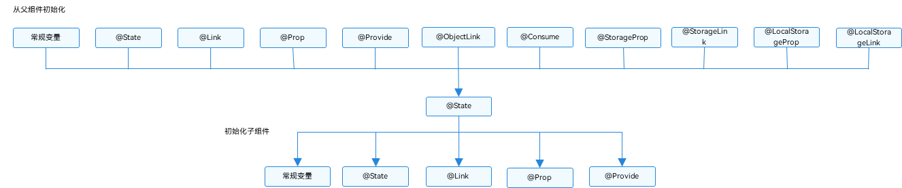

# \@State装饰器：组件内状态


\@State装饰的变量，或称为状态变量，一旦变量拥有了状态属性，就和自定义组件的渲染绑定起来。当状态改变时，UI会发生对应的渲染改变。


在状态变量相关装饰器中，\@State是最基础的，使变量拥有状态属性的装饰器，它也是大部分状态变量的数据源。


> **说明：**
>
> 从API version 9开始，该装饰器支持在ArkTS卡片中使用。


## 概述

\@State装饰的变量，与声明式范式中的其他被装饰变量一样，是私有的，只能从组件内部访问，在声明时必须指定其类型和本地初始化。初始化也可选择使用命名参数机制从父组件完成初始化。

\@State装饰的变量拥有以下特点：

- \@State装饰的变量与子组件中的\@Prop、\@Link或\@ObjectLink装饰变量之间建立单向或双向数据同步。

- \@State装饰的变量生命周期与其所属自定义组件的生命周期相同。


## 装饰器使用规则说明

| \@State变量装饰器  | 说明                                                         |
| ------------------ | ------------------------------------------------------------ |
| 装饰器参数         | 无                                                           |
| 同步类型           | 不与父组件中任何类型的变量同步。                             |
| 允许装饰的变量类型 | Object、class、string、number、boolean、enum类型，以及这些类型的数组。<br/>支持Date类型。<br/>支持类型的场景请参考[观察变化](#观察变化)。<br/>类型必须被指定。<br/>不支持any，不支持简单类型和复杂类型的联合类型，不允许使用undefined和null。<br/>**说明：**<br/>不支持Length、ResourceStr、ResourceColor类型，Length、ResourceStr、ResourceColor为简单类型和复杂类型的联合类型。 |
| 被装饰变量的初始值 | 必须本地初始化。                                               |


## 变量的传递/访问规则说明

| 传递/访问          | 说明                                                         |
| ------------------ | ------------------------------------------------------------ |
| 从父组件初始化     | 可选，从父组件初始化或者本地初始化。如果从父组件初始化将会覆盖本地初始化。<br/>支持父组件中常规变量、\@State、\@Link、\@Prop、\@Provide、\@Consume、\@ObjectLink、\@StorageLink、\@StorageProp、\@LocalStorageLink和\@LocalStorageProp装饰的变量，初始化子组件的\@State。 |
| 用于初始化子组件   | \@State装饰的变量支持初始化子组件的常规变量、\@State、\@Link、\@Prop、\@Provide。 |
| 是否支持组件外访问 | 不支持，只能在组件内访问。                                   |

  **图1** 初始化规则图示  




## 观察变化和行为表现

并不是状态变量的所有更改都会引起UI的刷新，只有可以被框架观察到的修改才会引起UI刷新。该小节去介绍什么样的修改才能被观察到，以及观察到变化后，框架的是怎么引起UI刷新的，即框架的行为表现是什么。


### 观察变化

- 当装饰的数据类型为boolean、string、number类型时，可以观察到数值的变化。

  ```ts
  // for simple type
  @State count: number = 0;
  // value changing can be observed
  this.count = 1;
  ```

- 当装饰的数据类型为class或者Object时，可以观察到自身的赋值的变化，和其属性赋值的变化，即Object.keys(observedObject)返回的所有属性。例子如下。
    声明ClassA和Model类。

    ```ts
      class ClassA {
        public value: string;
      
        constructor(value: string) {
          this.value = value;
        }
      }
      
      class Model {
        public value: string;
        public name: ClassA;
        constructor(value: string, a: ClassA) {
          this.value = value;
          this.name = a;
        }
      }
    ```

    \@State装饰的类型是Model

    ```ts
    // class类型
     @State title: Model = new Model('Hello', new ClassA('World'));
    ```

    对\@State装饰变量的赋值。

    ```ts
    // class类型赋值
    this.title = new Model('Hi', new ClassA('ArkUI'));
    ```

    对\@State装饰变量的属性赋值。

    ```ts
    // class属性的赋值
    this.title.value = 'Hi'
    ```

    嵌套属性的赋值观察不到。

    ```ts
    // 嵌套的属性赋值观察不到
    this.title.name.value = 'ArkUI'
    ```
- 当装饰的对象是array时，可以观察到数组本身的赋值和添加、删除、更新数组的变化。例子如下。
  声明ClassA和Model类。

  ```ts
  class Model {
    public value: number;
    constructor(value: number) {
      this.value = value;
    }
  }
  ```

  \@State装饰的对象为Model类型数组时。

  ```ts
  @State title: Model[] = [new Model(11), new Model(1)]
  ```

  数组自身的赋值可以观察到。

  ```ts
  this.title = [new Model(2)]
  ```

  数组项的赋值可以观察到。

  ```ts
  this.title[0] = new Model(2)
  ```

  删除数组项可以观察到。

  ```ts
  this.title.pop()
  ```

  新增数组项可以观察到。

  ```ts
  this.title.push(new Model(12))
  ```

- 当装饰的对象是Date时，可以观察到Date整体的赋值，同时可通过调用Date的接口`setFullYear`, `setMonth`, `setDate`, `setHours`, `setMinutes`, `setSeconds`, `setMilliseconds`, `setTime`, `setUTCFullYear`, `setUTCMonth`, `setUTCDate`, `setUTCHours`, `setUTCMinutes`, `setUTCSeconds`, `setUTCMilliseconds` 更新Date的属性。

  ```ts
  @Entry
  @Component
  struct DatePickerExample {
    @State selectedDate: Date = new Date('2021-08-08')
  
    build() {
      Column() {
        Button('set selectedDate to 2023-07-08')
          .margin(10)
          .onClick(() => {
            this.selectedDate = new Date('2023-07-08')
          })
        Button('increase the year by 1')
          .margin(10)
          .onClick(() => {
            this.selectedDate.setFullYear(this.selectedDate.getFullYear() + 1)
          })
        Button('increase the month by 1')
          .margin(10)
          .onClick(() => {
            this.selectedDate.setMonth(this.selectedDate.getMonth() + 1)
          })
        Button('increase the day by 1')
          .margin(10)
          .onClick(() => {
            this.selectedDate.setDate(this.selectedDate.getDate() + 1)
          })
        DatePicker({
          start: new Date('1970-1-1'),
          end: new Date('2100-1-1'),
          selected: this.selectedDate
        })
      }.width('100%')
    }
  }
  ```

### 框架行为

- 当状态变量被改变时，查询依赖该状态变量的组件；

- 执行依赖该状态变量的组件的更新方法，组件更新渲染；

- 和该状态变量不相关的组件或者UI描述不会发生重新渲染，从而实现页面渲染的按需更新。


## 使用场景


### 装饰简单类型的变量

以下示例为\@State装饰的简单类型，count被\@State装饰成为状态变量，count的改变引起Button组件的刷新：

- 当状态变量count改变时，查询到只有Button组件关联了它；

- 执行Button组件的更新方法，实现按需刷新。


```ts
@Entry
@Component
struct MyComponent {
  @State count: number = 0;

  build() {
    Button(`click times: ${this.count}`)
      .onClick(() => {
        this.count += 1;
      })
  }
}
```


### 装饰class对象类型的变量

- 自定义组件MyComponent定义了被\@State装饰的状态变量count和title，其中title的类型为自定义类Model。如果count或title的值发生变化，则查询MyComponent中使用该状态变量的UI组件，并进行重新渲染。

- EntryComponent中有多个MyComponent组件实例，第一个MyComponent内部状态的更改不会影响第二个MyComponent。


```ts
class Model {
  public value: string;

  constructor(value: string) {
    this.value = value;
  }
}

@Entry
@Component
struct EntryComponent {
  build() {
    Column() {
      // 此处指定的参数都将在初始渲染时覆盖本地定义的默认值，并不是所有的参数都需要从父组件初始化
      MyComponent({ count: 1, increaseBy: 2 })
      MyComponent({ title: new Model('Hello, World 2'), count: 7 })
    }
  }
}

@Component
struct MyComponent {
  @State title: Model = new Model('Hello World');
  @State count: number = 0;
  private increaseBy: number = 1;

  build() {
    Column() {
      Text(`${this.title.value}`)
      Button(`Click to change title`).onClick(() => {
        // @State变量的更新将触发上面的Text组件内容更新
        this.title.value = this.title.value === 'Hello ArkUI' ? 'Hello World' : 'Hello ArkUI';
      })

      Button(`Click to increase count=${this.count}`).onClick(() => {
        // @State变量的更新将触发该Button组件的内容更新
        this.count += this.increaseBy;
      })
    }
  }
}
```


从该示例中，我们可以了解到\@State变量首次渲染的初始化流程：


1. 使用默认的本地初始化：

   ```ts
   @State title: Model = new Model('Hello World');
   @State count: number = 0;
   ```

2. 对于\@State来说，命名参数机制传递的值并不是必选的，如果没有命名参数传值，则使用本地初始化的默认值：

   ```ts
   MyComponent({ count: 1, increaseBy: 2 })
   ```
