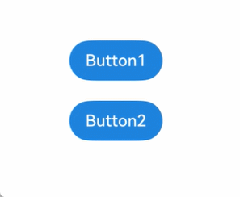

# stateStyles：多态样式


\@Styles仅仅应用于静态页面的样式复用，stateStyles可以依据组件的内部状态的不同，快速设置不同样式。这就是我们本章要介绍的内容stateStyles（又称为：多态样式）。

> **说明**：
>
> 多态样式仅支持通用属性

## 概述

stateStyles是属性方法，可以根据UI内部状态来设置样式，类似于css伪类，但语法不同。ArkUI提供以下五种状态：

- focused：获焦态。

- normal：正常态。

- pressed：按压态。

- disabled：不可用态。

- selected<sup>10+</sup>：选中态。

> **说明**：
>
> 获焦态目前仅支持通过外接键盘的tab键、方向键触发。不支持嵌套滚动组件场景按键走焦。


## 使用场景


### 基础场景

下面的示例展示了stateStyles最基本的使用场景。Button1处于第一个组件，Button2处于第二个组件。按压时显示为pressed态指定的黑色。使用Tab键走焦，先是Button1获焦并显示为focus态指定的粉色。当Button2获焦的时候，Button2显示为focus态指定的粉色，Button1失焦显示normal态指定的蓝色。


```ts
@Entry
@Component
struct StateStylesSample {
  build() {
    Column() {
      Button('Button1')
        .stateStyles({
          focused: {
            .backgroundColor('#ffffeef0')
          },
          pressed: {
            .backgroundColor('#ff707070')
          },
          normal: {
            .backgroundColor('#ff2787d9')
          }
        })
        .margin(20)
      Button('Button2')
        .stateStyles({
          focused: {
            .backgroundColor('#ffffeef0')
          },
          pressed: {
            .backgroundColor('#ff707070')
          },
          normal: {
            .backgroundColor('#ff2787d9')
          }
        })
    }.margin('30%')
  }
}
```


  **图1** 获焦态和按压态  




### \@Styles和stateStyles联合使用

以下示例通过\@Styles指定stateStyles的不同状态。


```ts
@Entry
@Component
struct MyComponent {
  @Styles normalStyle() {
    .backgroundColor(Color.Gray)
  }

  @Styles pressedStyle() {
    .backgroundColor(Color.Red)
  }

  build() {
    Column() {
      Text('Text1')
        .fontSize(50)
        .fontColor(Color.White)
        .stateStyles({
          normal: this.normalStyle,
          pressed: this.pressedStyle,
        })
    }
  }
}
```

  **图2** 正常态和按压态  


### 在stateStyles里使用常规变量和状态变量

stateStyles可以通过this绑定组件内的常规变量和状态变量。


```ts
@Entry
@Component
struct CompWithInlineStateStyles {
  @State focusedColor: Color = Color.Red;
  normalColor: Color = Color.Green

  build() {
    Column() {
      Button('clickMe').height(100).width(100)
        .stateStyles({
          normal: {
            .backgroundColor(this.normalColor)
          },
          focused: {
            .backgroundColor(this.focusedColor)
          }
        })
        .onClick(() => {
          this.focusedColor = Color.Pink
        })
        .margin('30%')
    }
  }
}
```

Button默认normal态显示绿色，第一次按下Tab键让Button获焦显示为focus态的红色，点击事件触发后，再次按下Tab键让Button获焦，focus态变为粉色。

  **图3** 点击改变获焦态样式  


