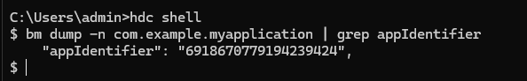

# 应用程序包常见问题
<!--Kit: Ability Kit-->
<!--Subsystem: BundleManager-->
<!--Owner: @wanghang904-->
<!--Designer: @hanfeng6-->
<!--Tester: @kongjing2-->
<!--Adviser: @Brilliantry_Rui-->

## 如何获取签名信息中的指纹信息

* 通过调用接口获取。

可以调用[bundleManager.getBundleInfoForSelf](../reference/apis-ability-kit/js-apis-bundleManager.md#bundlemanagergetbundleinfoforself)获取自身的BundleInfo应用包信息，应用包信息中包含signatureInfo签名信息，签名信息中包含fingerprint指纹信息。

```ts
import { bundleManager } from '@kit.AbilityKit';
import { BusinessError } from '@kit.BasicServicesKit';
import { hilog } from '@kit.PerformanceAnalysisKit';

let bundleFlags = bundleManager.BundleFlag.GET_BUNDLE_INFO_WITH_APPLICATION | bundleManager.BundleFlag.GET_BUNDLE_INFO_WITH_SIGNATURE_INFO;
try {
  bundleManager.getBundleInfoForSelf(bundleFlags).then((bundleInfo:bundleManager.BundleInfo) => {
    console.info('testTag', 'getBundleInfoForSelf successfully. fingerprint: %{public}s', bundleInfo.signatureInfo.fingerprint);
  }).catch((err: BusinessError) => {
    console.error('testTag', 'getBundleInfoForSelf failed. Cause: %{public}s', err.message);
  });
} catch (err) {
  let message = (err as BusinessError).message;
  console.error('testTag', 'getBundleInfoForSelf failed: %{public}s', message);
}
```

* 通过[bm工具](../tools/bm-tool.md)获取fingerprint指纹信息。

```shell
hdc shell
# 需将com.example.myapplication替换为实际应用的包名
bm dump -n com.example.myapplication | grep fingerprint 
```


* 通过.cer证书文件获取，可以参考[APP备案FAQ](https://developer.huawei.com/consumer/cn/doc/app/50130)中HarmonyOS应用/元服务如何获取公钥和签名信息。

* 通过keytool工具获取，详情参考[生成签名证书指纹](https://developer.huawei.com/consumer/cn/doc/AppGallery-connect-Guides/appgallerykit-preparation-game-0000001055356911#section147011294331)。

## 什么是appIdentifier

appIdentifier是[Profile文件](https://developer.huawei.com/consumer/cn/doc/app/agc-help-add-releaseprofile-0000001914714796)中的一个字段，为应用的唯一标识，在应用签名时生成，其中：
1. 通过DevEco Studio工具[自动签名](https://developer.huawei.com/consumer/cn/doc/harmonyos-guides/ide-signing#section18815157237)生成，此时的appIdentifier字段是随机生成的，在不同的设备上签名、或者重新签名均会导致appIdentifier字段不一致。
2. 采用手动签名，并通过AppGallery Connect平台申请证书，此时申请[调试Profile](https://developer.huawei.com/consumer/cn/doc/app/agc-help-debug-profile-0000002248181278)或者[发布Profile](https://developer.huawei.com/consumer/cn/doc/app/agc-help-release-profile-0000002248341090)中的appIdentifier字段是固定的，该字段来源于AppGallery Connect创建应用时生成的[APP ID](https://developer.huawei.com/consumer/cn/doc/app/agc-help-createharmonyapp-0000001945392297)，由云端统一分配。此时的appIdentifier字段在应用全生命周期中不会发生变化，包括版本升级、证书变更、开发者公私钥变更、应用转移等。

因此，在跨设备调试、跨应用交互调试、或者多用户共同开发且需要共享密钥等要求appIdentifier不变的场景下，推荐使用手动签名，具体场景请参考[使用场景说明](https://developer.huawei.com/consumer/cn/doc/harmonyos-guides/ide-signing#section54361623194519)。

## 如何获取应用信息中的appIdentifier

* 可以调用[bundleManager.getBundleInfoForSelf](../reference/apis-ability-kit/js-apis-bundleManager.md#bundlemanagergetbundleinfoforself)获取自身的BundleInfo应用包信息，应用包信息中包含signatureInfo签名信息，签名信息中包含appIdentifier信息。

```ts
import { bundleManager } from '@kit.AbilityKit';
import { BusinessError } from '@kit.BasicServicesKit';
import { hilog } from '@kit.PerformanceAnalysisKit';

let bundleFlags = bundleManager.BundleFlag.GET_BUNDLE_INFO_WITH_APPLICATION | bundleManager.BundleFlag.GET_BUNDLE_INFO_WITH_SIGNATURE_INFO;
try {
  bundleManager.getBundleInfoForSelf(bundleFlags).then((bundleInfo:bundleManager.BundleInfo) => {
    console.info('testTag', 'getBundleInfoForSelf successfully. appIdentifier: %{public}s', bundleInfo.signatureInfo.appIdentifier);
  }).catch((err: BusinessError) => {
    console.error('testTag', 'getBundleInfoForSelf failed. Cause: %{public}s', err.message);
  });
} catch (err) {
  let message = (err as BusinessError).message;
  console.error('testTag', 'getBundleInfoForSelf failed: %{public}s', message);
}
```

* 通过[bm工具](../tools/bm-tool.md)获取。

```shell
hdc shell
# 需将com.example.myapplication替换为实际应用的包名
bm dump -n com.example.myapplication | grep appIdentifier
```




