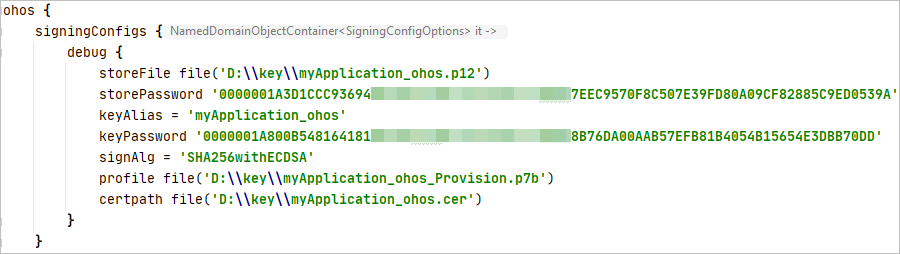

# 配置OpenHarmony应用签名信息

- [生成密钥和证书请求文件](#生成密钥和证书请求文件)
- [生成应用证书文件](#生成应用证书文件)
- [生成应用Profile文件](#生成应用profile文件)
- [配置应用签名信息](#配置应用签名信息)

使用真机设备运行和调试OpenHarmony应用前，需要对应用进行签名才能正常运行。该指导用于OpenHarmony应用的签名配置。除此章节以外，DevEco Studio的其余操作指导无差别，具体请访问[HUAWEI DevEco Studio使用指南](https://developer.harmonyos.com/cn/docs/documentation/doc-guides/tools_overview-0000001053582387)。配置应用签名信息的流程如下图所示。


## 生成密钥和证书请求文件

OpenHarmony应用通过数字证书（.cer文件）和Profile文件（.p7b文件）来保证应用的完整性，需要通过DevEco Studio来生成密钥文件（.p12文件）和证书请求文件（.csr文件）。同时，也可以使用命令行工具的方式来生成密钥文件和证书请求文件。

### 使用DevEco Studio生成密钥和证书请求文件

1. 在主菜单栏点击**Build > Generate Key** **and CSR**。

   > **说明**
   >
   > 如果本地已有对应的密钥，无需新生成密钥，可以在**Generate Key**界面中点击下方的Skip跳过密钥生成过程，直接使用已有密钥生成证书请求文件。

2. 在**Key Store File**中，可以点击**Choose Existing**选择已有的密钥库文件（存储有密钥的.p12文件）；如果没有密钥库文件，点击**New**进行创建。下面以新创建密钥库文件为例进行说明。

   

3. 在**Create Key Store**窗口中，填写密钥库信息后，点击**OK**。

   - **Key Store File**：选择密钥库文件存储路径。
   - **Password**：设置密钥库密码，必须由大写字母、小写字母、数字和特殊符号中的两种以上字符的组合，长度至少为8位。请记住该密码，后续签名配置需要使用。
   - **Confirm Password**：再次输入密钥库密码。

   

4. 在**Generate Key**界面中，继续填写密钥信息后，点击**Next**。

   - **Alias**：密钥的别名信息，用于标识密钥名称。请记住该别名，后续签名配置需要使用。
   - **Password**：密钥对应的密码，与密钥库密码保持一致，无需手动输入。
   - **Validity**：证书有效期，建议设置为25年及以上，覆盖应用的完整生命周期。
   - **Certificate**：输入证书基本信息，如组织、城市或地区、国家码等。

   

5. 在**Generate CSR**界面，选择密钥和设置CSR文件存储路径。

   

6. 点击**OK**按钮，创建CSR文件成功，可以在存储路径下获取生成的密钥库文件（.p12）和证书请求文件（.csr）。

   

### 使用命令行工具生成证书请求文件

使用Open JDK携带的Keytool工具生成证书请求文件。

1. 使用管理员身份运行命令行工具。

   

2. 切换到keytool工具所在路径，实际路径请根据DevEco Studio安装目录进行修改。

   

3. 执行如下命令，生成公私钥文件。例如，生成的密钥库名称为ide_demo_app.p12，以存储到D盘根目录下为例

   ```
   keytool -genkeypair -alias "ide_demo_app" -keyalg EC -sigalg SHA256withECDSA -dname "C=CN,O=HUAWEI,OU=HUAWEI IDE,CN=ide_demo_app"  -keystore d:\\idedemokey.p12 -storetype pkcs12 -validity 9125 -storepass 123456Abc -keypass 123456Abc
   ```

   生成公私钥文件的参数说明如下：

   > 请记录下**alias、storepass和keypass**的值，在后续[配置签名信息](#配置应用签名信息)操作会使用到。

   - **alias**：密钥的别名信息，用于标识密钥名称。

   - **sigalg**：签名算法，固定为**SHA256withECDSA**。
   - dname：按照操作界面提示进行输入。
     - C：国家/地区代码，如CN。
     - O：组织名称，如HUAWEI。
     - OU：组织单位名称，如HUAWEI IDE。
     - CN：名字与姓氏，建议与别名一致。
   - **validity**：证书有效期，建议设置为9125（25年）。
   - **storepass**：设置密钥库密码，必须由大写字母、小写字母、数字和特殊符号中的两种以上字符的组合，长度至少为8位。请记住该密码，后续签名配置需要使用。
   - **keypass**：设置密钥的密码，请与**storepass**保持一致。

4. 执行如下命令，执行后需要输入**storepass**密码，生成证书请求文件，后缀格式为.csr。

   ```
   keytool -certreq -alias "ide_demo_app" -keystore d:\\idedemokey.p12 -storetype pkcs12 -file d:\\idedemokey.csr
   ```

   生成证书请求文件的参数说明如下：

   - **alias**：与[3](https://developer.harmonyos.com/cn/docs/documentation/doc-guides/publish_app-0000001053223745#ZH-CN_TOPIC_0000001224804001__la996f2c8ce594df98eaadeacfafdea10)中输入的alias保持一致。
   - **file**：生成的证书请求文件名称，后缀为.csr。


## 生成应用证书文件

使用[生成密钥和证书请求文件](#生成密钥和证书请求文件)中生成的证书请求文件，来生成应用签名所需的数字证书文件。生成方法如下：

进入DevEco Studio安装目录的 **Sdk\toolchains\lib**文件夹下（该SDK目录只能是OpenHarmony SDK，配置方法可参考[配置OpenHarmony SDK](../quick-start/configuring-openharmony-sdk.md)），打开命令行工具，执行如下命令（如果keytool命令不能执行，请在系统环境变量中添加JDK的环境变量）。其中，只需要修改输入和输出即可快速生成证书文件，即修改 **-infile**指定证书请求文件csr文件路径， **-outfile**指定输出证书文件名及路径。

```
keytool -gencert -alias "OpenHarmony Application CA" -infile myApplication_ohos.csr -outfile myApplication_ohos.cer -keystore OpenHarmony.p12 -sigalg SHA384withECDSA -storepass 123456 -ext KeyUsage:"critical=digitalSignature" -validity  3650 -rfc
```

关于该命令的参数说明如下：

- **alias**：用于签发证书的CA私钥别名，OpenHarmony社区CA私钥存于OpenHarmony.p12密钥库文件中，该参数不能修改。

- **infile**：证书请求（CSR）文件的路径。

- **outfile**：输出证书链文件名及路径。

- **keystore**：签发证书的CA密钥库路径，OpenHarmony密钥库文件名为OpenHarmony.p12，文件在OpenHarmony SDK中 **Sdk\toolchains\lib**路径下，该参数不能修改。请注意，该OpenHarmony.p12文件并不是[生成密钥和证书请求文件](#生成密钥和证书请求文件)中生成的.p12文件。

- **sigalg**：证书签名算法，该参数不能修改。

- **storepass**：密钥库密码，密码为123456，该参数不能修改。

- **ext**：证书扩展项，该参数不能修改。

- **validity**：证书有效期，自定义天数。

- **rfc**：输出文件格式指定，该参数不能修改。


## 生成应用Profile文件

Profile文件包含OpenHarmony应用的包名、数字证书信息、描述应用允许申请的证书权限列表，以及允许应用调试的设备列表（如果应用类型为Release类型，则设备列表为空）等内容，每个应用包中均必须包含一个Profile文件。

进入 **Sdk\toolchains\lib**目录下，打开命令行工具，执行如下命令。

```
java -jar provisionsigtool.jar sign --in UnsgnedReleasedProfileTemplate.json --out myApplication_ohos_Provision.p7b --keystore OpenHarmony.p12 --storepass 123456 --alias "OpenHarmony Application Profile Release" --sigAlg SHA256withECDSA --cert OpenHarmonyProfileRelease.pem --validity 365 --developer-id ohosdeveloper --bundle-name 包名 --permission 受限权限名（可选） --permission 受限权限名（可选） --distribution-certificate myApplication_ohos.cer
```

关于该命令的参数说明如下：

- **provisionsigtool**：Profile文件生成工具，文件在OpenHarmony SDK的 **Sdk\toolchains\lib**路径下。

- **in**：Profile模板文件所在路径，文件在OpenHarmony SDK中 **Sdk\toolchains\lib**路径下，该参数不能修改。

- **out**：输出的Profile文件名和路径。

- **keystore**：签发证书的密钥库路径，OpenHarmony密钥库文件名为OpenHarmony.p12，文件在OpenHarmony SDK中 **Sdk\toolchains\lib**路径下，该参数不能修改。

- **storepass**：密钥库密码，密码为123456，该参数不能修改。

- **alias**：用于签名Profile私钥别名，OpenHarmony社区CA私钥存于OpenHarmony.p12密钥库文件中，该参数不能修改。

- **sigalg**：证书签名算法，该参数不能修改。

- **cert**：签名Profile的证书文件路径，文件在OpenHarmony SDK中 **Sdk\toolchains\lib**路径下，该参数不能修改。

- **validity**：证书有效期，自定义天数。

- **developer-id**：开发者标识符，自定义一个字符串。

- **bundle-name**：填写应用包名。

- **permission**：可选字段，如果不需要，则可以不用填写此字段；如果需要添加多个受限权限，则如示例所示重复输入。受限权限列表如下：ohos.permission.READ_CONTACTS、ohos.permission.WRITE_CONTACTS。

- **distribution-certificate**：[生成应用证书文件](#生成应用证书文件)中生成的证书文件。


## 配置应用签名信息

在真机设备上调试前，需要使用到制作的私钥（.p12）文件、证书（.cer）文件和Profile（.p7b）文件对调试的模块进行签名。

打开 **File &gt; Project Structure**，点击 **Project &gt; Signing Configs &gt; debug**窗口中，去除勾选“Automatically generate signing”，然后配置指定模块的调试签名信息。

- **Store File**：选择密钥库文件，文件后缀为.p12，该文件为[生成密钥和证书请求文件](#生成密钥和证书请求文件)中生成的.p12文件。

- **Store Password**：输入密钥库密码，该密码为[生成密钥和证书请求文件](#生成密钥和证书请求文件)中填写的密钥库密码保持一致。

- **Key Alias**：输入密钥的别名信息，与[生成密钥和证书请求文件](#生成密钥和证书请求文件)中填写的别名保持一致。

- **Key Password**：输入密钥的密码，与 **Store Password**保持一致。

- **Sign Alg**：签名算法，固定为SHA256withECDSA。

- **Profile File**：选择[生成应用Profile文件](#生成应用profile文件)中生成的Profile文件，文件后缀为.p7b。

- **Certpath File**：选择[生成应用证书文件](#生成应用证书文件)中生成的数字证书文件，文件后缀为.cer。


设置完签名信息后，点击 **OK**进行保存，然后可以在工程下的build.gradle中查看签名的配置信息。



默认情况下，DevEco Studio编译hap包的类型为debug类型，如果需要编译release类型的hap包，请打开工程左下角的OhosBuild Variants，设置模块的编译构建类型为release。关于编译构建hap的详细说明请参考[HUAWEI DevEco Studio使用指南](https://developer.harmonyos.com/cn/docs/documentation/doc-guides/build_hap-0000001053342418)。


编译完成后，OpenHarmony应用的Hap包可以从工程的bulid目录下获取。

