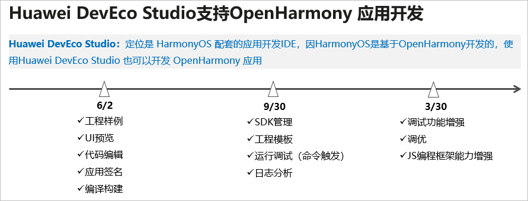

# 概述

## 总体说明

DevEco Studio是HarmonyOS的配套的开发IDE，因为HarmonyOS是基于OpenHarmony开发的，因此，使用DevEco Studio（配套HarmonyOS）也可以进行OpenHarmony的应用开发。

使用DevEco Studio开发OpenHarmony应用的流程与开发HarmonyOS的流程完全一样，本文档仅描述OpenHarmony应用开发与HarmonyOS应用开发的差异点。

- **搭建开发环境差异**：OpenHarmony应用开发环境需要先安装OpenHarmony SDK，具体可参考[配置OpenHarmony SDK](../quick-start/configuring-openharmony-sdk.md)章节。

- **创建OpenHarmony工程**：OpenHarmony应用开发，可以通过工程向导创建一个新工程，或通过导入Sample工程的方式来创建一个新工程，具体可参考[使用工程向导创建新工程](../quick-start/use-wizard-to-create-project.md)。

- **调试签名配置**：OpenHarmony应用运行在真机设备上，需要对应用进行签名，关于OpenHarmony应用的签名指导请参考[配置OpenHarmony应用签名信息](../quick-start/configuring-openharmony-app-signature.md)。

- **在真机设备上运行应用**：将OpenHarmony的hap包推送到真机设备上进行安装，具体可参考[安装运行OpenHarmony应用](../quick-start/installing-openharmony-app.md)。

关于DevEco Studio的详细操作指导，请访问[HUAWEI DevEco Studio使用指南](https://developer.harmonyos.com/cn/docs/documentation/doc-guides/tools_overview-0000001053582387)。

## 使用约束

- OpenHarmony只支持使用eTS、JS语言开发应用，不支持Java、C/C++语言。

- OpenHarmony开发环境DevEco Studio暂只支持Windows系统。

OpenHarmony与HarmonyOS的开发工具都是DevEco Studio，下表为OpenHarmony相比HarmonyOS不支持的功能说明：

| 特性名称 | HarmonyOS版本 | OpenHarmony版本 | 
| -------- | -------- | -------- |
| 服务卡片 | **√** | **X** | 
| 自动化签名 | **√** | **X** | 
| 远程模拟器 | **√** | **X** | 
| 本地模拟器 | **√** | **X** | 
| 使用DevEco&nbsp;Studio进行日志查看、调优 | **√** | **X** | 
| 云测试 | **√** | **X** | 
| 安全测试 | **√** | **X** | 

## DevEco Studio演进路标

Huawei DevEco Studio分阶段支持OpenHarmony应用开发的演进路标如下：

