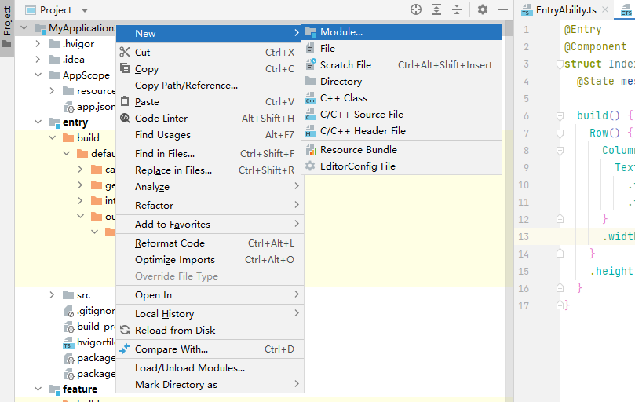

# HAP

HAP（Harmony Ability Package）是应用安装和运行的基本单元。HAP包是由代码、资源、第三方库、配置文件等打包生成的模块包，其主要分为两种类型：entry和feature。

- entry：应用的主模块，作为应用的入口，提供了应用的基础功能。
- feature：应用的动态特性模块，作为应用能力的扩展，可以根据用户的需求和设备类型进行选择性安装。

应用程序包可以只包含一个基础的entry包，也可以包含一个基础的entry包和多个功能性的feature包。

## 场景描述

方便开发者模块化的管理应用，好的应用一般都是模块化管理，模块之间属于松耦合关系。多HAP方便了开发者将业务划分成多个模块，每个模块放到独立的HAP中。例如支付类应用，有统一的主界面，主界面管理“扫一扫”、“收付款”、“消息”、“理财”等各个模块。其中主界面管理其他模块的逻辑在Entry包中实现，而“扫一扫”、“收付款”、“消息”和“理财”等模块在不同的Feature包中实现。可以同时开发多个Feature包，能够实现Feature包单独的开发测试，最终由Entry包统一集成Feature包的特性。

方便开发者将多HAP合理地组合并部署到不同的设备上。例如应用程序包含一个Entry包和两个Featrue包（Feature1和Feature2）。其中Entry包可以部署到设备A和设备B，Feature1只能部署到设备A，Feature2包只部署到设备B上，那么开发者就可以方便的组合Entry和Feature1部署到设备A上，组合Entry和Feature2部署到设备B上。

## 约束限制

- App Pack包不能直接安装到设备上，只是上架应用市场的单元。

- App Pack包打包时会对每个HAP在json文件中的配置进行校验，确保bundleName、versionCode等标签取值相同，详见[App打包时的HAP合法性校验](../tools/packing-tool.md#app打包指令)。

- App Pack包中同一设备类型的所有HAP中必须有且只有一个Entry类型的HAP，Feature类型的HAP可以有一个或者多个，也可以没有。

- App Pack包中的每个HAP必须配置moduleName标签，同一设备类型的所有HAP对应的moduleName标签必须唯一。

- 同一应用的所有HAP签名证书要保持一致。上架应用市场是以App Pack的形式上架，并对其进行了签名。应用市场分发时会将所有HAP从App Pack中拆分出来，同时对其中的所有HAP进行重签名，这样保证了所有HAP签名证书的一致性。在调试阶段，开发者通过命令行或IDE将HAP安装到设备上时要保证所有HAP签名证书一致，否则会出现安装失败的问题。

## 创建

1. 创建工程（详情参见[构建第一个ArkTS应用](start-with-ets-stage.md)。
2. 若想新建一个HAP，请在工程目录上点击鼠标右键，选择New > Module，如下图所示。

<div align="center">



**图1** 新建模块流程

</div>

3. 在弹出的对话框中选择Empty Ability，点击Next。
   
4. 进入模块配置界面，可以给新建的模块命名，配置完成之后，点击Next。

<div align="center">


**图2** 模块配置

</div>

5. 进入Ability配置界面，给Ability命名之后，点击Finish即可创建一个新的HAP。

## 开发调试

多HAP的开发调试与发布部署流程如下图所示。

<div align="center">


**图3** 多HAP的开发调试与发布部署流程

</div>

通过DevEco Studio编译打包，生成单个或者多个HAP，即可基于HAP进行调试。如需根据不同的部署环境、目标人群、运行环境等，将同一个HAP定制编译为不同版本，请参见[定制编译指导](https://developer.harmonyos.com/cn/docs/documentation/doc-guides-V3/customized-multi-targets-and-products-0000001430013853-V3?catalogVersion=V3)。

在调试前，需要先安装或更新HAP，以下介绍具体做法。

**方法一：**使用DevEco Studio进行调试，详见[应用程序包调试方法](https://developer.harmonyos.com/cn/docs/documentation/doc-guides-V3/ide_debug_device-0000001053822404-V3?catalogVersion=V3#section10491183521520)。

**方法二：**使用[hdc工具](../../device-dev/subsystems/subsys-toolchain-hdc-guide.md)(可通过OpenHarmony SDK获取，在SDK的toolchains目录下)进行调试。

在调试前，需要先安装或更新HAP，此处有两种方式：

- 直接使用hdc安装、更新HAP。

   HAP的路径为开发平台上的文件路径，以Windows开发平台为例，命令参考如下：

   ```shell
   // 安装、更新，多HAP可以指定多个文件路径
   hdc install C:\entry.hap C:\feature.hap
   // 执行结果
   install bundle successfully.
   // 卸载
   hdc uninstall com.example.myapplication
   // 执行结果
   uninstall bundle successfully.
   ```

- 先执行hdc shell，再使用bm工具安装、更新HAP。

   HAP的文件路径为真机上的文件路径，命令参考如下：

   ```shell
   // 先执行hdc shell才能使用bm工具
   hdc shell
   // 安装、更新，多HAP可以指定多个文件路径
   bm install -p /data/app/entry.hap /data/app/feature.hap
   // 执行结果
   install bundle successfully.
   // 卸载
   bm uninstall -n com.example.myapplication
   // 执行结果
   uninstall bundle successfully.
   ```

完成HAP安装或更新后，即可参考相关调试命令进行[调试](../tools/aa-tool.md)。

## 编译

## 相关实例

针对多HAP开发，有以下相关实例可供参考：

- [多HAP（ArkTS）(API9)](https://gitee.com/openharmony/applications_app_samples/tree/master/code/Project/ApplicationHap/MultiHap)