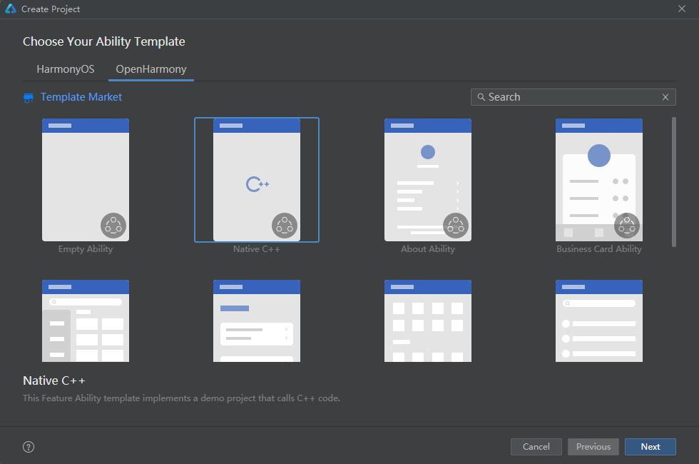

# 如何在CMake工程中使用OHOS SDK的Native API(NDK)

## 1. 什么是Native API
请参看《[Native API](https://gitee.com/openharmony/docs/blob/a1ef2da9276755c98883bd318f55fd0a3a614680/zh-cn/application-dev/napi/Readme-CN.md)》

## 2. 如何下载Native API开发包（NDK)

1）**推荐OHOS正式发布的SDK包** ，下载链接可以从OHOS正式发布版本的[release-notes](https://gitee.com/openharmony/docs/tree/master/zh-cn/release-notes#/openharmony/docs/blob/master/zh-cn/release-notes/OpenHarmony-v3.2-release.md)中获取，点击release notes中的如下链接下载。

2）**IDE OpenHarmony SDK Manager中下载**