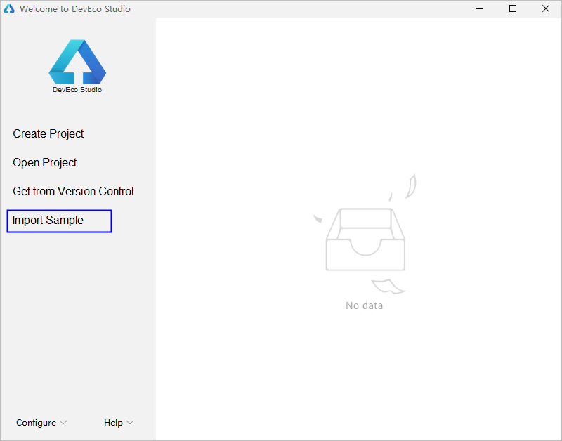
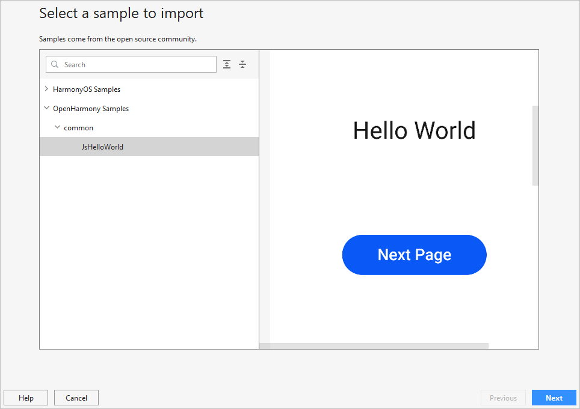
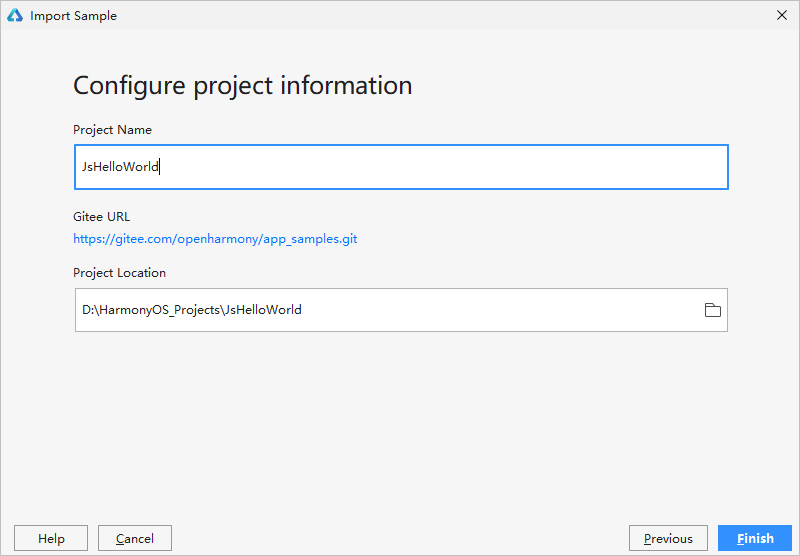

# 通过导入Sample方式创建新工程

>  **说明：**
> 该功能适用于通过DevEco Studio 2.1 Release及以上版本，创建OpenHarmony工程。

OpenHarmony SDK配置完成后，便可以启动应用开发。针对OpenHarmony应用开发， **可以通过导入Sample工程的方式来创建一个新工程**。

1. 在DevEco Studio的欢迎页，进入 **Configure （** **或** **图标** **） &gt; Settings &gt; Version Control &gt; Git**界面，点击Test按钮检测是否安装Git工具。
   - 已安装，请根据**步骤2**开始导入Sample。
      
   - 未安装，请点击 **Download and Install**，DevEco Studio会自动下载并安装。安装完成后，请根据**步骤2**开始导入Sample。
      

2. 在DevEco Studio的欢迎页，点击 **Import Sample**按钮，导入Sample工程。
   

3. 选择OpenHarmony Samples &gt; common下的 **JsHelloWorld**工程，然后点击 **Next**。
   

4. 设置 **App Name**和 **Project Location**，然后点击 **Finish**，等待Sample工程导入完成。
   

5. 等待工程同步完成，同步成功后，便可以进行OpenHarmony应用开发了。
   
