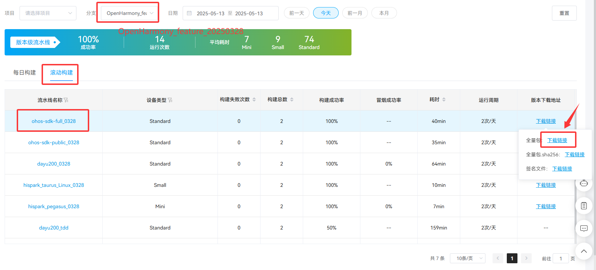
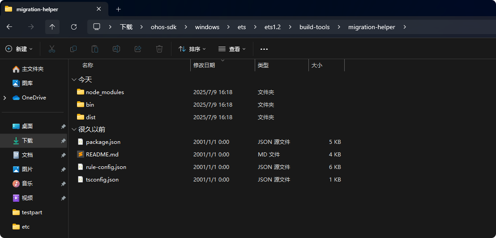
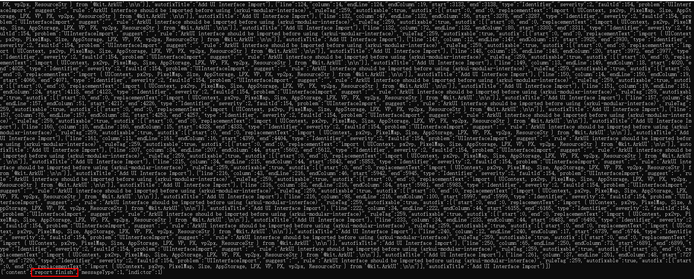
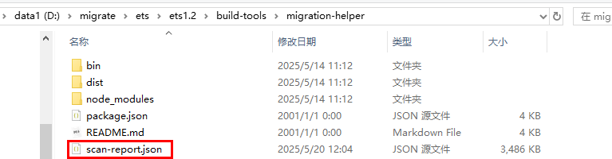
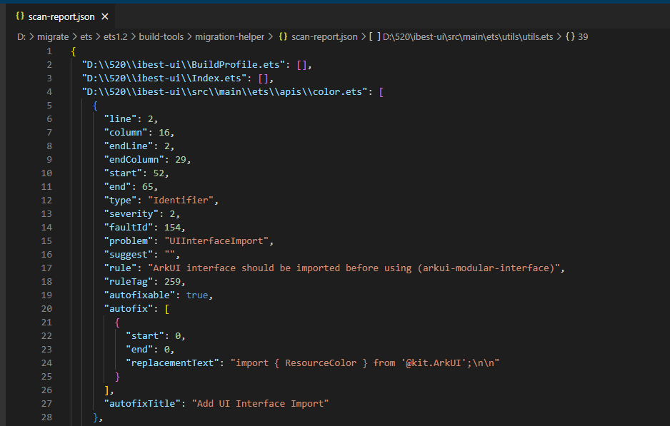

# ArkTS1.2迁移工具使用指导

## 说明

迁移工具提供语法差异检查和代码自动修复功能，帮助开发者将工程代码从ArkTS1.1迁移到ArkTS1.2。

## 下载地址

从Gitee仓库的[每日构建](https://gitee.com/link?target=https%3A%2F%2Fci.openharmony.cn%2Fworkbench%2Fcicd%2Fdailybuild%2Fdailylist)中下载ArkTS1.2特性分支（如当前是`OpenHarmony_feature_20250328`分支）的SDK并解压。

**图1** 每日构建页面



目录`ohos-sdk\windows\ets\ets1.2\build-tools\migration-helper`内包含迁移工具。

**图2** 迁移工具目录



## 工具规格

| 参数                       | 参数说明                                                     |
| -------------------------- | ------------------------------------------------------------ |
| --ide-interactive          | 生成json文件，支持IDE解析。                                    |
| --arkts-2                  | 启用ArkTS1.2规则。                                            |
| --autofix                  | 自动修复建议，生成到json文件中。                                |
| --check-ts-as-source       | 支持扫描.ts和.ets混合工程。                                    |
| --migrate                  | 启用迁移功能。启用后会修改原有代码。                            |
| --migration-report         | 生成迁移报告。                                                 |
| --sdk-default-api-path     | OpenHarmonyOS的SDK路径，以openharmony/ets结尾。                          |
| --sdk-external-api-path    | HarmonyOS的SDK路径，以default/hms/ets结尾，传入错误路径将不会生效也不会报错。|
| --arkts-whole-project-path | 完整工程路径。                                                 |
| --project-folder           | 扫描文件夹路径，如扫描单个文件不需要加此参数，将单个文件路径加在命令行最后即可。 |
| --autofix-check            |搭配`--migrate`使用，在扫描后询问用户是否进行修复。          |
| --homecheck                |增加运行时错误的检查。   |

**注意事项：**

1. 命令行参数中传入的路径不能包含空格，例如`/DevEco Studio/sdk`。

2. 推荐先基于ArkTS1.1编译工程。否则，可能会缺失工程的模块间依赖，导致部分规则漏扫或误扫。

3. 设备要求：建议使用32GB及以上Windows环境扫描。在扫描过程中发生out of memory错误时，可以为node添加参数"--max-old-space-size=8192"解决部分场景问题。

## 工具使用示例

### 扫描文件夹

在命令行工具中输入以下命令来扫描工程文件夹。

```
node dist/tslinter.js \
--ide-interactive \
--arkts-2 \
--autofix \
--check-ts-as-source \
--sdk-external-api-path D:/deveco-studio/sdk/default/hms/ets  \
--sdk-default-api-path D:/deveco-studio/sdk/default/openharmony/ets  \
--arkts-whole-project-path path/to/MyApp  \
--project-folder path/to/MyApp/entry/src/main/ets 
```

> **说明：** 
> 
>- `dist/tslinter.js`在下载的日构建`migration-helper`目录下，需要先将终端定位到该目录，或补全路径。
>- `D:/deveco-studio/sdk/default/hms/ets`是DevEco studio的SDK路径，需要根据安装位置进行替换。本文中的所有路径均需进行相应的替换检查。
>- `path/to/MyApp`是待扫描文件夹所在的工程路径。
>- `..../src/main/ets`是待扫描的工程文件夹。

### 扫描单个文件

在命令行工具中输入以下命令来扫描单个工程文件。

需要注意，该文件需要在完整的工程目录下，并且命令行参数要加上工程路径[`--arkts-whole-project-path`]

```
node dist/tslinter.js \
--ide-interactive \
--homecheck \
--arkts-2 \
--sdk-external-api-path  D:/deveco-studio/sdk/default/hms/ets \
--sdk-default-api-path D:/deveco-studio/sdk/default/openharmony/ets \
--arkts-whole-project-path path/to/MyApp \ 
 path/to/MyApp/entry/src/main/ets/pages/Index.ets
```
> **说明：** 
>
>- `dist/tslinter.js`在下载的日构建`migration-helper`目录下，需要先将终端定位到该目录，或补全路径。
>- `D:/deveco-studio/sdk/default/hms/ets`是DevEco studio的SDK路径，需要根据安装位置进行替换。本文中的所有路径均需进行相应的替换检查。
>- `path/to/MyApp`是待扫描文件所在的工程路径。
>- 最后一行的`..../Index.ets`是待扫描的工程文件。


### 扫描并自动修复

在命令行工具中输入以下命令来扫描并自动修复工程文件夹。

```
node dist/tslinter.js \
--ide-interactive \
--homecheck \
--arkts-2 \
--autofix \
--migrate \
--autofix-check \
--check-ts-as-source \
--sdk-external-api-path D:/deveco-studio/sdk/default/hms/ets \
--sdk-default-api-path D:/deveco-studio/sdk/default/openharmony/ets \
--arkts-whole-project-path path/to/MyApp \
--project-folder path/to/MyApp/entry/src/main/ets 
```
> **说明：** 
>
>- `dist/tslinter.js`在下载的日构建`migration-helper`目录下，需要先将终端定位到该目录，或补全路径。
>- `D:/deveco-studio/sdk/default/hms/ets`是DevEco studio的SDK路径，需要根据安装位置进行替换。本文中的所有路径均需进行相应的替换检查。
>- `path/to/MyApp`是待扫描文件夹所在的工程路径。
>- `..../main/ets`是待扫描的工程文件夹。

**图3** 迁移成功截图



**图4** 同级目录下会出现scan-report.json文件



**图5** scan-report.json文件内容

