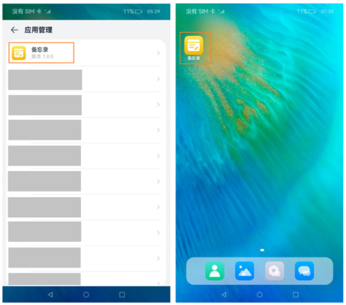

# 配置应用图标和名称

本页面提供应用图标和名称的配置指导。应用图标分为单层图标和分层图标。单层图标包含一个图片，分层图标包含前景图和背景图。图标规范详见<!--RP1-->[图标交付](https://docs.openharmony.cn/pages/v5.0/zh-cn/design/ux-design/visual-app-icons.md#%E5%9B%BE%E6%A0%87%E4%BA%A4%E4%BB%98)<!--RP1End-->，图标和名称配置约束详见[图标和名称配置](../application-models/application-component-configuration-stage.md#应用图标和名称配置)。

## 使用场景

<!--RP2-->
- 用于在应用界面内展示当前应用。例如：在设置应用中展示应用列表。
- 用于在设备桌面上展示当前应用。例如：桌面或者最近任务列表中显示应用。
<!--RP2End-->

效果图如下。
<!--RP3-->

<!--RP3End-->

## 配置优先级和生成策略

* HAP中包含UIAbility

  * 如果在[module.json5配置文件](module-configuration-file.md)的abilities标签中配置了icon和label，且该对应的ability中skills标签下面的entities中包含"entity.system.home"、actions中包含"ohos.want.action.home"，则系统将优先返回module.json5中的icon与label。如果存在多个满足条件的ability，优先返回module.json5中mainElement对应的ability配置的icon和label。

  * 如果在module.json5配置文件的abilities标签中未设置icon和label，系统将返回[app.json5](app-configuration-file.md)中的icon和label。

* HAP中不包含UIAbility，系统将返回app.json5中的icon和label。

>
> **说明：**
> 
> 在编译构建时，app.json5文件所在AppScope目录下的资源文件会合入到模块下面资源目录中，如果两个目录下存在重名文件，编译打包后只会保留AppScope目录下的资源文件。
>
> 例如，app.json5和module.json5中配置的分层图标的资源文件名称一致、图标不一致，AppScope目录下的资源文件会覆盖模块中的文件，最后的效果是app.json5中的配置图标生效。
> 
> 如果应用配置中未设置入口UIAbility，点击桌面图标将直接进入应用详情页（设置->应用和元服务下，点击任意应用即可进入该应用的应用详情页）。其他情况下，点击桌面图标将直接进入应用页面。应用未配置入口UIAbility包含2种场景：
>
>   1. 应用没有配置任何UIAbility。
>   2. 所有UIAbility中skills标签下的entities未配置或配置内容不包括 "entity.system.home"，并且actions未配置或配置内容不包括 "ohos.want.action.home"。
>

## 配置单层图标和应用名称

- **方式一：配置app.json5**

  该配置仅当module.json5配置文件中无UIAbility、或者存在UIAbility但abilities标签中未设置icon和label（可手动删除icon和label配置）时生效。

  ```json
  {
    "app": {
      "icon": "$media:app_icon",
      "label": "$string:app_name" // 需要在AppScope/resources/base/element/string.json配置name为app_name的资源，已存在可以忽略
      // ...
    }
  }
  ```

- **方式二：配置module.json5**

  除了需要配置icon与label字段，还需要在skills标签下面的entities中添加"entity.system.home"、actions中添加"ohos.want.action.home"。

  ```json
  {
    "module": {
      // ...
      "abilities": [
        {
          "icon": "$media:icon",
          "label": "$string:EntryAbility_label", // 需要在entry/src/main/resources/base/element/string.json配置name为EntryAbility_label的资源，已存在可以忽略
          "skills": [
            {
              "entities": [
                "entity.system.home"
              ],
              "actions": [
                "ohos.want.action.home"
              ]
            }
          ],
        }
      ]
    }
  }
  ```

## 配置分层图标和应用名称

- **方式一：配置app.json5**

  该配置仅当module.json5配置文件中无UIAbility、或者存在UIAbility但abilities标签中未设置icon和label（可手动删除icon和label配置）时生效。

  1. 将前景资源和背景资源文件放在“AppScope\resources\base\media”文件下。

      本例中，前景资源文件名为“foreground.png”，背景资源文件名为“background.png”。

  2. 在“AppScope\resources\base\media”文件夹下app_layered_image.json分层图标资源文件中，配置分层图标的前景资源与背景资源信息。

      ```json
      {
        "layered-image":
        {
          "background" : "$media:background",
          "foreground" : "$media:foreground"
        }
      }
      ```
  3. 在[app.json5配置文件](app-configuration-file.md)中引用分层图标资源文件。示例如下：
      ```json
          {
            "app": {
              "icon": "$media:app_layered_image",
              "label": "$string:app_name" // 需要在AppScope/resources/base/element/string.json配置name为app_name的资源，已存在可以忽略
              // ...
            }
          }
      ```

- **方式二：配置module.json5**

  1. 将前景资源和背景资源文件放在“entry\src\main\resources\base\media”文件下。

      本例中采用的前景资源和背景资源的文件名分别为“foreground.png”和“background.png”。

  2. 在“entry\src\main\resources\base\media”文件夹下layered_image.json分层图标资源文件中，配置分层图标的前景资源与背景资源信息。

      ```json
      {
        "layered-image":
        {
          "background" : "$media:background",
          "foreground" : "$media:foreground"
        }
      }
      ```

  3. 如果需要在桌面显示UIAbility图标，除了需要配置icon与label字段，还需要在skills标签下面的entities中添加"entity.system.home"、actions中添加"ohos.want.action.home"。

      ```json
      {
        "module": {
          "abilities": [
            "name": "EntryAbility",
            // ...
            "icon": "$media:layered_image", // icon配置为分层图标资源文件的索引
            "label": "$string:EntryAbility_label", // 需要在entry/src/main/resources/base/element/string.json配置name为EntryAbility_label的资源，已存在可以忽略
            "skills": [
              {
                "entities": [
                  "entity.system.home"
                ],
                "actions": [
                  "ohos.want.action.home"
                ]
              }
            ],
            // ...
          ]
          // ...
        }
      }
      ```

>
> **说明：**
>
> DevEco Studio NEXT Beta1(5.0.3.814) 及之后的版本，创建应用时默认模板中包含分层图标的资源文件，不同版本生成的资源文件名称可能不同，文件名称支持手动修改。如果分层图标资源文件不存在则需要手动创建，文件名称需要符合资源命名规范，由数字、字母、点和下划线组成。
>

<!--Del-->
## 管控规则

系统对无图标应用实施严格管控，防止一些恶意应用故意配置无桌面应用图标，导致用户找不到软件所在的位置，无法操作卸载应用，在一定程度上保证用户终端设备的安全。因此除预置应用外，其他应用不支持隐藏桌面图标。

如果预置应用确需隐藏桌面应用图标，必须配置AllowAppDesktopIconHide[应用特权](../../device-dev/subsystems/subsys-app-privilege-config-guide.md#通用应用特权)，具体配置方式参考应用特权配置指南。申请该特权后，应用不会在桌面上显示。<!--DelEnd-->
