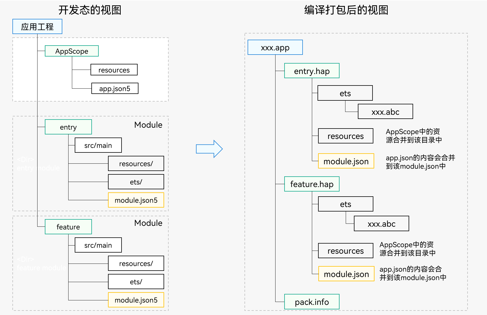

# 多HAP构建视图

IDE支持在一个应用工程中进行多个HAP的开发与构建，如下图所示。

  **图1** 多HAP构建视图  

1. IDE开发态视图
   - AppScope目录
      - [app.json5](app-configuration-file.md)：配置应用全局描述信息，例如应用Bundle名称、版本号、应用图标、应用名称和依赖的SDK版本号等。
      - resources目录：放置应用的图标资源和应用名称字符串资源。

         **说明：**
         - 该目录由IDE自动生成，名称不可更改。
         - AppScope目录下面的文件名与Entry、Feature模块下面的文件名不能重复，否则IDE会报错。
   - entry或者featrue目录（名称可由开发者自定义）
      - 由IDE引导开发者创建的Module，在该Module中实现应用的业务逻辑；可以创建多个Module，图中entry和featrue即是创建的两个Module。
      - resources目录：放置该Module中所使用到的资源。
      - ets目录：开发者的业务逻辑。
      - [module.json5](module-configuration-file.md)：配置该Module的描述信息，如：Module的名称、Module的入口代码路径、包含的组件信息等。

2. 编译打包后的视图
   - 一个开发态的Module编译后生成一个部署态的HAP，Module和HAP一一对应。
   - HAP中的module.json由开发视图中的app.json5和module.json5合成。
   - 所有的HAP最终会编译到一个App Pack中（以.app为后缀的包文件），用于发布到应用市场。
