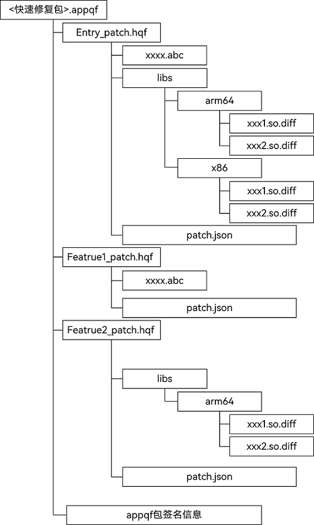
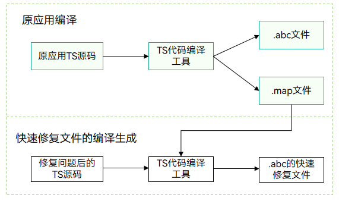
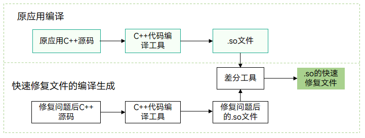
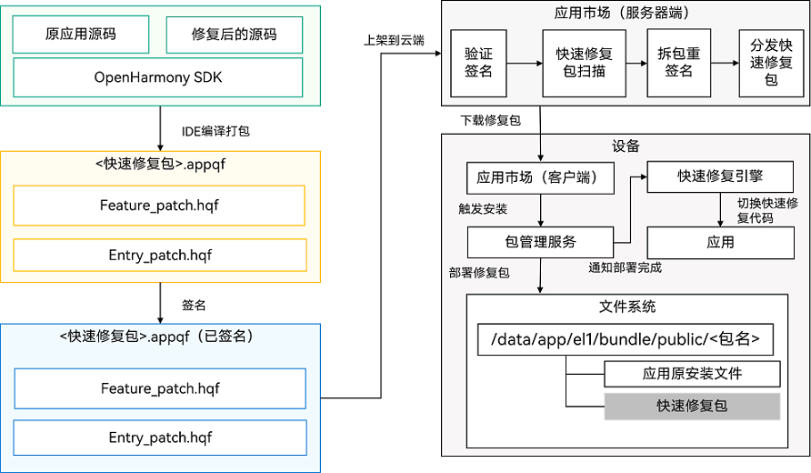
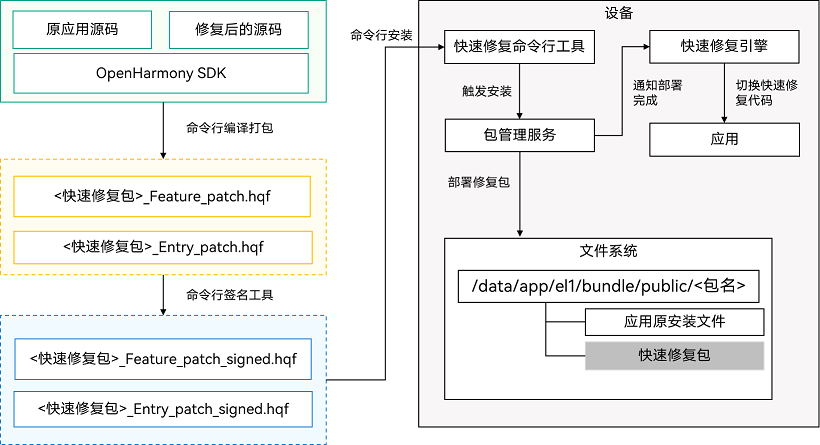

# 快速修复概述

快速修复是OpenHarmony系统提供给开发者的一种技术手段，支持开发者以远快于应用升级的方式对应用程序包进行缺陷修复。和全量应用升级软件版本相比，快速修复的主要优势在小、快和用户体验好。在较短的时间内不中断正在运行的应用的情况下（即不需要重启应用），修复应用的缺陷。

## 快速修复的使用规则

* 仅支持修复应用的TS和C++代码，对应的文件为.abc文件（TS编译后的文件）和.so文件（C++编译后的文件），不支持对资源的修复。
* 不支持新增.abc文件和.so文件。
* 快速修复包部署时要确保对应应用包已安装，如果未安装，则部署失败。
* 快速修复包中配置的包名和应用版本号必须和已安装的包名和版本号应用相同，如果不同则部署失败。
* 如果已经部署过快速修复包，新部署的快速修复包的版本号必须大于之前快速修复包的版本号，否则部署失败。
* 快速修复包的签名信息和待修复的应用的签名信息必须一致，否则会部署失败。
* 新的应用版本发布安装时，会清理掉快速修复包。

## 快速修复包结构


<br>上图是OpenHarmony应用程序发布的快速修复的包格式
* 从图中可以看出包含两种包格式：
    * appqf（Application Quick Fix）
    <br> appqf与应用的app pack包是一一对应关系，具体可参考[应用程序包结构](application-package-structure-stage.md)的介绍。
        * appqf包是OpenHarmony应用用于发布到应用市场的单元，不能够直接安装到设备上。
        * 它是由一个或多个hqf（Harmony Ability Package Quick Fix）组成，这些hqf包在应用市场会从appqf包中拆分出来，再被分发到具体的设备上。
        * appqf包上架到应用市场前要有开发者的签名信息。签名方式可可参考[Hap包签名工具](../security/hapsigntool-overview.md)的介绍。
    * hqf（Harmony Ability Package Quick Fix）
    <br> hqf包是修复HAP中问题的快速修复包，用于安装到设备上的快速修复单元。一个hqf可以包含.abc的快速修复文件，.so的快速修复文件和描述该包的配置文件。
        * `.abc`文件：应用中修改后的ts代码，编译后生成的字节码文件。
        * `libs`目录：存放.so库文件的差分文件，以`.so.diff`为后缀。区分的不同的系统cpu架构，例如arm平台、x86平台。
        * `patch.json`：
        <br> 该文件用于描述hqf包版本信息的配置文件，由开发者填写，具体内容如下：
            ```json
            {
                "app" : {
                    "bundleName" : "com.ohos.quickfix",
                    "versionCode" : 1000000,
                    "versionName" : "1.0.0",
                    "patchVersionCode" : 1000000,
                    "patchVersionName" : "1.0.0"
                },
                "module" : {
                    "name" : "entry",
                    "type" : "patch",
                    "deviceTypes" : [
                    "default",
                    "tablet"
                    ],
                    "originalModuleHash" : "11223344556677889900"
                }
            }
            ```
            具体字段说明：
            | 字段 |类型  |说明  |备注 |
            | --- | --- | --- | --- |
            |bundleName | string | 对应应用的包名    | 不可缺省 |
            |versionCode | int |对应应用版本号          | 不可缺省  |
            |versionName |string |对应应用的版本名称 | patch类型不可缺省 |
            |patchVersionCode |int |补丁包的版本号   | 不可缺省 |
            |patchVersionName |string |补丁包的版本名称 | patch类型不可缺省 |
            |name |string |对应应用的moduleName，用来修复该module的 | 不可缺省 |
            |type | string|对应补丁包的类型，当前可选择为patch | 不可缺省 |
            |deviceTypes |array<string> |补丁包支持的设备类型 | 不可缺省 |
            |originalModuleHash| string |原始module Name对应包的哈希值 | 不可缺省 |

## 快速修复TS编译后的文件



上图是通过TS代码编译工具生成快速修复.abc文件的流程：
* 原始应用编译时，生成.abc文件和.map文件。.abc是TS代码编译后的字节码文件，应用运行时使用该文件。.map文件是通过TS代码编译工具编译TS代码时生成的中间文件，记录有代码中的函数、类等信息。
* 修复问题后的应用编译时，根据上述的.map文件，结合当前的TS代码，得到差异部分，根据差异部分生成快速修复的.abc文件。该.abc文件也既是最终要放到hqf包中的快速修复文件。

## 快速修复C++编译后的文件



上图是通过差分工具生成快速修复.so文件的流程：
* 原始应用C++源码通过编译工具生成.so文件，该.so文件供应用在运行时使用。
* 修复问题后的C++源码通过编译工具生成.so文件，该.so文件和原应用的.so文件通过差分工具生成.so快速修复文件，该.so快速修复文件也既是最终要放到hqf包中的快速修复文件。

## 快速修复包的发布部署流程



上图涉及到的模块如下：
* DevEco Studio：用于开发代码的项目工程的集成开发环境。在快速修复的工程中能够给予原应用的代码和修复问题后的代码生成快速修复包，并完成快速修复包的签名。
* 应用市场服务器端：开发者将开发完成的快速修复包上架到该平台，平台会对上架的包进行签名验证、风险扫描和拆包重签名等，然后分发到客户端。
* 应用市场客户端：用于接收应用市场服务器端分发的快速修复包，并触发安装快速修复包。
* 包管理服务：设备上用于管理应用包及快速修复包安装和卸载的系统服务程序。
* 快速修复引擎：设备上用于管理应用切换使用快速修复包的系统服务程序。如果应用正在运行，快速修复引擎接收到有快速修复包部署完成会通知应用切换快速修复包，进而使得应用使能快速修复包。
* 文件系统：应用及快速修复包部署在设备上的位置。

上图是快速修复包的端到端发布部署流程：
1. 开发者通过DevEco Studio，基于原应用的源码和修复后的源码编译打包生成快速修复包，并通过DevEco Studio完成快速修复包的签名。
2. 将生成的带有签名的快速修复包上架到应用市场，应用市场通过验证签名、风险扫描和拆包重签名后进行分发。
3. 设备侧的应用市场客户端检测到应用市场服务器端有新上架的快速修复包会下载最新版本的快速修复包，接着通过系统中的包管理服务来安装部署快速修复包。
4. 快速修复包部署完成后，再由快速修复引擎触发应用使用快速修复包，进而保证用户使用到问题修复后的功能。

## 快速修复包的调试流程



* DevEco Studio中暂时还没有集成快速修复的能力。当前阶段，OpenHarmony为开发者提供了命令行的调试开发工具可供使用，具体的调试开发流程如下：
1. 基于原应用的源码和修复后的源码，通过命令行工具可以编译生成快速修复包，并通过命令行签名工具完成对快速修复的包的签名。通过命令行调试开发，要对.hqf包签名，并通过命令行工具将.hqf包安装到设备上，.appqf包不能直接安装到设备上。
2. 通过快速修复的命令行工具，将.hqf包安装部署到设备上。
3. .hqf包安装部署完成后，回调通知快速修复引擎触发应用使用快速修复包，进而保证用户使用到问题修复后的功能。