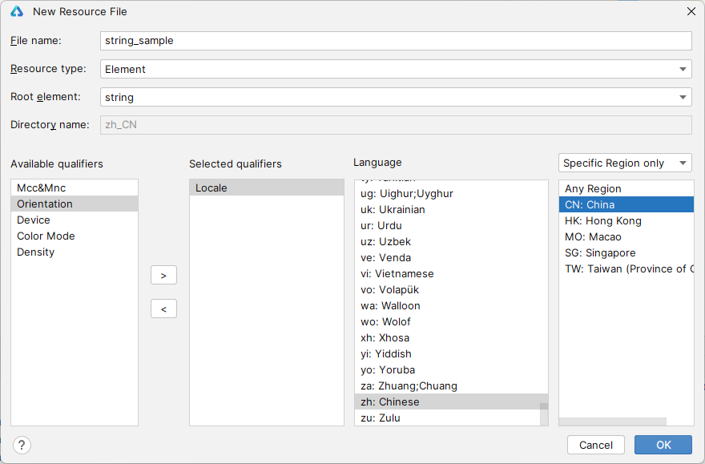
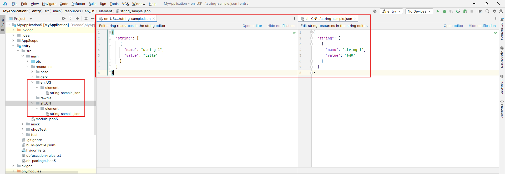

# 资源分类与访问

<!--Kit: Localization Kit-->
<!--Subsystem: Global-->
<!--Owner: @liule_123-->
<!--SE: @buda_wy-->
<!--TSE: @lpw_work-->

应用开发过程中，需要使用字符串、颜色、字体、间距和图标等资源。不同设备或配置下，这些资源的值会有所不同。本文档对资源类型进行介绍，并提供资源开发指导。
根据来源差异，可以将资源分为：

- 应用资源：开发者在应用中自定义的资源，可以利用资源文件管理资源在不同的设备或配置中的表现。
- 系统资源：系统提供的资源，开发者可以通过[主题图标库](https://developer.huawei.com/consumer/cn/design/harmonyos-symbol/)获取系统symbol图标资源信息、通过[系统资源分层设计表](https://gitcode.com/openharmony/docs/blob/master/zh-cn/design/ux-design/design-resources.md)获取系统颜色、间距、圆角等资源信息。此外，系统颜色资源还可以通过[系统色彩全量表](https://developer.huawei.com/consumer/cn/doc/design-guides/color-0000001776857164#section17672143841113)获取，系统色彩全量表与系统资源分层设计表内的资源不重合，均为推荐使用的系统颜色资源。<br>表格中未列出的其他系统资源均为系统组件和底层能力参数，推荐开发者优先使用上述表格中提供的系统资源。

## 资源分类

应用开发中使用的各类资源文件，需要放入特定子目录中存储管理。目录结构如下所示，base目录、限定词目录、rawfile目录、resfile目录称为资源目录，element、media、profile称为资源组目录。

> **说明**
>
> - 资源目录和资源组目录下的文件均被视为资源文件，在应用打包时不会进行混淆。
>
> - stage模型多工程情况下，共有的资源文件放到AppScope下的resources目录。

资源目录和资源组目录示例：
```
resources
|---base  // 默认存在的目录
|   |---element
|   |   |---string.json
|   |---media
|   |   |---icon.png
|   |---profile
|   |   |---test_profile.json
|---en_GB-vertical-car-mdpi // 自定义限定词目录示例，由开发者创建
|   |---element
|   |   |---string.json
|   |---media
|   |   |---icon.png
|   |---profile
|   |   |---test_profile.json
|---rawfile // 其他类型文件，原始文件形式保存，不会被集成到resources.index文件中。文件名可自定义。
|---resfile // 其他类型文件，原始文件形式保存，不会被集成到resources.index文件中。文件名可自定义。
```
### 资源目录

#### base目录

base目录默认存在。二级子目录element用于存放字符串、颜色、布尔值等基础元素，media和profile子目录存放媒体、动画、布局等资源文件。<br/>目录中的资源文件会被编译成二进制文件，并分配资源ID。通过指定资源类型（type）和资源名称（name）来访问。

#### 限定词目录

限定词目录需要开发者根据开发需要自行创建，二级子目录element用于存放字符串、颜色、布尔值等基础元素，media和profile子目录存放媒体、动画、布局等资源文件。<br/>同样，目录中的资源文件会被编译成二进制文件，并分配资源ID。通过指定资源类型（type）和资源名称（name）来访问。

**限定词目录的命名要求**

限定词目录由一个或多个表征应用场景或设备特征的限定词组合而成，限定词包括移动国家码和移动网络码、语言、文字、国家或地区、横竖屏、设备类型、颜色模式和屏幕密度，限定词之间通过下划线（\_）或者中划线（\-）连接。开发者在创建限定词目录时，需要遵守如下限定词目录命名规则。

- 限定词的组合顺序：移动国家码_移动网络码-语言_文字_国家或地区-横竖屏-设备类型-颜色模式-屏幕密度。开发者可以根据应用的使用场景和设备特征，选择其中的一类或几类限定词组成目录名称。

- 限定词的连接方式：移动国家码和移动网络码之间采用下划线（\_）连接，语言、文字、国家或地区之间也采用下划线（\_）连接，除此之外的其他限定词之间均采用中划线（-）连接。例如：**mcc460_mnc00-zh_Hant_CN**、**zh_CN-car-ldpi**。

- 限定词的取值范围：每类限定词的取值必须符合限定词取值要求表中的条件，如表1。否则，将无法匹配目录中的资源文件。

表1 限定词取值要求

| 限定词类型       | 含义与取值说明                                  |
| ----------- | ---------------------------------------- |
| 移动国家码和移动网络码 | 移动国家码（MCC）和移动网络码（MNC）的值取自设备注册的网络。<br/>MCC可与MNC合并使用，使用下划线（_）连接，也可以单独使用。例如：mcc460表示中国，mcc460_mnc00表示中国_中国移动。<br/>详细取值范围，请查阅[**ITU-T&nbsp;E.212**](https://www.itu.int/rec/T-REC-E.212)（国际电联相关标准）。 |
| 语言          | 表示设备使用的语言类型，由2~3个小写字母组成。例如：zh表示中文，en表示英语，mai表示迈蒂利语。<br/>详细取值范围，请查阅[**ISO&nbsp;639**](https://www.iso.org/iso-639-language-code)（ISO制定的语言编码标准）。 |
| 文字          | 表示设备使用的文字类型，由1个大写字母（首字母）和3个小写字母组成。例如：Hans表示简体中文，Hant表示繁体中文。<br/>详细取值范围，请查阅[**ISO&nbsp;15924**](https://www.iso.org/standard/81905.html)（ISO制定的文字编码标准）。 |
| 国家或地区       | 表示用户所在的国家或地区，由2~3个大写字母或者3个数字组成。例如：CN表示中国，GB表示英国。<br/>详细取值范围，请查阅[**ISO&nbsp;3166-1**](https://www.iso.org/iso-3166-country-codes.html)（ISO制定的国家和地区编码标准）。 |
| 横竖屏         | 表示设备的屏幕方向，取值如下：<br/>-&nbsp;vertical：竖屏<br/>-&nbsp;horizontal：横屏 |
| 设备类型        | <!--RP1-->表示设备的类型，取值如下：<br/>-&nbsp;car：车机<br/>-&nbsp;tablet：平板<br/>-&nbsp;tv：智慧屏<br/>-&nbsp;wearable：智能穿戴<!--RP1End--> |
| 颜色模式        | 表示设备的颜色模式，取值如下：<br/>-&nbsp;dark：深色模式<br/>-&nbsp;light：浅色模式 |
| 屏幕密度        | 表示设备的屏幕密度（单位为dpi），取值如下：<br/>-&nbsp;sdpi：表示小规模的屏幕密度（Small-scale&nbsp;Dots&nbsp;Per&nbsp;Inch），适用于dpi取值为(0,&nbsp;120]的设备。<br/>-&nbsp;mdpi：表示中规模的屏幕密度（Medium-scale&nbsp;Dots&nbsp;Per&nbsp;Inch），适用于dpi取值为(120,&nbsp;160]的设备。<br/>-&nbsp;ldpi：表示大规模的屏幕密度（Large-scale&nbsp;Dots&nbsp;Per&nbsp;Inch），适用于dpi取值为(160,&nbsp;240]的设备。<br/>-&nbsp;xldpi：表示特大规模的屏幕密度（Extra&nbsp;Large-scale&nbsp;Dots&nbsp;Per&nbsp;Inch），适用于dpi取值为(240,&nbsp;320]的设备。<br/>-&nbsp;xxldpi：表示超大规模的屏幕密度（Extra&nbsp;Extra&nbsp;Large-scale&nbsp;Dots&nbsp;Per&nbsp;Inch），适用于dpi取值为(320,&nbsp;480]的设备。<br/>-&nbsp;xxxldpi：表示超特大规模的屏幕密度（Extra&nbsp;Extra&nbsp;Extra&nbsp;Large-scale&nbsp;Dots&nbsp;Per&nbsp;Inch），适用于dpi取值为(480,&nbsp;640]的设备。 |

#### rawfile目录

支持创建多层子目录，子目录名称可以自定义，文件夹内可以自由放置各类资源文件。<br/>目录中的资源文件会被直接打包进应用，不经过编译，也不会分配资源ID。通过指定文件路径和文件名访问。

#### resfile目录

支持创建多层子目录，子目录名称可以自定义，文件夹内可以自由放置各类资源文件。<br/>目录中的资源文件会被直接打包进应用，不经过编译，也不会分配资源ID。应用安装后，resfile资源会被解压到应用沙箱路径，通过Context属性[resourceDir](../reference/apis-ability-kit/js-apis-inner-application-context.md#属性)获取到resfile资源目录后，可通过文件路径访问，且该路径仅能以只读方式访问。

### 资源组目录

资源组目录包括element、media、profile三种类型的资源文件，用于存放特定类型资源。

  表2 资源组目录说明

| 目录类型    | 说明                                     | 资源文件                                     |
| --------- | ---------------------------------------- | ---------------------------------------- |
| element | 表示元素资源，以下每一类数据都采用相应的JSON文件来表征（目录下仅支持文件类型）。<br/>-&nbsp;boolean，布尔型<br/>-&nbsp;color，颜色<br/>-&nbsp;float，浮点型，范围是`-2^128到2^128`<br/>-&nbsp;intarray，整型数组<br/>-&nbsp;integer，整型，范围是`-2^31到2^31-1`<!--Del--><br/>-&nbsp;pattern，样式（仅支持系统应用使用）<!--DelEnd--><br/>-&nbsp;plural，复数形式<br/>-&nbsp;strarray，字符串数组<br/>-&nbsp;string，字符串，[格式化字符串请参考API文档](../reference/apis-localization-kit/js-apis-resource-manager.md#getstringsync10)<!--Del--><br/>-&nbsp;theme，主题（仅支持系统应用使用）<!--DelEnd-->| element目录中的文件名称建议与下面的文件名保持一致。每个文件中只能包含同一类型的数据。<br/>-&nbsp;boolean.json<br/>-&nbsp;color.json<br/>-&nbsp;float.json<br/>-&nbsp;intarray.json<br/>-&nbsp;integer.json<!--Del--><br/>-&nbsp;pattern.json<!--DelEnd--><br/>-&nbsp;plural.json<br/>-&nbsp;strarray.json<br/>-&nbsp;string.json |
| media   | 表示媒体资源，包括图片、音频、视频等非文本格式的文件（目录下只支持文件类型）。<br/>图片和音视频的类型说明见表3和表4。              | 文件名可自定义，例如：icon.png。                     |
| profile  | 表示自定义配置文件，其文件内容可[通过包管理接口](../reference/apis-ability-kit/js-apis-bundleManager.md#bundlemanagergetprofilebyability)获取（目录下只支持json文件类型）。       | 文件名可自定义，例如：test_profile.json。           |

**媒体资源类型说明**

表3 图片资源类型说明

| 格式   | 文件后缀名 |
| ---- | ----- |
| JPEG | .jpg  |
| PNG  | .png  |
| GIF  | .gif  |
| SVG  | .svg  |
| WEBP | .webp |
| BMP  | .bmp  |

表4 音视频资源类型说明

| 格式                                   | 支持的文件类型         |
| ------------------------------------ | --------------- |
| H.264 AVC |.3gp |
| Baseline Profile (BP) | .mp4   |

### 资源文件示例

color.json文件的内容如下：

标准的十六进制颜色值由八位十六进制数字组成，前两位表示透明度，后六位表示颜色值。
```json
{
    "color": [
        {
            "name": "color_hello",
            "value": "#ffff0000"
        },
        {
            "name": "color_world",
            "value": "#ff0000ff"
        }
    ]
}
```

float.json文件的内容如下：

```json
{
    "float": [
        {
            "name": "font_hello",
            "value": "28.0fp"
        },
	    {
            "name": "font_world",
            "value": "20.0fp"
        }
    ]
}
```

string.json文件的内容如下：

```json
{
    "string": [
        {
            "name": "string_hello",
            "value": "Hello"
        },
	    {
            "name": "string_world",
            "value": "World"
        },
	    {
            "name": "message_arrive",
            "value": "We will arrive at %1$s."
        },
        {
            "name": "message_notification",
            "value": "Hello, %1$s!,You have %2$d new messages."
        }
    ]
}
```

plural.json文件的内容如下：

```json
{
    "plural": [
        {
            "name": "eat_apple",
            "value": [
                {
                    "quantity": "one",
                    "value": "%d apple"
                },
                {
                    "quantity": "other",
                    "value": "%d apples"
                }
            ]
        }
    ]
}
```

## 创建资源目录和资源文件

在resources目录下，可按照限定词目录命名规则和资源组目录支持的文件类型，创建资源目录和资源组目录，添加特定类型资源。DevEco Studio支持同时创建资源目录和资源文件，也支持单独创建资源目录或资源文件。

### 创建资源目录和资源文件

在resources目录右键菜单选择“New > Resource File”，可同时创建资源目录和资源文件，文件默认创建在base目录的对应资源组中。如果选择了限定词，则会按照命名规范自动生成限定词和资源组目录，并将文件创建在限定词目录中。

不同类型的限定词可以组合，如同时选择Locale为zh_CN，ColorMode为Dark，将创建zh_CN-dark目录，具体组合规则参考[限定词目录](#资源目录)。

图中File name为需要创建的文件名。Resource type为资源组类型，默认是element。Root Element为资源类型。Available qualifiers为供选择的限定词目录，通过右边的小箭头可添加或者删除。<br/>创建的目录名自动生成，格式固定为“限定词.资源组”，例如：创建一个限定词为dark的element目录，自动生成的目录名称为“dark/element”。

  

### 创建资源目录

在resources目录右键菜单选择“New > Resource Directory”，可创建资源目录，默认创建的是base目录。如果选择了限定词，则会按照命名规范自动生成限定词和资源组目录。确定限定词后，选择资源组类型，当前资源组类型支持Element、Media、Profile三种，创建后生成资源目录。

  

### 创建资源文件

在资源组目录（element、media、profile）的右键菜单选择“New > XXX Resource File”，可创建对应资源组目录的资源文件。例如，在element目录下可新建Element Resource File。

  

### 示例

以创建中文和英文字符串资源文件为例，说明如何创建不同限定词的资源。

1. 在resources目录右键菜单选择“New > Resource File”，File name填写为string_sample，Resource type选择Element，Root Element选择string，Available qualifiers选中Locale，在右侧的语言列表中选择zh，地区列表中选择CN，将会在resources目录下创建zh_CN/element/string_sample.json文件。
  

2. 同理，语言选择en，地区选择US，创建en_US/element/string_sample.json文件。

最终创建的资源文件如下。资源文件创建完成后，如何访问资源文件请参见[资源访问](#资源访问)<!--Del-->与[相关实例](#相关实例)<!--DelEnd-->。



## 资源可翻译特性

### 功能介绍

当应用引用的字符串资源需要支持国际化多语言翻译时，可使用attr属性标记字符串翻译范围和翻译状态。attr属性不参与资源编译，只标记字符串是否翻译。

未配置attr属性时，默认需要翻译。

**attr支持属性**

| 名称        | 类型                    |  说明   |
| --------- | ----------------------- |  ---- |
| translatable |  boolean |  标记字符串是否需要翻译。 <br>  true：需要翻译。 <br> false：不需要翻译。|
| priority    | string   |  标记字符串翻译状态。<br>code：未翻译。<br>translate：翻译未验证。<br>LT：翻译已验证。<br>customer：用户定制字符串。   |

### 使用约束
可翻译特性使能范围：base目录下string、strarray、plural类型资源。
```
resources
|---base
|   |---element
|   |   |---string.json
|   |   |---strarray.json
|   |   |---plural.json
```
### 示例
string资源配置attr属性示例如下，其中string1字符串被标记为不需要翻译，string2字符串被标记为需要翻译且翻译已验证。

```json
{
  "string": [
    {
      "name": "string1",
      "value": "1",
      "attr": {
        "translatable": false
      }
    },
    {
      "name": "string2",
      "value": "Hello world!",
      "attr": {
        "translatable": true,
        "priority": "LT"
      }
    }
  ]
}
```

## 资源访问

### 单HAP包应用资源

 - 通过`$r`或`$rawfile`访问资源。<br/>对于color、float、string、plural、media、profile等类型的资源，通过`$r('app.type.name')`形式访问。其中，app为resources目录中定义的资源，type为资源类型，name为资源名，由开发者定义资源时确定。<br/>对于string.json中使用多个占位符的情况，例如资源值value中存在`$s`和`$d`两个占位符，需要通过`$r('app.string.label', 'aaa', 444)`形式访问。其中label为资源名称name，'aaa'和444用来替代占位符。<br/>对于rawfile目录资源，通过`$rawfile('filename')`形式访问。其中，filename为rawfile目录下文件的相对路径，文件名需要包含后缀，路径开头不可以"/"开头。

   > **说明：**
   >
   > rawfile的native的访问方式请参考[Rawfile开发指导](../napi/rawfile-guidelines.md)。

  [资源组目录](#资源组目录)下的“资源文件示例”显示了.json文件内容，包含color.json、string.json和plural.json，访问应用资源时需先了解.json文件的使用规范。<br/>资源的具体使用方法如下：

  ```ts
    //通过$r('app.type.name')访问
    Text($r('app.string.string_hello'))
    .fontColor($r('app.color.color_emphasize'))
    .fontSize($r('app.float.text_size_headline1'))
    .fontFamily($r('app.string.font_family_medium'))
    .backgroundColor($r('app.color.color_palette_aux1'))

    Image($r('app.media.app_icon'))
    .border({
      color: $r('app.color.color_palette_aux1'),
      radius: $r('app.float.corner_radius_button'), width: 2
    })
    .margin({
      top: $r('app.float.elements_margin_horizontal_m'),
      bottom: $r('app.float.elements_margin_horizontal_l')
    })
    .height(200)
    .width(300)

    // 对于string.json中name为"message_notification"，value为"Hello, %1$s!,You have %2$d new messages."
    // 该资源存在$s、$d两个占位符，需要替代为'LiHua'、2，则采用如下方式访问
    Text($r('app.string.message_notification', 'LiHua', 2))
  ```

- 通过本应用上下文获取ResourceManager后，可调用不同[资源管理接口](../reference/apis-localization-kit/js-apis-resource-manager.md)通过资源ID值或资源名称访问各类资源。例如：<br/>`getContext().resourceManager.getStringByNameSync('test')`可获取字符串资源。<br/>`getContext().resourceManager.getRawFd('rawfilepath')`可获取Rawfile所在hap包的descriptor信息，访问rawfile文件时需{fd, offset, length}一起使用。

### 跨HAP/HSP包应用资源

<!--Del-->
#### bundle不同，跨bundle访问（仅支持系统应用使用）

- 通过[createBundleContext(context, bundleName)](../reference/apis-ability-kit/js-apis-app-ability-application-sys.md#applicationcreatebundlecontext12)接口创建对应HAP/HSP包的上下文，获取resourceManager对象后，调用不同[资源管理接口](../reference/apis-localization-kit/js-apis-resource-manager.md)通过资源ID值或资源名称访问各类资源。
<!--DelEnd-->

#### bundle相同，跨module访问

- 通过[createModuleContext(context, moduleName)](../reference/apis-ability-kit/js-apis-app-ability-application.md#applicationcreatemodulecontext12)接口创建同应用中不同module的上下文，获取resourceManager对象后，调用不同[资源管理接口](../reference/apis-localization-kit/js-apis-resource-manager.md)通过资源ID值或资源名称访问各类资源。

- 通过`$r`或`$rawfile`访问资源。具体操作如下：

  1.在entry的oh-package.json5文件中添加依赖。如`"dependencies": {"library": "file":../library}`。

  

  2.使用字面量`[hsp].type.name`获取资源。其中，hsp为hsp模块名，type为资源类型，name为资源名称，示例如下：
  
    ```ts
      Text($r('[hsp].string.test_string'))
        .fontSize($r('[hsp].float.font_size'))
        .fontColor($r('[hsp].color.font_color'))  
      Image($rawfile('[hsp].icon.png'))
    ```
  3.使用变量获取资源。示例如下：

   ```ts
    @Entry
    @Component
    struct Index {
      text: string = '[hsp].string.test_string';
      fontSize: string = '[hsp].float.font_size';
      fontColor: string = '[hsp].color.font_color';
      image: string = '[hsp].media.string';
      rawfile: string = '[hsp].icon.png';
  
      build() {
        Row() {
          Text($r(this.text))
            .fontSize($r(this.fontSize))
            .fontColor($r(this.fontColor))
  
          Image($r(this.image))
  
          Image($rawfile(this.rawfile))
        }
      }
    }
   ```
  > **说明** 
  >
  > hsp包名必须写在[]内，rawfile下有多层目录，需要从rawfile下面第一个目录开始写，如`$rawfile('[hsp].oneFile/twoFile/icon.png')`，使用`$r`和`$rawfile`跨包访问HSP包资源无法提供编译时的资源校验，需要开发者自行保证使用资源存在于对应包中。


### 系统资源

开发者可以通过[主题图标库](https://developer.huawei.com/consumer/cn/design/harmonyos-symbol/)获取系统symbol图标资源信息、通过[系统资源分层设计表](https://gitcode.com/openharmony/docs/blob/master/zh-cn/design/ux-design/design-resources.md)获取系统颜色、间距、圆角等资源信息。此外，系统颜色资源还可以通过[系统色彩全量表](https://developer.huawei.com/consumer/cn/doc/design-guides/color-0000001776857164#section17672143841113)获取，系统色彩全量表与系统资源分层设计表内的资源不重合，均为推荐使用的系统颜色资源。
获取的symbol图标资源可通过[SymbolGlyph](../reference/apis-arkui/arkui-ts/ts-basic-components-symbolGlyph.md)对图标颜色等进一步设置。

对于系统资源，可以通过`$r('sys.type.name')`的形式访问。其中，sys表示系统资源，type为资源类型，取值包括“color”、“float”、“string”、“media”、“symbol”，name为资源名称。

> **说明：**
> - 上述表格中未列出的其他系统资源均为系统组件和底层能力参数，推荐开发者优先使用上述表格中提供的系统资源。
>
> - 对于系统预置应用，建议使用系统资源；对于三方应用，可以根据需要选择使用系统资源或自定义应用资源。
>
> - 仅声明式开发范式支持使用系统资源。
>
> - 当前，界面显示时默认使用的系统字体是鸿蒙黑体（HarmonyOS Sans），支持的字符范围是[中文编码字符集GB18030-2022（级别一/级别二）](https://openstd.samr.gov.cn/bzgk/gb/newGbInfo?hcno=A1931A578FE14957104988029B0833D3)。若要显示的字符不在鸿蒙黑体支持的字符范围内，系统会在其他支持该字符的字体中选择优先级最高的字体用来显示。关于系统字体的优先级顺序，可以查看设备上的配置文件`system/etc/fontconfig.json`。

```ts
Text('Hello')
  .fontColor($r('sys.color.ohos_id_color_emphasize'))
  .fontSize($r('sys.float.ohos_id_text_size_headline1'))
  .fontFamily($r('sys.string.ohos_id_text_font_family_medium'))
  .backgroundColor($r('sys.color.ohos_id_color_palette_aux1'))

Image($r('sys.media.ohos_app_icon'))
  .border({
    color: $r('sys.color.ohos_id_color_palette_aux1'),
    radius: $r('sys.float.ohos_id_corner_radius_button'), width: 2
  })
  .margin({
    top: $r('sys.float.ohos_id_elements_margin_horizontal_m'),
    bottom: $r('sys.float.ohos_id_elements_margin_horizontal_l')
  })
  .height(200)
  .width(300)
```

## 资源匹配

应用使用某资源时，系统会根据当前设备状态优先从相匹配的限定词目录中寻找该资源。只有当resources目录中没有与设备状态匹配的限定词目录，或者在限定词目录中找不到该资源时，才会去base目录中查找。rawfile和resfile是原始文件目录，不会根据设备状态去匹配资源。

### 限定词目录与设备状态的匹配规则

- 在为设备匹配对应的资源文件时，限定词目录匹配的优先级从高到低依次为：移动国家码和移动网络码 > 区域（可选组合：语言、语言_文字、语言_国家或地区、语言_文字_国家或地区）> 横竖屏 > 设备类型 > 颜色模式 > 屏幕密度。

- 如果限定词目录中包含移动国家码和移动网络码、语言、文字、横竖屏、设备类型、颜色模式限定词，则对应限定词的取值必须与当前的设备状态完全一致，该目录才能够参与设备的资源匹配。例如，限定词目录`zh_CN-car-ldpi`不能参与`en_US`设备的资源匹配。

- 如果存在多个屏幕密度限定词目录，则优先向上匹配最接近的屏幕密度限定词目录，否则向下匹配最为接近的屏幕密度限定词目录。例如，假设存在限定词目录`xldpi`和`xxldpi`，设备屏幕密度为`xxldpi`，则会匹配`xxldpi`限定词目录。

关于应用界面加载资源的更多规则，请参考[国际化和本地化](../internationalization/i18n-l10n.md)文档。

### 获取指定配置的资源

#### 基本概念

开发者可以在工程的resources目录下添加限定词目录，满足多语言、深浅色模式等不同类型的系统设置。然而，在获取资源时，由于限定词目录匹配规则，只能筛选出最匹配的资源，无法获取其它目录资源。

应用如果有获取指定配置的资源的诉求，可以通过以下方法进行获取。

#### 接口说明

| 接口名                                                       | 描述                                                         |
| ------------------------------------------------------------ | ------------------------------------------------------------ |
| [getOverrideResourceManager](../reference/apis-localization-kit/js-apis-resource-manager.md#getoverrideresourcemanager12)(configuration?: [Configuration](../reference/apis-localization-kit/js-apis-resource-manager.md#configuration)) : [ResourceManager](../reference/apis-localization-kit/js-apis-resource-manager.md#resourcemanager) | 获取可以加载指定配置的资源的资源管理对象，使用同步方式返回。 |
| [getOverrideConfiguration](../reference/apis-localization-kit/js-apis-resource-manager.md#getoverrideconfiguration12)() : [Configuration](../reference/apis-localization-kit/js-apis-resource-manager.md#configuration) | 获取指定的配置，使用同步方式返回。                             |
| [updateOverrideConfiguration](../reference/apis-localization-kit/js-apis-resource-manager.md#updateoverrideconfiguration12)(configuration: [Configuration](../reference/apis-localization-kit/js-apis-resource-manager.md#configuration)) : void | 更新指定的配置。                                               |

#### 示例

以获取非当前系统语言的资源为例，说明如何获取指定配置的资源。假设工程中定义了中文、英文、德文的同名资源如下：

- entry/src/main/resources/zh_CN/element/string.json

```json
{
  "string": [
    {
      "name": "greetings",
      "value": "你好，世界"
    }
  ]
}
```

- entry/src/main/resources/en_US/element/string.json

```json
{
  "string": [
    {
      "name": "greetings",
      "value": "Hello, world"
    }
  ]
}
```

- entry/src/main/resources/de_DE/element/string.json

```json
{
  "string": [
    {
      "name": "greetings",
      "value": "Hallo, Welt"
    }
  ]
}
```

在`Index.ets`中，分别获取三种语言的资源并显示在文本框中，运行设备当前系统语言为中文，`entry/src/main/ets/pages/Index.ets`的代码如下：

```ts
import { common } from '@kit.AbilityKit';

@Entry
@Component
struct Index {
  @State englishString: string = "";
  @State germanString: string = "";

  getString(): string {
    let resMgr = this.getUIContext().getHostContext()?.resourceManager;
    if (!resMgr) {
      return "";
    }
    let currentLanguageString: string = "";
    try {
      let resId = $r('app.string.greetings').id;

      //获取符合当前系统语言地区、颜色模式、分辨率等配置的资源
      currentLanguageString = resMgr.getStringSync(resId);

      //获取符合当前系统颜色模式、分辨率等配置的英文资源
      let overrideConfig = resMgr.getOverrideConfiguration();
      overrideConfig.locale = "en_US"; //指定资源的语言为英语，地区为美国
      let overrideResMgr = resMgr.getOverrideResourceManager(overrideConfig);
      this.englishString = overrideResMgr.getStringSync(resId);

      //获取符合当前系统颜色模式、分辨率等配置的德文资源
      overrideConfig.locale = "de_DE"; //指定资源的语言为德语，地区为德国
      overrideResMgr.updateOverrideConfiguration(overrideConfig); //等效于resMgr.updateOverrideConfiguration(overrideConfig)
      this.germanString = overrideResMgr.getStringSync(resId);
    } catch (err) {
      const code = (err as BusinessError).code;
      const message = (err as BusinessError).message;
      console.error(`get override resource failed, error code: ${code}, error msg: ${message}`);
    }
    return currentLanguageString;
  }

  build() {
    Row() {
      Column() {
        Text(this.getString())
          .fontSize(50)
          .fontWeight(FontWeight.Bold)
        Text(this.englishString)
          .fontSize(50)
          .fontWeight(FontWeight.Bold)
        Text(this.germanString)
          .fontSize(50)
          .fontWeight(FontWeight.Bold)
      }
      .width('100%')
    }
    .height('100%')
  }
}
```

## overlay机制

overlay是一种资源替换机制，针对不同品牌、产品的显示风格，开发者可以在不重新打包HAP的情况下，通过配置和使用overlay资源包，实现应用界面风格变换。overlay资源包只包含资源文件、资源索引文件和配置文件。

### 动态overlay使用方式

1、对应的overlay资源包需要放在对应应用安装路径下，通过`hdc install`的方式安装。如应用`com.example.overlay`的安装路径为`data/app/el1/bundle/public/com.example.overlay/`。

2、应用通过[addResource(path)](../reference/apis-localization-kit/js-apis-resource-manager.md#addresource10)，实现资源覆盖；通过[removeResource(path)](../reference/apis-localization-kit/js-apis-resource-manager.md#removeresource10)，实现overlay删除。overlay资源路径需经过元能力的getContext().bundleCodeDir获取此应用对应的沙箱根目录，由应用的沙箱根目录与overlay资源包名称拼接而成。如：`let path = getContext().bundleCodeDir + "overlay资源包名称"`，其对应沙箱路径为`/data/storage/el1/bundle/overlay资源包名称`。

### 静态overlay配置方式

包内overlay资源包中的配置文件app.json5中支持的字段：
```json
{
  "app":{
    "bundleName": "com.example.myapplication.overlay",
    "vendor" : "example",
    "versionCode": "1000000",
    "versionName": "1.0.0.1",
    "icon": "$media:app_icon",
    "label": "$string:app_name"
  }
}
```
包内overlay资源包中的配置文件module.json5中支持的字段：
```json
{
  "module":{
    "name": "entry_overlay_module_name",
    "type": "shared",
    "description": "$string:entry_overlay_desc",
    "deviceTypes": [
      "default",
      "tablet"
    ],
    "deliverywithInstall": true,
    "targetModuleName": "entry_module_name",
    "targetPriority": 1
  }
}
```
<!--Del-->
包间overlay资源包中的配置文件app.json5中支持的字段，仅对系统应用开放：
```json
{
  "app":{
    "bundleName": "com.example.myapplication.overlay",
    "vendor" : "example",
    "versionCode": "1000000",
    "versionName": "1.0.0.1",
    "icon": "$media:app_icon",
    "label": "$string:app_name",
    "targetBundleName": "com.example.myapplication",
    "targetPriority": 1
  }
}
```
包间overlay资源包中的配置文件module.json5中支持的字段，仅对系统应用开放：
```json
{
  "module":{
    "name": "entry_overlay_module_name",
    "type": "shared",
    "description": "$string:entry_overlay_desc",
    "deviceTypes": [
      "default",
      "tablet"
    ],
    "deliverywithInstall": true,
    "targetModuleName": "entry_module_name",
    "targetPriority": 1
  }
}
```
<!--DelEnd-->
> **说明：**
><!--Del-->
> - targetBundleName: 字符串类型，指定要overlay的bundleName。
><!--DelEnd-->
> - targetModuleName: 字符串类型，指定要overlay的应用中的目标module。
>
> - targetPriority： 整数类型，指定overlay优先级。
>
> - 不支持Ability、ExtensionAbility、Permission等其他字段的配置。
>
> - overlay不支持json类型的图片配置。

在DevEco Studio中创建应用工程时，module的配置文件module.json5中包含targetModuleName和targetPriority字段时，该module将会在安装阶段被识别为overlay特征的module。overlay特征的module一般是为设备上存在的非overlay特征的module提供覆盖的资源文件，以便于targetModuleName指向的module在运行阶段可以使用overlay资源文件展示不同的颜色，标签，主题等等。

该功能默认使能，使能及去使能请参考[包管理接口](../reference/apis-ability-kit/js-apis-overlay.md)。

<!--Del-->
## 相关实例

针对访问应用资源，有以下相关实例可供参考：

- [资源管理（ArkTS）（API10）](https://gitcode.com/openharmony/applications_app_samples/tree/master/code/BasicFeature/Resource/ResourceManager)
<!--DelEnd-->