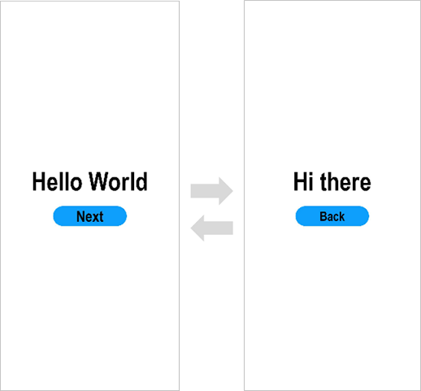

# 开发准备

本文档适用于OpenHarmony应用开发的初学者。通过构建一个简单的具有页面跳转/返回功能的应用（如下图所示），快速了解工程目录的主要文件，熟悉OpenHarmony应用开发流程。

在开始之前，您需要了解有关OpenHarmony应用的一些基本概念：UI框架的简单说明、应用模型的基本概念。

## 基本概念

### UI框架

OpenHarmony提供了一套UI开发框架，即方舟开发框架（ArkUI框架）。方舟开发框架可为开发者提供应用UI开发所必需的能力，比如多种组件、布局计算、动画能力、UI交互、绘制等。

方舟开发框架针对不同目的和技术背景的开发者提供了两种开发范式，分别是基于ArkTS的声明式开发范式（简称“声明式开发范式”）和兼容JS的类Web开发范式（简称“类Web开发范式”）。以下是两种开发范式的简单对比。

| **开发范式名称** | **语言生态** | **UI更新方式** | **适用场景**                     | **适用人群**                           |
| ---------------- | ------------ | -------------- | -------------------------------- | -------------------------------------- |
| 声明式开发范式   | ArkTS语言    | 数据驱动更新   | 复杂度较大、团队合作度较高的程序 | 移动系统应用开发人员、系统应用开发人员 |
| 类Web开发范式    | JS语言       | 数据驱动更新   | 界面较为简单的程序应用和卡片     | Web前端开发人员                        |

更多UI框架的开发内容及指导，详见[UI开发](../ui/arkui-overview.md)。

### 应用模型

应用模型是OpenHarmony为开发者提供的应用程序所需能力的抽象提炼，它提供了应用程序必备的组件和运行机制。有了应用模型，开发者可以基于一套统一的模型进行应用开发，使应用开发更简单、高效。请见[应用模型的构成要素](../application-models/application-models.md#应用模型的构成要素)。

随着系统的演进发展，OpenHarmony先后提供了两种应用模型：

- **Stage模型：** OpenHarmony API 9开始新增的模型，是目前主推且会长期演进的模型。在该模型中，由于提供了AbilityStage、WindowStage等类作为应用组件和Window窗口的“舞台”，因此称这种应用模型为Stage模型。Stage模型开发可见[Stage模型开发概述](../application-models/stage-model-development-overview.md)。**快速入门以此为例提供开发指导。**

- **FA（Feature Ability）模型：** OpenHarmony API 7开始支持的模型，已经不再主推。FA模型开发可见[FA模型开发概述](../application-models/fa-model-development-overview.md)。**快速入门章节不再对此展开提供开发指导。**

FA模型和Stage模型的整体架构和设计思想等更多区别，请见[应用模型解读](../application-models/application-models.md)。

快速入门提供了一个含有两个页面的开发实例，并基于Stage模型构建第一个ArkTS应用，以便开发者理解以上基本概念及应用开发流程。

## 工具准备

请安装[最新版DevEco Studio](https://developer.huawei.com/consumer/cn/download/)。

完成上述操作及基本概念的理解后，可参照[构建第一个ArkTS应用（Stage模型）](start-with-ets-stage.md)进行下一步体验和学习。
