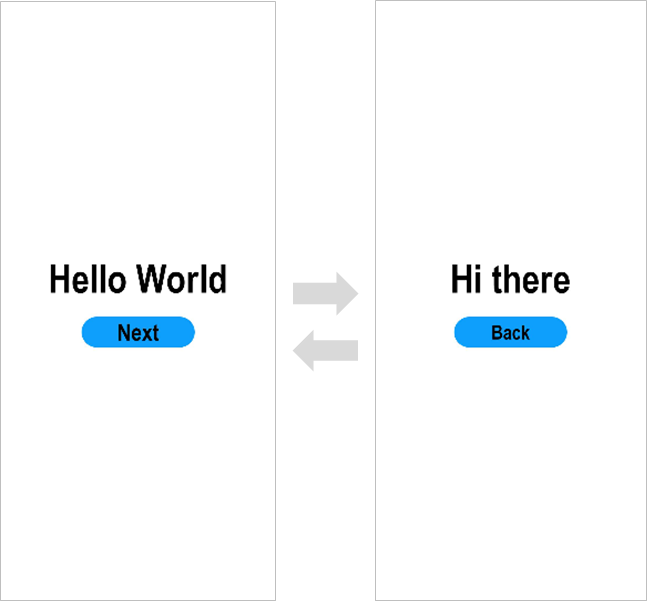
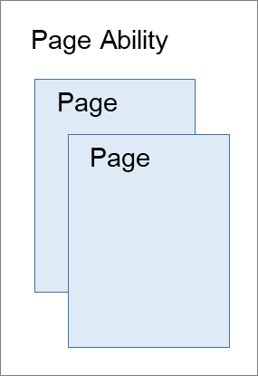

# 开发准备

本文档适用于OpenHarmony应用开发的初学者。通过构建一个简单的具有页面跳转/返回功能的应用（如下图所示），快速了解工程目录的主要文件，熟悉OpenHarmony应用开发流程。

在开始之前，您需要了解有关OpenHarmony应用的一些基本概念：UI框架的简单说明、Ability的基本概念。

## 基本概念

### UI框架

OpenHarmony提供了一套UI开发框架，即方舟开发框架（ArkUI框架）。方舟开发框架可为开发者提供应用UI开发所必需的能力，比如多种组件、布局计算、动画能力、UI交互、绘制等。

方舟开发框架针对不同目的和技术背景的开发者提供了两种开发范式，分别是基于JS扩展的类Web开发范式（简称“类Web开发范式”）和基于TS扩展的声明式开发范式（简称“声明式开发范式”）。以下是两种开发范式的简单对比。

| **开发范式名称** | **语言生态** | **UI更新方式** | **适用场景** | **适用人群** |
| -------- | -------- | -------- | -------- | -------- |
| 类Web开发范式 | JS语言 | 数据驱动更新 | 界面较为简单的程序应用和卡片 | Web前端开发人员 |
| 声明式开发范式 | 扩展的TS语言（eTS） | 数据驱动更新 | 复杂度较大、团队合作度较高的程序 | 移动系统应用开发人员、系统应用开发人员 |

对于JS语言开发时，低代码方式在DevEco Studio V2.2 Beta1及更高版本中支持。

对于eTS语言开发，低代码方式在DevEco Studio V3.0 Beta3及更高版本中支持。

OpenHarmony低代码开发方式具有丰富的UI界面编辑功能，遵循JS开发规范，通过可视化界面开发方式快速构建布局，可有效降低开发者的上手成本并提升开发者构建UI界面的效率。
更多UI框架的开发内容及指导，请参见[UI开发](../ui/arkui-overview.md)。

### Ability

Ability是应用所具备能力的抽象，也是应用程序的重要组成部分。一个应用可以具备多种能力（即可以包含多个Ability）。OpenHarmony支持应用以Ability为单位进行部署。

Ability分为[FA（Feature Ability）](../../glossary.md#f)和[PA（Particle Ability）](../../glossary.md#p)两种类型，每种类型为开发者提供了不同的模板，以便实现不同的业务功能。其中，FA支持[Page Ability](../ability/fa-pageability.md)模板，以提供与用户交互的能力。一个Page Ability可以含有一个或多个页面（即Page），Page Ability与Page的关系如下图所示：

快速入门提供了一个含有两个页面的Page Ability实例。更多Ability的开发内容及指导，请参见[Ability开发](../ability/fa-brief.md)。

## 工具准备

1. 安装最新版[DevEco Studio](https://developer.harmonyos.com/cn/develop/deveco-studio#download_beta_openharmony)。

2. 请参考[配置OpenHarmony SDK](https://developer.harmonyos.com/cn/docs/documentation/doc-guides/ohos-setting-up-environment-0000001263160443)，完成**DevEco Studio**的安装和开发环境配置。

完成上述操作及基本概念的理解后，可参照[使用eTS语言开发（传统代码方式）](start-with-ets.md)、[使用eTS语言开发（低代码方式）](start-with-ets-low-code.md)、[使用JS语言开发（传统代码方式）](start-with-js.md)、[使用JS语言开发（低代码方式）](start-with-js-low-code.md)中的任一章节进行下一步体验和学习。

