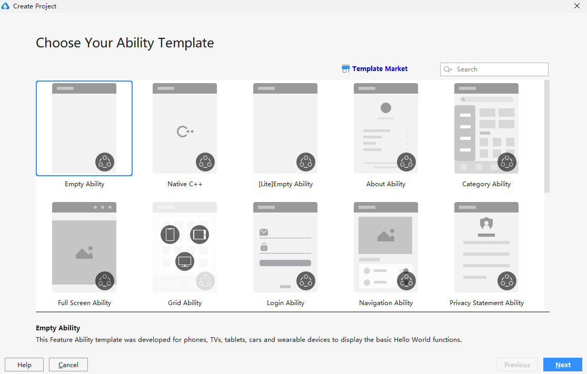
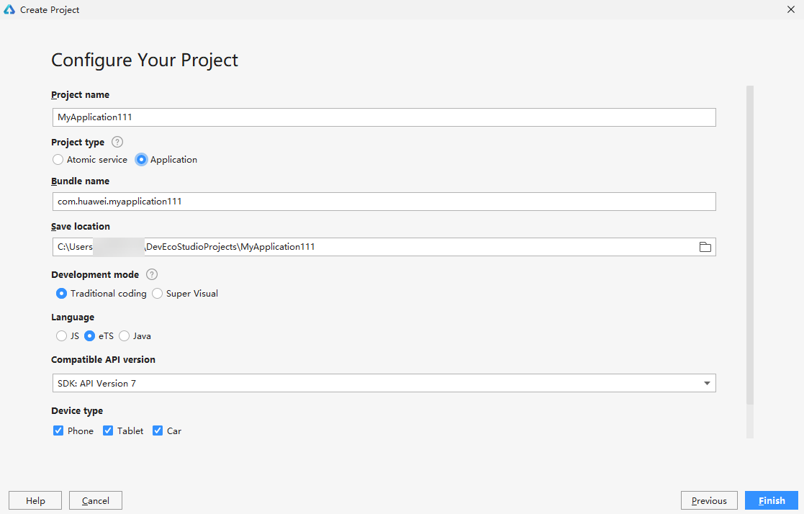
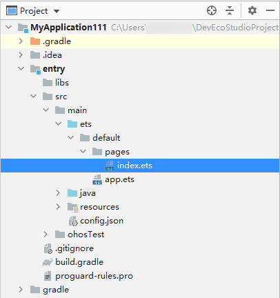
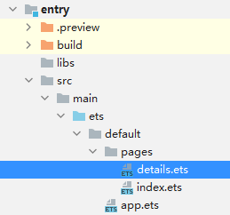

# 使用eTS语言开发

>  **说明：**
> 请使用DevEco Studio V3.0.0.601 Beta1及更高版本。本文以使用**DevEco Studio 3.0 Beta2**版本为例，点击[此处](https://developer.harmonyos.com/cn/develop/deveco-studio#download_beta)获取下载链接。


## 创建eTS工程

1. 打开DevEco Studio，创建一个新工程，选择模板，如Empty Ability：

   

2. 进入配置工程界面，Project Type选择Application，Language选择eTS，其他参数根据实际需要设置即可。

   


## 编写第一个页面

1. 工程创建完成后，在"Project"窗口，点击entry &gt; src &gt; main &gt; ets &gt; default &gt; pages，打开index.ets文件。

   

2. 第一个页面由Flex容器组件、Text组件和Button组件构成。在index.ets中编写并设置页面组件的属性和样式，示例代码如下所示：
   ```
   @Entry
   @Component
   struct Index {
     build() {
         //Flex容器组件
         Flex({ direction: FlexDirection.Column, alignItems: ItemAlign.Center, justifyContent: FlexAlign.Center }) {
           //Text组件
           Text('Hello World')
             .fontSize(60)
             .fontWeight(500)
           //Button组件
           Button('Next')
             .fontSize(40)
             .fontWeight(500)
             .width(280)
             .height(60)
         }
         //容器整体宽高
         .width('100%')
         .height('100%')
       }
   }
   ```

3. 使用[预览器](https://developer.harmonyos.com/cn/docs/documentation/doc-guides/previewer-0000001054328973#ZH-CN_TOPIC_0000001056725592__section16523172216252)运行项目，效果如下图所示：

   


## 创建第二个页面

1. 在"Project"窗口，打开entry &gt; src &gt; main &gt; ets &gt; default，右键点击pages文件夹，选择NeweTS Page，命名为details，单击回车键。创建完成后，可以看到pages文件夹下的文件目录结构如下：

   

2. 第二个页面由Flex容器组件、Text组件构成。在details.ets中编写并设置页面组件的属性和样式，示例代码如下所示：
   ```
   @Entry
   @Component
   struct Details {
     build() {
       //Flex容器组件
       Flex({ direction: FlexDirection.Column, alignItems: ItemAlign.Center, justifyContent: FlexAlign.Center }) {
         //Text组件
         Text('Hi there')
           .fontSize(60)
           .fontWeight(500)
       }
       //容器整体宽高
       .width('100%')
       .height('100%')
     }
   }
   ```


## 实现页面跳转

1. 打开第一个页面的index.ets文件，导入router模块，页面路由router根据页面的uri来找到目标页面，从而实现跳转。示例代码如下：
   ```
   //导入router模块
   import router from '@system.router';
   @Entry
   @Component
   struct Index {
     build() {
       //Flex容器组件
       Flex({ direction: FlexDirection.Column, alignItems: ItemAlign.Center, justifyContent: FlexAlign.Center }) {
         //Text组件
         Text('Hello World')
           .fontSize(60)
           .fontWeight(500)
         //Button组件
         Button('Next')
           .fontSize(40)
           .fontWeight(500)
           .width(280)
           .height(60)
           //点击Button实现页面跳转
           .onClick(() => {        router.push({ uri: 'pages/details' })      })
       }
       //容器整体宽高
       .width('100%')
       .height('100%')
     }
   }
   ```

2. 再次使用[预览器](https://developer.harmonyos.com/cn/docs/documentation/doc-guides/previewer-0000001054328973#ZH-CN_TOPIC_0000001056725592__section16523172216252)运行项目，效果如下图所示：

   

恭喜你，至此已成功完成OpenHarmony快速入门-使用eTS语言开发。
