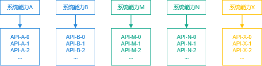
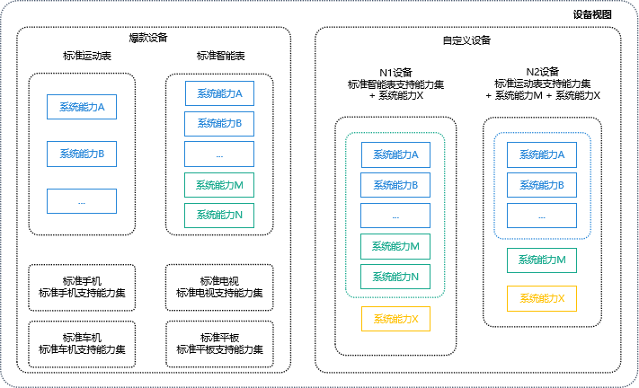
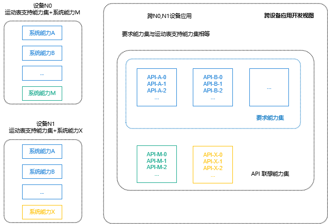

# SysCap使用指南

## 概述

### 系统能力与 API

SysCap，全称SystemCapability，即系统能力，指操作系统中每一个相对独立的特性，如蓝牙，WIFI，NFC，摄像头等，都是系统能力之一。每个系统能力对应多个 API，这些 API 绑定在一起，随着目标设备是否支持该系统能力共同存在或消失，也会随着 IDE 一起提供给开发者做联想。



开发者可以在[SysCap列表](../reference/syscap-list.md)中查询OpenHarmony的能力集。


### 支持能力集，联想能力集与要求能力集

支持能力集，联想能力集与要求能力集都是系统能力的集合。
支持能力集描述的是设备能力，要求能力集描述的是应用能力。若应用A的要求能力集是设备N的支持能力集的子集，则应用A可分发到设备N上安装运行，否则不能分发。
联想能力集是该应用开发时，IDE 可联想的 API 所在的系统能力集合。


### 设备与支持能力集

每个设备根据其硬件能力，对应不同的支持能力集。
SDK 将设备分为两组，典型设备和自定义设备，典型设备的支持能力集由 OpenHarmony 来定义，自定义设备由设备厂商给出。




### 设备与SDK能力的对应

SDK 提供全量的 API 给 IDE，IDE 通过开发者的项目支持的设备，找到该设备的支持能力集，筛选支持能力集包含的 API 提供给开发者做联想。


## SysCap开发指导

### PCID获取

PCID，全称 Product Compatibility ID，包含当前设备支持的 syscap 信息。获取所有设备 PCID 的认证中心正在建设中，目前需要找对应设备的厂商获取该设备的 PCID。


### PCID导入

DevEco Studio 工程支持 PCID 的导入。导入的 PCID 文件解码后输出的 syscap 会被写入 syscap.json 文件中。

在工程目录右键后选择 Import Product Compatibility ID，即可上传 PCID 文件并导入至 syscap.json 中。


### 配置联想能力集和要求能力集

IDE 会根据创建的工程所支持的设置自动配置联想能力集和要求能力集，开发者也可以自行修改。
对于联想能力集，开发者通过添加更多的系统能力，在 IDE 中可以使用更多的 API，但要注意这些 API 可能在设备上不支持，使用前需要判断。
对于要求能力集，开发者修改时要十分慎重，修改不当会导致应用无法分发到目标设备上。

```json
// syscap.json
{
	"devices": {
		"general": [            // 每一个典型设备对应一个syscap支持能力集，可配置多个典型设备
			"default",
			"car"
		],
		"custom": [             // 厂家自定义设备
			{
				"某自定义设备": [
					"SystemCapability.Communication.SoftBus.Core"
				]
			}
		]
	},
	"development": {             // addedSysCaps内的sycap集合与devices中配置的各设备支持的syscap集合的并集共同构成联想能力集
		"addedSysCaps": [
			"SystemCapability.Location.Location.Lite"
		]
	},
	"production": {              // 用于生成rpcid，慎重添加，可能导致应用无法分发到目标设备上
		"addedSysCaps": [],      // devices中配置的各设备支持的syscap集合的交集，添加addedSysCaps集合再除去removedSysCaps集合，共同构成要求能力集
		"removedSysCaps": []     // 当该要求能力集为某设备的子集时，应用才可被分发到该设备上
	}
}
```


### 单设备应用开发

默认应用的联想能力集，要求系统能力集和设备的支持系统能力集相等，开发者修改要求能力集需要慎重。


### 跨设备应用开发

默认应用的联想能力集是多个设备支持能力集的并集，要求能力集则是交集。




### 判断 API 是否可以使用

首先我们定义了 API canIUse 帮助开发者来判断该工程是否支持某个特定的syscap。

```
if (canIUse("SystemCapability.ArkUI.ArkUI.Full")) {
	console.log("该应用支持SystemCapability.ArkUI.ArkUI.Full");
} else {
	console.log("该应用不支持SystemCapability.ArkUI.ArkUI.Full");
}
```

开发者可通过 import 的方式将模块导入，若当前设备不支持该模块，import 的结果为 undefined，开发者在使用其 API 时，需要判断其是否存在。

```
import geolocation from '@ohos.geolocation';

if (geolocation) {
	geolocation.getCurrentLocation((location) => {
		console.log(location.latitude, location.longitude);
	});
} else {
	console.log('该设备不支持位置信息')；
}
```


### 不同设备相同能力的差异检查

即使是相同的系统能力，在不同的设备下，也会有能力的差异。比如同是摄像头的能力，平板设备优于智能穿戴设备。

```
import userAuth from '@ohos.userIAM.userAuth';

const authenticator = userAuth.getAuthenticator();
const result = authenticator.checkAbility('FACE_ONLY', 'S1');

if (result == authenticator.CheckAvailabilityResult.AUTH_NOT_SUPPORT) {
	console.log('该设备不支持人脸识别');
}
//强行调用不支持的 API 会返回错误信息，但不会出现语法错误。
authenticator.execute('FACE_ONLY', 'S1', (err, result) => {
	if (err) {
		console.log(err.message);
		return;
	}
})
```


### 设备间的SysCap差异如何产生的

设备的SysCap因产品解决方案厂商拼装的部件组合不同而不同，整体流程如下图：


1. 一套 OpenHarmony 源码由可选和必选部件集组成，不同的部件为对外体现的系统能力不同，即部件与 SysCap 之间映射关系。

2. 发布归一化的 SDK，API 与 SysCap 之间存在映射关系。

3. 产品解决方案厂商按硬件能力和产品诉求，可按需拼装部件。

4. 产品配置的部件可以是 OpenHarmony 的部件，也可以是三方开发的私有部件，由于部件与SysCap间存在映射，所有拼装后即可得到该产品的SysCap集合。

5. SysCap集编码生成 PCID (Product Compatibility ID， 产品兼容性标识)，应用开发者可将 PCID 导入 IDE解码成SysCap ，开发时对设备的SysCap差异做兼容性处理。

6. 部署到设备上的系统参数中包含了 SysCap 集，系统提供了native的接口和应用接口，可供系统内的部件和应用查询某个 SysCap 是否存在。

7. 应用开发过程中，应用必要的 SysCap 将被编码成 RPCID（Required Product Compatibility ID），并写入应用安装包中。应用安装时，包管理器将解码 RPCID 得到应用需要的 SysCap，与设备当前具备的 SysCap 比较，若应用要求的 SysCap 都被满足，则安装成功。

8. 应用运行时，可通过 canIUse 接口查询设备的 SysCap，保证在不同设备上的兼容性。
