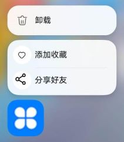

# 创建应用静态快捷方式

随着应用的功能越来越复杂，用户在使用应用时，找到某个功能的操作步骤也变得更加繁琐。为提升用户体验，可以对应用中常用的功能创建对应的桌面快捷方式，以达到快速启动应用、一键直达特定功能等目的。例如相机应用的 “快速拍照”、便签应用的 “新建便签” 和地图应用的常用地点导航等功能的快捷方式，用户通过快捷方式可以快速进入特定功能页面，既能大大提高操作效率，同时也增加了用户对应用的依赖性。使用快捷方式，还可以实现个性化定制的需求，创建多个快捷方式，以满足个性化的工作流程和操作偏好。

## 场景介绍

以导航场景为例，用户使用地图应用导航时，通常先搜索目的地，然后开始导航。为了提升导航效率和操作便捷性，建议在地图应用中添加常去地点的快捷方式，如公司、家等。添加这些快捷方式后，用户长按应用图标，即可打开快捷方式入口，快速启动导航。详情请参考[桌面快捷方式](https://developer.huawei.com/consumer/cn/doc/best-practices/bpta-desktop-shortcuts)。

## 配置方法

下面介绍在工程中配置静态快捷方式的方法。

1. 在entry/src/main/resources/base/element/string.json配置资源文件如下。
    ```json
    {
      "string": [
        // ···
        {
          "name": "share",
          "value": "分享好友"
        },
        {
          "name": "add",
          "value": "添加收藏"
        }
      ]
    }
    ```


2. 配置快捷方式文件。

    在模块的/resources/base/profile/目录下配置[快捷方式的配置文件](module-configuration-file.md#shortcuts标签)，如shortcuts_config.json，拷贝示例代码需要删除注释。

    ```json
    {
      "shortcuts": [
       {
          "shortcutId": "id_test1",  // 标识快捷方式，在应用有多个快捷方式时，该字段可作为快捷方式的唯一标识符，不支持通过资源索引的方式（$string）配置该字段
          "label": "$string:add",  // 标识该快捷方式对外显示的名称
          "icon": "$media:add_icon",  // 标识该快捷方式对外显示的图片，需要在entry/src/main/resources/base/media中添加名称为add_icon的图片
          "wants": [
            {
              "bundleName": "com.ohos.hello",   // 对应该快捷方式对应拉起组件的包名
              "moduleName": "entry",    // 对应该快捷方式对应拉起组件的模块名
              "abilityName": "EntryAbility1",   // 对应该快捷方式对应拉起组件的组件名
              "parameters": {
                "testKey": "testValue"   // 表示拉起快捷方式时的自定义数据
              }
            }
          ]
        },
        {
          "shortcutId": "id_test2",  // 标识快捷方式，在应用有多个快捷方式时，该字段可作为快捷方式的唯一标识符，不支持通过资源索引的方式（$string）配置该字段
          "label": "$string:share",  // 标识该快捷方式对外显示的名称
          "icon": "$media:share_icon",  // 标识该快捷方式对外显示的图片，需要在entry/src/main/resources/base/media中添加名称为share_icon的图片
          "wants": [
            {
              "bundleName": "com.ohos.hello",   // 对应该快捷方式对应拉起组件的包名
              "moduleName": "entry",    // 对应该快捷方式对应拉起组件的模块名
              "abilityName": "EntryAbility",   // 对应该快捷方式对应拉起组件的组件名
              "parameters": {
                "testKey": "testValue"   // 表示拉起快捷方式时的自定义数据
              }
            }
          ]
        }
      ]
    }
    ```

3. 在应用的module.json5文件中配置metadata，指向快捷方式的配置文件。

    ```json
    {
      "module": {
      // ...
        "abilities": [
          {
            "name": "EntryAbility",
            "srcEntry": "./ets/entryability/EntryAbility.ets",
            // ...
            "metadata": [
              {
                "name": "ohos.ability.shortcuts",  // 配置快捷方式，该值固定为ohos.ability.shortcuts
                "resource": "$profile:shortcuts_config"  // 指定shortcuts信息的资源位置
              }
            ]
          }
        ]
      }
    }
    ```

安装应用后，长按桌面上的应用图标，图标上方会显示开发者配置的快捷方式：“添加收藏”和“分享好友”。点击相应标签，可启动对应的组件。应用配置的静态快捷方式在桌面上的展示效果如下图所示。



