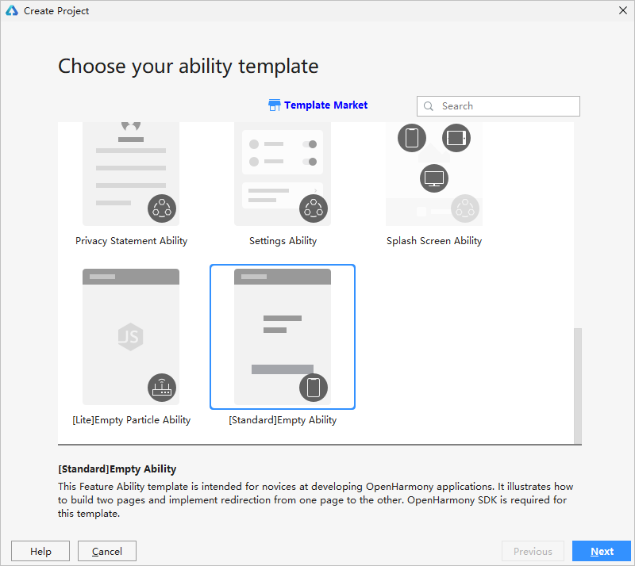

# 使用工程向导创建新工程

-   [前提条件](#section13642104391619)
-   [操作步骤](#section132671712101714)

通过工程向导创建一个OpenHarmony工程，该功能只有DevEco Studio 2.2 Beta1及以上版本支持。如果是DevEco Studio 2.1 Release版本，请根据[通过导入Sample方式创建新工程](import-sample-to-create-project.md)进行操作。

## 前提条件

已安装OpenHarmony SDK，具体请参考[配置OpenHarmony SDK](configuring-openharmony-sdk.md)。

## 操作步骤

1.  通过如下两种方式，打开工程创建向导界面。
    -   如果当前未打开任何工程，可以在DevEco Studio的欢迎页，选择**Create Project**开始创建一个新工程。
    -   如果已经打开了工程，可以在菜单栏选择**File \> New \> New Project**来创建一个新工程。

2.  根据工程创建向导，选择**\[Standard\]Empty Ability**模板，点击**Next**。

    

3.  点击**Next**，进入到工程配置阶段，需要根据向导配置工程的基本信息。
    -   **Project Name**：工程的名称，可以自定义。
    -   **Project Type**：工程的类型，标识该工程是一个[原子化服务](https://developer.harmonyos.com/cn/docs/documentation/doc-guides/atomic-service-definition-0000001090840664)（Service）或传统方式的需要安装的应用（Application）。

        > **说明：** 
        >如果是创建的原子化服务，则：
        >-   原子化服务调试、运行时，在设备桌面上没有应用图标，请使用DevEco Studio的调试和运行功能，来启动原子化服务。
        >-   原子化服务是免安装的，config.json中自动添加**installationFree**字段，取值为“true”。
        >-   如果entry模块的**installationFree**字段为true，则其相关的所有hap模块的**installationFree**字段都默认为true；如果entry模块的**installationFree**字段为false，则其相关的所有hap模块可以配置为true或false。
        >-   编译构建App时，每个hap包大小不能超过10MB。

    -   **Package Name**：软件包名称，默认情况下，应用ID也会使用该名称，应用发布时，应用ID需要唯一。
    -   **Save Location**：工程文件本地存储路径。
    -   **Compatible API Version**：兼容的SDK最低版本。

        > **说明：** 
        >OpenHarmony工程如果配置了compileSdkVersion 7以上，对应模块默认使用方舟编译器进行编译，如果要修改编译方式为非方舟编译，在模块级build.gradle的**ohos**闭包中添加**arkEnable false**字段。

    -   **Language：**支持的开发语言。
    -   **Device Type**：该工程模板支持的设备类型。

        

4.  点击**Finish**，工具会自动生成示例代码和相关资源，等待工程创建完成。

