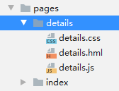

# 使用JS语言开发<a name="ZH-CN_TOPIC_0000001064805858"></a>

-   [编写第一个页面](#section17436202895811)
-   [创建另一个页面](#section944219415598)
-   [实现页面跳转](#section126857614017)

## 编写第一个页面<a name="section17436202895811"></a>

1.  第一个页面内有一个文本和一个按钮，通过text和button组件来实现。

    在“Project“窗口，选择“entry \> src \> main  \>  js  \>  default  \>  pages.index“，打开“index.hml“文件，添加一个文本和一个按钮，示例代码如下：

    ```
    <!-- index.hml -->
    <div class="container">
        <!-- 添加一个文本 -->
        <text class="text">
            Hello World
        </text>
        <!-- 添加一个按钮，按钮样式设置为胶囊型，文本显示为Next，绑定launch事件 -->
        <button class="button" type="capsule" value="Next" onclick="launch"></button>
    </div>
    ```

2.  打开“index.css“文件，设置文本和按钮的样式，示例代码如下：

    ```
    /* index.css */
    .container {
        flex-direction: column; /* 设置容器内的项目纵向排列 */
        justify-content: center; /* 设置项目位于容器主轴的中心 */
        align-items: center; /* 项目在交叉轴居中 */
    }
    /* 对class="text"的组件设置样式 */
    .text{
        font-size: 72px;
    }
    /* 对class="button"的组件设置样式 */
    .button {
        width: 362px;
        height: 80px;
        background-color: #007dff;
        font-size: 39px;
        text-color: white;
        margin-top: 20px;
    }
    ```

3.  使用真机或模拟器运行项目，效果如图所示：

    


## 创建另一个页面<a name="section944219415598"></a>

1.  在“Project“窗口，打开“entry \> src \> main  \>  js  \>  default“，右键点击“pages.index“文件夹，选择“New  \>  JS Page“，命名为“details“。

    创建完成后，可以看到变成了“pages“文件夹下的“index“和“details“文件夹。

    

2.  打开“details.hml“文件，添加一个文本，示例代码如下：

    ```
    <!-- details.hml -->
    <div class="container">
      <text class="text">
        Hi there
      </text>
    </div>
    ```

3.  打开“details.css“文件，设置文本的样式，示例代码如下：

    ```
    /* details.css */
    .container {
        flex-direction: column;
        justify-content: center;
        align-items: center;
    }
    .text {
        font-size: 70px;
        text-align: center;
    }
    ```


## 实现页面跳转<a name="section126857614017"></a>

1.  打开第一个页面的“index.js“文件，导入router模块，页面路由router根据页面的uri来找到目标页面，从而实现跳转。示例代码如下：

    ```
    // index.js
    import router from '@system.router';
    
    export default {
      launch() {
        router.push ({
          uri:'pages/details/details', // 指定要跳转的页面
        })
      }
    }
    ```

2.  再次运行项目，效果如图所示：

    


