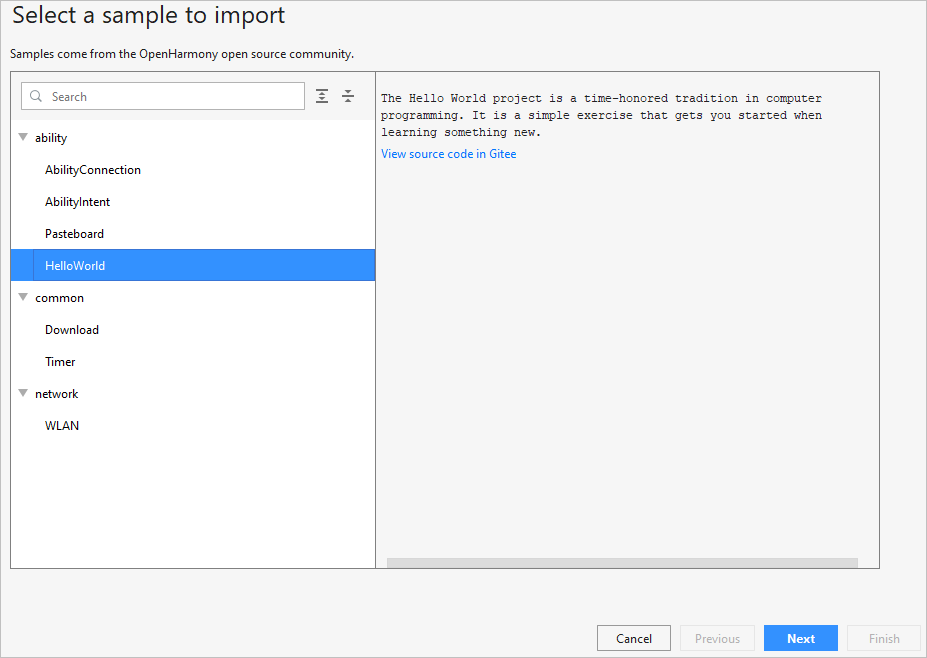

# 导入OpenHarmony工程

OpenHarmony SDK配置完成后，便可以启动应用开发。针对OpenHarmony应用开发，**只能通过导入Sample工程的方式来创建一个新工程**。

1.  在DevEco Studio的欢迎页，点击**Import HarmonyOS Sample**按钮，导入Sample工程。

    

2.  选择ability下的**HelloWorld**工程，然后点击**Next**。

    

3.  设置**App Name**和**Project Location**，然后点击**Finish**，等待Sample工程导入完成。

    

4.  Sample导入后，等待工程同步完成，此时工程会同步失败。请打开工程下的build.gradle，修改hap插件的版本号为“2.4.4.3-RC”。

    

5.  修改完成后，点击右上角Gradle中的按钮，重新同步工程。

    

6.  等待工程同步完成，同步成功后，便可以进行OpenHarmony应用开发了。

    

